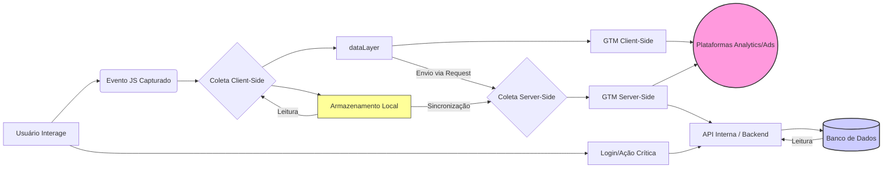

---
versão: 1.0  
última_atualização: 2025-04-15  
autor: AnalyticsGPT  
status: Ativo  
---

# ESTRATÉGIAS DE COLETA E PERSISTÊNCIA

## VISÃO GERAL

### Propósito do Componente
Definir métodos padronizados e seguros para:
1.  **Coleta de dados** (client-side, server-side, híbrida).
2.  **Armazenamento temporário/persistente** de parâmetros (cookies, localStorage, sessionStorage, IndexedDB, Server-Side DBs).
3.  **Recuperação consistente de dados** em diferentes estágios da jornada do usuário (sessões, dispositivos).
4.  **Sincronização de dados** entre o navegador, GTM (Client/Server), e plataformas de backend (CRMs, CDPs, Data Warehouses).
5.  Garantir a **integridade e a privacidade** dos dados durante todo o ciclo de vida da coleta e armazenamento.

### Casos de Uso Principais
- Implementação de `dataLayer` robusto e com redundância de parâmetros essenciais.
- Preservação de dados de atribuição multi-sessão (UTMs, click IDs) de forma confiável.
- Gestão unificada da identidade do usuário (logado/não-logado) entre diferentes pontos de contato.
- Implementação de estratégias de coleta que respeitem o consentimento do usuário e estejam em conformidade com leis de privacidade (LGPD, GDPR, CCPA).
- Definição de arquiteturas de coleta resilientes a falhas de rede ou bloqueadores.

### Conexões com Outros Componentes
- **Depende de:** `taxonomia_parametros.md` (Define *quais* dados coletar e seus requisitos).
- **Alimenta:** `redundancia_fallbacks.md` (Fornece os mecanismos para as estratégias de backup de identificadores).
- **Integra-se a:** `seguranca_privacidade.md` (Detalha *como* tratar dados PII/sensíveis mencionados aqui, incluindo hashing e criptografia).
- **Relaciona-se com:** `integracao_plataformas.md` (As estratégias aqui definidas impactam como os dados chegam às plataformas finais).

## DIRETRIZES PARA O AGENTE

Ao consultar este componente de conhecimento, o AnalyticsGPT deve:

1.  **PRIORIZAR Segurança e Privacidade:** Sempre recomendar métodos de persistência apropriados à sensibilidade dos dados (e.g., `HttpOnly` cookies para IDs de sessão, hashing para PII antes de armazenar no client-side).
2.  **RECOMENDAR Resiliência:** Sugerir implementações resistentes a falhas (e.g., fallbacks para identificadores, retry logic para `dataLayer`, Beacon API para saídas de página).
3.  **ALERTAR sobre Riscos:** Informar sobre potenciais problemas de privacidade (e.g., fingerprinting) ou segurança (e.g., armazenar tokens em `localStorage`) ao discutir estratégias.
4.  **CONSULTAR para Respostas Específicas:** Usar este documento para responder perguntas sobre:
    *   Como armazenar UTMs ou Click IDs entre sessões de forma eficaz.
    *   Qual a melhor forma de implementar identificação persistente de usuários (logados e anônimos).
    *   Como construir um `dataLayer` padronizado e robusto.
    *   Estratégias para sincronizar dados entre client-side e server-side.
    *   Diferenças e casos de uso para `localStorage`, `sessionStorage`, cookies e IndexedDB.
    *   Impacto de ITP/ETP na persistência de dados.
5.  **CONSIDERAR Performance:** Levar em conta o impacto de cada método na performance da página ao fazer recomendações.

## CONTEÚDO DETALHADO

### 1. Hierarquia de Armazenamento Client-Side

Prioridade de persistência e características de cada tecnologia no navegador:

| Camada          | Tecnologia          | Duração Típica        | Limite Aprox. | Acesso JS | Sincronia | Segurança (`HttpOnly`) | Casos de Uso Comuns                               |
| :-------------- | :------------------ | :-------------------- | :------------ | :-------- | :-------- | :--------------------- | :------------------------------------------------ |
| **Permanente**  | `localStorage`      | Permanente (manual)   | 5-10MB        | Sim       | Síncrono  | Não                    | First-touch UTMs, Prefs Usuário, IDs Anônimos Hashed |
| **Sessão**      | `sessionStorage`    | Até fechar aba/nav.   | 5-10MB        | Sim       | Síncrono  | Não                    | Last-touch UTMs, `session_id`, Carrinhos Temporários |
| **Curta Duração**| Cookies (1st-party) | Definida (`Max-Age`)  | ~4KB          | Sim       | Síncrono  | Opcional               | `client_id` (GA), Click IDs (gclid/fbclid), A/B Test |
| **Segura**      | Cookies `HttpOnly`  | Definida (`Max-Age`)  | ~4KB          | **Não**   | Síncrono  | **Sim**                | Tokens de Sessão, IDs de Usuário Logado (Server-Set) |
| **Grande Volume**| IndexedDB           | Permanente (manual)   | >10MB (quota) | Sim       | **Assíncrono**| Não                    | Dados Offline, Caching Complexo, Grandes Datasets |

#### Nota de Performance e Impacto:
-   **localStorage/sessionStorage:** Acesso rápido, mas **síncrono** (pode bloquear a thread principal em operações pesadas ou frequentes). Use com moderação para escritas.
-   **Cookies:** Enviados em *cada* requisição HTTP ao domínio (aumentam o overhead de rede). Use cookies pequenos e estritamente necessários. Cookies `HttpOnly`, `Secure`, `SameSite=Lax/Strict` são essenciais para segurança.
-   **IndexedDB:** **Assíncrono** (melhor para performance, não bloqueia a UI), ideal para grandes volumes (>10MB) ou dados estruturados, mas mais complexo de implementar e gerenciar.
-   **Server-Side Storage (DBs):** Mais lento para acesso inicial (requer request de rede), mas altamente escalável, seguro para dados críticos/volumosos e não impacta diretamente a performance do navegador. Introduz latência de rede.

### 2. Estratégias por Tipo de Dado

#### A. Identificadores de Usuário
```javascript
// Exemplo: Setar User ID via Cookie HttpOnly (FEITO NO BACKEND APÓS LOGIN)
// Exemplo (Node.js/Express):
// response.cookie('user_session_id', sessionId, { 
//   httpOnly: true, 
//   secure: true, // Apenas HTTPS
//   sameSite: 'Lax', // Ou 'Strict'
//   maxAge: 30 * 24 * 60 * 60 * 1000 // 30 dias em ms
// });

// Exemplo: Fallback para Client ID (Anônimos) via Cookie 1st-party (Client-Side)
function getOrSetClientId() {
  let clientId = getCookie('_ga_cid'); // Função auxiliar para ler cookie
  if (!clientId) {
    clientId = generateUUIDv4(); // Função para gerar UUID
    // Duração longa, mas respeitando políticas de privacidade (e.g., 13 meses)
    setCookie('_ga_cid', clientId, { maxAge: 34164000, sameSite: 'Lax' }); // 13 meses em segundos
  }
  return clientId;
}

// Exemplo: Session ID (Temporário)
function getOrSetSessionId() {
  let sessionId = sessionStorage.getItem('session_id');
  if (!sessionId) {
    sessionId = Date.now() + '_' + Math.random().toString(36).substring(2, 15);
    sessionStorage.setItem('session_id', sessionId);
  }
  return sessionId;
}

// NOTA SOBRE FINGERPRINTING:
// Evite técnicas de fingerprinting (baseadas em canvas, fontes, etc.) como identificador primário.
// Elas são intrusivas, menos confiáveis a longo prazo devido a mudanças no navegador,
// e levantam sérias preocupações de privacidade, podendo exigir consentimento explícito
// e detalhado sob LGPD/GDPR. Prefira IDs baseados em cookies first-party ou IDs de login.
```

#### B. Atribuição (UTMs & Click IDs)
```javascript
// Função auxiliar para pegar parâmetro da URL
function getUrlParam(name) {
  const results = new RegExp('[\\?&]' + name + '=([^&#]*)').exec(window.location.href);
  return results ? decodeURIComponent(results[1].replace(/\+/g, ' ')) : null;
}

// Armazenar First-Touch UTMs (Apenas na primeira visita com UTMs)
function storeFirstTouchUTMs() {
  const utmParams = ['utm_source', 'utm_medium', 'utm_campaign', 'utm_content', 'utm_term'];
  let storedSomething = false;
  utmParams.forEach(param => {
    if (!localStorage.getItem(param + '_first')) {
      const value = getUrlParam(param);
      if (value) {
        localStorage.setItem(param + '_first', value);
        storedSomething = true;
      }
    }
  });
  if (storedSomething) {
      localStorage.setItem('first_touch_timestamp', Date.now());
  }
}

// Armazenar Last-Touch UTMs (Atualiza a cada nova visita com UTMs)
function storeLastTouchUTMs() {
  const utmParams = ['utm_source', 'utm_medium', 'utm_campaign', 'utm_content', 'utm_term'];
  utmParams.forEach(param => {
    const value = getUrlParam(param);
    if (value) {
      // Usar sessionStorage para limpar automaticamente no fim da sessão
      sessionStorage.setItem(param + '_last', value); 
    }
  });
}

// Armazenar Click IDs (gclid, fbclid, etc.)
function storeClickIds() {
  const clickIdParams = ['gclid', 'fbclid', 'msclkid', 'dclid', 'ttclid', 'sclid']; // Adicionar outros conforme necessário
  clickIdParams.forEach(param => {
    const value = getUrlParam(param);
    if (value) {
      // Armazenar em cookie 1st-party com duração apropriada (e.g., 90 dias para gclid)
      const durationSeconds = (param === 'gclid' || param === 'msclkid' || param === 'dclid') ? 7776000 : 2419200; // 90 ou 28 dias
      setCookie('_' + param, value, { maxAge: durationSeconds, sameSite: 'Lax' });
    }
  });
}

// Chamar as funções no carregamento da página
storeFirstTouchUTMs();
storeLastTouchUTMs();
storeClickIds();
```

#### C. Dados Sensíveis e PII
> **Regra de Ouro:** Nenhum PII (Nome, Email, CPF, Telefone, Endereço, etc.) deve ser armazenado no client-side (localStorage, sessionStorage, cookies acessíveis por JS) em formato legível.

```javascript
// ❌ Perigoso e Incorreto:
localStorage.setItem('user_email', 'usuario@exemplo.com');
document.cookie = 'customer_name=Fulano de Tal';

// ✅ Correto (Hashing antes de armazenar, se absolutamente necessário no client-side):
// Use bibliotecas criptográficas robustas (e.g., crypto.subtle no navegador)
async function hashData(data) {
  const msgUint8 = new TextEncoder().encode(data.trim().toLowerCase()); // Normalizar antes
  const hashBuffer = await crypto.subtle.digest('SHA-256', msgUint8);
  const hashArray = Array.from(new Uint8Array(hashBuffer));
  const hashHex = hashArray.map(b => b.toString(16).padStart(2, '0')).join('');
  return hashHex;
}
// Exemplo de uso:
// hashData('usuario@exemplo.com').then(hashedEmail => {
//   localStorage.setItem('email_hash', hashedEmail); // Armazena apenas o hash
// });

// ✅ Ideal: Manter PII apenas no Server-Side e referenciar por IDs não-identificáveis no client-side.

// 🚨 ALERTA DE SEGURANÇA CRÍTICO: 🚨
// Jamais armazene tokens de sessão, API keys, senhas ou outras credenciais sensíveis 
// em `localStorage` ou `sessionStorage`. Eles são vulneráveis a ataques XSS (Cross-Site Scripting).
// Use cookies `HttpOnly`, `Secure`, `SameSite=Strict` (ou `Lax`) gerenciados pelo servidor 
// para esses tipos de dados.
```

### 3. Implementação do dataLayer (Otimizada e Resiliente)

```javascript
// Inicialização segura do dataLayer (colocar no <head> antes do GTM)
window.dataLayer = window.dataLayer || [];
function gtag(){dataLayer.push(arguments);} // Compatibilidade com GA4/GAds se necessário

// Função robusta para push com validação, merge e retry básico
function pushToDataLayer(eventObject) {
  // 1. Validação Mínima
  const requiredParams = ['event', 'event_id', 'event_timestamp']; // Adicionar outros obrigatórios globais
  if (typeof eventObject !== 'object' || !eventObject.event || !requiredParams.every(p => eventObject[p])) {
    console.error('[Analytics Error] Evento inválido ou faltando parâmetros obrigatórios:', eventObject);
    sendErrorToMonitoring({ type: 'DataLayerValidationError', event: eventObject?.event || 'unknown' });
    return; // Não envia evento inválido
  }

  // 2. Merge com Dados Persistentes e Contextuais (Funções auxiliares necessárias)
  const mergedEvent = {
    // Ordem de merge: Específico do evento > Contextual > Persistente > Base
    ...getBaseContext(),        // event_timestamp, page_location, page_title, etc.
    ...getPersistedData(),     // user_id (hashed), client_id, session_id, first_touch_utms, click_ids
    ...getTechnicalContext(),  // device_category, browser, os, language
    ...getConsentContext(),    // consent_state, consent_analytics, etc.
    ...eventObject             // Sobrescreve com parâmetros específicos do evento
  };

  // 3. Push para o dataLayer com tratamento de erro
  try {
    window.dataLayer.push({ ecommerce: null }); // Limpa ecommerce anterior (boa prática GA4)
    window.dataLayer.push(mergedEvent);
    console.debug('[Analytics Event] Pushed:', mergedEvent.event, mergedEvent);
    
    // 4. Backup Assíncrono (Opcional, mas recomendado para eventos críticos)
    if (isCriticalEvent(mergedEvent.event)) { 
        sendToBeaconQueue(mergedEvent); // Envia para fila de Beacon API ou XHR assíncrono
    }

  } catch (e) {
    console.error('[Analytics Error] Falha ao fazer push no dataLayer:', e, mergedEvent);
    sendErrorToMonitoring({ type: 'DataLayerPushError', event: mergedEvent.event, error: e.message });
    // Tentar enfileirar para retry ou backup alternativo
    queueForRetryOrBackup(mergedEvent); 
  }
}

// Função auxiliar de retry (exemplo simplificado)
let retryQueue = [];
let isRetrying = false;
function queueForRetryOrBackup(eventObj, attempt = 0) {
    const MAX_ATTEMPTS = 3;
    const BACKOFF_MS = 1000 * Math.pow(2, attempt);

    if (attempt >= MAX_ATTEMPTS) {
        console.warn('[Analytics Retry] Máximo de tentativas atingido para evento:', eventObj.event);
        saveToOfflineQueue(eventObj); // Último recurso: salvar localmente
        return;
    }

    setTimeout(() => {
        try {
            window.dataLayer.push(eventObj);
            console.log(`[Analytics Retry] Sucesso na tentativa ${attempt + 1} para ${eventObj.event}`);
        } catch (e) {
            queueForRetryOrBackup(eventObj, attempt + 1);
        }
    }, BACKOFF_MS);
}

// Funções auxiliares (getBaseContext, getPersistedData, etc.) precisam ser implementadas
// para buscar os dados das fontes corretas (cookies, localStorage, etc.)
```

### 4. Tabela de Decisão para Persistência (Client vs. Server)

| Critério                     | Priorizar Client-Side (Navegador)                     | Priorizar Server-Side (Backend)                     |
| :--------------------------- | :---------------------------------------------------- | :-------------------------------------------------- |
| **Duração Necessária**       | Curta (sessão) a Média (< 1-2 anos, ciente de ITP)    | Longa (> 2 anos), Permanente                      |
| **Sensibilidade / Risco**    | Dados Não-PII, Dados PII *apenas* hasheados/tokenizados | PII Bruto, Dados Financeiros, Segredos, Logs Audit |
| **Necessidade de Acesso**    | Imediato pela UI (JS), personalização em tempo real   | Sob demanda (API), Análise Histórica, Relatórios   |
| **Volume de Dados**          | Pequeno a Médio (< 5MB total localStorage)            | Grande, Ilimitado (escalabilidade do DB)          |
| **Integridade / Fonte Verdade**| Contexto do navegador, dados de atribuição inicial    | Transações confirmadas, Estado da Conta Usuário     |
| **Resiliência a Bloqueios**  | Vulnerável a AdBlockers, ITP/ETP, Modo Privado        | Menos vulnerável (se coleta for server-to-server) |
| **Requisitos Legais/Audit**  | Dados que não exigem audit trail rigoroso             | Dados com retenção legal obrigatória, Logs Audit   |
| **Exemplo**                  | `session_id`, `client_id`, First/Last Touch UTMs      | Histórico de Compras, `user_id` real, Logs de Acesso |

### 5. Boas Práticas Críticas

1.  **Consentimento Primeiro, Sempre:** Nenhuma coleta ou armazenamento (exceto estritamente necessários) deve ocorrer antes do consentimento explícito do usuário. Use uma CMP (Consent Management Platform) e integre o estado de consentimento (`consent_state`, `consent_analytics`, etc.) em toda a lógica de coleta e persistência.
    ```javascript
    // Exemplo de verificação antes de armazenar
    if (getConsentState().analytics === 'granted') {
      localStorage.setItem('user_prefs', JSON.stringify(prefs));
    } else {
      // Não armazena ou usa dados não essenciais
    }
    ```
2.  **Atenção aos Bloqueadores e ITP/ETP:** Navegadores modernos (especialmente Safari com ITP e Firefox com ETP) limitam agressivamente a vida útil de cookies de terceiros e até mesmo de scripts de terceiros que usam `localStorage` (podendo expirar em 7 dias ou 24h em alguns casos).
    *   **Mitigação:** Priorize **cookies first-party** setados pelo **seu próprio servidor** (`HttpOnly`, `Secure`, `SameSite=Lax/Strict`). Considere **Server-Side Tagging (GTM Server-Side)** para mover a lógica de coleta e o envio para plataformas de terceiros para um contexto first-party no servidor, tornando a persistência mais confiável.
3.  **Limpeza Programada:** Implemente rotinas para limpar dados expirados ou não mais necessários do `localStorage` e cookies para evitar inchaço e respeitar a privacidade.
4.  **Serialização Segura:** Ao armazenar objetos complexos em `localStorage`, use `JSON.stringify()` mas esteja ciente de possíveis erros e considere `encodeURIComponent()` se houver caracteres especiais problemáticos. Valide ao ler com `JSON.parse()` dentro de um `try...catch`.
5.  **Nomenclatura Consistente:** Use nomes claros e padronizados (consulte `taxonomia_parametros.md`) para chaves em `localStorage`, `sessionStorage` e cookies.
6.  **Minimizar Uso de Cookies:** Use cookies apenas quando necessário (identificação, segurança de sessão). Para dados não críticos ou maiores, prefira `localStorage` ou IndexedDB. Lembre-se que cookies aumentam o tamanho de cada request HTTP.

### 6. Estratégias para Edge Cases (Cenários Complexos)

| Cenário Problemático          | Solução Primária Recomendada                      | Solução Secundária / Fallback                    | Implementação / Notas                                    |
| :---------------------------- | :------------------------------------------------ | :----------------------------------------------- | :------------------------------------------------------- |
| **Bloqueio de Cookies 3rd-Party** | Usar apenas Cookies 1st-Party setados pelo servidor | Server-Side Tagging (move para contexto 1st-party)| Essencial para atribuição e identificação confiável. |
| **Bloqueio Total de Cookies**   | Identificação Server-Side (baseada em login)      | IndexedDB como fallback (se permitido)           | Funcionalidade do site pode ser limitada sem cookies.      |
| **Modo Privativo / Incógnito**| Server-Side Tracking (se possível via login)      | Aceitar perda de persistência entre sessões      | `localStorage`/`sessionStorage` são apagados ao fechar. |
| **Conexão Offline / Instável**| Service Worker + IndexedDB para queue + Sync API  | `localStorage` como queue simples + Beacon API | Requer PWA (Progressive Web App) ou lógica robusta.      |
| **Falha no Push para dataLayer**| Retry com exponential backoff                     | Backup para Beacon API / XHR assíncrono          | Implementar `queueForRetryOrBackup` (ver exemplo acima). |
| **Saída Rápida da Página**      | `navigator.sendBeacon()` para envio assíncrono   | Event listener em `visibilitychange` ou `pagehide` | Ideal para enviar últimos dados antes do usuário sair.     |

### 7. Arquitetura de Fluxo de Dados (Visão Simplificada)


*Legenda: Retângulos=Ações/Processos, Chaves=Pontos de Coleta, Círculos=Destinos Finais, Cilindro=Armazenamento Local, Banco de Dados=Armazenamento Persistente.*

Este fluxo ilustra como os dados podem navegar do evento inicial no navegador, passando pelo `dataLayer` e armazenamento local, até plataformas externas via GTM Client-Side, ou serem enviados para o Server-Side para processamento, enriquecimento e armazenamento final.

## GLOSSÁRIO DE TERMOS CHAVE

-   **Cookie `HttpOnly`:** Um atributo de cookie que impede que ele seja acessado por JavaScript no navegador, mitigando riscos de XSS. Essencial para tokens de sessão.
-   **Cookie `Secure`:** Um atributo que garante que o cookie só seja enviado em requisições HTTPS.
-   **Cookie `SameSite` (`Strict`, `Lax`, `None`):** Controla quando um cookie é enviado em requisições cross-site, ajudando a prevenir ataques CSRF. `Lax` é o padrão na maioria dos navegadores. `None` requer `Secure`.
-   **`localStorage`:** Armazenamento chave-valor persistente no navegador (~5-10MB), que dura até ser limpo manualmente. Acesso síncrono.
-   **`sessionStorage`:** Similar ao `localStorage`, mas os dados são limpos quando a sessão da aba/navegador termina. Acesso síncrono.
-   **IndexedDB:** Banco de dados NoSQL no navegador, para volumes maiores de dados (>10MB) e estruturas complexas. Acesso assíncrono.
-   **Hashing (e.g., SHA-256):** Processo unidirecional que transforma dados em uma string de tamanho fixo (hash). Impossível reverter para o original, usado para verificar integridade ou armazenar representações de PII sem expor o dado original.
-   **Fingerprinting (Device/Browser):** Técnica que coleta várias características do navegador/dispositivo (fontes, resolução, user agent, etc.) para criar um identificador único. Possui implicações sérias de privacidade.
-   **ITP (Intelligent Tracking Prevention):** Mecanismo do Safari (Apple) que limita o rastreamento cross-site, principalmente afetando cookies de terceiros e a durabilidade de armazenamento de scripts de terceiros.
-   **ETP (Enhanced Tracking Protection):** Mecanismo do Firefox (Mozilla) similar ao ITP, bloqueando rastreadores conhecidos e limitando cookies de terceiros.
-   **Beacon API (`navigator.sendBeacon()`):** API do navegador que permite enviar pequenas quantidades de dados de forma assíncrona para um servidor web, sem esperar resposta. Útil para enviar dados antes da página descarregar.
-   **Server-Side Tagging (e.g., GTM Server-Side):** Mover a lógica de coleta de dados e o envio para plataformas de terceiros do navegador para um servidor controlado pelo proprietário do site (contexto first-party). Aumenta a segurança, controle e resiliência da coleta.

## REFERÊNCIAS CRUZADAS

### Internas (Outros Documentos do Sistema de Conhecimento)
-   `taxonomia_parametros.md`: Essencial para saber *quais* parâmetros coletar e persistir.
-   `redundancia_fallbacks.md`: Detalha como usar os identificadores persistidos aqui em cascata.
-   `seguranca_privacidade.md`: Aprofunda nas técnicas de hashing, criptografia e gestão de consentimento mencionadas.
-   `integracao_plataformas.md`: Mostra como os dados coletados e persistidos aqui são mapeados para GA4, Meta CAPI, etc.
-   `gtm_server_side.md`: Explica a arquitetura Server-Side Tagging mencionada como mitigação para ITP/ETP.

### Externas (Documentação Oficial e Guias)
-   [MDN Web Docs: Web Storage API (`localStorage`, `sessionStorage`)](https://developer.mozilla.org/en-US/docs/Web/API/Web_Storage_API)
-   [MDN Web Docs: HTTP Cookies](https://developer.mozilla.org/en-US/docs/Web/HTTP/Cookies)
-   [MDN Web Docs: IndexedDB API](https://developer.mozilla.org/en-US/docs/Web/API/IndexedDB_API)
-   [MDN Web Docs: Beacon API (`navigator.sendBeacon`)](https://developer.mozilla.org/en-US/docs/Web/API/Beacon_API)
-   [web.dev: SameSite cookies explained](https://web.dev/samesite-cookies-explained/)
-   [OWASP: HTML5 Security Cheat Sheet (Client-Side Storage)](https://cheatsheetseries.owasp.org/cheatsheets/HTML5_Security_Cheat_Sheet.html#local-storage)
-   [Google Tag Manager: Server-side tagging](https://developers.google.com/tag-manager/server-side)
-   [WebKit Blog: Intelligent Tracking Prevention (ITP)](https://webkit.org/blog/tag/intelligent-tracking-prevention/) (Acompanhar posts mais recentes)

## CHECKLIST DE IMPLEMENTAÇÃO E REVISÃO

1.  [ ] **Consentimento:** A coleta/armazenamento respeita o consentimento do usuário?
2.  [ ] **PII:** Dados PII estão sendo tratados corretamente (idealmente apenas no server-side, ou hasheados no client-side)?
3.  [ ] **Tokens/Credenciais:** Tokens de sessão/API Keys estão *apenas* em cookies `HttpOnly`?
4.  [ ] **Identificadores:** Existe uma estratégia clara e resiliente para `user_id` (logado) e `client_id` (anônimo)?
5.  [ ] **Atribuição:** UTMs (First/Last Touch) e Click IDs estão sendo capturados e persistidos corretamente (considerando ITP/ETP)?
6.  [ ] **dataLayer:** A implementação do `dataLayer` é robusta (validação, merge, tratamento de erro)?
7.  [ ] **Performance:** O impacto dos métodos de armazenamento na performance foi considerado?
8.  [ ] **Limpeza:** Existe um mecanismo para limpar dados obsoletos do armazenamento local?
9.  [ ] **Edge Cases:** As estratégias consideram cenários como modo offline ou bloqueio de cookies?
10. [ ] **Nomenclatura:** Os nomes das chaves de armazenamento são consistentes e claros?

---
**Nota de Versão:** Este documento representa o padrão atualizado para estratégias de coleta e persistência. Substitui todas as versões anteriores. Manter sincronizado com as evoluções das tecnologias de navegador e regulamentações de privacidade.

*Última revisão: 2025-04-15*
```