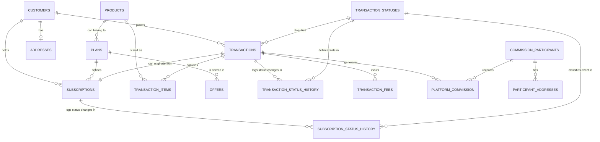

# `Core_DB_Architecture.md` 


```markdown
---
title: "Unified Sales and Subscription Database Architecture"
id: "core_db_arch_001"
doc_type: "architecture_document"
doc_version: "1.3" # Reflects this revision
date_created: "2025-04-23"
date_updated: "2025-04-24" # Updated to current revision date
author: "João Castanheira"
db_name: "joaocastanheira_bancodedados"
db_version: "1.0"
doc_status: "Approved"
environment: "Production"
language: "en" # Document language is English
response_languages: ["pt-BR", "en"] # Agent can respond in these languages
technical_terms_preservation: "strict" # Enforce strict preservation
original_language: "pt-BR" # Original language before translation
related_docs: [ # Cross-references to related documents
  "core_db_design_001", 
  "platform_integration_strategy_001", 
  "core_db_glossary_001", 
  "domain_customers_ecosystem_001", 
  "domain_products_catalog_001", 
  "domain_transactions_lifecycle_001", 
  "domain_subscriptions_management_001", 
  "domain_commission_system_001", 
  "domain_platform_integration_details_001", 
  "process_flow_purchase_lifecycle_001",
  "process_flow_subscription_lifecycle_001",
  "process_flow_refund_chargeback_001",
  "ref_db_schema_details_001"
]
db_engine: "PostgreSQL 13+"
technical_terms: { # Explicit list of technical terms for preservation
  "table_names": [
    "customers", "addresses", "customer_logs", "products", "plans", "offers", 
    "transactions", "transaction_items", "transaction_status_history", "transaction_fees", 
    "subscriptions", "subscription_status_history", "commission_participants", 
    "platform_commission", "participant_addresses", "transaction_statuses", 
    "platform_transaction_payment_history", "platform_utm_history", 
    "platform_software_invoice_history", "platform_sale_offer_history"
  ],
  "column_names": [
    "id", "product_id", "platform_origin", "status_id", "source", "transaction_id", 
    "customer_id", "created_at", "updated_at" # Add other key columns as needed
  ],
  "sql_keywords": [ # Common SQL keywords used
    "CREATE TABLE", "SERIAL", "PRIMARY KEY", "REFERENCES", "CONSTRAINT", 
    "UNIQUE", "VARCHAR", "INTEGER", "TIMESTAMP", "WITH TIME ZONE", "DEFAULT", 
    "CURRENT_TIMESTAMP", "JSONB", "NOT NULL", "SELECT", "FROM", "WHERE", "JOIN" 
  ]
}
embedding_guide_concepts: [ # Keywords for semantic search
  "data architecture", 
  "relational model", 
  "transaction system", 
  "data unification", 
  "functional domains", 
  "ER diagram", 
  "multi-platform database", 
  "schema organization", 
  "unification strategy", 
  "data normalization", 
  "multi-platform identification", 
  "data flows", 
  "sale lifecycle", 
  "subscription lifecycle", 
  "commission flow", 
  "data history",
  "platform independence",
  "ETL pipeline",
  "domain mapping",
  "data integration"
]
---


# Unified Sales and Subscription Database Architecture


## 1. Overview and Purpose


The `joaocastanheira_bancodedados` database was designed with the primary goal of unifying and normalizing sales, subscription, and commission data from multiple digital e-commerce platforms (such as Hotmart, Kiwify, and other future integrations). This solution addresses the critical challenge of consolidating data scattered across different systems, each with its own terminology, structures, and formats.


### 1.1. Core Objectives


1.  **Multi-platform Data Unification**: Create a single, reliable source for business performance analysis, regardless of the platform where transactions occurred.
2.  **Terminological Normalization**: Establish a common vocabulary for transaction status, payment methods, and other concepts that differ between platforms.
3.  **Bidirectional Traceability**: Maintain links with source systems by preserving external IDs (`platform_origin`, `product_id`, etc.), allowing precise reconciliation.
4.  **Support for Complex Analysis**: Facilitate business analyses that cross-reference data from multiple platforms, impossible to perform with isolated data.
5.  **Extensibility**: Design a flexible model that can accommodate new platforms with minimal integration effort.


### 1.2. Critical Role in the Ecosystem


This database is not just a repository, but a **central transformation component** that:


-   **Normalizes Data**: Converts different representations into a unified format, as detailed in the document **[Multi-platform Integration Strategy](platform_integration_strategy_001.md)**.
-   **Establishes Relationships**: Connects related entities (e.g., linking a `customer` to their `transactions` across platforms).
-   **Preserves History**: Maintains historical records (e.g., in `transaction_status_history`) essential for auditing and temporal analysis.
-   **Facilitates Interoperability**: Allows other systems (BI tools, reporting dashboards) to consume standardized data.


*(Ref: Unified DB Arch, ID core_db_arch_001)*


## 2. High-Level ER Diagram


The diagram below represents the main entities of the database and their relationships at a conceptual level. This model was structured around well-defined functional domains that reflect business reality.





This conceptual diagram illustrates the key relationships. Each entity corresponds to one or more tables (e.g., `CUSTOMERS` maps to the `customers` table) in the physical model, depending on normalization and performance needs. For complete details of the physical schema, refer to the document **[Detailed Schema Reference](ref_db_schema_details_001.md)**.


### 2.1. Central Model Characteristics


-   **Customer Focus**: Everything starts with the `customers` entity, representing the unified buyer across platforms.
-   **Product Flexibility**: `products` can be sold individually or through `plans` and `offers`.
-   **Complete History**: All status changes in `transactions` and `subscriptions` are recorded in respective history tables (e.g., `transaction_status_history`).
-   **Multi-item Support**: A `transaction` can contain multiple `transaction_items`.
-   **Financial Tracking**: `transaction_fees` and `platform_commission` are explicitly modeled.
-   **Platform Independence**: The core design allows storing data from any platform consistently, using fields like `platform_origin`.


*(Ref: Unified DB Arch, ID core_db_arch_001)*


## 3. Main Relationship Flows in the System


Beyond the static structure, understanding how entities interact in business flows is crucial.


### 3.1. Sales Flow (Single Transaction)


Purchase of a product/offer that isn't a recurring subscription.
```
[customers] <-- (places) -- [transactions] -- (contains) --> [transaction_items] -- (refers to) --> [products/offers/plans]
                                   |
                                   |-- (logs status changes in) --> [transaction_status_history]
                                   |
                                   |-- (incurs) --> [transaction_fees]
                                   |
                                   |-- (generates) --> [platform_commission] --> [commission_participants]
                                   |
                                   |-- (detailed in) --> [platform_transaction_payment_history]
                                   |
                                   |-- (tracked by) --> [platform_utm_history]
                                   |
                                   |-- (documented by) --> [platform_software_invoice_history]
                                   |
                                   |-- (captured in) --> [platform_sale_offer_history]
```
**Description**: A `customer` places a `transaction`. This `transaction` contains `transaction_items` referencing `products`/`offers`/`plans`. The `transaction` generates records in `transaction_status_history`, `transaction_fees`, `platform_commission` (for `commission_participants`), and various platform-specific detail tables (`platform_transaction_payment_history`, `platform_utm_history`, `platform_software_invoice_history`, `platform_sale_offer_history`).


See **[Purchase Lifecycle](process_flow_purchase_lifecycle_001.md)** for details.


### 3.2. Subscription and Recurrence Flow


Creation of a subscription and its recurring transactions.
```
[customers] <-- (holds) -- [subscriptions] -- (defined by) --> [plans] -- (offers) --> [products]
                                   |
                                   |-- (logs status changes in) --> [subscription_status_history]
                                   |
                                   |-- (originates) --> [transactions] (recurring)
```
**Description**: A `customer` holds a `subscription` based on a `plan`. The `subscription` logs its status changes in `subscription_status_history` and originates recurring `transactions`. Each recurring `transaction` follows the Sales Flow but is linked to the parent `subscription`.


See **[Subscription Lifecycle](process_flow_subscription_lifecycle_001.md)** for details.


### 3.3. Commission Flow


How commissions are assigned and recorded.
```
[transactions] -- (generates) --> [platform_commission] -- (received by) --> [commission_participants]
                                                                                       |
                                                                                       |-- (has) --> [participant_addresses]
```
**Description**: A `transaction` generates `platform_commission` records for `commission_participants`. Participant details are stored in `commission_participants` and `participant_addresses`.


See **[Commission System](domain_commission_system_001.md)** for details.


### 3.4. History and Audit Flow


Tracking important changes.
```
[customers] -- (logs changes in) --> [customer_logs]
[transactions] -- (logs status changes in) --> [transaction_status_history]
[subscriptions] -- (logs status changes in) --> [subscription_status_history]
```
**Description**: Changes to `customers` data, `transactions` status, and `subscriptions` status are recorded in respective history/log tables for auditing.


### 3.5. Refund and Chargeback Flow


Processing refunds and chargebacks.
```
[transactions] -- (status changes logged in) --> [transaction_status_history (status="Refunded")]
                        |
                        |-- (recorded in) --> [platform_transaction_payment_history (refund amount)]
                        |
                        |-- (adjusts) --> [platform_commission (reversal)]
```
**Description**: On refund/chargeback, the `transaction` status is updated (logged in `transaction_status_history`), a negative payment record is created (in `platform_transaction_payment_history`), and `platform_commission` records are adjusted/reversed.


See **[Refund and Chargeback Processing](process_flow_refund_chargeback_001.md)** for details.


*(Ref: Unified DB Arch, ID core_db_arch_001)*


## 4. Organization into Functional Domains


The database is structured into well-defined functional domains.


### 4.1. Customer Domain


**Main tables**: `customers`, `addresses`, `customer_logs`
**Responsibility**: Manage unified customer information.
**Key characteristics**: Email as unification key, separate addresses, change logging.
**Detailed document**: **[Customer Ecosystem](domain_customers_ecosystem_001.md)**


### 4.2. Product Domain


**Main tables**: `products`, `plans`, `offers`
**Responsibility**: Maintain the unified catalog.
**Key characteristics**: Hierarchy (`product` → `plan` → `offer`), cross-platform unification.
**Detailed document**: **[Product Catalog](domain_products_catalog_001.md)**


### 4.3. Transaction Domain


**Main tables**: `transactions`, `transaction_items`, `transaction_status_history`, `transaction_fees`, `transaction_statuses`, `platform_transaction_payment_history`
**Responsibility**: Record all sales transactions.
**Key characteristics**: Detailed monetary values, status lifecycle tracking via `transaction_status_history`.
**Detailed document**: **[Transaction Lifecycle](domain_transactions_lifecycle_001.md)**


### 4.4. Subscription Domain


**Main tables**: `subscriptions`, `subscription_status_history`
**Responsibility**: Control recurring subscriptions.
**Key characteristics**: Date tracking, status tracking via `subscription_status_history`, linking to `transactions`.
**Detailed document**: **[Subscription Management](domain_subscriptions_management_001.md)**


### 4.5. Commission Domain


**Main tables**: `commission_participants`, `platform_commission`, `participant_addresses`
**Responsibility**: Manage commission participants and calculations.
**Key characteristics**: Detailed participant info, commission tracking per `transaction`.
**Detailed document**: **[Commission System](domain_commission_system_001.md)**


### 4.6. Platform Integration Details Domain


**Main tables**: `platform_transaction_payment_history`, `platform_utm_history`, `platform_software_invoice_history`, `platform_sale_offer_history`
**Responsibility**: Store platform-specific details.
**Key characteristics**: Preserves original context, supports marketing analysis, ensures compliance.
**Detailed document**: **[Platform Integration Details](domain_platform_integration_details_001.md)**


This domain organization aligns with **[Core Database Design Principles](core_db_design_001.md)**.


*(Ref: Unified DB Arch, ID core_db_arch_001)*


## 5. Multi-platform Data Unification Approach


Unifying data from diverse platforms (Hotmart, Kiwify, etc.) is a core challenge addressed by this architecture.


### 5.1. Unique Identification with Traceability


**Approach**: Use an internal `id` (`SERIAL PRIMARY KEY`) for relationships, while preserving original platform identifiers.


**Implementation**:
```sql
-- Example: products table structure
CREATE TABLE IF NOT EXISTS products (
    id              SERIAL PRIMARY KEY,         -- Internal unique ID
    product_id      VARCHAR(100) NOT NULL,      -- Original platform's product ID
    platform_origin VARCHAR(100) NOT NULL,      -- Name of the originating platform (e.g., 'Hotmart', 'Kiwify')
    -- other unified product fields
    CONSTRAINT uq_product_platform UNIQUE (product_id, platform_origin) -- Ensures unique product per platform
);
```
**Benefit**: Efficient internal joins and clear traceability to external systems.


### 5.2. Vocabulary Normalization


**Example: Transaction Status Unification**


| Platform | Original Status (`platform_status`) | Normalized Status (`status_id` references `transaction_statuses`.`status`) |
|----------|-----------------------------------|----------------------------------------------------------------------------|
| Hotmart  | `"APPROVED"`                      | `"Approved"`                                                               |
| Kiwify   | `"paid"`                          | `"Approved"`                                                               |
| Hotmart  | `"REFUNDED"`                      | `"Refunded"`                                                               |
| Kiwify   | `"refunded"`                      | `"Refunded"`                                                               |


**Implementation**:
```sql
-- Central table for normalized statuses
CREATE TABLE IF NOT EXISTS transaction_statuses (
    id         SERIAL PRIMARY KEY,
    status     VARCHAR(50) NOT NULL UNIQUE,  -- Standardized status name (e.g., 'Approved', 'Refunded')
    created_at TIMESTAMP WITH TIME ZONE DEFAULT CURRENT_TIMESTAMP,
    updated_at TIMESTAMP WITH TIME ZONE DEFAULT CURRENT_TIMESTAMP
);


-- Reference in transactions table
CREATE TABLE IF NOT EXISTS transactions (
    -- other fields
    status_id           INTEGER REFERENCES transaction_statuses(id), -- Foreign key to normalized status
    platform_status     VARCHAR(100), -- Store the original status from the platform if needed
    -- more fields
);
```
**Benefit**: Consistent querying and reporting across platforms using the normalized `status_id`.


See **[Multi-platform Integration Strategy](platform_integration_strategy_001.md)** for details.


### 5.3. Historical Snapshots Preservation


**Approach**: Capture critical data (like offer details) at the time of the transaction.


**Implementation**:
```sql
-- Example: Snapshot of offer details at the time of sale
CREATE TABLE IF NOT EXISTS platform_sale_offer_history (
    id             SERIAL PRIMARY KEY,
    transaction_id INTEGER REFERENCES transactions(id), -- Link to the transaction
    code           VARCHAR(100),          -- Offer code at time of sale
    offer_name     VARCHAR(255),          -- Offer name at time of sale
    description    VARCHAR(500),          -- Offer description at time of sale
    -- other relevant snapshot fields
    created_at     TIMESTAMP WITH TIME ZONE DEFAULT CURRENT_TIMESTAMP,
    updated_at     TIMESTAMP WITH TIME ZONE DEFAULT CURRENT_TIMESTAMP
);
```
**Benefit**: Ensures historical accuracy even if the source `offer` changes later.


### 5.4. Extensible Data Model


**Approach**: Accommodate platform-specific fields while maintaining a common core structure.


**Implementation**:
- Universal fields are direct columns (e.g., `amount` in `transactions`).
- Common platform-specific fields are included (e.g., `payment_method` in `transactions`).
- Highly specific or variable data can use `JSONB` columns or dedicated extension tables.


**Benefit**: Facilitates adding new platforms with minimal core schema changes. See **[Core Database Design Principles - Schema Evolution and Extension Section](core_db_design_001.md#schema-evolution-and-extension)**.


### 5.5. Standardized ETL Pipeline (Conceptual)


Our integration strategy relies on a standardized ETL (Extract, Transform, Load) pipeline:
1.  **Extract**: Fetch data from platform APIs.
2.  **Transform**: Convert data to the normalized model, mapping statuses and terms.
3.  **Load**: Insert data into the unified database, maintaining relationships and preserving original IDs.


This uses platform-specific adapters for extraction and transformation logic. See **[Multi-platform Integration Strategy](platform_integration_strategy_001.md)**.


*(Ref: Unified DB Arch, ID core_db_arch_001)*


## 6. Performance and Security Considerations


### 6.1. Performance


Designed for efficient querying:
1.  **Strategic Indexes**: On foreign keys, frequently filtered columns (`created_at`, `status_id`), and sorting columns.
2.  **Partitioning Ready**: High-volume tables (`transactions`, history tables) designed for potential future partitioning by date or platform.
3.  **Optimized Data Types**: Using appropriate types (e.g., `INTEGER` for IDs, `TIMESTAMP WITH TIME ZONE` for dates).
4.  **Query Optimization**: Structure facilitates common analytical queries.


See **[Core Database Design Principles - Performance and Scalability Considerations Section](core_db_design_001.md#performance-and-scalability-considerations)**.


### 6.2. Security


Multiple security layers:
1.  **Referential Integrity**: Enforced via foreign key constraints (`REFERENCES`).
2.  **Auditing**: History tables (`*_history`, `*_logs`) track changes.
3.  **Data Protection**: Strategies for handling sensitive data (details outside this scope).
4.  **Access Control**: Schema design supports role-based access control (implementation details separate).


See **[Core Database Design Principles - Data Security and Governance Guidelines Section](core_db_design_001.md#data-security-and-governance-guidelines)**.


*(Ref: Unified DB Arch, ID core_db_arch_001)*


## 7. Conclusion


The `joaocastanheira_bancodedados` database provides a robust architecture for unifying sales and subscription data from diverse platforms. Its domain-driven design and multi-platform unification strategy enable:


-   **Integrated Business Analysis**: Holistic view across platforms.
-   **Accurate Financial Reporting**: Consolidated metrics.
-   **Auditing and Compliance**: Detailed traceability.
-   **Future Extensibility**: Easier integration of new platforms.


The core strength lies in normalizing disparate data while preserving original context, achieved through dual IDs, vocabulary mapping, historical snapshots, and a flexible model. This empowers data-driven decisions based on a complete and consistent dataset.


Refer to related documents for specific domain details, process flows, and query examples.


*(Ref: Unified DB Arch, ID core_db_arch_001)*
```