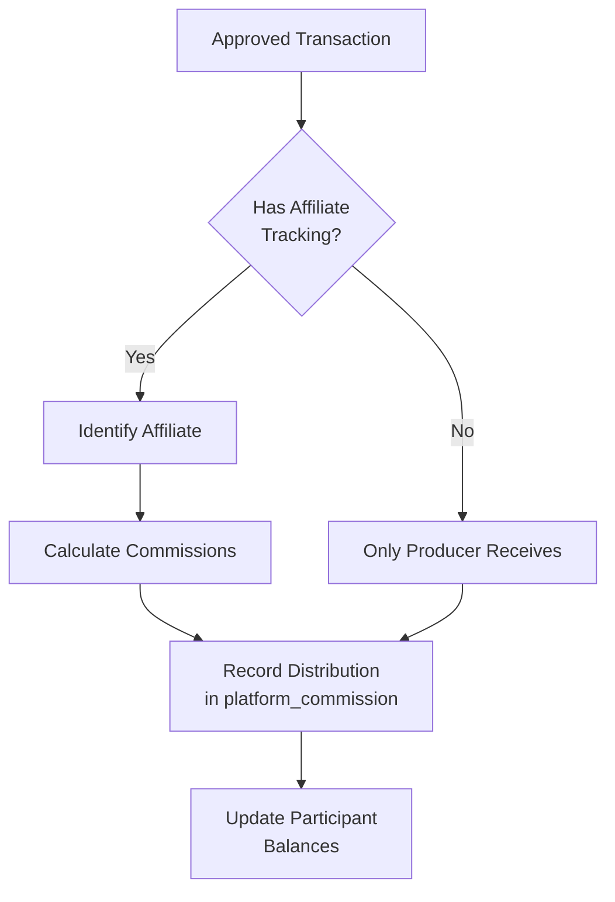
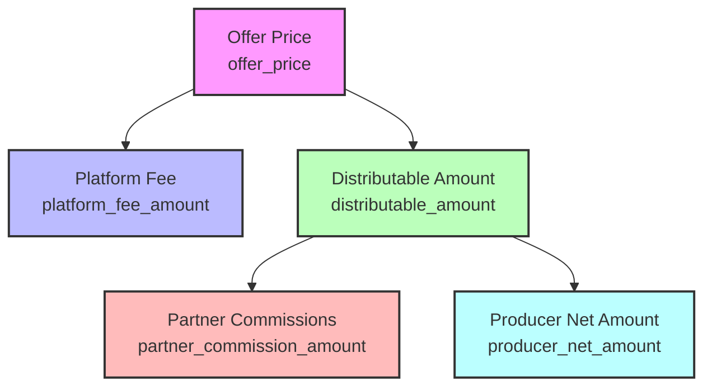
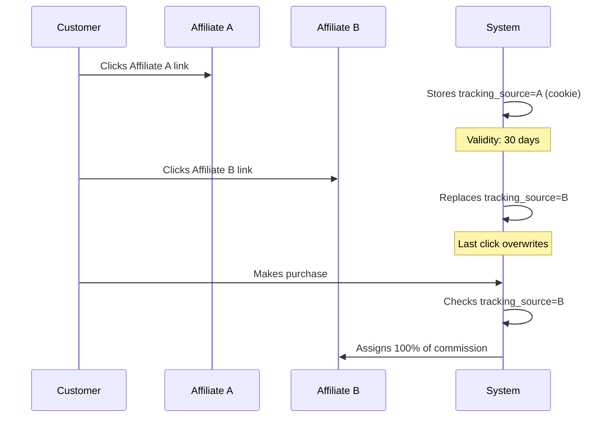
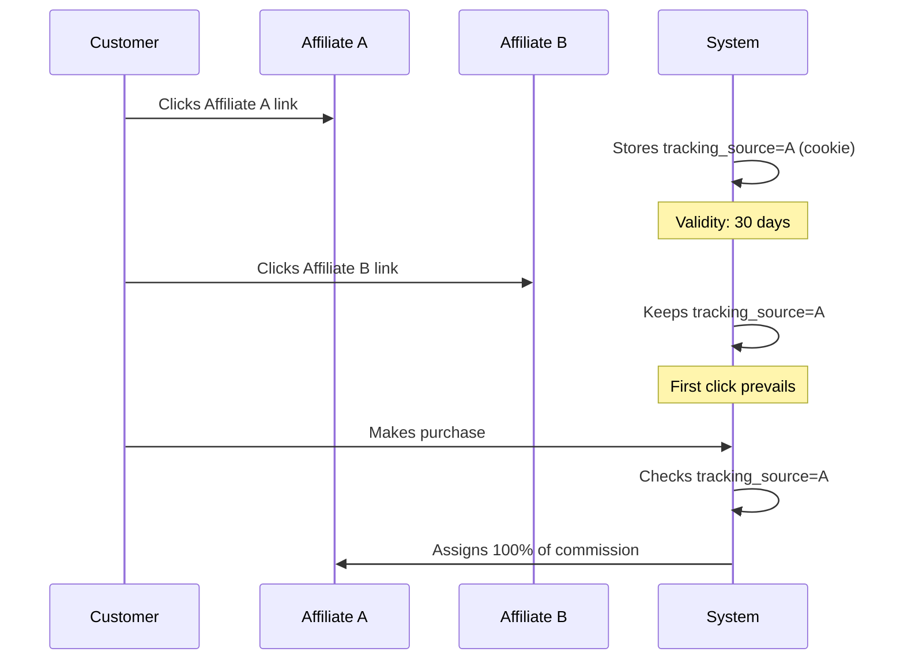
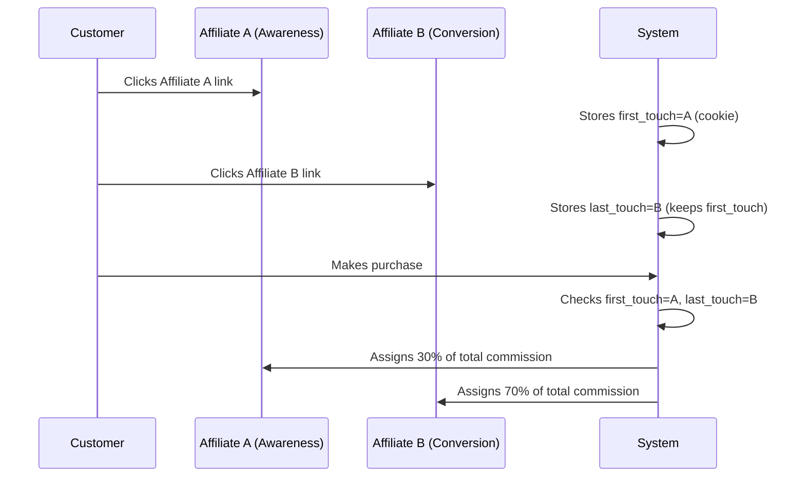
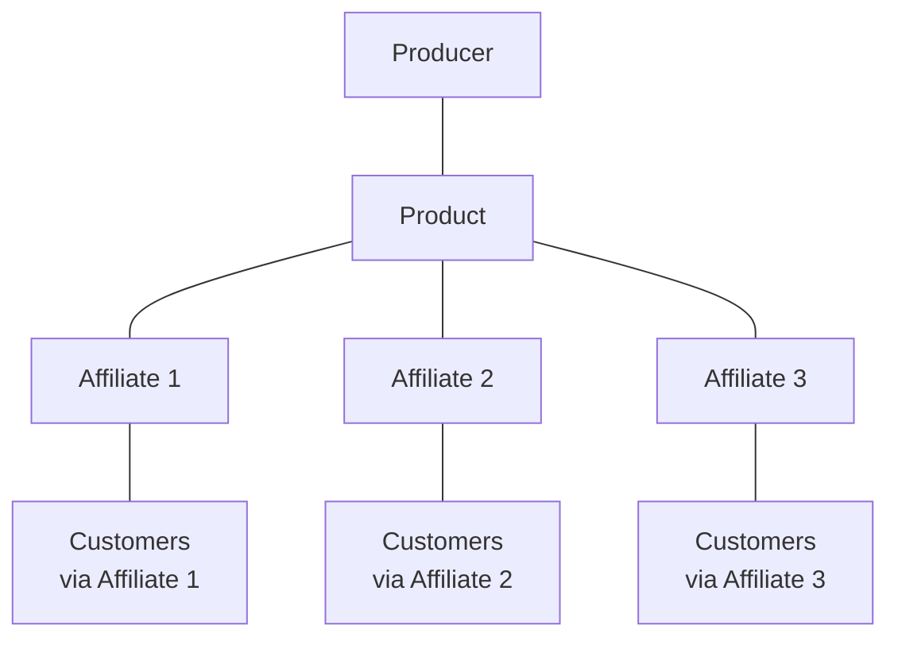
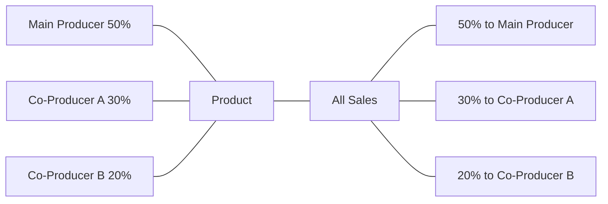
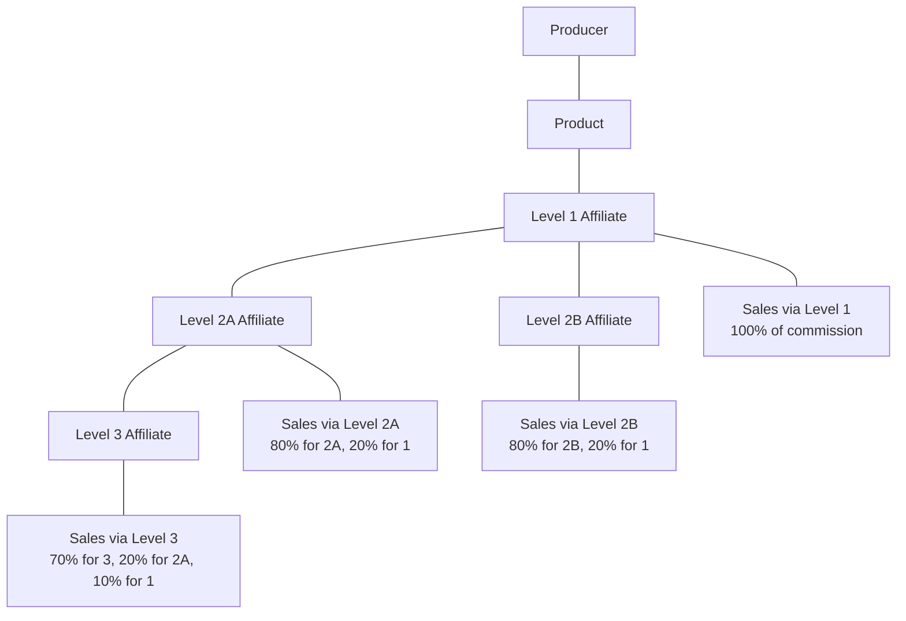
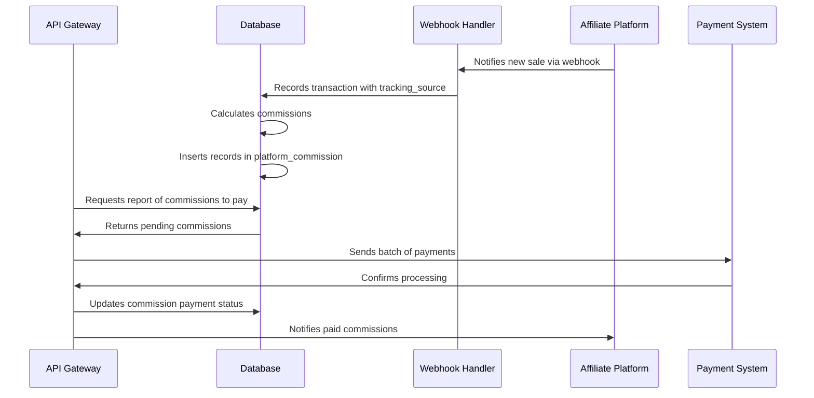

# `Domain_Commission_System.md` 
```markdown
---
title: "Domain: Commission System"
id: "domain_commission_system_001"
doc_type: "domain_functional"
doc_version: "1.1"
date_created: "2025-04-23"
date_updated: "2025-04-23"
author: "João Castanheira"
db_name: "joaocastanheira_bancodedados"
db_version: "1.0"
doc_status: "Approved"
environment: "Production"
language: "en"
response_languages: ["pt-BR", "en"]
technical_terms_preservation: "strict"
original_language: "pt-BR"
related_docs: [
  "core_db_architecture_001", 
  "platform_integration_strategy_001", 
  "domain_transactions_lifecycle_001", 
  "domain_customers_ecosystem_001", 
  "domain_products_catalog_001", 
  "process_flow_commission_system_001"
]
tables_in_domain: [
  "commission_participants", 
  "platform_commission", 
  "participant_addresses", 
  "transactions", 
  "platform_utm_history",
  "transaction_items",
  "product_coproducers",
  "affiliate_hierarchy",
  "affiliate_click_tracking",
  "transaction_statuses",
  "commission_compliance_actions",
  "affiliate_logins",
  "subscriptions"
]
technical_terms: {
  "table_names": [
    "commission_participants", "platform_commission", "participant_addresses", 
    "transactions", "platform_utm_history", "transaction_items", 
    "product_coproducers", "affiliate_hierarchy", "affiliate_click_tracking", 
    "transaction_statuses", "commission_compliance_actions", "affiliate_logins", 
    "subscriptions", "customers", "products", "plans"
  ],
  "column_names": [
    "id", "platform_id", "platform_origin", "email", "name", "trader_name", 
    "locale", "created_at", "updated_at", "phone_local_code", "phone_number", 
    "document_type", "document_number", "transaction_id", "participant_id", 
    "amount", "currency_code", "source", "address", "neighborhood", "country", 
    "city", "zip_code", "complement", "number", "state", "partner_commission_amount", 
    "tracking_source", "tracking_sck", "order_date", "utm_source", "utm_medium", 
    "utm_campaign", "utm_term", "utm_content", "capture_date", "offer_price", 
    "platform_fee_amount", "distributable_amount", "producer_net_amount", 
    "status_id", "customer_id", "subscription_id", "recurrence_number", 
    "is_subscription", "product_id", "percentage", "affiliate_id", "parent_id", 
    "level", "ip_address", "device_fingerprint", "user_agent", "click_time", 
    "converted", "action_type", "reason", "affected_transactions", "amount_adjusted", 
    "performed_by", "notes", "start_date", "affiliate_commission_percent"
  ],
  "data_types": [
    "SERIAL", "VARCHAR", "INTEGER", "NUMERIC", "TIMESTAMP WITH TIME ZONE", 
    "TEXT", "BOOLEAN", "PRIMARY KEY", "REFERENCES", "ON DELETE CASCADE", 
    "DEFAULT", "CURRENT_TIMESTAMP", "CONSTRAINT", "UNIQUE", "NOT NULL",
    "INTERVAL", "INTEGER[]"
  ],
  "sql_keywords": [
    "CREATE TABLE", "CREATE VIEW", "CREATE ROLE", "CREATE INDEX", "GRANT", "SELECT", 
    "INSERT INTO", "VALUES", "UPDATE", "DELETE", "FROM", "WHERE", "GROUP BY", 
    "ORDER BY", "HAVING", "JOIN", "LEFT JOIN", "WITH", "CASE", "WHEN", "THEN", 
    "ELSE", "END", "SET", "AS", "ON", "AND", "OR", "IN", "NOT IN", "COUNT", 
    "SUM", "AVG", "MIN", "MAX", "ROUND", "CONCAT", "SUBSTRING", "POSITION", 
    "EXTRACT", "INTERVAL", "PARTITION BY", "REFERENCES", "NULLIF", "IS NULL", 
    "IS NOT NULL", "BETWEEN", "LIMIT", "OFFSET", "IF EXISTS", "IF NOT EXISTS", 
    "CURRENT_TIMESTAMP", "CURRENT_DATE", "CURRENT_SETTING", "FOR VALUES FROM", 
    "TO", "CREATE OR REPLACE FUNCTION", "RETURNS", "LANGUAGE plpgsql", "BEGIN", 
    "END", "DECLARE", "DEFAULT", "ORDER BY", "HAVING", "DESC", "ASC", "LOWER", 
    "DISTINCT", "COALESCE"
  ],
  "function_names": [
    "distribute_mlm_commissions"
  ],
  "source_values": [
    "PRODUCER", "AFFILIATE", "COPRODUCER", "SECOND_TIER", "TEAM_LEADER", 
    "AFFILIATE_CONVERTER", "AFFILIATE_INITIATOR", "LEVEL_1_OVERRIDE"
  ],
  "status_values": [
    "Aprovada", "Reembolsada", "Aguardando Período Garantia",
    "Approved", "Refunded", "Waiting Guarantee Period"
  ],
  "roles": [
    "affiliate_portal_user"
  ],
  "database_objects": [
    "affiliate_portal.commission_view"
  ]
}
functional_domain: ["Revenue Share", "Affiliate Marketing", "Partner Management"]
embedding_guide_concepts: [
  "commission system", 
  "affiliates", 
  "producers", 
  "co-producers", 
  "recurring commission", 
  "sale attribution", 
  "affiliate tracking", 
  "revenue sharing", 
  "commission participant", 
  "commission calculation", 
  "commission source", 
  "tracking_source", 
  "tracking_sck", 
  "commission payment", 
  "attribution model", 
  "first click", 
  "last click", 
  "multilevel marketing", 
  "commission fraud"
]
---


# Domain: Commission System


## System Overview


The Commission System manages revenue distribution among various participants in a collaborative sales ecosystem. It tracks, calculates, and records amounts due to each contributor in the sales process, from original producers to promotional affiliates.


This domain is essential for operations involving:


- **Affiliate programs** where external promoters receive percentages of the sales they generate
- **Co-production models** where multiple creators share revenues from a product
- **Multilevel structures** where there are referral chains between participants
- **Revenue sharing** based on different contributions to the sales process


The system precisely captures who contributed to each transaction, their role in the process (affiliate, producer, co-producer), how much they should receive, and ensures complete traceability of these attributions over time.





(Ref: Commission System, ID domain_commission_system_001)


## Commission System Data Structure


### 1. Participants and Their Roles


The `commission_participants` table is the central registry of all entities that can receive commissions:


```sql
CREATE TABLE IF NOT EXISTS commission_participants (
    id               SERIAL PRIMARY KEY,
    platform_id      VARCHAR(255) NOT NULL,                -- Platform ID
    platform_origin  VARCHAR(100) NOT NULL,                -- Platform name
    email            VARCHAR(255),                         -- Participant email
    name             VARCHAR(255),                         -- Full name
    trader_name      VARCHAR(255),                         -- Business name
    locale           VARCHAR(20),                          -- Location/language
    created_at       TIMESTAMP WITH TIME ZONE DEFAULT CURRENT_TIMESTAMP,
    updated_at       TIMESTAMP WITH TIME ZONE DEFAULT CURRENT_TIMESTAMP,
    phone_local_code VARCHAR(10),                          -- Area code
    phone_number     VARCHAR(20),                          -- Phone number
    document_type    VARCHAR(10),                          -- Document type
    document_number    VARCHAR(55)                         -- Document Number
    CONSTRAINT uq_participant_platform UNIQUE (platform_id, platform_origin)
);
```


#### Types of Participants in the Ecosystem:


|Type|Description|Identification|Typical Commission|
|------|-----------|---------------|------------------------|
|**Producer**|Original product creator|Product owner in the catalog|Receives net value (after fees and partner commissions)|
|**Affiliate**|External promoter who advertises products|Through tracking codes (`tracking_source`)|Fixed or variable percentage per referenced sale|
|**Co-Producer**|Contributor to product creation|Direct link with the product in the system|Percentage of all sales, regardless of channel|
|**Sub-Affiliate**|Affiliate recruited by another affiliate|Through affiliation hierarchy|Generates commission for themselves and their recruiter|


#### Contact and Fiscal Data:


To process payments and meet fiscal requirements, the system stores complementary data:


```sql
CREATE TABLE IF NOT EXISTS participant_addresses (
    id             SERIAL PRIMARY KEY,
    participant_id INTEGER NOT NULL REFERENCES commission_participants ON DELETE CASCADE,
    address        VARCHAR(255),                          -- Street address
    neighborhood   VARCHAR(100),                          -- Neighborhood
    country        VARCHAR(100),                          -- Country
    city           VARCHAR(100),                          -- City
    zip_code       VARCHAR(20),                           -- Zip code
    complement     VARCHAR(255),                          -- Complement
    number         VARCHAR(20),                           -- Number
    created_at     TIMESTAMP WITH TIME ZONE DEFAULT CURRENT_TIMESTAMP,
    updated_at     TIMESTAMP WITH TIME ZONE DEFAULT CURRENT_TIMESTAMP,
    state          VARCHAR(100)                           -- State
);
```


This separation into a specific address table allows:
- Updating contact data without affecting the main record
- Support for multiple addresses in the future (residential/commercial)
- Consistent structure with other system entities that have addresses


### 2. Commission Records


The `platform_commission` table records each individual commission attribution:


```sql
CREATE TABLE IF NOT EXISTS platform_commission (
    id             SERIAL PRIMARY KEY,
    transaction_id INTEGER NOT NULL REFERENCES transactions ON DELETE CASCADE,
    participant_id INTEGER NOT NULL REFERENCES commission_participants,
    amount         NUMERIC(15, 4) NOT NULL,                -- Commission amount
    currency_code  VARCHAR(3) NOT NULL,                    -- Currency code
    source         VARCHAR(100),                           -- Commission source
    created_at     TIMESTAMP WITH TIME ZONE DEFAULT CURRENT_TIMESTAMP,
    updated_at     TIMESTAMP WITH TIME ZONE DEFAULT CURRENT_TIMESTAMP
);
```


#### The `source` Field as Role Identifier:


The `source` field is crucial for understanding the **role** that the participant played in the transaction:


|`source` Value|Meaning|Usage Context|
|-------------------|-------------|-----------------|
|`PRODUCER`|Main producer|Receipt of final net value|
|`AFFILIATE`|Direct affiliate|Commission for sale generated directly|
|`COPRODUCER`|Co-producer/partner|Revenue participation as co-creator|
|`SECOND_TIER`|Second-level affiliate|In multilevel marketing structures|
|`TEAM_LEADER`|Team leader|In programs with affiliate team structures|


Example of how multiple records are created for a single transaction:


```sql
-- For a transaction with ID 123 involving producer, affiliate and co-producer
INSERT INTO platform_commission (transaction_id, participant_id, amount, currency_code, source)
VALUES 
  (123, 456, 450.00, 'BRL', 'PRODUCER'),     -- Producer receives R$450.00
  (123, 789, 270.00, 'BRL', 'AFFILIATE'),    -- Affiliate receives R$270.00
  (123, 101, 180.00, 'BRL', 'COPRODUCER');   -- Co-producer receives R$180.00
```


### 3. Sale Origin Tracking


Tracking who generated a sale is implemented through specific fields in the `transactions` table:


```sql
-- Commission-relevant fields in the transactions table
transaction_id            VARCHAR(100) NOT NULL,           -- Platform ID
...
partner_commission_amount NUMERIC(15, 4) DEFAULT 0,        -- Total commissions
tracking_source           VARCHAR(100),                    -- Affiliate ID
tracking_sck              VARCHAR(100),                    -- Secondary code
...
```


#### How Tracking Works:


1. **Link Generation**: An affiliate receives a link with tracking parameters
   ```
   https://product.com/?src=affiliate123&sck=instagram
   ```


2. **Parameter Capture**: When a customer clicks the link, parameters are captured
   ```javascript
   // Simplified capture example in JavaScript
   const urlParams = new URLSearchParams(window.location.search);
   const affiliateCode = urlParams.get('src');
   const trackingSource = urlParams.get('sck');
   
   // Store in cookies or localStorage to persist during navigation
   localStorage.setItem('tracking_src', affiliateCode);
   localStorage.setItem('tracking_sck', trackingSource);
   ```


3. **Storage in Transaction**: At the time of purchase, parameters are associated with the transaction
   ```sql
   INSERT INTO transactions (
       /* other fields */
       tracking_source,
       tracking_sck
   ) VALUES (
       /* other values */
       'affiliate123',
       'instagram'
   );
   ```


4. **Commission Attribution**: The system uses this data to calculate and record commissions
   ```sql
   -- Attribution pseudocode
   SELECT id FROM commission_participants
   WHERE platform_id = 'affiliate123'
   AND platform_origin = 'Hotmart';
   
   -- Register commission with the found ID
   ```


For more detailed marketing analyses, additional UTM parameters are stored in the `platform_utm_history` table:


```sql
CREATE TABLE IF NOT EXISTS platform_utm_history (
    id             SERIAL PRIMARY KEY,
    transaction_id INTEGER NOT NULL REFERENCES transactions ON DELETE CASCADE,
    utm_source     VARCHAR(255),                           -- Source
    utm_medium     VARCHAR(255),                           -- Medium
    utm_campaign   VARCHAR(255),                           -- Campaign
    utm_term       VARCHAR(255),                           -- Term
    utm_content    VARCHAR(255),                           -- Content
    capture_date   TIMESTAMP WITH TIME ZONE DEFAULT CURRENT_TIMESTAMP,
    created_at     TIMESTAMP WITH TIME ZONE DEFAULT CURRENT_TIMESTAMP,
    updated_at     TIMESTAMP WITH TIME ZONE DEFAULT CURRENT_TIMESTAMP
);
```


(Ref: Commission System, ID domain_commission_system_001)


## Financial Flow and Commission Calculation


### Sale Value Breakdown


Each transaction goes through a division process that determines how much each party will receive:





#### 1. Key Fields in the `transactions` Table:


```sql
offer_price               NUMERIC(15, 4) NOT NULL,             -- Offer price
platform_fee_amount       NUMERIC(15, 4) DEFAULT 0,            -- Platform fees
distributable_amount      NUMERIC(15, 4),                      -- Distributable amount
partner_commission_amount NUMERIC(15, 4) DEFAULT 0,            -- Commissions
producer_net_amount       NUMERIC(15, 4),                      -- Producer net amount
```


#### 2. Calculation Process:


```sql
-- Example calculation in a typical transaction
-- 1. Define the total sale value
SET @offer_price = 100.00;


-- 2. Calculate the platform fee (e.g.: 10%)
SET @platform_fee_amount = @offer_price * 0.10;


-- 3. Calculate the distributable amount
SET @distributable_amount = @offer_price - @platform_fee_amount;


-- 4. Calculate the affiliate commission (e.g.: 30% of distributable)
SET @affiliate_commission = @distributable_amount * 0.30;


-- 5. Calculate the co-producer commission (e.g.: 20% of distributable)
SET @coproducer_commission = @distributable_amount * 0.20;


-- 6. Calculate the total commissions
SET @partner_commission_amount = @affiliate_commission + @coproducer_commission;


-- 7. Calculate the producer net amount
SET @producer_net_amount = @distributable_amount - @partner_commission_amount;


-- 8. Verification: the distributable amount is divided between partners and producer
-- @distributable_amount = @partner_commission_amount + @producer_net_amount
```


### Distribution Examples in Different Models


#### Example 1: Direct Sale (No Affiliate)


```
Offer Price: $100.00
- Platform Fee (10%): $10.00
= Distributable Amount: $90.00
  - Partner Commissions (0%): $0.00
  = Producer Net Amount: $90.00
```


#### Example 2: Sale through Affiliate


```
Offer Price: $100.00
- Platform Fee (10%): $10.00
= Distributable Amount: $90.00
  - Affiliate Commission (30% of distributable): $27.00
  = Producer Net Amount: $63.00
```


#### Example 3: Co-Production with Affiliate


```
Offer Price: $100.00
- Platform Fee (10%): $10.00
= Distributable Amount: $90.00
  - Affiliate Commission (30% of distributable): $27.00
  - Co-producer Commission (20% of distributable): $18.00
  = Main Producer Net Amount: $45.00
```


#### Example 4: Multilevel Marketing (2 Levels)


```
Offer Price: $100.00
- Platform Fee (10%): $10.00
= Distributable Amount: $90.00
  - Direct Affiliate Commission (25% of distributable): $22.50
  - 2nd Level Affiliate Commission (5% of distributable): $4.50
  = Producer Net Amount: $63.00
```


### Commission Calculation in Recurring Subscriptions


In subscription-based business models, commissions are calculated on each billing cycle:


```sql
-- Query to check recurring commissions for a specific affiliate
SELECT 
    t.transaction_id,
    t.order_date,
    s.subscription_id,
    t.recurrence_number,
    pc.amount AS commission_amount
FROM 
    transactions t
JOIN 
    subscriptions s ON t.subscription_id = s.id
JOIN 
    platform_commission pc ON t.id = pc.transaction_id
JOIN 
    commission_participants cp ON pc.participant_id = cp.id
WHERE 
    cp.email = 'affiliate@example.com'
    AND t.is_subscription = true
    AND pc.source = 'AFFILIATE'
ORDER BY 
    s.subscription_id, t.recurrence_number;
```


**Recurring Commission Characteristics:**


- The affiliate who generated the initial sale continues to receive commissions on renewals
- Commissions are based on the value of each renewal (which may vary)
- The original attribution is preserved throughout the subscription lifecycle
- Provides predictable and long-term revenue for affiliates


(Ref: Commission System, ID domain_commission_system_001)


## Attribution Models and Tracking


### Main Attribution Models


The system supports different models to determine which affiliate receives credit for a sale:


#### 1. Last Click Model





This is the most common model on platforms, where:
- Only the last affiliate whose link was clicked receives the commission
- Previous cookies are overwritten by more recent clicks
- Favors affiliates who effectively convert the customer in the final phase


```sql
-- Last Click implementation pseudocode
-- At purchase time, simply use the current value of cookies
INSERT INTO transactions (
    /* other fields */
    tracking_source,
    tracking_sck
) VALUES (
    /* other values */
    COOKIE['tracking_src'],  -- Last stored value
    COOKIE['tracking_sck']   -- Last stored value
);
```


#### 2. First Click Model





Less common, but values who initiated the process:
- The first affiliate whose link was clicked receives the commission
- Subsequent clicks do not replace the original tracking
- Favors "top-of-funnel" affiliates who generate initial awareness


```sql
-- First Click implementation pseudocode
-- On first click, ensure it doesn't overwrite if already exists
IF (COOKIE['tracking_src'] IS NULL) THEN
    SET COOKIE['tracking_src'] = 'affiliate123';
    SET COOKIE['tracking_sck'] = 'campaign';
END IF;
```


#### 3. Split Commission Model





More complex, but fairer in certain contexts:
- Recognizes multiple contributions in the sales funnel
- Divides the commission in predefined proportions
- Requires more sophisticated tracking of multiple touchpoints


```sql
-- Simplified implementation example of split commission
-- Assuming we have first_touch and last_touch cookies


-- Calculate total available commission
SET @total_commission = @distributable_amount * 0.30;


-- Distribute between affiliates (70% for last touch, 30% for first)
SET @last_touch_commission = @total_commission * 0.70;
SET @first_touch_commission = @total_commission * 0.30;


-- Record the split commissions
INSERT INTO platform_commission (transaction_id, participant_id, amount, currency_code, source)
VALUES 
  (@transaction_id, (SELECT id FROM commission_participants WHERE platform_id = COOKIE['last_touch']), 
   @last_touch_commission, 'BRL', 'AFFILIATE_CONVERTER'),
  (@transaction_id, (SELECT id FROM commission_participants WHERE platform_id = COOKIE['first_touch']), 
   @first_touch_commission, 'BRL', 'AFFILIATE_INITIATOR');
```


### Cookie Period and Attribution


The time during which an affiliate maintains "credit" for an eventual purchase (known as "cookie duration" or "attribution window") is a critical parameter:


```sql
-- Example: check if an affiliate cookie is still valid
SELECT 
    CASE 
        WHEN COOKIE['tracking_timestamp']::timestamp + INTERVAL '30 days' >= CURRENT_TIMESTAMP 
        THEN 'Valid'
        ELSE 'Expired'
    END AS cookie_status,
    COOKIE['tracking_src'] AS affiliate_code,
    COOKIE['tracking_timestamp']::timestamp AS click_date,
    COOKIE['tracking_timestamp']::timestamp + INTERVAL '30 days' AS expiration_date,
    CURRENT_TIMESTAMP AS current_date,
    (COOKIE['tracking_timestamp']::timestamp + INTERVAL '30 days' - CURRENT_TIMESTAMP) AS time_remaining
```


Considerations about the attribution period:
- **Short period** (7-14 days): Favors quick purchase decisions, ideal for low-ticket products
- **Medium period** (30 days): Balanced for most digital products
- **Long period** (60-90 days): Suitable for complex products with an extensive decision cycle
- **Lifetime**: In some cases, an affiliate may maintain attribution permanently for all products purchased by the customer ("referred customer" model)


(Ref: Commission System, ID domain_commission_system_001)


## Business Models and Commission Structures


The system is designed to support various commission-based business models:


### 1. Traditional Affiliate Program


**Structure:** A producer and multiple independent affiliates promoting their products.





**Implementation:**
```sql
-- 1. Commission configuration on the product
UPDATE products
SET affiliate_commission_percent = 30.0  -- 30% for affiliates
WHERE id = 123;


-- 2. Commission recording when a sale occurs
INSERT INTO platform_commission (
    transaction_id,
    participant_id,
    amount,
    currency_code,
    source
)
VALUES (
    @transaction_id,
    (SELECT id FROM commission_participants WHERE platform_id = @tracking_source),
    @distributable_amount * (SELECT affiliate_commission_percent/100 FROM products WHERE id = @product_id),
    'BRL',
    'AFFILIATE'
);
```


**Characteristics:**
- Affiliates promote products and receive fixed or variable percentage per sale
- Each affiliate operates independently, without hierarchy
- Commissions are paid based on performance (completed sales)
- Tracking via `tracking_source` and `tracking_sck`


### 2. Co-Production / Revenue Share


**Structure:** Multiple producers share the creation and ownership of a product.





**Implementation:**
```sql
-- Co-production configuration (product_coproducers would be an addition)
INSERT INTO product_coproducers (
    product_id,
    participant_id,
    percentage
)
VALUES
    (123, 456, 50.0),  -- Main producer with 50%
    (123, 789, 30.0),  -- Co-producer A with 30%
    (123, 101, 20.0);  -- Co-producer B with 20%


-- Commission recording in a sale
INSERT INTO platform_commission (
    transaction_id,
    participant_id,
    amount,
    currency_code,
    source
)
SELECT
    @transaction_id,
    pc.participant_id,
    @distributable_amount * (pc.percentage / 100),
    'BRL',
    CASE WHEN pc.percentage = 50.0 THEN 'PRODUCER' ELSE 'COPRODUCER' END
FROM
    product_coproducers pc
WHERE
    pc.product_id = @product_id;
```


**Characteristics:**
- Each co-producer receives a fixed percentage of all sales
- Independent of the sales channel (with or without affiliate)
- Division usually defined in contract before launch
- Automated for all product transactions


### 3. Multilevel Marketing (MLM)


**Structure:** Hierarchy of affiliates where each one can recruit others, creating multiple levels.





**Implementation:**
```sql
-- Assuming an affiliate hierarchy table
CREATE TABLE affiliate_hierarchy (
    id SERIAL PRIMARY KEY,
    affiliate_id INTEGER REFERENCES commission_participants(id),
    parent_id INTEGER REFERENCES commission_participants(id),
    level INTEGER NOT NULL,  -- Hierarchy level
    created_at TIMESTAMP WITH TIME ZONE DEFAULT CURRENT_TIMESTAMP
);


-- Function to distribute commissions in multiple levels
CREATE OR REPLACE FUNCTION distribute_mlm_commissions(
    p_transaction_id INTEGER,
    p_affiliate_id INTEGER,
    p_total_commission NUMERIC(15,4),
    p_currency VARCHAR(3)
) RETURNS VOID AS $$
DECLARE
    v_current_affiliate INTEGER;
    v_level INTEGER;
    v_commission NUMERIC(15,4);
    v_commission_rate NUMERIC(5,2);
BEGIN
    -- Distribute to direct affiliate
    INSERT INTO platform_commission (
        transaction_id, participant_id, amount, currency_code, source
    ) VALUES (
        p_transaction_id, p_affiliate_id, p_total_commission * 0.7, p_currency, 'AFFILIATE'
    );
    
    -- Look up hierarchy and distribute to upper levels
    FOR v_current_affiliate, v_level IN 
        SELECT parent_id, level FROM affiliate_hierarchy 
        WHERE affiliate_id = p_affiliate_id
        ORDER BY level
    LOOP
        -- Define rate based on level
        IF v_level = 1 THEN
            v_commission_rate := 0.2;  -- 20% for immediate upper level
        ELSE
            v_commission_rate := 0.1;  -- 10% for grandparent level
        END IF;
        
        v_commission := p_total_commission * v_commission_rate;
        
        -- Record commission for upper level
        INSERT INTO platform_commission (
            transaction_id, participant_id, amount, currency_code, source
        ) VALUES (
            p_transaction_id, v_current_affiliate, v_commission, p_currency, 
            'LEVEL_'||v_level||'_OVERRIDE'
        );
    END LOOP;
END;
$$ LANGUAGE plpgsql;
```


**Characteristics:**
- Affiliates can recruit other affiliates, creating a network
- Commissions are distributed across multiple levels (e.g.: 70% level 1, 20% level 2, 10% level 3)
- Encourages network growth of affiliates
- Requires careful control of hierarchical relationships


### 4. Bonuses and Variable Incentives


In addition to basic models, the system can implement additional incentives:


```sql
-- Example: Volume-based bonus for affiliates
SELECT 
    cp.id AS participant_id,
    cp.email,
    COUNT(*) AS total_sales,
    SUM(pc.amount) AS total_commission,
    CASE
        WHEN COUNT(*) >= 50 THEN 'Gold (20% Bonus)'
        WHEN COUNT(*) >= 20 THEN 'Silver (10% Bonus)'
        WHEN COUNT(*) >= 10 THEN 'Bronze (5% Bonus)'
        ELSE 'Standard (No Bonus)'
    END AS affiliate_tier,
    CASE
        WHEN COUNT(*) >= 50 THEN SUM(pc.amount) * 0.2
        WHEN COUNT(*) >= 20 THEN SUM(pc.amount) * 0.1
        WHEN COUNT(*) >= 10 THEN SUM(pc.amount) * 0.05
        ELSE 0
    END AS volume_bonus
FROM 
    platform_commission pc
JOIN 
    commission_participants cp ON pc.participant_id = cp.id
JOIN 
    transactions t ON pc.transaction_id = t.id
WHERE 
    pc.source = 'AFFILIATE'
    AND t.order_date BETWEEN '2023-01-01' AND '2023-01-31'
GROUP BY 
    cp.id, cp.email;
```


**Supported Incentive Types:**
- **Volume bonuses**: Additional rewards for reaching sales targets
- **Progressive commissions**: Percentages that increase based on performance
- **Seasonal bonuses**: Special rates during campaigns or launches
- **Lifetime commissions**: Smaller but permanent percentage on all future customer purchases


(Ref: Commission System, ID domain_commission_system_001)


## Fraud Detection and System Protection


A robust commission system needs to implement protections against abuses and fraud:


### 1. Self-Affiliation Prevention


Self-affiliation occurs when someone uses their own affiliate link to purchase:


```sql
-- Detection of possible self-affiliation cases
SELECT 
    t.id AS transaction_id,
    t.customer_id,
    t.tracking_source,
    c.email AS customer_email,
    cp.email AS affiliate_email,
    t.order_date,
    pc.amount AS commission_amount
FROM 
    transactions t
JOIN 
    customers c ON t.customer_id = c.id
JOIN 
    platform_commission pc ON t.id = pc.transaction_id
JOIN 
    commission_participants cp ON pc.participant_id = cp.id
WHERE 
    -- Same email
    c.email = cp.email
    -- Or same IP
    OR t.ip_address = (
        SELECT ip_address 
        FROM affiliate_logins 
        WHERE participant_id = pc.participant_id 
        ORDER BY login_date DESC 
        LIMIT 1
    )
    -- Or same device
    OR t.device_fingerprint = (
        SELECT device_fingerprint 
        FROM affiliate_logins 
        WHERE participant_id = pc.participant_id 
        ORDER BY login_date DESC 
        LIMIT 1
    )
ORDER BY 
    t.order_date DESC;
```


**Prevention Methods:**
1. Blocking commissions when the customer and affiliate have the same email
2. Verification of IP and device to identify suspicious patterns
3. Analysis of purchase patterns (timing, value, frequency)
4. Clear policies prohibiting the practice in program terms


### 2. Cookie Fraud and Click Spam


Manipulation of cookies or generation of fraudulent clicks:


```sql
-- Detection of possible click spam (abnormal number of clicks without conversion)
SELECT 
    tracking_source,
    COUNT(*) AS total_clicks,
    COUNT(DISTINCT ip_address) AS unique_ips,
    COUNT(DISTINCT user_agent) AS unique_browsers,
    SUM(CASE WHEN converted = true THEN 1 ELSE 0 END) AS conversions,
    CASE 
        WHEN COUNT(*) > 0 THEN 
            ROUND((SUM(CASE WHEN converted = true THEN 1 ELSE 0 END)::numeric / COUNT(*)::numeric) * 100, 2)
        ELSE 0
    END AS conversion_rate
FROM 
    affiliate_click_tracking
WHERE 
    click_time BETWEEN '2023-01-01' AND '2023-01-31'
GROUP BY 
    tracking_source
HAVING 
    COUNT(*) > 1000 AND  -- Suspicious volume of clicks
    (SUM(CASE WHEN converted = true THEN 1 ELSE 0 END)::numeric / COUNT(*)::numeric) < 0.001  -- Extremely low conversion rate
ORDER BY 
    total_clicks DESC;
```


**Implemented Protections:**
1. Limiting clicks per IP in a period
2. Analysis of the ratio between clicks and conversions
3. Verification of suspicious temporal patterns (many clicks in sequence)
4. Use of unique click tokens that expire


### 3. Refund Abuse


Obtaining commissions followed by strategic refunds:


```sql
-- Identification of suspicious refund patterns
SELECT 
    cp.id AS affiliate_id,
    cp.email AS affiliate_email,
    COUNT(*) AS total_sales,
    SUM(CASE WHEN ts.status = 'Refunded' THEN 1 ELSE 0 END) AS refunded_sales,
    ROUND((SUM(CASE WHEN ts.status = 'Refunded' THEN 1 ELSE 0 END)::numeric / COUNT(*)::numeric) * 100, 2) AS refund_rate,
    SUM(CASE WHEN ts.status = 'Refunded' THEN pc.amount ELSE 0 END) AS refunded_commission_amount
FROM 
    platform_commission pc
JOIN 
    commission_participants cp ON pc.participant_id = cp.id
JOIN 
    transactions t ON pc.transaction_id = t.id
JOIN 
    transaction_statuses ts ON t.status_id = ts.id
WHERE 
    t.order_date BETWEEN '2023-01-01' AND '2023-12-31'
    AND pc.source = 'AFFILIATE'
GROUP BY 
    cp.id, cp.email
HAVING 
    COUNT(*) >= 10  -- Minimum sales for analysis
    AND (SUM(CASE WHEN ts.status = 'Refunded' THEN 1 ELSE 0 END)::numeric / COUNT(*)::numeric) > 0.3  -- Refund rate above 30%
ORDER BY 
    refund_rate DESC, total_sales DESC;
```


**Protection Measures:**
1. Grace period before commission payment (after guarantee period)
2. Automatic chargeback of commissions in case of refund
3. Monitoring of refund rates by affiliate
4. Suspension of affiliates with abnormal refund patterns


### 4. Compliance Policies


```sql
-- Implementation of a compliance action log
CREATE TABLE IF NOT EXISTS commission_compliance_actions (
    id SERIAL PRIMARY KEY,
    participant_id INTEGER REFERENCES commission_participants(id),
    action_type VARCHAR(50) NOT NULL,  -- 'WARNING', 'SUSPENSION', 'TERMINATION', 'COMMISSION_REVERSAL'
    reason TEXT NOT NULL,
    affected_transactions INTEGER[],  -- Array of affected transaction IDs
    amount_adjusted NUMERIC(15, 4),
    action_date TIMESTAMP WITH TIME ZONE DEFAULT CURRENT_TIMESTAMP,
    performed_by VARCHAR(100) NOT NULL,
    notes TEXT,
    created_at TIMESTAMP WITH TIME ZONE DEFAULT CURRENT_TIMESTAMP
);


-- Example of action record
INSERT INTO commission_compliance_actions (
    participant_id,
    action_type,
    reason,
    affected_transactions,
    amount_adjusted,
    performed_by,
    notes
)
VALUES (
    123,  -- Participant ID
    'COMMISSION_REVERSAL',
    'Terms violation: Self-affiliation detected',
    ARRAY[456, 457, 458],  -- Affected transaction IDs
    350.75,  -- Total reversed commissions
    'compliance_team',
    'Multiple purchases detected using same device and IP as affiliate'
);
```


**Compliance Principles:**
1. Clear terms and conditions for program participants
2. Transparency in commission and attribution rules
3. Documented process for disputes and appeals
4. Regular monitoring of suspicious patterns
5. Progressive approach to violations (warning → suspension → termination)


(Ref: Commission System, ID domain_commission_system_001)


## Commission Analysis and Reports


The system provides data for critical analysis of the commission program performance:


### 1. Affiliate Performance


```sql
-- Performance analysis of top affiliates in a period
SELECT 
    cp.name AS affiliate_name,
    cp.email,
    COUNT(DISTINCT pc.transaction_id) AS total_sales,
    SUM(pc.amount) AS total_commission,
    AVG(pc.amount) AS avg_commission_per_sale,
    SUM(t.offer_price) AS total_sales_value,
    ROUND((SUM(pc.amount) / SUM(t.offer_price)) * 100, 2) AS effective_commission_rate,
    -- Trend metrics
    COUNT(DISTINCT CASE WHEN t.order_date >= CURRENT_DATE - INTERVAL '30 days' THEN pc.transaction_id END) AS sales_last_30_days,
    COUNT(DISTINCT CASE WHEN t.order_date >= CURRENT_DATE - INTERVAL '60 days' AND t.order_date < CURRENT_DATE - INTERVAL '30 days' THEN pc.transaction_id END) AS sales_previous_30_days,
    -- Month-over-month growth
    CASE 
        WHEN COUNT(DISTINCT CASE WHEN t.order_date >= CURRENT_DATE - INTERVAL '60 days' AND t.order_date < CURRENT_DATE - INTERVAL '30 days' THEN pc.transaction_id END) > 0 
        THEN ROUND(
            (COUNT(DISTINCT CASE WHEN t.order_date >= CURRENT_DATE - INTERVAL '30 days' THEN pc.transaction_id END)::numeric / 
             COUNT(DISTINCT CASE WHEN t.order_date >= CURRENT_DATE - INTERVAL '60 days' AND t.order_date < CURRENT_DATE - INTERVAL '30 days' THEN pc.transaction_id END)::numeric - 1) * 100, 2
        )
        ELSE NULL
    END AS mom_growth_percent
FROM 
    platform_commission pc
JOIN 
    commission_participants cp ON pc.participant_id = cp.id
JOIN 
    transactions t ON pc.transaction_id = t.id
WHERE 
    pc.source = 'AFFILIATE'
    AND t.order_date >= CURRENT_DATE - INTERVAL '180 days'
GROUP BY 
    cp.id, cp.name, cp.email
HAVING 
    COUNT(DISTINCT pc.transaction_id) >= 5  -- Minimum 5 sales for analysis
ORDER BY 
    total_commission DESC
LIMIT 50;
```


### 2. Product Analysis by Commission Channels


```sql
-- Product performance analysis by channel type
WITH sales_by_channel AS (
    SELECT 
        p.id AS product_id,
        p.name AS product_name,
        CASE
            WHEN t.tracking_source IS NULL THEN 'Direct Sale'
            ELSE 'Via Affiliate'
        END AS sales_channel,
        COUNT(*) AS total_sales,
        SUM(t.offer_price) AS total_sales_value,
        SUM(t.partner_commission_amount) AS total_commission_paid,
        SUM(t.producer_net_amount) AS total_producer_revenue
    FROM 
        transactions t
    JOIN 
        transaction_items ti ON t.id = ti.transaction_id
    JOIN 
        products p ON ti.product_id = p.id
    JOIN 
        transaction_statuses ts ON t.status_id = ts.id
    WHERE 
        ts.status = 'Approved'
        AND t.order_date BETWEEN '2023-01-01' AND '2023-12-31'
    GROUP BY 
        p.id, p.name, 
        CASE
            WHEN t.tracking_source IS NULL THEN 'Direct Sale'
            ELSE 'Via Affiliate'
        END
)
SELECT 
    product_id,
    product_name,
    SUM(total_sales) AS total_sales_all_channels,
    SUM(total_sales_value) AS total_revenue_all_channels,
    -- Direct Sales
    MAX(CASE WHEN sales_channel = 'Direct Sale' THEN total_sales ELSE 0 END) AS direct_sales_count,
    MAX(CASE WHEN sales_channel = 'Direct Sale' THEN total_sales_value ELSE 0 END) AS direct_sales_value,
    -- Affiliate Sales
    MAX(CASE WHEN sales_channel = 'Via Affiliate' THEN total_sales ELSE 0 END) AS affiliate_sales_count,
    MAX(CASE WHEN sales_channel = 'Via Affiliate' THEN total_sales_value ELSE 0 END) AS affiliate_sales_value,
    MAX(CASE WHEN sales_channel = 'Via Affiliate' THEN total_commission_paid ELSE 0 END) AS total_commissions,
    -- Proportions
    ROUND(MAX(CASE WHEN sales_channel = 'Via Affiliate' THEN total_sales ELSE 0 END)::numeric / 
          NULLIF(SUM(total_sales)::numeric, 0) * 100, 2) AS affiliate_sales_percent,
    -- Efficiency
    ROUND(MAX(CASE WHEN sales_channel = 'Via Affiliate' THEN total_commission_paid ELSE 0 END)::numeric / 
          NULLIF(MAX(CASE WHEN sales_channel = 'Via Affiliate' THEN total_sales_value ELSE 0 END)::numeric, 0) * 100, 2) AS commission_rate,
    -- ROI
    ROUND(MAX(CASE WHEN sales_channel = 'Via Affiliate' THEN total_producer_revenue ELSE 0 END)::numeric / 
          NULLIF(MAX(CASE WHEN sales_channel = 'Via Affiliate' THEN total_commission_paid ELSE 0 END)::numeric, 0), 2) AS roi_per_commission_dollar
FROM 
    sales_by_channel
GROUP BY 
    product_id, product_name
ORDER BY 
    total_revenue_all_channels DESC;
```


### 3. Recurring Subscription Commissions


```sql
-- Analysis of recurring commission longevity
WITH recurring_commissions AS (
    SELECT 
        s.id AS subscription_id,
        s.start_date,
        MAX(t.recurrence_number) AS current_recurrence,
        cp.id AS affiliate_id,
        cp.name AS affiliate_name,
        -- First transaction commission
        (SELECT pc2.amount 
         FROM platform_commission pc2 
         JOIN transactions t2 ON pc2.transaction_id = t2.id 
         WHERE t2.subscription_id = s.id AND t2.recurrence_number = 1 
         AND pc2.participant_id = cp.id 
         LIMIT 1) AS initial_commission,
        -- Average of recurring commissions
        AVG(CASE WHEN t.recurrence_number > 1 THEN pc.amount ELSE NULL END) AS avg_recurring_commission,
        -- Accumulated total
        SUM(pc.amount) AS lifetime_commission,
        -- Duration in months
        EXTRACT(MONTH FROM AGE(CURRENT_TIMESTAMP, s.start_date)) AS subscription_age_months
    FROM 
        subscriptions s
    JOIN 
        transactions t ON s.id = t.subscription_id
    JOIN 
        platform_commission pc ON t.id = pc.transaction_id
    JOIN 
        commission_participants cp ON pc.participant_id = cp.id
    WHERE 
        pc.source = 'AFFILIATE'
        AND s.start_date >= '2023-01-01'
    GROUP BY 
        s.id, s.start_date, cp.id, cp.name
)
SELECT 
    affiliate_id,
    affiliate_name,
    COUNT(*) AS total_subscriptions,
    AVG(current_recurrence) AS avg_recurrences,
    AVG(initial_commission) AS avg_initial_commission,
    AVG(avg_recurring_commission) AS avg_monthly_commission,
    AVG(lifetime_commission) AS avg_lifetime_commission,
    -- Multiple of initial value
    ROUND(AVG(lifetime_commission) / NULLIF(AVG(initial_commission), 0), 2) AS lifetime_to_initial_multiple,
    -- LTV per referred subscription
    SUM(lifetime_commission) / COUNT(*) AS ltv_per_referred_subscription,
    -- Distribution by longevity
    COUNT(CASE WHEN subscription_age_months <= 1 THEN 1 END) AS subscriptions_1m,
    COUNT(CASE WHEN subscription_age_months > 1 AND subscription_age_months <= 3 THEN 1 END) AS subscriptions_1_3m,
    COUNT(CASE WHEN subscription_age_months > 3 AND subscription_age_months <= 6 THEN 1 END) AS subscriptions_3_6m,
    COUNT(CASE WHEN subscription_age_months > 6 THEN 1 END) AS subscriptions_6m_plus
FROM 
    recurring_commissions
GROUP BY 
    affiliate_id, affiliate_name
ORDER BY 
    avg_lifetime_commission DESC;
```


### 4. Commission Report for Participants


```sql
-- Detailed report for participants (e.g., for affiliate portal)
SELECT 
    t.order_date,
    t.transaction_id AS reference_id,
    p.name AS product_name,
    CASE 
        WHEN t.is_subscription AND t.recurrence_number > 1 THEN 'Renewal'
        ELSE 'New Sale'
    END AS transaction_type,
    t.offer_price AS sale_amount,
    pc.amount AS commission_amount,
    ROUND((pc.amount / t.offer_price) * 100, 2) AS commission_rate,
    CASE
        WHEN ts.status = 'Approved' THEN 'Paid'
        WHEN ts.status = 'Refunded' THEN 'Refunded'
        WHEN ts.status = 'Waiting Guarantee Period' THEN 'Pending'
        ELSE ts.status
    END AS status,
    t.tracking_sck AS campaign_code,
    -- Customer info (anonymized)
    CONCAT(SUBSTRING(c.email, 1, 2), '***', SUBSTRING(c.email FROM POSITION('@' IN c.email))) AS customer_email_masked
FROM 
    platform_commission pc
JOIN 
    transactions t ON pc.transaction_id = t.id
JOIN 
    transaction_items ti ON t.id = ti.transaction_id
JOIN 
    products p ON ti.product_id = p.id
JOIN 
    customers c ON t.customer_id = c.id
JOIN 
    transaction_statuses ts ON t.status_id = ts.id
WHERE 
    pc.participant_id = :participant_id  -- Parameter: participant ID
    AND t.order_date BETWEEN :start_date AND :end_date  -- Parameters: period
ORDER BY 
    t.order_date DESC;
```


(Ref: Commission System, ID domain_commission_system_001)


## Implementation Considerations and Best Practices


### 1. Performance Optimization


The volume of data in a commission system can grow rapidly, requiring attention to performance:


```sql
-- Recommended indexes
CREATE INDEX IF NOT EXISTS idx_platform_commission_participant ON platform_commission (participant_id);
CREATE INDEX IF NOT EXISTS idx_platform_commission_transaction ON platform_commission (transaction_id);
CREATE INDEX IF NOT EXISTS idx_platform_commission_source ON platform_commission (source);
CREATE INDEX IF NOT EXISTS idx_platform_commission_created_at ON platform_commission (created_at);


CREATE INDEX IF NOT EXISTS idx_transactions_tracking ON transactions (tracking_source, tracking_sck);
CREATE INDEX IF NOT EXISTS idx_transactions_order_date ON transactions (order_date);


CREATE INDEX IF NOT EXISTS idx_commission_participants_email ON commission_participants (LOWER(email));
CREATE INDEX IF NOT EXISTS idx_commission_participants_platform ON commission_participants (platform_id, platform_origin);


-- Recommended partitioning for large tables
-- Example: Partition platform_commission by date
CREATE TABLE platform_commission_partitioned (
    id             SERIAL,
    transaction_id INTEGER NOT NULL,
    participant_id INTEGER NOT NULL,
    amount         NUMERIC(15, 4) NOT NULL,
    currency_code  VARCHAR(3) NOT NULL,
    source         VARCHAR(100),
    created_at     TIMESTAMP WITH TIME ZONE DEFAULT CURRENT_TIMESTAMP,
    updated_at     TIMESTAMP WITH TIME ZONE DEFAULT CURRENT_TIMESTAMP
) PARTITION BY RANGE (created_at);


-- Create partitions by quarter
CREATE TABLE platform_commission_q1_2023 PARTITION OF platform_commission_partitioned
    FOR VALUES FROM ('2023-01-01') TO ('2023-04-01');
    
CREATE TABLE platform_commission_q2_2023 PARTITION OF platform_commission_partitioned
    FOR VALUES FROM ('2023-04-01') TO ('2023-07-01');
```


### 2. Integration with External Systems





Integration considerations:
1. **Robustness** in webhook reception (retries, idempotency)
2. **Validation** of data received from external systems
3. **Auditing** of transactions for reconciliation
4. **Asynchronous processing** for operations that may be slow
5. **Circuit breakers** to protect against external service failures


### 3. Security and Privacy


```sql
-- Example: Controlled access to commission data
CREATE ROLE affiliate_portal_user;


-- Granular permissions
GRANT SELECT ON commission_participants TO affiliate_portal_user;
GRANT SELECT ON platform_commission TO affiliate_portal_user;


-- View with sensitive data masking
CREATE VIEW affiliate_portal.commission_view AS
SELECT 
    pc.id,
    pc.transaction_id,
    t.order_date,
    pc.amount,
    pc.currency_code,
    pc.source,
    -- Anonymized customer
    SUBSTRING(c.email FROM 1 FOR 2)||'***'||SUBSTRING(c.email FROM POSITION('@' IN c.email)) AS customer_masked,
    p.name AS product_name
FROM 
    platform_commission pc
JOIN 
    transactions t ON pc.transaction_id = t.id
JOIN 
    customers c ON t.customer_id = c.id
JOIN 
    transaction_items ti ON t.id = ti.transaction_id
JOIN 
    products p ON ti.product_id = p.id
WHERE 
    pc.participant_id = current_setting('app.current_participant_id')::integer;


GRANT SELECT ON affiliate_portal.commission_view TO affiliate_portal_user;
```


Recommended security practices:
1. **Granular access** based on roles and responsibilities
2. **Masking** of customer sensitive data
3. **Encryption** of participant fiscal/banking data
4. **Audit logs** for all commission modifications
5. **Security checks** before each payment


### 4. Scalability and Extensibility


Approaches to ensure the system can grow:


1. **Modularity**
   - Clear separation between tracking, calculation, and payment
   - Well-defined interfaces between components


2. **Configurability**
   - Parameterizable commission rules
   - Flexibility to add new models


3. **Versioning**
   - Support for changes in commission rules over time
   - Preservation of old rules for existing transactions


4. **Multi-tenancy Architecture**
   - Ability to support multiple independent affiliate programs
   - Data isolation between different products/programs


(Ref: Commission System, ID domain_commission_system_001)


## Conclusion and Real Use Cases


The Commission System is a critical component for operations that depend on collaboration and revenue distribution, supporting various business models:


### Main Use Cases


1. **Online Course Platforms**
   - Producers create educational content
   - Affiliates promote courses in exchange for commission
   - Co-producers contribute content/expertise and receive part of the revenue


2. **Software Ecosystems**
   - SaaS companies offer referral programs
   - Strategic partners receive recurring commission for referred customers
   - Consultants implement solutions and earn a percentage of licenses


3. **Digital Marketplaces**
   - Creators sell digital products
   - The platform charges a fixed fee
   - Promoters receive commission for directing buyers


4. **Subscription Clubs**
   - Members earn for referring new subscribers
   - Recurring commissions encourage quality referrals
   - Multilevel structures reward community building


### Strategic Value of the System


1. **Marketing Leverage**
   - Transforms satisfied customers into active promoters
   - Access to audiences that would be difficult to reach with traditional marketing
   - Performance-based payment reduces risk of initial investment


2. **Alignment of Incentives**
   - Creates win-win relationships between creators, promoters, and platform
   - Encourages behaviors that generate value for all involved
   - Facilitates strategic partnerships with fair division of results


3. **Business Scalability**
   - Allows accelerated growth with reduced initial cost
   - Supports expansion to new markets through local affiliates
   - Facilitates testing new products with immediate exposure


This domain provides the fundamental infrastructure to transform a traditional business model into a collaborative ecosystem where multiple participants contribute to success and share results in a proportional and fair manner.


(Ref: Commission System, ID domain_commission_system_001)
```