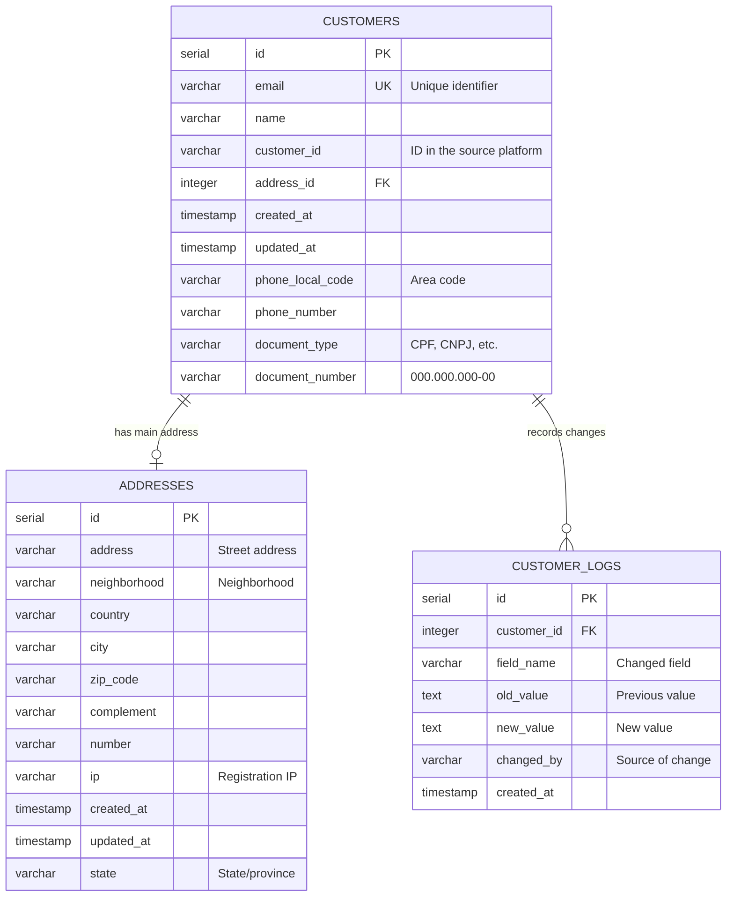

# `Domain_Customers_Ecosystem.md` 


```markdown
---
title: "Domain: Customer Ecosystem"
id: "domain_customers_ecosystem_001"
doc_type: "domain_functional"
doc_version: "1.1"
date_created: "2023-11-20"
date_updated: "2024-02-15"
author: "João Castanheira"
db_name: "joaocastanheira_bancodedados"
db_version: "1.0"
doc_status: "Approved"
environment: "Production"
language: "en"
response_languages: ["pt-BR", "en"]
technical_terms_preservation: "strict"
original_language: "pt-BR"
related_docs: [
  "core_db_architecture_001", 
  "platform_integration_strategy_001", 
  "process_flow_purchase_lifecycle_001", 
  "analytics_examples_001"
]
tables_in_domain: [
  "customers", 
  "addresses", 
  "customer_logs"
]
technical_terms: {
  "table_names": [
    "customers", "addresses", "customer_logs", "transactions", 
    "subscriptions", "products", "transaction_items", "transaction_statuses", 
    "customer_attributes", "platform_commission"
  ],
  "column_names": [
    "id", "email", "name", "customer_id", "address_id", "created_at", 
    "updated_at", "phone_local_code", "phone_number", "document_type", 
    "document_number", "address", "neighborhood", "country", "city", 
    "zip_code", "complement", "number", "ip", "state", "field_name", 
    "old_value", "new_value", "changed_by", "transaction_id", "order_date", 
    "offer_price", "status_id", "product_id"
  ],
  "data_types": [
    "SERIAL", "VARCHAR", "INTEGER", "TIMESTAMP WITH TIME ZONE", 
    "TEXT", "NUMERIC", "BOOLEAN"
  ],
  "sql_keywords": [
    "CREATE TABLE", "IF NOT EXISTS", "PRIMARY KEY", "UNIQUE", 
    "REFERENCES", "DEFAULT", "NOT NULL", "CREATE INDEX", "SELECT", 
    "FROM", "JOIN", "WHERE", "ORDER BY", "GROUP BY", "LIMIT", 
    "HAVING", "SUM", "COUNT", "MIN", "MAX", "DISTINCT", "CASE", 
    "WHEN", "THEN", "ELSE", "END", "LEFT JOIN", "INSERT INTO", 
    "VALUES", "UPDATE", "SET", "DELETE", "CONCAT", "MD5", "CURRENT_DATE", 
    "CURRENT_USER", "NTILE", "OVER", "RETURNS", "TRIGGER", "BEGIN", 
    "WITH", "AS", "date_trunc", "CAST", "LOWER", "TRIM"
  ],
  "function_names": [
    "log_customer_changes", "unify_customer", "update_customer"
  ],
  "status_values": [
    "Aprovada", "Approved"
  ]
}
functional_domain: ["Customer", "CRM", "Identity Management"]
embedding_guide_concepts: [
  "unified customer", 
  "customer identification", 
  "customer data normalization", 
  "single customer profile", 
  "customer address", 
  "change history", 
  "data auditing", 
  "customer deduplication", 
  "registration data", 
  "unification strategy", 
  "contact record", 
  "modification traceability", 
  "email as identifier", 
  "document registration", 
  "multi-platform"
]
---


# Domain: Customer Ecosystem


## Domain Overview


The Customer Ecosystem constitutes the central structure for identification, unification, and management of all customer data in the system. Its main function is to establish a "single customer view" regardless of the platform of origin (whether as a buyer, subscriber, or lead), allowing consistent tracking of interaction history and integrated behavioral analysis.


This domain resolves the critical challenge of customer data fragmentation across multiple platforms, consolidating information such as personal data, addresses, contacts, and activities into a single, coherent record. The customer's email serves as the universal identifier for this unification.


The model is structured into three interconnected components:


1. **Central Repository** (`customers`): Stores main information and identification data
2. **Location Information** (`addresses`): Manages address data in a normalized form
3. **Audit System** (`customer_logs`): Documents all changes for complete traceability


(Ref: Customer Domain, ID domain_customers_ecosystem_001)


## Data Structure and Model


### Relationship Diagram





### Table Definitions


#### Table: `customers`


```sql
CREATE TABLE IF NOT EXISTS customers (
    id               SERIAL PRIMARY KEY,
    email            VARCHAR(255) UNIQUE,                  -- Customer email (unique)
    name             VARCHAR(255),                         -- Full name
    customer_id      VARCHAR(255),                         -- ID in the source platform
    address_id       INTEGER REFERENCES addresses,         -- Main address
    created_at       TIMESTAMP WITH TIME ZONE DEFAULT CURRENT_TIMESTAMP,
    updated_at       TIMESTAMP WITH TIME ZONE DEFAULT CURRENT_TIMESTAMP,
    phone_local_code VARCHAR(10),                          -- Area code
    phone_number     VARCHAR(20),                          -- Phone number
    document_type    VARCHAR(10),                          -- Document type
    document_number  VARCHAR(55)                           -- Document Number
);


-- Strategic indexes for search and performance
CREATE INDEX idx_customers_email ON customers (email);
CREATE INDEX idx_customers_customer_id ON customers (customer_id);
CREATE INDEX idx_customers_address_id ON customers (address_id);
CREATE INDEX idx_customers_email_lower ON customers (lower(email::text));
```


#### Table: `addresses`


```sql
CREATE TABLE IF NOT EXISTS addresses (
    id           SERIAL PRIMARY KEY,
    address      VARCHAR(255),                              -- Street address
    neighborhood VARCHAR(100),                              -- Neighborhood
    country      VARCHAR(100),                              -- Country
    city         VARCHAR(100),                              -- City
    zip_code     VARCHAR(20),                               -- Postal code
    complement   VARCHAR(255),                              -- Additional info
    number       VARCHAR(20),                               -- Street number
    ip           VARCHAR(45),                               -- Registration IP address
    created_at   TIMESTAMP WITH TIME ZONE DEFAULT CURRENT_TIMESTAMP,
    updated_at   TIMESTAMP WITH TIME ZONE DEFAULT CURRENT_TIMESTAMP,
    state        VARCHAR(100)                               -- State/province
);


-- Indexes for geographic searches
CREATE INDEX idx_addresses_zip_code ON addresses (zip_code);
CREATE INDEX idx_addresses_city ON addresses (city);
CREATE INDEX idx_addresses_country ON addresses (country);
CREATE INDEX idx_addresses_state ON addresses (state);
```


#### Table: `customer_logs`


```sql
CREATE TABLE IF NOT EXISTS customer_logs (
    id          SERIAL PRIMARY KEY,
    customer_id INTEGER NOT NULL REFERENCES customers ON DELETE CASCADE,
    field_name  VARCHAR(100) NOT NULL,                    -- Name of changed field
    old_value   TEXT,                                     -- Previous value
    new_value   TEXT,                                     -- New value
    changed_by  VARCHAR(100) DEFAULT 'SYSTEM',            -- Who made the change
    created_at  TIMESTAMP WITH TIME ZONE DEFAULT CURRENT_TIMESTAMP,
    updated_at  TIMESTAMP WITH TIME ZONE DEFAULT CURRENT_TIMESTAMP
);


-- Indexes for efficient auditing
CREATE INDEX idx_customer_logs_customer_id ON customer_logs (customer_id);
CREATE INDEX idx_customer_logs_created_at ON customer_logs (created_at);
```


(Ref: Customer Domain, ID domain_customers_ecosystem_001)


## Customer Unification Strategy


Unique identification and customer deduplication is a critical aspect of this domain, especially when integrating data from multiple platforms.


### Using Email as the Primary Identifier


Email was chosen as the universal identifier for the following reasons:


1. **Universality**: All platforms collect email as mandatory data
2. **Uniqueness**: Emails tend to be unique per individual (with some exceptions)
3. **Stability**: Users rarely change their primary emails
4. **Standardization**: Standardized format regardless of geographic region


### Unification Algorithm


When the system receives customer data from any platform (via API or import):


1. **Email Normalization**:
   ```sql
   -- Convert to lowercase and remove spaces
   SELECT lower(trim(email)) as normalized_email FROM imported_data;
   ```


2. **Existence Check**:
   ```sql
   -- Case-insensitive search using the optimized index
   SELECT id FROM customers WHERE lower(email) = normalized_email;
   ```


3. **Creation or Update Decision**:
   - If customer doesn't exist: Create new record
   - If customer exists: Update data according to priority rules


4. **Conflicting Data Handling**:
   - Empty fields never overwrite existing data
   - Data from higher-priority platforms can overwrite data from lower-priority platforms
   - All changes are recorded in the `customer_logs` table


### Implementation Example (Pseudocode)


```
FUNCTION unify_customer(email, name, platform_customer_id, phone, ...)
  normalized_email = lowercase(trim(email))
  
  existing_customer = query("SELECT * FROM customers WHERE lower(email) = ?", normalized_email)
  
  IF existing_customer EXISTS THEN
    FOR EACH field IN incoming_data
      IF should_update_field(existing_customer, field, incoming_value, platform_priority) THEN
        log_change(existing_customer.id, field, existing_value, incoming_value)
        update_customer_field(existing_customer.id, field, incoming_value)
      END IF
    END FOR
    
    RETURN existing_customer.id
  ELSE
    new_customer_id = insert_new_customer(normalized_email, name, platform_customer_id, ...)
    RETURN new_customer_id
  END IF
END FUNCTION
```


(Ref: Customer Domain, ID domain_customers_ecosystem_001)


## Customer Record Lifecycle


The lifecycle of a customer record in the system goes through several phases:


### 1. Customer Creation


Creation can occur through different flows:


- **Purchase Event**: When a new transaction is detected for a non-existing email
- **Subscription**: When a new subscriber is registered
- **Bulk Import**: During data migration or synchronization with external platform
- **Lead Capture**: When a prospect is registered in a marketing funnel


Regardless of the origin, the system executes the unification logic to avoid duplication.


### 2. Progressive Data Enrichment


Customer records often start with minimal information (just email) and are gradually enriched:


- After first purchase: Name, basic phone
- During checkout: Billing address
- In subsequent purchases: Additional information (preferences, tax data)


Each new interaction can contribute to completing the customer's profile.


### 3. Update and Maintenance


Updates are recorded with complete metadata:


- **Change Origin**: API, administrative interface, customer self-service
- **Timestamp**: Exact moment of modification
- **Old and New Values**: Preserved for auditing and possible reversal
- **Reason for Change** (when available): Why the data was modified


### 4. Eventual Inactivation or Removal


For compliance with GDPR/LGPD and other regulations:


- Customers can request data anonymization (right to be forgotten)
- Records inactive for long periods can be anonymized by internal policy
- The infrastructure supports pseudonymization that preserves analytical data while protecting privacy


(Ref: Customer Domain, ID domain_customers_ecosystem_001)


## Audit and Traceability System


### Log System Operation


The log system in the `customer_logs` table creates a detailed record of all changes, allowing:


1. **Complete Tracking**: Each modification to customer data is documented
2. **Accountability**: Identification of who made each change
3. **Recovery**: Ability to reverse unwanted changes
4. **Compliance**: Meeting regulatory audit requirements


### Technical Implementation


Change recording is implemented through:


1. **Database Triggers**: Automatically capture changes
   ```sql
   CREATE OR REPLACE FUNCTION log_customer_changes()
   RETURNS TRIGGER AS $$
   BEGIN
       IF OLD.name IS DISTINCT FROM NEW.name THEN
           INSERT INTO customer_logs (customer_id, field_name, old_value, new_value, changed_by)
           VALUES (NEW.id, 'name', OLD.name, NEW.name, CURRENT_USER);
       END IF;
       
       -- Repeat for other fields
       
       RETURN NEW;
   END;
   $$ LANGUAGE plpgsql;
   
   CREATE TRIGGER customer_change_logger
   AFTER UPDATE ON customers
   FOR EACH ROW
   EXECUTE FUNCTION log_customer_changes();
   ```


2. **Logic in the Application Layer**: For more complex cases or when the reason for the change needs to be captured
   ```python
   def update_customer(customer_id, field_name, new_value, changed_by, reason=None):
       # Fetch current value
       current_value = db.query(f"SELECT {field_name} FROM customers WHERE id = %s", customer_id)
       
       # Record change
       db.execute(
           "INSERT INTO customer_logs (customer_id, field_name, old_value, new_value, changed_by) VALUES (%s, %s, %s, %s, %s)",
           customer_id, field_name, current_value, new_value, changed_by
       )
       
       # Update the value
       db.execute(f"UPDATE customers SET {field_name} = %s WHERE id = %s", new_value, customer_id)
   ```


### Change Analysis


The change history allows analytical queries such as:


```sql
-- Most frequently changed fields (may indicate problems in initial collection)
SELECT 
    field_name, 
    COUNT(*) as change_count
FROM 
    customer_logs
GROUP BY 
    field_name
ORDER BY 
    change_count DESC;


-- Changes by origin (identifies data sources with higher activity)
SELECT 
    changed_by, 
    COUNT(*) as change_count
FROM 
    customer_logs
GROUP BY 
    changed_by
ORDER BY 
    change_count DESC;


-- Changes by period (identifies activity peaks)
SELECT 
    date_trunc('day', created_at) as change_date,
    COUNT(*) as daily_changes
FROM 
    customer_logs
GROUP BY 
    change_date
ORDER BY 
    change_date DESC;
```


(Ref: Customer Domain, ID domain_customers_ecosystem_001)


## Privacy and Security Considerations


As a central repository of personal data, this domain requires special attention to privacy and security issues:


### Compliance with Data Protection Regulations


The model was designed considering GDPR (Europe) and LGPD (Brazil) requirements:


1. **Data Minimization**: Collects only data necessary for legitimate operations
2. **Specific Purpose**: Fields have clearly defined purposes
3. **Traceability**: Complete modification history to demonstrate compliance
4. **Data Subject Rights**: Structure facilitates data extraction, correction, and anonymization


### Implementation of Technical Measures


To protect this sensitive data, it is recommended:


| Security Measure | Implementation |
|------------------|----------------|
| **Access Control** | Granular permissions by user role |
| **Encryption** | Sensitive data encrypted at rest |
| **Masking** | Limited display of complete data in the interface |
| **Auditing** | Logs of all queries and changes |
| **Retention** | Automatic retention and purging policies |
| **Secure Backup** | Encrypted backups with access control |


### Pseudonymization Architecture


For data deletion cases ("right to be forgotten"):


```sql
-- Customer pseudonymization (implementation example)
UPDATE customers
SET 
    email = CONCAT('deleted_', MD5(email), '@anonymous.com'),
    name = 'Anonymized Customer',
    phone_local_code = NULL,
    phone_number = NULL
WHERE 
    id = 123;


-- Recording the pseudonymization
INSERT INTO customer_logs (customer_id, field_name, old_value, new_value, changed_by)
VALUES (123, 'pseudonymization', 'Complete personal data', 'Anonymized data', 'GDPR Request');
```


(Ref: Customer Domain, ID domain_customers_ecosystem_001)


## Integration with Other Domains


The Customer Ecosystem is a fundamental domain that connects with virtually all other components of the system:


### Main Integrations


| Domain | Relationship | Related Tables |
|--------|--------------|----------------|
| **Transactions** | Each transaction belongs to a customer | `transactions.customer_id → customers.id` |
| **Subscriptions** | Subscriptions belong to a customer | `subscriptions.customer_id → customers.id` |
| **Products & Offers** | Customers buy products via offers | Indirect relationship via transactions |
| **Commission** | Analysis of customers brought by partners | Analysis via transactions and commissions |
| **Analytics** | Segmentation and behavior analysis | Primary source for customer reports |


### Common Integration Queries


#### Purchase History by Customer


```sql
-- All transactions of a specific customer
SELECT 
    t.transaction_id,
    t.order_date,
    p.name AS product_name,
    t.offer_price,
    ts.status
FROM 
    transactions t
JOIN 
    transaction_items ti ON t.id = ti.transaction_id
JOIN 
    products p ON ti.product_id = p.id
JOIN 
    transaction_statuses ts ON t.status_id = ts.id
WHERE 
    t.customer_id = (SELECT id FROM customers WHERE email = 'customer@example.com')
ORDER BY 
    t.order_date DESC;
```


#### Customer Lifetime Value (LTV)


```sql
-- Lifetime Value calculation per customer
SELECT 
    c.id,
    c.email,
    c.name,
    COUNT(t.id) AS total_purchases,
    SUM(t.offer_price) AS total_spent,
    MIN(t.order_date) AS first_purchase_date,
    MAX(t.order_date) AS last_purchase_date
FROM 
    customers c
LEFT JOIN 
    transactions t ON c.id = t.customer_id
JOIN 
    transaction_statuses ts ON t.status_id = ts.id
WHERE 
    ts.status = 'Approved'  -- Consider only approved transactions
GROUP BY 
    c.id, c.email, c.name
ORDER BY 
    total_spent DESC;
```


#### Geographic Distribution of Customers


```sql
-- Analysis of customers' geographic distribution
SELECT 
    a.country,
    a.state,
    COUNT(c.id) AS customer_count,
    SUM(
        CASE WHEN t.id IS NOT NULL THEN 1 ELSE 0 END
    ) AS customers_with_purchases
FROM 
    customers c
LEFT JOIN 
    addresses a ON c.address_id = a.id
LEFT JOIN 
    transactions t ON c.id = t.customer_id
GROUP BY 
    a.country, a.state
ORDER BY 
    customer_count DESC;
```


(Ref: Customer Domain, ID domain_customers_ecosystem_001)


## Common Challenges and Solutions


### 1. Customer Deduplication


**Challenge**: Identifying and merging duplicate records when customers use different emails or have slightly different information.


**Implemented Solution**:
- Email as primary identifier
- Optimized indexes for case-insensitive search
- Validation in the application layer before insertion


**Advanced Solution for Future Consideration**:
- Fuzzy matching algorithms to detect probable duplications
- Supervised merging process for ambiguous cases
- Analysis based on multiple fields (name + phone + ZIP code)


### 2. Incomplete Data


**Challenge**: Many customer records start with minimal data and remain incomplete.


**Solution**:
- Structure that allows progressive filling
- Enrichment processes during subsequent interactions
- "Data health" reports to identify priority incomplete profiles


### 3. Granular Access Control


**Challenge**: Different roles need different levels of access to customer data.


**Solution**:
- Masking of sensitive data for roles with limited access
- Detailed access logs for auditing
- Field-level permissions for highly sensitive data
- Approval mechanism for bulk export operations


(Ref: Customer Domain, ID domain_customers_ecosystem_001)


## Strategic Queries and Analysis


### Customer Management Queries


#### High-Value Customer Identification


```sql
-- Top 100 customers by total purchase value
SELECT 
    c.id,
    c.email,
    c.name,
    SUM(t.offer_price) AS total_spent,
    COUNT(DISTINCT t.id) AS purchase_count,
    MAX(t.order_date) AS last_purchase_date,
    CURRENT_DATE - MAX(t.order_date)::date AS days_since_last_purchase
FROM 
    customers c
JOIN 
    transactions t ON c.id = t.customer_id
JOIN 
    transaction_statuses ts ON t.status_id = ts.id
WHERE 
    ts.status = 'Approved'
GROUP BY 
    c.id, c.email, c.name
ORDER BY 
    total_spent DESC
LIMIT 100;
```


#### Engagement Segmentation


```sql
-- RFM Segmentation (Recency, Frequency, Monetary)
WITH customer_metrics AS (
    SELECT 
        c.id,
        c.email,
        c.name,
        CURRENT_DATE - MAX(t.order_date)::date AS recency_days,
        COUNT(DISTINCT t.id) AS frequency,
        SUM(t.offer_price) AS monetary
    FROM 
        customers c
    JOIN 
        transactions t ON c.id = t.customer_id
    JOIN 
        transaction_statuses ts ON t.status_id = ts.id
    WHERE 
        ts.status = 'Approved'
    GROUP BY 
        c.id, c.email, c.name
),
rfm_scores AS (
    SELECT 
        id, email, name,
        NTILE(5) OVER (ORDER BY recency_days DESC) AS r_score,
        NTILE(5) OVER (ORDER BY frequency) AS f_score,
        NTILE(5) OVER (ORDER BY monetary) AS m_score
    FROM 
        customer_metrics
)
SELECT 
    id, email, name,
    r_score, f_score, m_score,
    r_score::text||f_score::text||m_score::text AS rfm_segment
FROM 
    rfm_scores
ORDER BY 
    (r_score + f_score + m_score) DESC;
```


#### Inactivity Analysis


```sql
-- Inactive customers (no purchases in the last 180 days)
SELECT 
    c.id,
    c.email,
    c.name,
    MAX(t.order_date) AS last_purchase_date,
    CURRENT_DATE - MAX(t.order_date)::date AS days_inactive,
    COUNT(t.id) AS lifetime_purchases,
    SUM(t.offer_price) AS lifetime_value
FROM 
    customers c
LEFT JOIN 
    transactions t ON c.id = t.customer_id
LEFT JOIN 
    transaction_statuses ts ON t.status_id = ts.id
WHERE 
    t.id IS NOT NULL
    AND ts.status = 'Approved'
GROUP BY 
    c.id, c.email, c.name
HAVING 
    CURRENT_DATE - MAX(t.order_date)::date > 180
ORDER BY 
    days_inactive ASC;
```


(Ref: Customer Domain, ID domain_customers_ecosystem_001)


## Best Practices for Customer Data Management


### 1. Data Quality and Integrity


- **Consistent Validation**: Implement rigorous format and content validation (email, phone, ZIP code)
- **Standardized Normalization**: Apply consistent standards for data formatting
- **Progressive Enrichment**: Prioritize data completeness for active and high-value customers


### 2. Model Extensibility


The current design supports common expansions:


- **Custom Fields**: Consider a `customer_attributes` table for dynamic fields
- **Multiple Addresses**: Adapt to a 1:N model between customer and addresses (shipping, billing, etc.)
- **GDPR Consents**: Add a dedicated table for tracking specific consents


### 3. Monitoring and Maintenance


- **Periodic Audits**: Regularly check data quality and completeness
- **Proactive Cleaning**: Identify and correct inconsistencies before they affect operations
- **Quality Metrics**: Establish KPIs for data health (% of complete records, update rate)


### 4. Internationalization Considerations


For global operations, consider:


- **Address Formats**: Different countries have distinct address structures
- **Phone Formats**: Support different number formats and country codes
- **Document Types**: Adapt for country-specific documents
- **Legal Considerations**: Region-specific privacy policies


(Ref: Customer Domain, ID domain_customers_ecosystem_001)


## Conclusion


The Customer Ecosystem represents a fundamental piece of the data architecture, serving as the foundation for virtually all business operations. By establishing a unique and consistent view of each customer, regardless of the platform of origin, the system enables:


1. **Unified Experience**: Complete view of customer history and interactions
2. **Advanced Analytics**: Solid foundation for segmentation, LTV, and other business metrics
3. **Regulatory Compliance**: Structure that facilitates meeting GDPR/LGPD requirements
4. **Efficient Operations**: Elimination of duplications and data inconsistencies


The implementation described in this document balances the need for a robust structure with the flexibility necessary for continuous evolution, ensuring that the system can adapt to new business and regulatory requirements over time.


(Ref: Customer Domain, ID domain_customers_ecosystem_001)
```