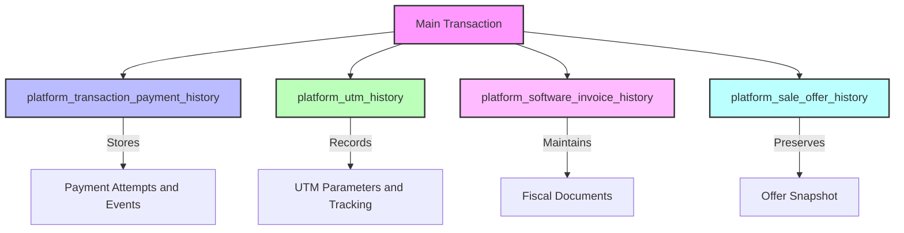
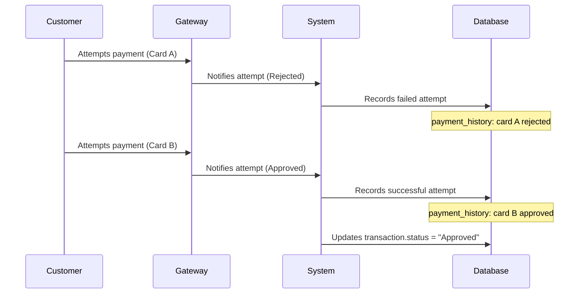
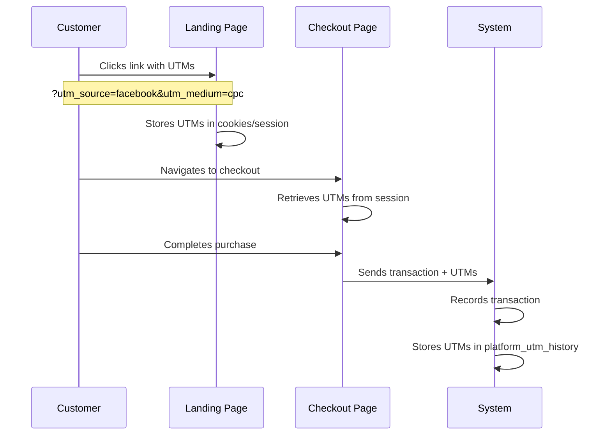
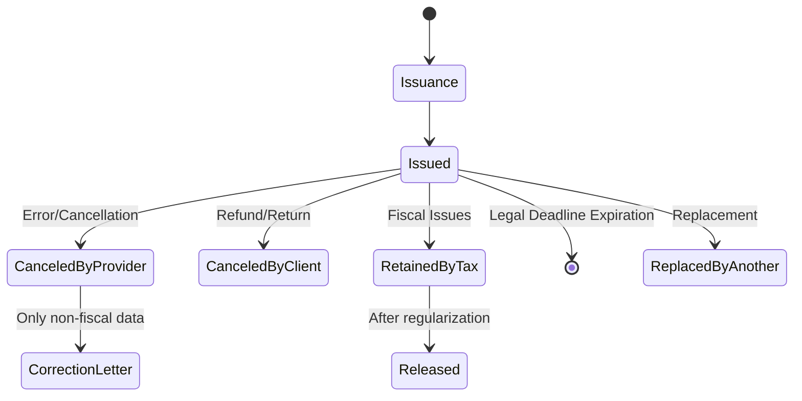
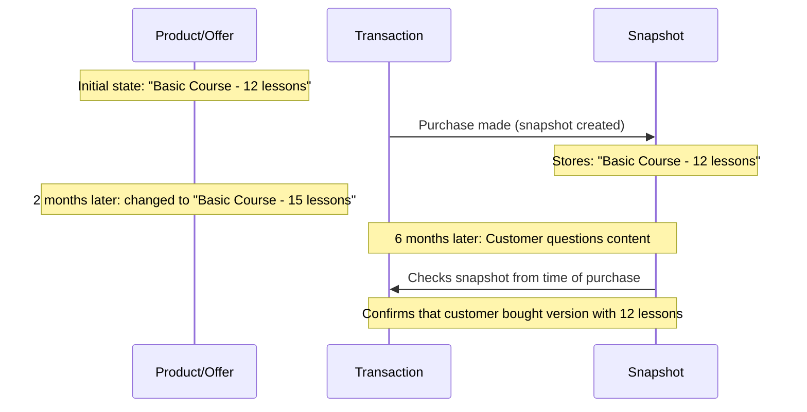
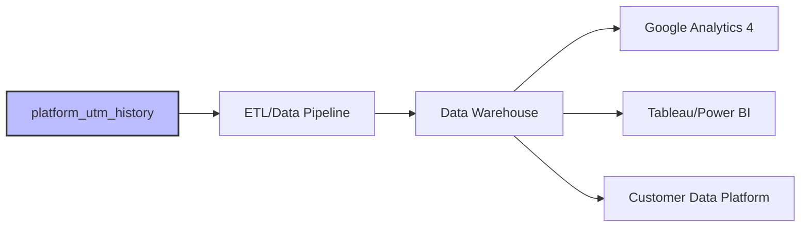
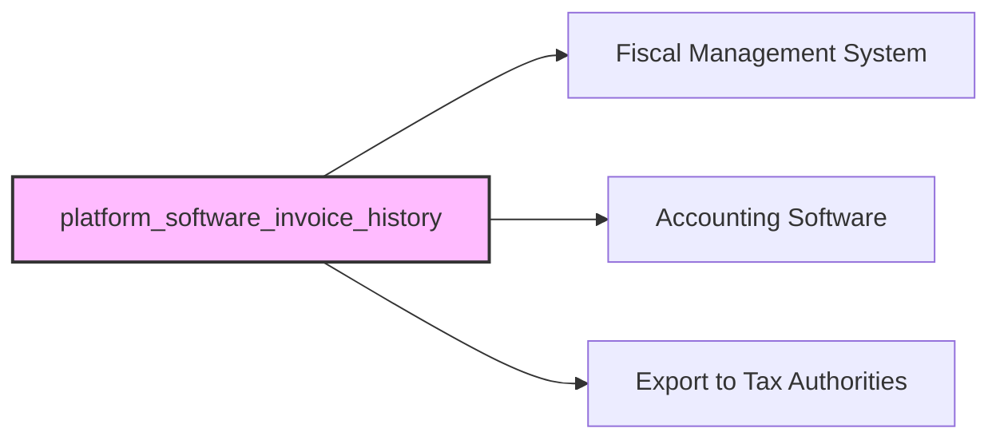
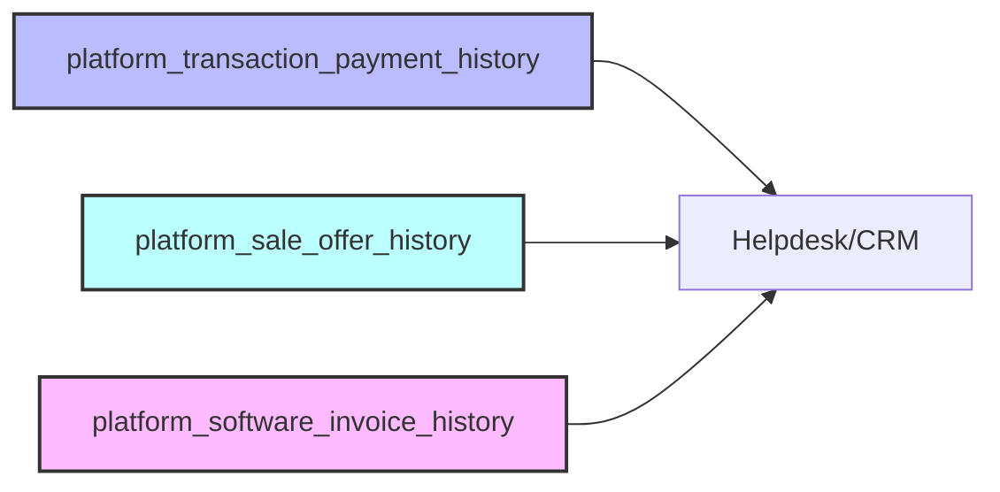
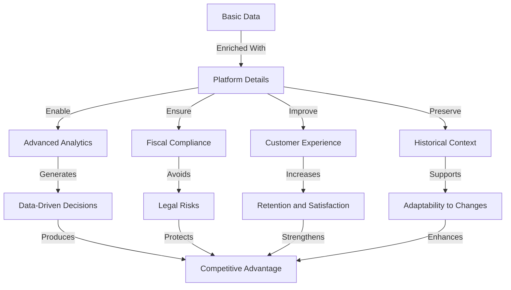

# `Domain_Platform_Integration_Details.md` 
```markdown
---
title: "Domain: Platform Integration Details"
id: "domain_platform_integration_details_001"
doc_type: "domain_functional"
doc_version: "1.1"
date_created: "2025-04-23"
date_updated: "2025-04-23"
author: "João Castanheira"
db_name: "joaocastanheira_bancodedados"
db_version: "1.0"
doc_status: "Approved"
environment: "Production"
language: "en"
response_languages: ["pt-BR", "en"]
technical_terms_preservation: "strict"
original_language: "pt-BR"
related_docs: [
  "core_db_architecture_001", 
  "platform_integration_strategy_001", 
  "domain_transactions_lifecycle_001", 
  "domain_customers_ecosystem_001", 
  "domain_products_catalog_001", 
  "process_flow_purchase_lifecycle_001"
]
tables_in_domain: [
  "platform_transaction_payment_history", 
  "platform_utm_history", 
  "platform_software_invoice_history", 
  "platform_sale_offer_history"
]
technical_terms: {
  "table_names": [
    "platform_transaction_payment_history", "platform_utm_history",
    "platform_software_invoice_history", "platform_sale_offer_history",
    "transactions", "customers", "transaction_items", "products",
    "offers", "transaction_statuses", "marketing_costs", "platform_commission"
  ],
  "column_names": [
    "id", "transaction_id", "payment_method", "payment_type",
    "installments", "value", "payment_date", "card_brand",
    "card_last_digits", "bank_slip_barcode", "pix_code", "metadata",
    "created_at", "updated_at", "utm_source", "utm_medium",
    "utm_campaign", "utm_term", "utm_content", "capture_date",
    "invoice_number", "invoice_series", "invoice_key", "issue_date",
    "status", "xml_url", "pdf_url", "code", "offer_id", "offer_name",
    "description", "customer_id", "order_date", "offer_price", "email", "name"
  ],
  "data_types": [
    "SERIAL", "INTEGER", "VARCHAR", "TEXT", "NUMERIC", "TIMESTAMP WITH TIME ZONE",
    "JSONB", "payment_method_enum", "payment_type_enum", "PRIMARY KEY",
    "REFERENCES", "ON DELETE CASCADE", "UNIQUE", "DEFAULT", "CURRENT_TIMESTAMP"
  ],
  "sql_keywords": [
    "CREATE TABLE", "IF NOT EXISTS", "SELECT", "FROM", "WHERE", "JOIN", 
    "LEFT JOIN", "GROUP BY", "ORDER BY", "HAVING", "CASE", "WHEN", 
    "THEN", "ELSE", "END", "AS", "ON", "AND", "OR", "NOT", "NULL", 
    "IS NULL", "IS NOT NULL", "BETWEEN", "IN", "LIKE", "COUNT", "SUM", 
    "AVG", "MIN", "MAX", "DISTINCT", "PARTITION BY", "OVER", "ROW_NUMBER",
    "WITH", "CTE", "CREATE INDEX", "CREATE OR REPLACE VIEW", "TO_CHAR",
    "DATE_TRUNC", "INTERVAL", "EXTRACT", "COALESCE", "NULLIF", "SUBSTRING",
    "CURRENT_DATE", "CURRENT_TIMESTAMP", "ROUND", "FILTER", "EXISTS"
  ],
  "payment_methods": [
    "credit_card", "bank_slip", "pix", "paypal", "apple_pay", "google_pay"
  ],
  "invoice_statuses": [
    "Emitida", "Cancelada", "CanceladaPeloPrestador", "CanceladaPeloTomador",
    "RetidaFisco", "Liberada", "SubstituídaPorOutra", "CartaDeCorreção",
    "Issued", "Canceled", "CanceledByProvider", "CanceledByClient",
    "RetainedByTax", "Released", "ReplacedByAnother", "CorrectionLetter"
  ],
  "transaction_statuses": [
    "Aprovada", "Recusada", "Pendente", "Cancelada", "Reembolsada",
    "Approved", "Rejected", "Pending", "Canceled", "Refunded"
  ],
  "utm_parameters": [
    "utm_source", "utm_medium", "utm_campaign", "utm_term", "utm_content"
  ],
  "functions": [
    "DATE_TRUNC", "EXTRACT", "TO_CHAR", "jsonb_build_object"
  ]
}
functional_domain: ["Platform Integration", "Payment Processing", "Marketing Analytics", "Tax Documentation"]
embedding_guide_concepts: [
  "platform integration", 
  "payment history", 
  "payment attempts", 
  "payment details", 
  "UTM tracking", 
  "marketing attribution", 
  "electronic invoice", 
  "offer history", 
  "bank slip", 
  "credit card", 
  "PIX", 
  "invoice", 
  "tracking parameters", 
  "payment events", 
  "offer snapshot", 
  "DANFE", 
  "fiscal XML", 
  "acquisition campaigns",
  "payment diagnostics",
  "payment gateway"
]
---


# Domain: Platform Integration Details


## Domain Overview


The Platform Integration Details domain tables store enriched data from various platforms integrated with the system (Hotmart, Kiwify, and others), preserving granular information that is critical for support operations, analysis, fiscal compliance, and marketing attribution.


This domain functions as a complementary information layer that goes beyond the fundamental business data stored in the main tables. While the core tables (transactions, subscriptions, customers) maintain the essential data for system operation, the tables with the `platform_` prefix capture specific details that, although not necessary for basic operations, add significant value in scenarios such as:


- **Troubleshooting**: Detailed tracking of payment issues
- **Analytics**: In-depth analysis of campaigns and purchasing behavior
- **Compliance**: Maintenance of complete fiscal and contractual records
- **Auditing**: Preservation of the exact historical context of each transaction





This domain is particularly valuable when working with multiple sales platforms, as it allows preserving specific details from each platform without overloading the main data model with fields that would be relevant only for some integrations.


(Ref: Platform Integration Details, ID domain_platform_integration_details_001)


## Payment History and Attempts


The `platform_transaction_payment_history` table is the definitive record of each event related to the payment process, from initial attempts to final confirmations.


```sql
CREATE TABLE IF NOT EXISTS platform_transaction_payment_history (
    id                SERIAL PRIMARY KEY,
    transaction_id    INTEGER NOT NULL REFERENCES transactions ON DELETE CASCADE,
    payment_method    payment_method_enum,                 -- Payment method
    payment_type      payment_type_enum,                   -- Payment type
    installments      INTEGER,                             -- Number of installments
    value             NUMERIC(15, 4),                      -- Paid/attempted value
    payment_date      TIMESTAMP WITH TIME ZONE,            -- Payment/attempt date
    card_brand        VARCHAR(50),                         -- Card brand
    card_last_digits  VARCHAR(4),                          -- Last digits
    bank_slip_barcode TEXT,                                -- Bank slip code
    pix_code          TEXT,                                -- PIX code
    metadata          JSONB,                               -- Additional metadata
    created_at        TIMESTAMP WITH TIME ZONE DEFAULT CURRENT_TIMESTAMP,
    updated_at        TIMESTAMP WITH TIME ZONE DEFAULT CURRENT_TIMESTAMP
);
```


### Complete Payment Flow


While the `transactions` table records only the final and successful state of a payment, this table captures the entire journey, including:


1. **Rejected attempts** due to insufficient funds, card issues, or fraud suspicion
2. **Payment method changes** when the customer tries a card first, then another, and finally a PIX
3. **Partial confirmations** in cases of payment in stages or pre-authorization followed by capture
4. **Gateway-specific metadata** that can be crucial for troubleshooting issues





### Using JSONB Field for Flexibility


The `metadata` field (JSONB) is especially valuable for storing information specific to each gateway or platform:


```json
// Example of metadata for card decline via Stripe
{
  "gateway_specific_code": "card_declined",
  "decline_code": "insufficient_funds",
  "risk_level": "normal",
  "gateway_request_id": "req_zKFB1N5TjpQA4W",
  "processor_response": {
    "avs_result_code": "Z",
    "cvv_result_code": "M"
  },
  "attempted_at": "2023-11-15T14:23:18Z"
}
```


This allows capturing specific details without needing to add dozens of columns that would be relevant only for some gateways or specific situations.


### Critical Use Cases


1. **Recurring Failure Diagnosis**:
   ```sql
   -- Identify failure patterns for a specific customer
   SELECT 
       payment_date,
       payment_method,
       card_brand,
       card_last_digits,
       metadata->>'gateway_specific_code' AS error_code,
       metadata->>'decline_code' AS decline_reason
   FROM 
       platform_transaction_payment_history
   WHERE 
       transaction_id IN (SELECT id FROM transactions WHERE customer_id = 12345)
       AND metadata->>'gateway_specific_code' IN ('card_declined', 'processing_error')
   ORDER BY 
       payment_date DESC;
   ```


2. **Conversion Analysis by Payment Method**:
   ```sql
   -- Success rate by payment method
   SELECT 
       payment_method,
       COUNT(*) AS attempts,
       COUNT(*) FILTER (WHERE EXISTS (
           SELECT 1 FROM transactions t 
           WHERE t.id = transaction_id AND t.status_id = 1 -- Approved status
       )) AS successful_payments,
       ROUND(COUNT(*) FILTER (WHERE EXISTS (
           SELECT 1 FROM transactions t 
           WHERE t.id = transaction_id AND t.status_id = 1
       )) * 100.0 / COUNT(*), 2) AS success_rate
   FROM 
       platform_transaction_payment_history
   WHERE 
       payment_date BETWEEN '2023-01-01' AND '2023-12-31'
   GROUP BY 
       payment_method
   ORDER BY 
       success_rate DESC;
   ```


3. **Complete Timeline of a Problematic Payment**:
   ```sql
   -- Reconstruct sequence of events for customer support
   SELECT 
       to_char(payment_date, 'YYYY-MM-DD HH24:MI:SS') AS timestamp,
       payment_method,
       value,
       CASE 
           WHEN metadata->>'gateway_specific_code' IN ('card_declined', 'processing_error') THEN 'Failure'
           WHEN EXISTS (SELECT 1 FROM transactions t WHERE t.id = transaction_id AND t.status_id = 1) THEN 'Success'
           ELSE 'Pending'
       END AS status,
       COALESCE(metadata->>'decline_code', metadata->>'status_detail', 'N/A') AS details
   FROM 
       platform_transaction_payment_history
   WHERE 
       transaction_id = 987654
   ORDER BY 
       payment_date;
   ```


(Ref: Platform Integration Details, ID domain_platform_integration_details_001)


## Marketing Tracking and Attribution


The `platform_utm_history` table preserves the marketing tracking parameters that were present at the moment of conversion, allowing precise attribution and ROI analyses.


```sql
CREATE TABLE IF NOT EXISTS platform_utm_history (
    id             SERIAL PRIMARY KEY,
    transaction_id INTEGER NOT NULL REFERENCES transactions ON DELETE CASCADE,
    utm_source     VARCHAR(255),                           -- Source
    utm_medium     VARCHAR(255),                           -- Medium
    utm_campaign   VARCHAR(255),                           -- Campaign
    utm_term       VARCHAR(255),                           -- Term
    utm_content    VARCHAR(255),                           -- Content
    capture_date   TIMESTAMP WITH TIME ZONE DEFAULT CURRENT_TIMESTAMP,
    created_at     TIMESTAMP WITH TIME ZONE DEFAULT CURRENT_TIMESTAMP,
    updated_at     TIMESTAMP WITH TIME ZONE DEFAULT CURRENT_TIMESTAMP
);
```


### Understanding UTM Parameters


UTM parameters (Urchin Tracking Module) are the backbone of digital marketing attribution:


|Parameter|Description|Examples|
|-----------|-----------|----------|
|`utm_source`|The traffic origin|google, facebook, newsletter, instagram|
|`utm_medium`|The marketing channel|cpc, email, social, banner, affiliate|
|`utm_campaign`|Specific campaign name|black_friday_2023, launch_course_v2|
|`utm_term`|Keywords (mainly in paid campaigns)|online_course, finance_mentoring|
|`utm_content`|Differentiates versions of the same ad|button_green, video_testimonial|


### UTM Capture Flow





### Powerful Enabled Analyses


1. **Performance by Marketing Channel**:
   ```sql
   -- ROI by source and medium
   SELECT 
       puh.utm_source,
       puh.utm_medium,
       COUNT(DISTINCT t.id) AS transactions,
       SUM(t.offer_price) AS total_revenue,
       AVG(t.offer_price) AS avg_order_value,
       -- Assume we have a marketing costs table
       SUM(t.offer_price) / NULLIF(SUM(mc.cost), 0) AS roi
   FROM 
       platform_utm_history puh
   JOIN 
       transactions t ON puh.transaction_id = t.id
   LEFT JOIN 
       marketing_costs mc ON puh.utm_source = mc.source 
                         AND puh.utm_medium = mc.medium
                         AND puh.utm_campaign = mc.campaign
   WHERE 
       t.order_date BETWEEN '2023-01-01' AND '2023-03-31'
   GROUP BY 
       puh.utm_source, puh.utm_medium
   ORDER BY 
       total_revenue DESC;
   ```


2. **Content and Variation Analysis**:
   ```sql
   -- Performance of different ad variations
   SELECT 
       puh.utm_campaign,
       puh.utm_content,
       COUNT(DISTINCT t.id) AS conversions,
       SUM(t.offer_price) AS revenue,
       COUNT(DISTINCT t.customer_id) AS unique_customers
   FROM 
       platform_utm_history puh
   JOIN 
       transactions t ON puh.transaction_id = t.id
   WHERE 
       puh.utm_campaign = 'summer_launch_2023'
   GROUP BY 
       puh.utm_campaign, puh.utm_content
   ORDER BY 
       revenue DESC;
   ```


3. **Multi-touch Customer Journey**:
   ```sql
   -- View multiple touchpoints before conversion
   WITH customer_touchpoints AS (
       SELECT 
           c.id AS customer_id,
           c.email,
           t.id AS transaction_id,
           t.order_date,
           puh.utm_source,
           puh.utm_medium,
           puh.utm_campaign,
           ROW_NUMBER() OVER (PARTITION BY c.id ORDER BY t.order_date) AS touch_sequence
       FROM 
           customers c
       JOIN 
           transactions t ON c.id = t.customer_id
       JOIN 
           platform_utm_history puh ON t.id = puh.transaction_id
   )
   SELECT 
       ct1.customer_id,
       ct1.email,
       -- First touch
       ct1.utm_source AS first_source,
       ct1.utm_medium AS first_medium,
       ct1.utm_campaign AS first_campaign,
       -- Last touch (conversion)
       ct_last.utm_source AS conversion_source,
       ct_last.utm_medium AS conversion_medium,
       ct_last.utm_campaign AS conversion_campaign,
       ct_last.order_date AS conversion_date
   FROM 
       customer_touchpoints ct1
   JOIN (
       SELECT 
           customer_id, 
           MAX(touch_sequence) AS last_touch
       FROM 
           customer_touchpoints
       GROUP BY 
           customer_id
   ) max_touch ON ct1.customer_id = max_touch.customer_id
   JOIN 
       customer_touchpoints ct_last ON max_touch.customer_id = ct_last.customer_id 
                                    AND max_touch.last_touch = ct_last.touch_sequence
   WHERE 
       ct1.touch_sequence = 1
       AND max_touch.last_touch > 1 -- Customers with multiple touches
   ORDER BY 
       ct_last.order_date DESC;
   ```


### Affiliate Integration


An important feature is the relationship between UTM parameters and the affiliate commission system:


```sql
-- Correlation between UTM source and affiliate tracking
SELECT 
    t.tracking_source,
    puh.utm_source,
    COUNT(*) AS transaction_count,
    SUM(t.offer_price) AS total_revenue,
    SUM(pc.amount) AS total_commission
FROM 
    transactions t
JOIN 
    platform_utm_history puh ON t.id = puh.transaction_id
LEFT JOIN 
    platform_commission pc ON t.id = pc.transaction_id AND pc.source = 'AFFILIATE'
GROUP BY 
    t.tracking_source, puh.utm_source
ORDER BY 
    transaction_count DESC;
```


This type of analysis can reveal important patterns, such as affiliates (tracking_source) generating sales from multiple UTM sources, or situations where the affiliate credit doesn't match the actual traffic source.


(Ref: Platform Integration Details, ID domain_platform_integration_details_001)


## Fiscal Documentation and Compliance


The `platform_software_invoice_history` table maintains a complete record of fiscal documents associated with each transaction, essential for fiscal compliance and accounting processes.


```sql
CREATE TABLE IF NOT EXISTS platform_software_invoice_history (
    id             SERIAL PRIMARY KEY,
    transaction_id INTEGER NOT NULL REFERENCES transactions ON DELETE CASCADE,
    invoice_number VARCHAR(100),                           -- Invoice number
    invoice_series VARCHAR(20),                            -- Invoice series
    invoice_key    VARCHAR(255) UNIQUE,                    -- Access key
    issue_date     TIMESTAMP WITH TIME ZONE,               -- Issue date
    status         VARCHAR(50),                            -- Invoice status
    xml_url        TEXT,                                   -- XML URL
    pdf_url        TEXT,                                   -- PDF URL
    created_at     TIMESTAMP WITH TIME ZONE DEFAULT CURRENT_TIMESTAMP,
    updated_at     TIMESTAMP WITH TIME ZONE DEFAULT CURRENT_TIMESTAMP
);
```


### Essential Fiscal Elements


This table stores critical information related to fiscal documents:


1. **Unique Identification**: Each fiscal document has unique identifiers such as `invoice_number` (sequential number), `invoice_series` (invoice series), and `invoice_key` (NF-e access key, with 44 digits in Brazil).


2. **Temporal Traceability**: The `issue_date` field records when the document was officially issued, which may be different from the transaction date.


3. **Dynamic Status**: The `status` field tracks the current state of the document (e.g., Issued, Canceled, Denied).


4. **Document Access**: The `xml_url` and `pdf_url` fields ensure permanent access to the original files, even if the issuing platform changes or becomes unavailable.


### Fiscal Document Lifecycle





### Practical Applications


1. **Duplicate Issuance for Customers**:
   ```sql
   -- Get links to fiscal documents for a customer
   SELECT 
       t.transaction_id AS order_number,
       p.name AS product,
       t.order_date AS purchase_date,
       psih.invoice_number AS invoice_number,
       psih.issue_date AS issue_date,
       psih.pdf_url AS danfe_link
   FROM 
       customers c
   JOIN 
       transactions t ON c.id = t.customer_id
   JOIN 
       transaction_items ti ON t.id = ti.transaction_id
   JOIN 
       products p ON ti.product_id = p.id
   LEFT JOIN 
       platform_software_invoice_history psih ON t.id = psih.transaction_id
   WHERE 
       c.email = 'customer@example.com'
       AND t.order_date > CURRENT_DATE - INTERVAL '1 year'
   ORDER BY 
       t.order_date DESC;
   ```


2. **Accounting Reconciliation**:
   ```sql
   -- Monthly invoice report for reconciliation
   SELECT 
       DATE_TRUNC('month', psih.issue_date) AS reference_month,
       COUNT(*) AS total_documents,
       SUM(t.offer_price) AS total_documents_value,
       COUNT(*) FILTER (WHERE psih.status = 'Canceled') AS canceled_documents,
       SUM(t.offer_price) FILTER (WHERE psih.status = 'Canceled') AS canceled_documents_value
   FROM 
       platform_software_invoice_history psih
   JOIN 
       transactions t ON psih.transaction_id = t.id
   WHERE 
       psih.issue_date BETWEEN '2023-01-01' AND '2023-12-31'
   GROUP BY 
       DATE_TRUNC('month', psih.issue_date)
   ORDER BY 
       reference_month;
   ```


3. **Fiscal Audit**:
   ```sql
   -- Identify inconsistencies for audit
   SELECT 
       t.transaction_id,
       t.order_date,
       t.offer_price AS transaction_value,
       psih.invoice_number,
       psih.issue_date,
       CASE 
           WHEN psih.invoice_number IS NULL THEN 'No Invoice'
           WHEN DATE(psih.issue_date) > DATE(t.order_date) + 30 THEN 'Invoice Issued Late'
           WHEN psih.status = 'Canceled' AND t.status_id <> 
               (SELECT id FROM transaction_statuses WHERE status = 'Refunded') 
               THEN 'Invoice Canceled but Transaction Active'
           ELSE 'OK'
       END AS fiscal_situation
   FROM 
       transactions t
   LEFT JOIN 
       platform_software_invoice_history psih ON t.id = psih.transaction_id
   WHERE 
       t.order_date BETWEEN '2023-01-01' AND '2023-12-31'
       AND (
           psih.invoice_number IS NULL 
           OR DATE(psih.issue_date) > DATE(t.order_date) + 30
           OR (psih.status = 'Canceled' AND t.status_id <> 
               (SELECT id FROM transaction_statuses WHERE status = 'Refunded'))
       );
   ```


### Implementation Considerations


1. **Integration with Fiscal Software**: This table is typically fed by integrations with specialized invoice issuance software or government APIs.


2. **Document Retention**: It's essential to maintain these records for the minimum period required by local legislation (usually 5-10 years).


3. **Document Backup**: Besides URLs, consider keeping local copies of XML and PDF files to ensure availability even if external services become unavailable.


4. **Key Validation**: Implement format validation for fields such as the access key, which usually follow a specific format according to local legislation.


(Ref: Platform Integration Details, ID domain_platform_integration_details_001)


## Historical Context Preservation of Offers


The `platform_sale_offer_history` table creates immutable snapshots of offer conditions exactly as they were at the time of sale, regardless of future changes.


```sql
CREATE TABLE IF NOT EXISTS platform_sale_offer_history (
    id             SERIAL PRIMARY KEY,
    transaction_id INTEGER REFERENCES transactions,        -- Associated transaction
    code           VARCHAR(100),                           -- Offer code
    offer_id       VARCHAR(100),                           -- Offer ID
    offer_name     VARCHAR(255),                           -- Offer name
    description    VARCHAR(500),                           -- Offer description
    created_at     TIMESTAMP WITH TIME ZONE DEFAULT CURRENT_TIMESTAMP,
    updated_at     TIMESTAMP WITH TIME ZONE DEFAULT CURRENT_TIMESTAMP
);
```


### Importance of Historical Snapshot


Offers and products frequently change over time. Names are adjusted, prices modified, and descriptions updated. However, for purposes of:


1. **Customer Support**: It's crucial to know exactly what was promised to the customer at the time of purchase
2. **Legal Compliance**: Document the terms and conditions that the customer accepted when making the purchase
3. **Dispute Resolution**: Provide evidence of the original conditions in case of complaints
4. **Performance Analysis**: Compare different versions of offers and their conversion rates


This table maintains an immutable record of these details, while the main tables (`offers`, `products`, etc.) can be updated as needed.


### Illustrative Use Case





### Useful Queries for Analysis


1. **Offer Evolution Over Time**:
   ```sql
   -- Check how a specific offer changed in transactions
   SELECT 
       MIN(t.order_date) AS first_sale,
       MAX(t.order_date) AS most_recent_sale,
       psoh.offer_name,
       psoh.description,
       COUNT(*) AS total_sales
   FROM 
       platform_sale_offer_history psoh
   JOIN 
       transactions t ON psoh.transaction_id = t.id
   WHERE 
       psoh.offer_id = 'OFFER123'
   GROUP BY 
       psoh.offer_name, psoh.description
   ORDER BY 
       first_sale;
   ```


2. **Historical Conditions Verification**:
   ```sql
   -- Confirm exactly what was offered in a specific transaction
   SELECT 
       t.transaction_id,
       t.order_date,
       c.name AS customer_name,
       c.email,
       psoh.offer_name,
       psoh.description,
       o.name AS current_offer_name,
       o.description AS current_offer_description,
       CASE 
           WHEN psoh.offer_name <> o.name OR psoh.description <> o.description 
           THEN 'Modified'
           ELSE 'Same'
       END AS offer_status
   FROM 
       transactions t
   JOIN 
       customers c ON t.customer_id = c.id
   JOIN 
       platform_sale_offer_history psoh ON t.id = psoh.transaction_id
   LEFT JOIN 
       offers o ON psoh.offer_id = o.offer_id
   WHERE 
       t.transaction_id = 'TX987654';
   ```


3. **A/B Analysis of Offer Versions**:
   ```sql
   -- Compare performance of different versions of the same offer
   SELECT 
       SUBSTRING(psoh.offer_name FROM 1 FOR 50) AS offer_version,
       COUNT(*) AS transactions,
       SUM(t.offer_price) AS total_revenue,
       AVG(t.offer_price) AS avg_order_value,
       COUNT(*) * 100.0 / SUM(COUNT(*)) OVER () AS percentage_of_sales
   FROM 
       platform_sale_offer_history psoh
   JOIN 
       transactions t ON psoh.transaction_id = t.id
   WHERE 
       psoh.code = 'BASICCOURSE'
       AND t.order_date BETWEEN '2023-01-01' AND '2023-12-31'
   GROUP BY 
       SUBSTRING(psoh.offer_name FROM 1 FOR 50)
   ORDER BY 
       total_revenue DESC;
   ```


### Extensions and Possibilities


For more complex offers, consider expanding this table to include:


1. **Historical Prices**: `original_price`, `discount_price`, `discount_percentage`
2. **Temporal Conditions**: `offer_start_date`, `offer_end_date`, `limited_quantity`
3. **Specific Content**: `included_features`, `bonus_items`, `guarantee_terms`


This creates an even more complete record of the context in which the transaction occurred.


(Ref: Platform Integration Details, ID domain_platform_integration_details_001)


## Integration with Analytics and External Systems


The data stored in this domain is particularly valuable when integrated with external analysis and processing systems:


### 1. Integration with Marketing Analytics Tools





UTM data can be regularly exported to:
- **Google Analytics**: To correlate with website behavior data
- **BI Platforms**: For detailed attribution and ROI dashboards
- **CDPs**: To enrich customer profiles with acquisition data


### 2. Integration with Fiscal and Accounting Systems





Fiscal records are fundamental for:
- **Accounting Reconciliation**: Monthly closing of revenues and taxes
- **Audits**: Providing complete documentation when requested
- **Tax Declarations**: Preparing official reports for tax authorities


### 3. Integration with Customer Support





Support teams need to access:
- **Payment History**: To diagnose issues with payment attempts
- **Offer Conditions**: To verify what was promised to the customer
- **Fiscal Documents**: To send duplicates when requested


### Integrated Queries for Complete Analysis


One of the great advantages of this domain is the ability to create integrated views that combine different aspects of a transaction:


```sql
-- 360° view of a specific transaction
SELECT 
    t.transaction_id,
    t.order_date,
    c.name AS customer_name,
    c.email,
    p.name AS product_name,
    -- Purchased offer details
    psoh.offer_name,
    psoh.description,
    -- Marketing data
    puh.utm_source,
    puh.utm_medium,
    puh.utm_campaign,
    -- Payment details
    ptph.payment_method,
    ptph.payment_date,
    ptph.card_brand,
    ptph.installments,
    -- Fiscal document
    psih.invoice_number,
    psih.issue_date,
    psih.pdf_url
FROM 
    transactions t
JOIN 
    customers c ON t.customer_id = c.id
JOIN 
    transaction_items ti ON t.id = ti.transaction_id
JOIN 
    products p ON ti.product_id = p.id
LEFT JOIN 
    platform_sale_offer_history psoh ON t.id = psoh.transaction_id
LEFT JOIN 
    platform_utm_history puh ON t.id = puh.transaction_id
LEFT JOIN 
    platform_transaction_payment_history ptph ON t.id = ptph.transaction_id
LEFT JOIN 
    platform_software_invoice_history psih ON t.id = psih.transaction_id
WHERE 
    t.transaction_id = 'TX123456';
```


This type of query provides a complete view of the transaction that would be impossible to build using only the main system tables.


(Ref: Platform Integration Details, ID domain_platform_integration_details_001)


## Security Considerations and Optimization


### Protection of Sensitive Data


This domain may contain confidential information that requires special protection:


1. **Payment Data**: 
   - Store only the last 4 digits of the card, never the full number
   - Consider masking or encryption for sensitive data
   - Implement strict access control for viewing this data


2. **Fiscal Documents**:
   - Ensure that URLs for fiscal documents are protected and require authentication
   - Consider automatic expiration of shared links
   - Maintain detailed logs of who accessed fiscal documents


### Indexes and Performance Optimization


To ensure efficient queries with a growing volume of data:


```sql
-- Recommended indexes for each table


-- platform_transaction_payment_history
CREATE INDEX IF NOT EXISTS idx_ptph_transaction_id ON platform_transaction_payment_history (transaction_id);
CREATE INDEX IF NOT EXISTS idx_ptph_payment_date ON platform_transaction_payment_history (payment_date);
CREATE INDEX IF NOT EXISTS idx_ptph_payment_method ON platform_transaction_payment_history (payment_method);


-- platform_utm_history
CREATE INDEX IF NOT EXISTS idx_puh_transaction_id ON platform_utm_history (transaction_id);
CREATE INDEX IF NOT EXISTS idx_puh_utm_source_medium ON platform_utm_history (utm_source, utm_medium);
CREATE INDEX IF NOT EXISTS idx_puh_utm_campaign ON platform_utm_history (utm_campaign);


-- platform_software_invoice_history
CREATE INDEX IF NOT EXISTS idx_psih_transaction_id ON platform_software_invoice_history (transaction_id);
CREATE INDEX IF NOT EXISTS idx_psih_invoice_number ON platform_software_invoice_history (invoice_number);
CREATE INDEX IF NOT EXISTS idx_psih_issue_date ON platform_software_invoice_history (issue_date);
CREATE INDEX IF NOT EXISTS idx_psih_invoice_key ON platform_software_invoice_history (invoice_key);


-- platform_sale_offer_history
CREATE INDEX IF NOT EXISTS idx_psoh_transaction_id ON platform_sale_offer_history (transaction_id);
CREATE INDEX IF NOT EXISTS idx_psoh_offer_id ON platform_sale_offer_history (offer_id);
CREATE INDEX IF NOT EXISTS idx_psoh_code ON platform_sale_offer_history (code);
```


### Partitioning Strategies


For tables that grow rapidly, consider partitioning by date:


```sql
-- Example: Partition platform_transaction_payment_history by month
CREATE TABLE platform_transaction_payment_history_partitioned (
    id SERIAL,
    transaction_id INTEGER NOT NULL,
    payment_method payment_method_enum,
    payment_type payment_type_enum,
    payment_date TIMESTAMP WITH TIME ZONE,
    -- other fields...
    PRIMARY KEY (id, payment_date)
) PARTITION BY RANGE (payment_date);


-- Create partitions by quarter
CREATE TABLE platform_transaction_payment_history_q1_2023 PARTITION OF 
    platform_transaction_payment_history_partitioned
    FOR VALUES FROM ('2023-01-01') TO ('2023-04-01');


CREATE TABLE platform_transaction_payment_history_q2_2023 PARTITION OF 
    platform_transaction_payment_history_partitioned
    FOR VALUES FROM ('2023-04-01') TO ('2023-07-01');
```


### Retention and Archiving Policies


As data grows, consider strategies to manage the lifecycle:


1. **Scaled Retention**:
   - Complete and detailed data for recent transactions (1-2 years)
   - Summarized or aggregated data for older transactions
   - Archiving in low-cost storage for very old data that needs to be preserved


2. **JSON Compression**:
   - For fields like `metadata` in the payment history table, use compression for large JSON objects


```sql
-- Example: View to automate access policy based on data age
CREATE OR REPLACE VIEW platform_payment_history_with_retention AS
SELECT
    id,
    transaction_id,
    payment_method,
    payment_type,
    payment_date,
    value,
    -- Mask sensitive details for older records
    CASE 
        WHEN payment_date > CURRENT_DATE - INTERVAL '2 years' THEN card_brand
        ELSE NULL
    END AS card_brand,
    CASE 
        WHEN payment_date > CURRENT_DATE - INTERVAL '2 years' THEN card_last_digits
        ELSE NULL
    END AS card_last_digits,
    -- Keep only essential metadata for old records
    CASE 
        WHEN payment_date > CURRENT_DATE - INTERVAL '2 years' THEN metadata
        ELSE jsonb_build_object('gateway_status', metadata->>'gateway_status')
    END AS metadata
FROM
    platform_transaction_payment_history;
```


(Ref: Platform Integration Details, ID domain_platform_integration_details_001)


## Conclusion: Strategic Value of the Domain


The Platform Integration Details Domain represents a critical intelligence layer that goes beyond simple transactional recording, adding context, traceability, and compliance to the ecosystem:


### 1. Competitive Advantage through Enriched Data





### 2. Resolution of Specific Business Challenges


|Business Challenge|Solution with this Domain|
|--------------------|-----------------------------|
|Marketing ROI Optimization|Detailed analysis by UTM to identify most efficient channels|
|Disputes over Promised Conditions|Verification in historical snapshots of original offers|
|Fiscal Compliance|Complete and accessible record of fiscal documents|
|Payment Problem Diagnosis|Detailed timeline of attempts with specific metadata|
|Quality Customer Support|Immediate access to all transaction context and history|


### 3. Differentiated Analytical Capability


The true power of this domain lies in its ability to answer complex questions that cross different perspectives:


- "Which marketing campaign generates customers with the highest subscription renewal rate?"
- "How does the payment method affect future purchasing behavior of customers?"
- "Is there a correlation between failed payment attempts and future cancellations?"
- "Which offer versions generated the highest average revenue per customer over time?"


The tables in this domain, when combined with data from other domains, allow multi-dimensional analyses that transform raw data into strategic insights, supporting more informed and data-driven decisions.


### Adoption and Implementation


For organizations seeking to implement or expand this domain, it is recommended:


1. **Value-Based Prioritization**: Start with tables that solve the most critical business challenges
2. **Incremental Implementation**: Add fields and functionality as system maturity grows
3. **Planned Integration**: Clearly define integration points with external systems
4. **Data Governance**: Establish clear policies on data retention, access, and use


With proper implementation, this domain transforms data that would be ephemeral or scattered into a valuable strategic asset that supports daily operations and long-term decisions.


(Ref: Platform Integration Details, ID domain_platform_integration_details_001)
```