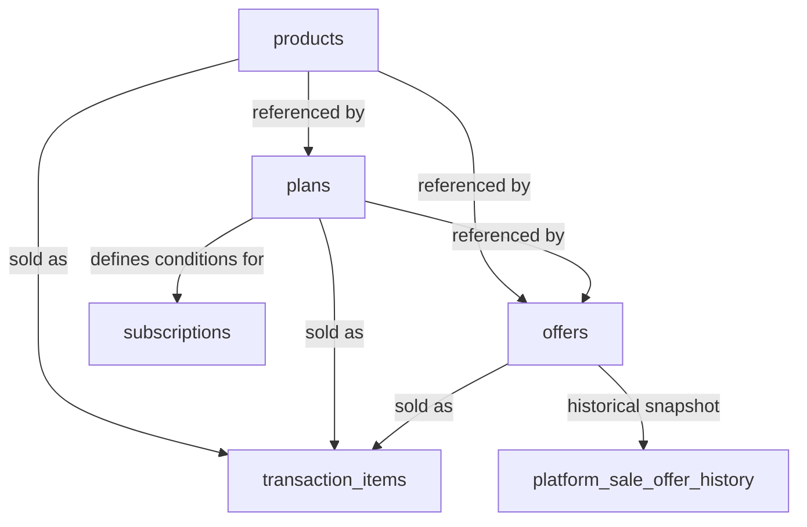

# `Domain_Products_Catalog.md` (Optimized)


```markdown
---
title: "Unified Product Catalog Domain"
id: "domain_products_catalog_001"
doc_type: "domain_specification"
doc_version: "1.2"
date_created: "2025-04-23"
date_updated: "2025-04-23"
author: "João Castanheira"
db_name: "joaocastanheira_bancodedados"
db_version: "1.0"
doc_status: "Approved"
environment: "Production"
language: "en"
response_languages: ["pt-BR", "en"]
technical_terms_preservation: "strict"
original_language: "pt-BR"
related_docs: [
  "core_db_arch_001", 
  "core_db_design_001", 
  "platform_integration_strategy_001",
  "ref_db_schema_details_001",
  "domain_subscription_management_001"
]
tables_in_focus: [
  "products",
  "plans",
  "offers",
  "transaction_items",
  "platform_sale_offer_history"
]
technical_terms: {
  "table_names": [
    "products", "plans", "offers", "transaction_items", 
    "platform_sale_offer_history", "transactions", 
    "subscriptions", "transaction_statuses"
  ],
  "column_names": [
    "id", "product_id", "platform_origin", "name", "description", 
    "created_at", "updated_at", "plan_id", "price", "currency_code", 
    "recurrence_period", "recurrence_interval", "trial_days", 
    "max_cycles", "offer_id", "payment_mode", "transaction_id", 
    "code", "offer_name", "status", "order_date", "offer_price", 
    "customer_id", "status_id"
  ],
  "data_types": [
    "SERIAL", "VARCHAR", "TEXT", "INTEGER", "NUMERIC", 
    "TIMESTAMP WITH TIME ZONE"
  ],
  "sql_keywords": [
    "SELECT", "FROM", "WHERE", "JOIN", "ORDER BY", "GROUP BY", 
    "INSERT INTO", "VALUES", "UPDATE", "SET", "COUNT", "SUM", 
    "AVG", "ON CONFLICT", "DO UPDATE", "BETWEEN", "LIMIT", 
    "HAVING", "DISTINCT", "CREATE INDEX", "IF NOT EXISTS", 
    "CREATE TABLE", "PRIMARY KEY", "REFERENCES", "DEFAULT", 
    "CURRENT_TIMESTAMP", "EXCLUDED", "LIKE", "AND", "ON", "AS"
  ],
  "enum_values": [
    "MONTH", "YEAR", "subscription", "one_time", "Aprovada", "Approved"
  ],
  "platform_names": [
    "Hotmart", "Kiwify"
  ]
}
embedding_guide_concepts: [
  "product catalog", 
  "product management", 
  "subscription plans", 
  "commercial offers", 
  "digital products", 
  "info products", 
  "online courses", 
  "multi-platform catalog",
  "product unification",
  "cross-platform mapping",
  "product identification",
  "offer management"
]
---


# Unified Product Catalog Domain


## Overview


The Product Catalog Domain is responsible for storing and managing information about all products, subscription plans, and commercial offers available for sale, regardless of the platform of origin. This domain provides a unified view of the catalog, allowing products from multiple platforms (such as Hotmart, Kiwify, and others) to be managed consistently.


The catalog unifies products, plans, and offers from multiple platforms using the combination of original platform identifiers (such as `product_id`, `plan_id`, or `offer_id`) with the `platform_origin` field. This composite identification strategy allows maintaining traceability to the original source while providing a consolidated view. For details on how data is imported and normalized from various platforms, see the **[Multi-Platform Integration Strategy](platform_integration_strategy_001.md)**.


This domain serves as a foundation for other domains, particularly Transactions and Subscriptions, which depend on these entities to record what was sold or subscribed to.


(Ref: Product Catalog, ID domain_products_catalog_001)


## Main Entities


### Products (`products`)


The `products` table is the central repository of all products available for sale, regardless of how they are marketed (direct sale or subscription). It stores basic information such as name and description.


#### Data Structure


| Field | Type | Description |
|-------|------|-------------|
| `id` | SERIAL | Internal unique identifier (PK) |
| `product_id` | VARCHAR(100) | Original product identifier in the source platform |
| `platform_origin` | VARCHAR(100) | Name of the platform where the product originated (e.g., "Hotmart", "Kiwify") |
| `name` | VARCHAR(255) | Product name |
| `description` | TEXT | Detailed product description |
| `created_at` | TIMESTAMP WITH TIME ZONE | Record creation date |
| `updated_at` | TIMESTAMP WITH TIME ZONE | Record last update date |


**Important note**: The combination `(product_id, platform_origin)` forms a unique composite key, ensuring that each product from each platform is represented only once in the unified catalog. This approach is fundamental to the multi-platform architecture, allowing precise identification of products regardless of their origin.


#### Query Example


To retrieve all products from a specific platform:


```sql
SELECT id, product_id, name, description
FROM products
WHERE platform_origin = 'Hotmart'
ORDER BY name;
```


To find a specific product using its identification in the source platform:


```sql
SELECT id, product_id, name, description
FROM products
WHERE product_id = 'PROD123' AND platform_origin = 'Kiwify';
```


### Plans (`plans`)


The `plans` table stores configurations for recurring subscriptions. Each plan is associated with a specific product and defines conditions such as price, billing interval, and trial period.


#### Data Structure


| Field | Type | Description |
|-------|------|-------------|
| `id` | SERIAL | Internal unique identifier (PK) |
| `plan_id` | VARCHAR(100) | Original plan identifier in the source platform |
| `platform_origin` | VARCHAR(100) | Name of the platform where the plan originated |
| `name` | VARCHAR(255) | Plan name |
| `description` | TEXT | Detailed plan description |
| `product_id` | INTEGER | Reference to the associated product (FK to `products.id`) |
| `price` | NUMERIC(15, 4) | Base price of the plan per billing cycle |
| `currency_code` | VARCHAR(3) | Currency code (e.g., "BRL", "USD") |
| `recurrence_period` | VARCHAR(20) | Recurrence time unit (e.g., "MONTH", "YEAR") |
| `recurrence_interval` | INTEGER | Interval between recurrences |
| `trial_days` | INTEGER | Number of days in the free trial period |
| `max_cycles` | INTEGER | Maximum number of cycles (0 or NULL for infinite) |
| `created_at` | TIMESTAMP WITH TIME ZONE | Record creation date |
| `updated_at` | TIMESTAMP WITH TIME ZONE | Record last update date |


**Important note**: Similar to products, the combination `(plan_id, platform_origin)` forms a unique composite key, allowing plans from different platforms to be unified in the same catalog. This identification approach is consistent with the **[Multi-Platform Integration Strategy](platform_integration_strategy_001.md#identification-and-entity-reconciliation)**.


#### Query Example


To retrieve all plans associated with a specific product:


```sql
SELECT p.name AS plan_name, p.price, p.currency_code, 
       p.recurrence_period, p.recurrence_interval, p.trial_days
FROM plans p
JOIN products pr ON p.product_id = pr.id
WHERE pr.product_id = 'PROD123' AND pr.platform_origin = 'Hotmart'
ORDER BY p.price;
```


### Offers (`offers`)


The `offers` table represents specific commercial variations of products or plans. An offer can be a specific checkout link, a temporary promotion, or particular commercial conditions for a product or plan.


#### Data Structure


| Field | Type | Description |
|-------|------|-------------|
| `id` | SERIAL | Internal unique identifier (PK) |
| `offer_id` | VARCHAR(100) | Original offer identifier in the source platform |
| `platform_origin` | VARCHAR(100) | Name of the platform where the offer originated |
| `name` | VARCHAR(255) | Descriptive name of the offer |
| `description` | TEXT | Detailed description of the offer conditions |
| `plan_id` | INTEGER | Reference to the associated plan, if applicable (FK to `plans.id`) |
| `product_id` | INTEGER | Reference to the associated product (FK to `products.id`) |
| `payment_mode` | VARCHAR(50) | Payment mode (e.g., "subscription", "one_time") |
| `price` | NUMERIC(15, 4) | Specific price of this offer |
| `currency_code` | VARCHAR(3) | Currency code (e.g., "BRL", "USD") |
| `created_at` | TIMESTAMP WITH TIME ZONE | Record creation date |
| `updated_at` | TIMESTAMP WITH TIME ZONE | Record last update date |


**Important note**: Like other entities, the combination `(offer_id, platform_origin)` forms a unique composite key, maintaining the consistency of the multi-platform identification architecture.


#### Query Example


To retrieve all active offers for a specific product:


```sql
SELECT o.name AS offer_name, o.price, o.currency_code, o.payment_mode
FROM offers o
JOIN products p ON o.product_id = p.id
WHERE p.product_id = 'PROD123' AND p.platform_origin = 'Kiwify'
ORDER BY o.price;
```


### Sale Offer History (`platform_sale_offer_history`)


The `platform_sale_offer_history` table stores a snapshot of the offer conditions at the time of a sale, ensuring that historical information is preserved even if the offer is modified later.


#### Data Structure


| Field | Type | Description |
|-------|------|-------------|
| `id` | SERIAL | Internal unique identifier (PK) |
| `transaction_id` | INTEGER | Reference to the associated transaction (FK to `transactions.id`) |
| `code` | VARCHAR(100) | Internal code or SKU of the offer/plan at the time of sale |
| `offer_id` | VARCHAR(100) | Offer ID in the source platform at the time of sale |
| `offer_name` | VARCHAR(255) | Offer name as displayed to the customer at the time of sale |
| `description` | VARCHAR(500) | Offer description valid at the time of sale |
| `created_at` | TIMESTAMP WITH TIME ZONE | Record creation date |
| `updated_at` | TIMESTAMP WITH TIME ZONE | Record last update date |


This table is especially important for maintaining the historical integrity of the sale terms, regardless of future changes to the offer catalog.


(Ref: Product Catalog, ID domain_products_catalog_001)


## Relationships with Other Domains


The Product Catalog Domain relates to other domains as follows:


### Relationship with Transactions Domain


- The `transaction_items` table links transactions to specific products, plans, or offers
- Each `transaction_item` can reference a product, a plan, an offer, or a combination of these


### Relationship with Subscriptions Domain


- Each subscription (`subscriptions`) is associated with a plan (`plans`)
- The plan defines the billing and renewal conditions of the subscription


### Relationship with Commissions Domain


- Commissions are calculated based on the product or plan sold
- Different products or plans may have distinct commission structures


### Relationship Diagram





This diagram illustrates how the product catalog entities are interconnected and how they relate to other domains such as transactions and subscriptions.


(Ref: Product Catalog, ID domain_products_catalog_001)


## Common Use Cases


### 1. External Platform New Product Registration


When a new product is created on an external platform (such as Hotmart or Kiwify), it is automatically synchronized with the unified catalog through the integration process. This process involves extracting the product information from the platform's API, normalizing it according to the unified data model, and inserting it into the database with the proper origin identification.


```sql
-- Example of inserting a new product from Hotmart
INSERT INTO products (product_id, platform_origin, name, description)
VALUES ('123456', 'Hotmart', 'Digital Marketing Course', 'Learn advanced digital marketing strategies.')
ON CONFLICT (product_id, platform_origin)
DO UPDATE SET
    name = EXCLUDED.name,
    description = EXCLUDED.description,
    updated_at = CURRENT_TIMESTAMP;
```


For details on how product data is extracted, transformed, and loaded from different platforms, see **[Multi-Platform Integration Strategy - Implementation by Platform](platform_integration_strategy_001.md#implementation-by-platform)**.


### 2. Subscription Plan Creation


A subscription plan is registered when it is created on a source platform, linked to an existing product:


```sql
-- Example of inserting a new subscription plan
INSERT INTO plans (
    plan_id, platform_origin, name, product_id, price, currency_code,
    recurrence_period, recurrence_interval, trial_days
)
VALUES (
    'PLAN789', 'Kiwify', 'Premium Monthly Plan',
    (SELECT id FROM products WHERE product_id = 'PROD123' AND platform_origin = 'Kiwify'),
    97.00, 'BRL', 'MONTH', 1, 7
);
```


### 3. Sales Analysis by Product


The unified catalog allows analyzing product sales regardless of the source platform:


```sql
-- Example query for product sales analysis
SELECT 
    p.name AS product_name,
    p.platform_origin,
    COUNT(ti.id) AS total_sales,
    SUM(t.offer_price) AS total_revenue
FROM products p
JOIN transaction_items ti ON p.id = ti.product_id
JOIN transactions t ON ti.transaction_id = t.id
WHERE t.status_id = (SELECT id FROM transaction_statuses WHERE status = 'Approved')
GROUP BY p.id, p.name, p.platform_origin
ORDER BY total_revenue DESC;
```


### 4. Offer Performance Comparison


The structure allows comparing different offers of the same product:


```sql
-- Example of comparative offer query
SELECT 
    o.name AS offer_name,
    o.price,
    COUNT(ti.id) AS total_sales,
    SUM(t.offer_price) AS total_revenue,
    AVG(t.offer_price) AS avg_revenue_per_sale
FROM offers o
JOIN transaction_items ti ON o.id = ti.offer_id
JOIN transactions t ON ti.transaction_id = t.id
WHERE t.status_id = (SELECT id FROM transaction_statuses WHERE status = 'Approved')
AND o.product_id = (SELECT id FROM products WHERE product_id = 'PROD123' AND platform_origin = 'Hotmart')
GROUP BY o.id, o.name, o.price
ORDER BY total_revenue DESC;
```


(Ref: Product Catalog, ID domain_products_catalog_001)


## Multi-Platform Catalog Maintenance


### Automatic Synchronization


The catalog is kept up-to-date through automated synchronization processes with the source platforms' APIs:


1. **Webhooks and Events**: Receiving real-time notifications about changes to products, plans, or offers
2. **Periodic Synchronization**: Scheduled jobs that check for changes at regular intervals
3. **Manual Reconciliation**: Interface to force manual synchronization when necessary


The platform-specific adapters, implemented according to the **[Multi-Platform Integration Strategy](platform_integration_strategy_001.md#platform-specific-adapters)**, ensure that data is correctly normalized before being inserted into the unified catalog.


### Conflict Resolution


When products or plans with the same identifier are received from different platforms, or when there are data discrepancies, the following rules are applied:


1. **Unique Identification**: The combination `(platform_id, platform_origin)` ensures there is no collision between products from different platforms
2. **Selective Update**: In updates, only non-null fields are updated, preserving existing data when appropriate
3. **Change Logs**: Significant changes are logged for auditing


### Handling Deletions


When products, plans, or offers are discontinued on source platforms, they are not removed from the unified catalog but marked as inactive through specific flags or statuses. This preserves the history of past sales and subscriptions.


(Ref: Product Catalog, ID domain_products_catalog_001)


## Unified and Cross-Platform Queries


One of the main advantages of the unified catalog is the ability to perform queries that span products from multiple platforms:


### Product Comparison Between Platforms


```sql
-- Query to compare similar products between platforms
SELECT 
    platform_origin AS platform,
    COUNT(id) AS product_count,
    AVG(
        (SELECT AVG(price) FROM offers WHERE offers.product_id = products.id)
    ) AS avg_offer_price
FROM products
WHERE name LIKE '%Marketing Course%'
GROUP BY platform_origin;
```


### Consolidated Sales Analysis


```sql
-- Consolidated sales analysis by platform
SELECT 
    p.platform_origin,
    COUNT(t.id) AS total_transactions,
    SUM(t.offer_price) AS total_revenue,
    COUNT(DISTINCT t.customer_id) AS unique_customers
FROM transactions t
JOIN transaction_items ti ON t.id = ti.transaction_id
JOIN products p ON ti.product_id = p.id
WHERE t.status_id = (SELECT id FROM transaction_statuses WHERE status = 'Approved')
AND t.order_date BETWEEN '2023-01-01' AND '2023-12-31'
GROUP BY p.platform_origin;
```


### Products with Presence on Multiple Platforms


In some cases, the same product (or very similar versions) may be present on multiple platforms. The unified catalog allows identifying these cases:


```sql
-- Identification of possible duplicate products between platforms
SELECT 
    p1.name, 
    p1.platform_origin AS platform1, 
    p2.platform_origin AS platform2
FROM products p1
JOIN products p2 ON 
    p1.name = p2.name AND 
    p1.platform_origin < p2.platform_origin
ORDER BY p1.name;
```


This unified query capability is a direct benefit of the platform-agnostic approach implemented by the data model.


(Ref: Product Catalog, ID domain_products_catalog_001)


## Technical Considerations


### Optimized Indexing


The index structure is optimized to support common catalog queries:


```sql
-- Indexes for products table
CREATE INDEX IF NOT EXISTS idx_products_name ON products (name);
CREATE INDEX IF NOT EXISTS idx_products_platform_origin ON products (platform_origin);


-- Indexes for plans table
CREATE INDEX IF NOT EXISTS idx_plans_product_id ON plans (product_id);
CREATE INDEX IF NOT EXISTS idx_plans_platform_origin ON plans (platform_origin);


-- Indexes for offers table
CREATE INDEX IF NOT EXISTS idx_offers_plan_id ON offers (plan_id);
CREATE INDEX IF NOT EXISTS idx_offers_product_id ON offers (product_id);
CREATE INDEX IF NOT EXISTS idx_offers_platform_origin ON offers (platform_origin);
```


### Partitioning Strategy


For very large catalogs, table partitioning may be considered:


1. **Platform Partitioning**: Dividing tables by `platform_origin`
2. **Date Partitioning**: Dividing sales history by periods


### Catalog Caching


Implementation of cache for frequent catalog queries:


1. **Popular Products Cache**: Cache best-selling products
2. **Price Cache**: Keep price information updated for quick reference
3. **Selective Invalidation**: Update cache only when relevant data changes


(Ref: Product Catalog, ID domain_products_catalog_001)


## Catalog Evolution


### Extensibility for New Platforms


The catalog design was conceived to facilitate adding new platforms:


1. **Composite Keys**: Using `(platform_id, platform_origin)` as a unique identifier allows adding new platforms without conflict
2. **Pluggable Adapters**: The integration architecture allows adding new adapters for future platforms
3. **Generic Fields**: The data structure accommodates the diversity of information between platforms


To implement a new platform, it is necessary to:


1. Create a new platform-specific adapter following the pattern of the **[Multi-Platform Integration Strategy](platform_integration_strategy_001.md#extension-for-new-platforms)**
2. Define the mapping between the fields of the new platform and the unified model
3. Implement the logic for extracting and transforming the data


### Data Enrichment


The catalog can be enriched with additional information:


1. **Product Metadata**: Categories, tags, target audience
2. **Performance Metrics**: Conversion, satisfaction, retention
3. **Associated Resources**: Materials, downloads, bonuses


### Product Versioning


For products that undergo significant updates, a versioning system can be implemented:


1. **Version History**: Record of important changes to products
2. **Version Access**: Control of which version each customer has access to
3. **Upgrades and Migrations**: Management of customer updates between versions


(Ref: Product Catalog, ID domain_products_catalog_001)


## Conclusion


The Unified Product Catalog Domain is a fundamental piece of the `joaocastanheira_bancodedados` database architecture. It provides a consolidated view of products, plans, and offers from multiple platforms, allowing consistent operations and analyses regardless of the data source.


The implementation of the catalog following the **[Multi-Platform Integration Strategy](platform_integration_strategy_001.md)** ensures that:


1. **Each product is uniquely identified**, regardless of the platform of origin
2. **Different terminologies are normalized** to a common vocabulary
3. **Offer history is preserved**, even when conditions change
4. **Cross-platform analyses are possible**, allowing comparisons between different platforms


This platform-agnostic approach provides flexibility for future expansion and resilience to changes in external platforms, while maintaining data integrity and consistency.


(Ref: Product Catalog, ID domain_products_catalog_001)
```