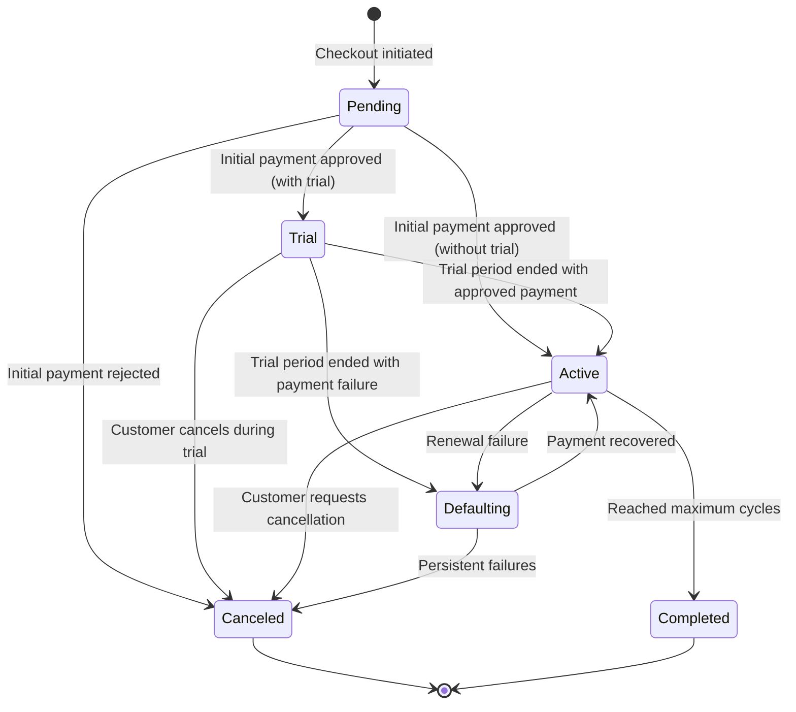
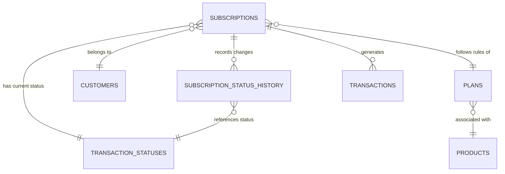

# `Domain_Subscriptions_Management.md` (Optimized)


```markdown
---
title: "Domain: Subscriptions Management"
id: "domain_subscriptions_management_001"
doc_type: "domain_functional"
doc_version: "1.1"
date_created: "2025-04-23"
date_updated: "2025-04-23"
author: "João Castanheira"
db_name: "joaocastanheira_bancodedados"
db_version: "1.0"
doc_status: "Approved"
environment: "Production"
language: "en"
response_languages: ["pt-BR", "en"]
technical_terms_preservation: "strict"
original_language: "pt-BR"
related_docs: [
  "core_db_architecture_001", 
  "platform_integration_strategy_001", 
  "domain_customers_ecosystem_001",
  "domain_products_catalog_001", 
  "domain_transactions_lifecycle_001",
  "process_flow_subscription_lifecycle_001"
]
tables_in_domain: [
  "subscriptions", 
  "subscription_status_history", 
  "transaction_statuses", 
  "plans", 
  "transactions",
  "customers",
  "products",
  "user_activity_logs"
]
technical_terms: {
  "table_names": [
    "subscriptions", "subscription_status_history", "transaction_statuses", 
    "plans", "transactions", "customers", "products", "user_activity_logs"
  ],
  "column_names": [
    "id", "subscription_id", "subscriber_id", "initial_transaction_id", 
    "customer_id", "plan_id", "payment_gateway", "billing_cycle", 
    "total_recurrences", "max_cycles", "last_update", "start_date", 
    "end_date", "created_at", "updated_at", "status_id", "request_billet", 
    "next_billing_date", "cancel_date", "change_date", "reason", 
    "name", "email", "recurrence_period", "price", "product_id"
  ],
  "data_types": [
    "SERIAL", "VARCHAR", "INTEGER", "BOOLEAN", "TIMESTAMP WITH TIME ZONE", 
    "TEXT", "NUMERIC", "PRIMARY KEY", "REFERENCES", "DEFAULT", 
    "CURRENT_TIMESTAMP", "INTERVAL", "ON DELETE CASCADE", "UNIQUE", "CONSTRAINT"
  ],
  "sql_keywords": [
    "CREATE TABLE", "INSERT INTO", "VALUES", "UPDATE", "SET", "WHERE", 
    "SELECT", "FROM", "JOIN", "LEFT JOIN", "GROUP BY", "ORDER BY", "ON", 
    "CASE", "WHEN", "THEN", "ELSE", "END", "BEGIN", "COMMIT", "AND", "OR", 
    "EXTRACT", "MONTH", "YEAR", "DAY", "IS NULL", "IS NOT NULL", "COUNT", 
    "SUM", "AVG", "MIN", "MAX", "INTERVAL", "BETWEEN", "IN", "NOT IN", 
    "DATE_TRUNC", "NULLIF", "COALESCE", "ROUND", "AS", "WITH", 
    "CREATE INDEX", "IF NOT EXISTS", "CREATE OR REPLACE FUNCTION", 
    "RETURNS", "DECLARE", "BEGIN", "END", "LANGUAGE plpgsql", "HAVING",
    "EXISTS", "LIMIT", "OFFSET", "DISTINCT", "CURRENT_TIMESTAMP", "ABS"
  ],
  "status_values": [
    "Pendente", "Trial", "Ativa", "Inadimplente", "Cancelada", 
    "Cancelada Assinante", "Cancelada Sistema", "Concluída", 
    "Pending", "Trial", "Active", "Defaulting", "Canceled", 
    "Subscriber Canceled", "System Canceled", "Completed"
  ],
  "billing_cycles": [
    "MONTHLY", "YEARLY", "QUARTERLY", "SEMIANNUAL", "WEEKLY", "DAILY",
    "MONTH", "YEAR", "QUARTER", "SEMIANNUAL", "WEEK", "DAY"
  ],
  "functions": [
    "calculate_next_billing_date", "is_valid_subscription_status_transition",
    "generate_series", "validate_transaction_amounts"
  ]
}
functional_domain: ["Recurring Revenue", "Billing", "Customer Retention"]
embedding_guide_concepts: [
  "recurring subscription", 
  "subscription lifecycle", 
  "subscription status", 
  "next billing", 
  "automatic renewal", 
  "trial period", 
  "subscription cancellation", 
  "default payment", 
  "payment failure", 
  "subscriber retention", 
  "churn rate", 
  "MRR", 
  "ARR", 
  "lifetime value", 
  "dunning", 
  "plan upgrade", 
  "plan downgrade"
]
---


# Domain: Subscriptions Management


## Domain Overview


The Subscriptions Management domain is responsible for the complete lifecycle of recurring billing relationships between customers and products/services. While the Transactions domain records isolated payment events, this domain manages the ongoing relationship that generates recurring revenue over time.


A subscription represents an automatic periodic billing contract where:


- A **customer** acquires access to a **product/service**
- Following rules defined in a **plan** (price, frequency, duration)
- With **automatic charges** at regular intervals
- Passing through different **states** during its lifecycle (active, defaulting, canceled)
- Generating multiple **recurring transactions** over time


This domain implements the data structures and relationships necessary to:
1. Track the current state and history of each subscription
2. Manage crucial dates (start, next billing, end)
3. Facilitate recurring business metrics analysis (MRR, churn, retention)
4. Support retention, renewal, and recovery processes


The fundamental tables of the domain are `subscriptions` (core subscription data) and `subscription_status_history` (chronological record of state changes), with critical relationships to the `plans`, `customers`, and `transactions` tables.


(Ref: Subscriptions Management, ID domain_subscriptions_management_001)


## Subscription Lifecycle


### State Diagram





### 1. Creation and Subscription


The subscription is born from an initially approved transaction:


```sql
-- After initial transaction approved, we create the subscription
INSERT INTO subscriptions (
    subscription_id,
    subscriber_id,
    initial_transaction_id,
    customer_id,
    plan_id,
    payment_gateway,
    billing_cycle,
    max_cycles,
    start_date,
    next_billing_date,
    status_id
)
VALUES (
    'SUB-12345',
    'CUST-789',
    'TRX-456',
    (SELECT id FROM customers WHERE email = 'customer@example.com'),
    (SELECT id FROM plans WHERE plan_id = 'PLAN-MONTHLY'),
    'payment_platform',
    'MONTHLY',
    12,  -- Limit of 12 cycles
    CURRENT_TIMESTAMP,  -- Immediate start
    CURRENT_TIMESTAMP + INTERVAL '30 days',  -- Next billing in 30 days
    (SELECT id FROM transaction_statuses WHERE status = 'Active')
);


-- We record the initial state in the history
INSERT INTO subscription_status_history (
    subscription_id,
    status_id,
    reason
)
VALUES (
    (SELECT id FROM subscriptions WHERE subscription_id = 'SUB-12345'),
    (SELECT id FROM transaction_statuses WHERE status = 'Active'),
    'Subscription creation after approved initial payment'
);
```


During creation, the system:
1. Links the subscription to the customer, plan, and initial transaction
2. Sets recurrence parameters based on the chosen plan
3. Establishes important dates (start and next billing)
4. Configures the appropriate initial status
5. Records the creation in the status history


### 2. Trial Period (Optional)


When the plan includes a free evaluation period:


```sql
-- For plans with trial, initial configuration slightly different
INSERT INTO subscriptions (
    -- basic fields similar to previous example
    start_date,
    next_billing_date,
    status_id
)
VALUES (
    -- other values
    CURRENT_TIMESTAMP,  -- Trial start
    CURRENT_TIMESTAMP + INTERVAL '14 days',  -- First charge after 14 days
    (SELECT id FROM transaction_statuses WHERE status = 'Trial')
);


-- When the trial ends, automatic status update
UPDATE subscriptions
SET 
    status_id = (SELECT id FROM transaction_statuses WHERE status = 'Active'),
    next_billing_date = CURRENT_TIMESTAMP + INTERVAL '30 days'  -- Sets regular cycle
WHERE 
    id = [subscription_id] 
    AND status_id = (SELECT id FROM transaction_statuses WHERE status = 'Trial');


-- With history record
INSERT INTO subscription_status_history (
    subscription_id,
    status_id,
    reason
)
VALUES (
    [subscription_id],
    (SELECT id FROM transaction_statuses WHERE status = 'Active'),
    'Automatic conversion after trial period'
);
```


During the trial:
- The subscription has a specific status ("Trial" or "Active Trial")
- The customer has access to the product without additional charges
- At the end of the period, an attempt is made for the first regular charge
- The result of this charge determines the continuity of the subscription


### 3. Automatic Renewals


The heart of a subscription business is the automatic renewal process:


```sql
-- When a renewal is successful
UPDATE subscriptions
SET 
    next_billing_date = CURRENT_TIMESTAMP + INTERVAL '30 days',  -- Next cycle
    total_recurrences = total_recurrences + 1  -- Increments recurrence counter
WHERE 
    id = [subscription_id];


-- Check if it reached cycle limit
UPDATE subscriptions
SET 
    status_id = (SELECT id FROM transaction_statuses WHERE status = 'Completed'),
    end_date = CURRENT_TIMESTAMP
WHERE 
    id = [subscription_id]
    AND total_recurrences >= max_cycles
    AND max_cycles > 0;  -- Only for subscriptions with cycle limit
```


Each renewal:
1. Generates a new transaction linked to the subscription
2. Increments the recurrence counter
3. Recalculates the next billing date
4. Checks if the cycle limit has been reached (when applicable)


### 4. Payment Failure and Recovery


When a recurring charge fails, the default flow begins:


```sql
-- When a charge fails
UPDATE subscriptions
SET 
    status_id = (SELECT id FROM transaction_statuses WHERE status = 'Defaulting')
WHERE 
    id = [subscription_id];


INSERT INTO subscription_status_history (
    subscription_id,
    status_id,
    reason
)
VALUES (
    [subscription_id],
    (SELECT id FROM transaction_statuses WHERE status = 'Defaulting'),
    'Failure in recurring charge attempt: card declined'
);


-- When a payment is recovered
UPDATE subscriptions
SET 
    status_id = (SELECT id FROM transaction_statuses WHERE status = 'Active'),
    next_billing_date = CURRENT_TIMESTAMP + INTERVAL '30 days'  -- Returns to normal cycle
WHERE 
    id = [subscription_id];


INSERT INTO subscription_status_history (
    subscription_id,
    status_id,
    reason
)
VALUES (
    [subscription_id],
    (SELECT id FROM transaction_statuses WHERE status = 'Active'),
    'Payment recovered after payment method update'
);
```


The recovery process (dunning) may include:
- Multiple automated reprocessing attempts
- Scheduled communications with the customer
- Grace periods before definitive cancellation
- Incentive strategies for payment method update


### 5. Cancellation


Cancellation can be initiated by the customer or by the system:


```sql
-- Cancellation requested by customer
UPDATE subscriptions
SET 
    status_id = (SELECT id FROM transaction_statuses WHERE status = 'Subscriber Canceled'),
    cancel_date = CURRENT_TIMESTAMP,
    end_date = CASE
        WHEN [immediate_cancellation] THEN CURRENT_TIMESTAMP
        ELSE next_billing_date  -- Access continues until the end of the paid period
    END
WHERE 
    id = [subscription_id];


INSERT INTO subscription_status_history (
    subscription_id,
    status_id,
    reason
)
VALUES (
    [subscription_id],
    (SELECT id FROM transaction_statuses WHERE status = 'Subscriber Canceled'),
    'Cancellation requested by customer: '||[informed_reason]
);


-- Automatic cancellation by the system (after persistent failures)
UPDATE subscriptions
SET 
    status_id = (SELECT id FROM transaction_statuses WHERE status = 'System Canceled'),
    cancel_date = CURRENT_TIMESTAMP,
    end_date = CURRENT_TIMESTAMP
WHERE 
    id = [subscription_id];


INSERT INTO subscription_status_history (
    subscription_id,
    status_id,
    reason
)
VALUES (
    [subscription_id],
    (SELECT id FROM transaction_statuses WHERE status = 'System Canceled'),
    'Automatic cancellation after 3 failed charge attempts'
);
```


Different policies can be applied to cancellation:
- **Immediate cancellation**: Access ends at the moment of cancellation
- **End-of-period cancellation**: Customer maintains access until the original next billing date
- **Cancellation with refund**: In specific cases, there may be a proportional refund


(Ref: Subscriptions Management, ID domain_subscriptions_management_001)


## Data Structure and Relationships


### Central Table: `subscriptions`


```sql
CREATE TABLE IF NOT EXISTS subscriptions (
    id                     SERIAL PRIMARY KEY,
    subscription_id        VARCHAR(100) NOT NULL,          -- Subscription ID in the platform
    subscriber_id          VARCHAR(100),                   -- Subscriber ID in the platform
    initial_transaction_id VARCHAR(100),                   -- Initial transaction ID
    customer_id            INTEGER REFERENCES customers,    -- Associated customer
    plan_id                INTEGER REFERENCES plans,        -- Associated plan
    payment_gateway        VARCHAR(100) NOT NULL,          -- Payment gateway
    billing_cycle          VARCHAR(50),                    -- Billing cycle
    total_recurrences      INTEGER,                        -- Total recurrences performed
    max_cycles             INTEGER,                        -- Maximum allowed cycles
    last_update            TIMESTAMP WITH TIME ZONE,       -- Last update
    start_date             TIMESTAMP WITH TIME ZONE,       -- Start date
    end_date               TIMESTAMP WITH TIME ZONE,       -- End date
    created_at             TIMESTAMP WITH TIME ZONE DEFAULT CURRENT_TIMESTAMP,
    updated_at             TIMESTAMP WITH TIME ZONE DEFAULT CURRENT_TIMESTAMP,
    status_id              INTEGER REFERENCES transaction_statuses, -- Current status
    request_billet         BOOLEAN DEFAULT false,          -- Bank slip request
    next_billing_date      TIMESTAMP WITH TIME ZONE,       -- Next billing date
    cancel_date            TIMESTAMP WITH TIME ZONE,       -- Cancellation date
    CONSTRAINT uq_subscription_gateway UNIQUE (subscription_id, payment_gateway)
);
```


This table is the core of the domain, storing all the essential details of a subscription.


#### Field Groups by Function


|Group|Fields|Description|
|-------|--------|-----------|
|**Identification**|`id`, `subscription_id`, `payment_gateway`, `subscriber_id`|Unique identifiers of the subscription in the system and the source platform|
|**Relationships**|`customer_id`, `plan_id`, `status_id`|Links with fundamental entities of the system|
|**Configuration**|`billing_cycle`, `max_cycles`, `request_billet`|Parameters that define how the subscription operates|
|**Counters**|`total_recurrences`|Tracking subscription progress|
|**Critical Dates**|`start_date`, `end_date`, `next_billing_date`, `cancel_date`|Temporal milestones that govern the lifecycle|
|**Metadata**|`created_at`, `updated_at`, `last_update`|Record control information|


### History Table: `subscription_status_history`


```sql
CREATE TABLE IF NOT EXISTS subscription_status_history (
    id              SERIAL PRIMARY KEY,
    subscription_id INTEGER NOT NULL REFERENCES subscriptions ON DELETE CASCADE,
    status_id       INTEGER NOT NULL REFERENCES transaction_statuses,
    change_date     TIMESTAMP WITH TIME ZONE DEFAULT CURRENT_TIMESTAMP,
    reason          TEXT,                                   -- Reason for change
    created_at      TIMESTAMP WITH TIME ZONE DEFAULT CURRENT_TIMESTAMP,
    updated_at      TIMESTAMP WITH TIME ZONE DEFAULT CURRENT_TIMESTAMP
);
```


This table provides the complete audit trail of each subscription state change over time, allowing:


- Reconstruction of the complete history of each subscription
- Understanding the reasons behind each status change
- Calculation of average time in each state
- Identification of progression patterns that precede cancellations


### Relationship Diagram





Crucial relationships include:
- **Customer (1:N Subscriptions)**: A customer can have multiple active or closed subscriptions
- **Plan (1:N Subscriptions)**: A plan can be used by multiple subscriptions
- **Subscription (1:N Transactions)**: A subscription generates multiple recurring transactions
- **Subscription (1:N History)**: A subscription has a complete history of status changes


(Ref: Subscriptions Management, ID domain_subscriptions_management_001)


## Business Rules and Operation Patterns


### Critical Dates and Their Importance


The subscription domain fundamentally depends on three main dates:


#### `next_billing_date` (Next Billing)


```sql
-- Update after successful charge
UPDATE subscriptions
SET next_billing_date = CASE
    WHEN billing_cycle = 'MONTHLY' THEN CURRENT_TIMESTAMP + INTERVAL '1 month'
    WHEN billing_cycle = 'YEARLY' THEN CURRENT_TIMESTAMP + INTERVAL '1 year'
    WHEN billing_cycle = 'QUARTERLY' THEN CURRENT_TIMESTAMP + INTERVAL '3 months'
    ELSE CURRENT_TIMESTAMP + INTERVAL '30 days' -- Fallback
END
WHERE id = [subscription_id];
```


- **Function**: Controls when the next charge attempt should occur
- **Initial Calculation**: `start_date + trial_period` (if trial) or `start_date + recurrence_period` (without trial)
- **Updates**: After each successful charge, based on the plan's periodicity
- **Importance**: Essential for scheduling future charges and for revenue forecast reports


#### `cancel_date` (Cancellation Date)


```sql
-- Record of the cancellation request moment
UPDATE subscriptions
SET 
    cancel_date = CURRENT_TIMESTAMP,
    status_id = (SELECT id FROM transaction_statuses WHERE status = 'Subscriber Canceled')
WHERE id = [subscription_id];
```


- **Function**: Marks the specific moment when cancellation was requested
- **Importance**: 
  - Crucial for retention analysis and cancellation reasons
  - Different from `end_date` when the model allows access until the end of the paid period
  - Allows distinguishing between request (cancel_date) and effectiveness (end_date) of cancellation


#### `end_date` (End Date)


```sql
-- Definition during cancellation based on company policy
UPDATE subscriptions
SET end_date = CASE
    WHEN [immediate_cancellation] THEN CURRENT_TIMESTAMP
    ELSE next_billing_date -- Allows access until the end of the already paid period
END
WHERE id = [subscription_id];
```


- **Function**: Indicates when the subscription effectively ends (access terminated)
- **Definition Scenarios**:
  - Immediate cancellation: `end_date = cancel_date`
  - End-of-period cancellation: `end_date = next_billing_date` (from cancellation date)
  - End by maximum cycles: `end_date = date of last charge + plan period`
- **Importance**: Determines until when the customer maintains access to the product/service


### Renewal Calculation


Determining the next billing date must consider several factors:


```sql
-- Function to calculate next billing date
CREATE OR REPLACE FUNCTION calculate_next_billing_date(
    current_date TIMESTAMP WITH TIME ZONE,
    billing_cycle VARCHAR,
    recurrence_interval INTEGER DEFAULT 1
) RETURNS TIMESTAMP WITH TIME ZONE AS $$
DECLARE
    next_date TIMESTAMP WITH TIME ZONE;
BEGIN
    CASE billing_cycle
        WHEN 'DAILY' THEN 
            next_date := current_date + (recurrence_interval * INTERVAL '1 day');
        WHEN 'WEEKLY' THEN 
            next_date := current_date + (recurrence_interval * INTERVAL '1 week');
        WHEN 'MONTHLY' THEN 
            next_date := current_date + (recurrence_interval * INTERVAL '1 month');
        WHEN 'QUARTERLY' THEN 
            next_date := current_date + (recurrence_interval * INTERVAL '3 months');
        WHEN 'SEMIANNUAL' THEN 
            next_date := current_date + (recurrence_interval * INTERVAL '6 months');
        WHEN 'YEARLY' THEN 
            next_date := current_date + (recurrence_interval * INTERVAL '1 year');
        ELSE
            -- Fallback to monthly if unknown cycle
            next_date := current_date + INTERVAL '1 month';
    END CASE;
    
    RETURN next_date;
END;
$$ LANGUAGE plpgsql;
```


Important considerations:
- **Variations in days per month**: Some months have 28-31 days, which can cause misalignment in monthly charges
- **Specific billing day**: Some platforms allow fixing a specific day of the month for billing
- **Holidays and weekends**: Can affect bank processing of charges
- **Different time zones**: Customer, platform, and bank may be in different time zones


### Status Logic and Transitions


The most common subscription statuses and their transition rules:


|Status|Description|Allowed Transitions|Business Rules|
|--------|-----------|------------------------|-------------------|
|**Pending**|Subscription created, awaiting initial confirmation|→ Active<br>→ Trial<br>→ Canceled|Automatic transition after initial payment result|
|**Trial**|Active free evaluation period|→ Active<br>→ Canceled<br>→ Defaulting|Automatic transition after end of trial period|
|**Active**|Subscription in full operation|→ Defaulting<br>→ Canceled<br>→ Completed|Remains in this state while payments are approved|
|**Defaulting**|Payment failure, in grace period|→ Active<br>→ Canceled|Recovery possible within the grace/dunning period|
|**Canceled**|Subscription terminated by customer request|(Final state)|May have subtypes: "Subscriber Canceled", "System Canceled"|
|**Completed**|Subscription ended by reaching cycle limit|(Final state)|Occurs only when max_cycles > 0 and total_recurrences >= max_cycles|


```sql
-- Valid transition check (simplified example)
CREATE OR REPLACE FUNCTION is_valid_subscription_status_transition(
    current_status_id INTEGER,
    new_status_id INTEGER
) RETURNS BOOLEAN AS $$
DECLARE
    current_status VARCHAR;
    new_status VARCHAR;
    is_valid BOOLEAN := FALSE;
BEGIN
    -- Get status names
    SELECT status INTO current_status FROM transaction_statuses WHERE id = current_status_id;
    SELECT status INTO new_status FROM transaction_statuses WHERE id = new_status_id;
    
    -- Check if transition is valid
    CASE current_status
        WHEN 'Pending' THEN
            is_valid := new_status IN ('Active', 'Trial', 'Canceled');
        WHEN 'Trial' THEN
            is_valid := new_status IN ('Active', 'Canceled', 'Defaulting');
        WHEN 'Active' THEN
            is_valid := new_status IN ('Defaulting', 'Canceled', 'Completed');
        WHEN 'Defaulting' THEN
            is_valid := new_status IN ('Active', 'Canceled');
        WHEN 'Canceled' THEN
            is_valid := FALSE; -- Final state
        WHEN 'Completed' THEN
            is_valid := FALSE; -- Final state
        ELSE
            is_valid := FALSE;
    END CASE;
    
    RETURN is_valid;
END;
$$ LANGUAGE plpgsql;
```


(Ref: Subscriptions Management, ID domain_subscriptions_management_001)


## Recurring Business Metrics


The subscription domain provides the database for crucial metrics:


### 1. Recurring Revenue


#### MRR (Monthly Recurring Revenue)


```sql
-- Current MRR calculation with periodicity normalization
WITH subscription_mrr AS (
    SELECT 
        s.id,
        CASE
            WHEN p.recurrence_period = 'MONTH' THEN p.price
            WHEN p.recurrence_period = 'YEAR' THEN p.price / 12
            WHEN p.recurrence_period = 'QUARTER' THEN p.price / 3
            WHEN p.recurrence_period = 'SEMIANNUAL' THEN p.price / 6
            WHEN p.recurrence_period = 'WEEK' THEN p.price * 4.33 -- Approximation
            WHEN p.recurrence_period = 'DAY' THEN p.price * 30.44 -- Approximation
            ELSE p.price -- Fallback
        END AS monthly_value
    FROM 
        subscriptions s
    JOIN 
        plans p ON s.plan_id = p.id
    JOIN 
        transaction_statuses ts ON s.status_id = ts.id
    WHERE 
        ts.status IN ('Active', 'Trial')
        AND (s.end_date IS NULL OR s.end_date > CURRENT_TIMESTAMP)
)
SELECT 
    SUM(monthly_value) AS total_mrr,
    COUNT(*) AS active_subscriptions,
    SUM(monthly_value) / COUNT(*) AS arpu -- Average Revenue Per User
FROM 
    subscription_mrr;
```


This metric:
- Normalizes all plans to a monthly basis, regardless of periodicity
- Considers only active and trial subscriptions
- Allows consistent comparisons over time
- Serves as a basis for financial projections


#### New MRR vs Churn MRR


```sql
-- MRR from new subscriptions vs lost MRR in a period
WITH new_subscriptions AS (
    SELECT 
        s.id,
        CASE
            WHEN p.recurrence_period = 'MONTH' THEN p.price
            WHEN p.recurrence_period = 'YEAR' THEN p.price / 12
            -- Other periods normalized to monthly
        END AS monthly_value
    FROM 
        subscriptions s
    JOIN 
        plans p ON s.plan_id = p.id
    WHERE 
        s.start_date BETWEEN '2023-01-01' AND '2023-01-31'
),
churned_subscriptions AS (
    SELECT 
        s.id,
        CASE
            WHEN p.recurrence_period = 'MONTH' THEN p.price
            WHEN p.recurrence_period = 'YEAR' THEN p.price / 12
            -- Other periods normalized to monthly
        END AS monthly_value
    FROM 
        subscriptions s
    JOIN 
        plans p ON s.plan_id = p.id
    JOIN 
        subscription_status_history ssh ON s.id = ssh.subscription_id
    JOIN 
        transaction_statuses ts ON ssh.status_id = ts.id
    WHERE 
        ts.status IN ('Canceled', 'Subscriber Canceled', 'System Canceled')
        AND ssh.change_date BETWEEN '2023-01-01' AND '2023-01-31'
        -- Ensures that the subscription was active before the period
        AND EXISTS (
            SELECT 1 
            FROM subscription_status_history ssh2
            JOIN transaction_statuses ts2 ON ssh2.status_id = ts2.id
            WHERE ssh2.subscription_id = s.id
            AND ts2.status = 'Active'
            AND ssh2.change_date < '2023-01-01'
        )
)
SELECT 
    (SELECT SUM(monthly_value) FROM new_subscriptions) AS new_mrr,
    (SELECT COUNT(*) FROM new_subscriptions) AS new_subscriptions_count,
    (SELECT SUM(monthly_value) FROM churned_subscriptions) AS churned_mrr,
    (SELECT COUNT(*) FROM churned_subscriptions) AS churned_subscriptions_count,
    (SELECT SUM(monthly_value) FROM new_subscriptions) - 
    (SELECT SUM(monthly_value) FROM churned_subscriptions) AS net_mrr
```


This calculation allows:
- Understanding the net growth of recurring revenue
- Identifying periods of expansion vs contraction
- Evaluating the effectiveness of acquisition vs retention campaigns


### 2. Retention Metrics


#### Churn Rate


```sql
-- Churn rate by period (monthly)
WITH subscription_counts AS (
    SELECT
        DATE_TRUNC('month', d)::date AS month_start,
        (
            SELECT COUNT(*) 
            FROM subscriptions s
            JOIN transaction_statuses ts ON s.status_id = ts.id
            WHERE 
                ts.status IN ('Active', 'Trial') 
                AND s.start_date < DATE_TRUNC('month', d)
                AND (s.end_date IS NULL OR s.end_date > DATE_TRUNC('month', d))
        ) AS start_count,
        (
            SELECT COUNT(*) 
            FROM subscriptions s
            JOIN subscription_status_history ssh ON s.id = ssh.subscription_id
            JOIN transaction_statuses ts ON ssh.status_id = ts.id
            WHERE 
                ts.status IN ('Canceled', 'Subscriber Canceled', 'System Canceled')
                AND ssh.change_date BETWEEN DATE_TRUNC('month', d) AND 
                                           (DATE_TRUNC('month', d) + INTERVAL '1 month - 1 day')
        ) AS churned_count
    FROM generate_series(
        '2023-01-01'::timestamp, 
        '2023-12-01'::timestamp, 
        '1 month'::interval
    ) d
)
SELECT
    month_start,
    start_count,
    churned_count,
    CASE 
        WHEN start_count > 0 THEN 
            ROUND((churned_count::numeric / start_count::numeric) * 100, 2)
        ELSE 0
    END AS churn_rate_percent,
    CASE 
        WHEN start_count > 0 THEN 
            ROUND((1 - (churned_count::numeric / start_count::numeric)) * 100, 2)
        ELSE 0
    END AS retention_rate_percent
FROM 
    subscription_counts
ORDER BY 
    month_start;
```


This metric:
- Indicates the percentage of subscriptions lost in a period
- Is one of the most important KPIs for subscription businesses
- Allows estimating the average lifetime of a subscription (1/monthly churn)
- Directly affects the financial viability of the business model


#### Cohort Survival Analysis


```sql
-- Cohort retention analysis (monthly groups of new subscribers)
WITH cohorts AS (
    -- Define cohorts by start month
    SELECT 
        id AS subscription_id,
        DATE_TRUNC('month', start_date)::date AS cohort_month
    FROM 
        subscriptions
),
retention_periods AS (
    -- Calculate retention period for each subscription
    SELECT 
        c.subscription_id,
        c.cohort_month,
        CASE
            WHEN s.end_date IS NULL OR s.end_date > CURRENT_TIMESTAMP THEN
                EXTRACT(MONTH FROM AGE(CURRENT_TIMESTAMP, c.cohort_month::timestamp))
            ELSE
                EXTRACT(MONTH FROM AGE(s.end_date, c.cohort_month::timestamp))
        END AS retention_month
    FROM 
        cohorts c
    JOIN 
        subscriptions s ON c.subscription_id = s.id
),
cohort_sizes AS (
    -- Calculate the size of each cohort
    SELECT 
        cohort_month,
        COUNT(*) AS total_subscribers
    FROM 
        cohorts
    GROUP BY 
        cohort_month
),
retention_counts AS (
    -- Count retained subscribers by cohort and period
    SELECT 
        rp.cohort_month,
        rp.retention_month,
        COUNT(*) AS retained_subscribers
    FROM 
        retention_periods rp
    GROUP BY 
        rp.cohort_month, rp.retention_month
)
SELECT 
    rc.cohort_month,
    cs.total_subscribers AS cohort_size,
    rc.retention_month,
    rc.retained_subscribers,
    ROUND((rc.retained_subscribers::numeric / cs.total_subscribers::numeric) * 100, 1) AS retention_rate
FROM 
    retention_counts rc
JOIN 
    cohort_sizes cs ON rc.cohort_month = cs.cohort_month
WHERE 
    rc.retention_month <= 12  -- Limits to 12 months for clarity
ORDER BY 
    rc.cohort_month, rc.retention_month;
```


This analysis:
- Groups subscribers by start date (cohort)
- Tracks how long each cohort remains active
- Helps identify impacts of product/price changes on retention
- Facilitates quality comparison between different acquisition periods


### 3. Customer Value Metrics


#### LTV (Lifetime Value)


```sql
-- Simplified LTV calculation by product
WITH subscription_values AS (
    SELECT 
        p.product_id,
        pr.name AS product_name,
        -- Average MRR per subscription for this product
        AVG(CASE
            WHEN p.recurrence_period = 'MONTH' THEN p.price
            WHEN p.recurrence_period = 'YEAR' THEN p.price / 12
            -- Other periods...
        END) AS avg_mrr,
        -- Monthly churn for this product
        COALESCE(
            (SELECT COUNT(*) 
             FROM subscriptions s2
             JOIN subscription_status_history ssh ON s2.id = ssh.subscription_id
             JOIN transaction_statuses ts ON ssh.status_id = ts.id
             WHERE s2.plan_id IN (SELECT id FROM plans WHERE product_id = p.product_id)
             AND ts.status IN ('Canceled', 'Subscriber Canceled', 'System Canceled')
             AND ssh.change_date BETWEEN CURRENT_TIMESTAMP - INTERVAL '30 days' AND CURRENT_TIMESTAMP
            )::numeric /
            NULLIF((SELECT COUNT(*) 
                  FROM subscriptions s3
                  JOIN transaction_statuses ts ON s3.status_id = ts.id
                  WHERE s3.plan_id IN (SELECT id FROM plans WHERE product_id = p.product_id)
                  AND ts.status IN ('Active', 'Trial')
                  AND s3.start_date < CURRENT_TIMESTAMP - INTERVAL '30 days'
                 ), 0)
        , 0) AS monthly_churn_rate
    FROM 
        subscriptions s
    JOIN 
        plans p ON s.plan_id = p.id
    JOIN 
        products pr ON p.product_id = pr.id
    GROUP BY 
        p.product_id, pr.name
)
SELECT 
    product_name,
    avg_mrr,
    monthly_churn_rate,
    CASE 
        WHEN monthly_churn_rate > 0 THEN 
            ROUND(avg_mrr / monthly_churn_rate, 2)
        ELSE 
            avg_mrr * 36 -- Assumes 3 years as fallback when churn is zero
    END AS estimated_ltv,
    ROUND(avg_mrr / monthly_churn_rate / avg_mrr, 1) AS estimated_lifetime_months
FROM 
    subscription_values
WHERE 
    avg_mrr > 0
ORDER BY 
    estimated_ltv DESC;
```


This calculation allows:
- Estimating the total value a customer generates throughout their lifetime as a subscriber
- Informing decisions about how much to invest in customer acquisition (CAC)
- Comparing the profitability of different products or customer segments
- Projecting long-term business revenue


(Ref: Subscriptions Management, ID domain_subscriptions_management_001)


## Retention and Recovery Processes


### 1. Dunning (Payment Failure Management)


The process of recovering subscriptions with failed payments:


```sql
-- Identification of subscriptions in dunning
SELECT 
    s.id,
    s.subscription_id,
    c.email,
    c.name,
    p.name AS plan_name,
    ts.status,
    s.next_billing_date,
    -- Finds the most recent payment failure
    (
        SELECT MAX(tsh.change_date)
        FROM transaction_status_history tsh
        JOIN transaction_statuses ts2 ON tsh.status_id = ts2.id
        WHERE 
            tsh.transaction_id IN (
                SELECT t.id 
                FROM transactions t 
                WHERE t.subscription_id = s.id
            )
            AND ts2.status = 'Rejected'
    ) AS last_failed_payment,
    -- Calculates days since failure
    EXTRACT(DAY FROM (CURRENT_TIMESTAMP - 
        (
            SELECT MAX(tsh.change_date)
            FROM transaction_status_history tsh
            JOIN transaction_statuses ts2 ON tsh.status_id = ts2.id
            WHERE 
                tsh.transaction_id IN (
                    SELECT t.id 
                    FROM transactions t 
                    WHERE t.subscription_id = s.id
                )
                AND ts2.status = 'Rejected'
        )
    )) AS days_since_failure
FROM 
    subscriptions s
JOIN 
    customers c ON s.customer_id = c.id
JOIN 
    plans p ON s.plan_id = p.id
JOIN 
    transaction_statuses ts ON s.status_id = ts.id
WHERE 
    ts.status = 'Defaulting'
ORDER BY 
    days_since_failure DESC;
```


An effective dunning process involves:


1. **Automatic retries**: Schedule of new charge attempts
   - Day 1: Initial notification + first retry
   - Day 3: Second retry
   - Day 5: Third retry
   - Day 7: Imminent cancellation warning
   - Day 10: Automatic cancellation


2. **Escalating communication**:
   - Messages with increasing urgency
   - Multiple channels (email, SMS, push)
   - Reminders about the value they will lose with cancellation
   - Easy options for payment method update


3. **Recovery segmentation**:
   - Differentiated treatment based on customer history and value
   - Special campaigns for high-value customers


### 2. Strategies to Prevent Cancellations


```sql
-- Identification of subscriptions at risk of cancellation
SELECT 
    s.id,
    c.email,
    c.name,
    p.name AS plan_name,
    s.start_date,
    s.next_billing_date,
    -- Risk indicators
    EXTRACT(DAY FROM (CURRENT_TIMESTAMP - s.start_date)) AS subscription_age_days,
    (
        SELECT COUNT(*)
        FROM transactions t
        JOIN transaction_statuses ts ON t.status_id = ts.id
        WHERE t.subscription_id = s.id
        AND ts.status = 'Approved'
    ) AS successful_payments,
    -- Engagement (simplified example - in a real system, would come from usage log table)
    (
        SELECT COUNT(*)
        FROM user_activity_logs
        WHERE customer_id = s.customer_id
        AND activity_date > CURRENT_TIMESTAMP - INTERVAL '30 days'
    ) AS recent_activity_count
FROM 
    subscriptions s
JOIN 
    customers c ON s.customer_id = c.id
JOIN 
    plans p ON s.plan_id = p.id
JOIN 
    transaction_statuses ts ON s.status_id = ts.id
WHERE 
    ts.status = 'Active'
    AND (
        -- Low engagement
        (
            SELECT COUNT(*)
            FROM user_activity_logs
            WHERE customer_id = s.customer_id
            AND activity_date > CURRENT_TIMESTAMP - INTERVAL '30 days'
        ) < 3
        -- OR near renewal
        OR s.next_billing_date < CURRENT_TIMESTAMP + INTERVAL '7 days'
    )
ORDER BY 
    s.next_billing_date;
```


Effective tactics for reducing voluntary churn:


1. **Proactive engagement**:
   - Monitoring product/service usage
   - Contacting customers with low engagement
   - Effective onboarding for new subscribers


2. **Value education**:
   - Periodic communications about benefits
   - History of usage/savings/results
   - New feature launches


3. **Satisfaction surveys**:
   - Periodic Net Promoter Score (NPS)
   - Early identification of dissatisfaction
   - Problem resolution before they lead to cancellation


4. **Optimized cancellation flow**:
   - Offering alternative options (downgrade, pause)
   - Retention incentives at the moment of cancellation
   - Detailed capture of reasons for analysis and continuous improvement


(Ref: Subscriptions Management, ID domain_subscriptions_management_001)


## Best Practices for Subscription Management


### 1. Data Integrity and Reconciliation


```sql
-- Consistency check between subscriptions and transactions
SELECT 
    s.id,
    s.subscription_id,
    s.total_recurrences,
    (
        SELECT COUNT(*)
        FROM transactions t
        JOIN transaction_statuses ts ON t.status_id = ts.id
        WHERE t.subscription_id = s.id
        AND ts.status = 'Approved'
    ) AS counted_successful_transactions,
    s.total_recurrences - (
        SELECT COUNT(*)
        FROM transactions t
        JOIN transaction_statuses ts ON t.status_id = ts.id
        WHERE t.subscription_id = s.id
        AND ts.status = 'Approved'
    ) AS discrepancy
FROM 
    subscriptions s
WHERE 
    s.total_recurrences <> (
        SELECT COUNT(*)
        FROM transactions t
        JOIN transaction_statuses ts ON t.status_id = ts.id
        WHERE t.subscription_id = s.id
        AND ts.status = 'Approved'
    )
ORDER BY 
    ABS(s.total_recurrences - (
        SELECT COUNT(*)
        FROM transactions t
        JOIN transaction_statuses ts ON t.status_id = ts.id
        WHERE t.subscription_id = s.id
        AND ts.status = 'Approved'
    )) DESC;
```


Recommended practices:


1. **Consistent state validation**:
   - Subscription status aligned with its payment history
   - Dates consistent with current state (e.g., canceled subscription must have cancel_date)
   - Counters (total_recurrences) precisely reflect actual transactions


2. **Scheduled reconciliation**:
   - Periodic verification with data from source platforms
   - Automated process for detecting and resolving discrepancies
   - Detailed logs of exceptions and corrections


3. **Resilient modeling**:
   - Proper handling of exceptional scenarios (partial chargebacks, plan changes)
   - Support for different policies of each integrated platform


### 2. Upgrade/Downgrade Strategies


```sql
-- Simplified implementation of plan upgrade
BEGIN;
    -- 1. Record the end of the current subscription
    UPDATE subscriptions
    SET 
        status_id = (SELECT id FROM transaction_statuses WHERE status = 'System Canceled'),
        cancel_date = CURRENT_TIMESTAMP,
        end_date = CURRENT_TIMESTAMP,
        updated_at = CURRENT_TIMESTAMP
    WHERE 
        id = [old_subscription_id];
    
    -- 2. Record the change in history
    INSERT INTO subscription_status_history (
        subscription_id,
        status_id,
        reason
    )
    VALUES (
        [old_subscription_id],
        (SELECT id FROM transaction_statuses WHERE status = 'System Canceled'),
        'Canceled for plan upgrade'
    );
    
    -- 3. Create new subscription with the higher plan
    INSERT INTO subscriptions (
        subscription_id,
        subscriber_id,
        initial_transaction_id,
        customer_id,
        plan_id,         -- New plan
        payment_gateway,
        billing_cycle,
        max_cycles,
        start_date,      -- Starts now
        next_billing_date, -- Calculate next billing
        status_id
        -- other fields
    )
    VALUES (
        'NEWSUB-'||[incremental_id],
        (SELECT subscriber_id FROM subscriptions WHERE id = [old_subscription_id]),
        [new_transaction_id],  -- Upgrade transaction ID
        (SELECT customer_id FROM subscriptions WHERE id = [old_subscription_id]),
        [new_plan_id],         -- New plan ID
        (SELECT payment_gateway FROM subscriptions WHERE id = [old_subscription_id]),
        (SELECT billing_cycle FROM plans WHERE id = [new_plan_id]),
        (SELECT max_cycles FROM plans WHERE id = [new_plan_id]),
        CURRENT_TIMESTAMP,     -- Immediate start
        -- Calculation of next billing date based on new plan
        CASE
            WHEN (SELECT recurrence_period FROM plans WHERE id = [new_plan_id]) = 'MONTH' 
                THEN CURRENT_TIMESTAMP + INTERVAL '1 month'
            WHEN (SELECT recurrence_period FROM plans WHERE id = [new_plan_id]) = 'YEAR' 
                THEN CURRENT_TIMESTAMP + INTERVAL '1 year'
            -- other cases
        END,
        (SELECT id FROM transaction_statuses WHERE status = 'Active')
        -- other values
    );
    
    -- 4. Record the new subscription history
    INSERT INTO subscription_status_history (
        subscription_id,
        status_id,
        reason
    )
    VALUES (
        currval('subscriptions_id_seq'),  -- New subscription ID
        (SELECT id FROM transaction_statuses WHERE status = 'Active'),
        'Created from upgrade of subscription #'||[old_subscription_id]
    );
COMMIT;
```


Considerations for plan changes:


1. **Upgrade/downgrade policies**:
   - Immediate application vs. next billing cycle
   - Proportional adjustment for remaining days in current cycle
   - Billing difference (additional amount for upgrade, credit for downgrade)


2. **History preservation**:
   - Option to keep the same subscription (updating plan) vs. create new
   - Benefits of long-standing subscriptions (loyalty, LTV evaluation)
   - Linking between old and new subscription for analysis


3. **Customer experience**:
   - Clear communication about changes (what changes, when, values)
   - Adequate change confirmations
   - Advance notices about billing changes


### 3. Scalability and Performance


```sql
-- Recommended indexes for optimized queries
CREATE INDEX IF NOT EXISTS idx_subscriptions_customer_id ON subscriptions(customer_id);
CREATE INDEX IF NOT EXISTS idx_subscriptions_plan_id ON subscriptions(plan_id);
CREATE INDEX IF NOT EXISTS idx_subscriptions_status_id ON subscriptions(status_id);
CREATE INDEX IF NOT EXISTS idx_subscriptions_next_billing_date ON subscriptions(next_billing_date);
CREATE INDEX IF NOT EXISTS idx_subscriptions_start_date ON subscriptions(start_date);


-- Composite index for frequent queries of active subscriptions with next billing date
CREATE INDEX IF NOT EXISTS idx_subscriptions_status_next_billing ON 
    subscriptions(status_id, next_billing_date) 
    WHERE status_id IN (SELECT id FROM transaction_statuses WHERE status IN ('Active', 'Trial'));


-- Index for status history
CREATE INDEX IF NOT EXISTS idx_sub_status_history_subscription_id ON 
    subscription_status_history(subscription_id);
CREATE INDEX IF NOT EXISTS idx_sub_status_history_status_id ON 
    subscription_status_history(status_id);
CREATE INDEX IF NOT EXISTS idx_sub_status_history_change_date ON 
    subscription_status_history(change_date);
```


Considerations for large-scale systems:


1. **Partitioning strategies**:
   - Date partitioning for history tables
   - State partitioning for the main table (active vs. closed)
   - Rotation or archiving of old historical data


2. **Batch processing**:
   - Scheduled jobs for processing large volumes (renewals, analysis)
   - Queue systems for asynchronous operations
   - Retries with exponential backoff for external integrations


3. **Performance monitoring**:
   - Alerts for slow queries or exceptions
   - Monitoring of renewal processing times
   - Tracking of integration operations with external platforms


(Ref: Subscriptions Management, ID domain_subscriptions_management_001)


## Conclusion


The Subscriptions Management domain provides the fundamental structure for recurring revenue-based businesses, enabling:


1. **Complete lifecycle tracking** of each subscription, from creation to termination
2. **Clear visibility of current states** of all recurring billing relationships
3. **Precise data for essential metrics** of recurring business (MRR, churn, LTV)
4. **Foundation for retention processes** that maximize long-term customer value
5. **Integration with other domains** for a holistic business view


Proper implementation of this domain allows the company to:
- Deeply understand the health of its subscriber base
- Identify growth trends and opportunities
- Accurately predict future revenues
- Minimize losses from cancellation or default
- Continuously optimize the product and plans offered


The success of a subscription business critically depends on the quality and reliability of the subscription management system, making this domain one of the most important foundations of the company's data infrastructure.


(Ref: Subscriptions Management, ID domain_subscriptions_management_001)
```