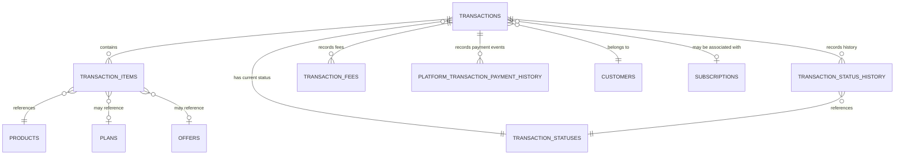

# `Domain_Transactions_Lifecycle.md` 
```markdown
---
title: "Domain: Transactions Lifecycle"
id: "domain_transactions_lifecycle_001"
doc_type: "domain_functional"
doc_version: "1.1"
date_created: "2025-04-23"
date_updated: "2025-04-23"
author: "João Castanheira"
db_name: "joaocastanheira_bancodedados"
db_version: "1.0"
doc_status: "Approved"
environment: "Production"
language: "en"
response_languages: ["pt-BR", "en"]
technical_terms_preservation: "strict"
original_language: "pt-BR"
related_docs: [
  "core_db_architecture_001", 
  "platform_integration_strategy_001", 
  "domain_customers_ecosystem_001", 
  "domain_subscriptions_management_001", 
  "process_flow_purchase_lifecycle_001"
]
tables_in_domain: [
  "transactions", 
  "transaction_items", 
  "transaction_status_history", 
  "transaction_fees", 
  "transaction_statuses", 
  "platform_transaction_payment_history"
]
technical_terms: {
  "table_names": [
    "transactions", "transaction_items", "transaction_status_history", 
    "transaction_fees", "transaction_statuses", 
    "platform_transaction_payment_history", "customers", "subscriptions",
    "offers", "products", "plans", "platform_commission"
  ],
  "column_names": [
    "id", "transaction_id", "customer_id", "payment_gateway", 
    "status_id", "payment_type", "payment_method", "payment_engine", 
    "installments_number", "gateway_transaction_id", "card_brand", 
    "card_last_digits", "billet_url", "billet_barcode", "currency_code", 
    "base_price", "offer_price", "customer_paid_amount", 
    "platform_fee_amount", "distributable_amount", 
    "partner_commission_amount", "producer_net_amount", 
    "is_subscription", "subscription_id", "platform_subscription_id", 
    "recurrence_number", "tracking_source", "tracking_sck", 
    "under_warranty", "warranty_expire_date", "order_date", 
    "created_at", "updated_at", "offer_id", "product_id", 
    "plan_id", "quantity", "unit_price", "status", "change_date",
    "reason", "fee_type", "total_amount", "fee_currency_code", 
    "base_amount", "fixed_amount", "payment_date", "installments", 
    "value", "bank_slip_barcode", "pix_code", "metadata"
  ],
  "data_types": [
    "SERIAL", "VARCHAR", "INTEGER", "BOOLEAN", "NUMERIC", 
    "TIMESTAMP WITH TIME ZONE", "TEXT", "JSONB", "payment_type_enum", 
    "payment_method_enum"
  ],
  "sql_keywords": [
    "CREATE TABLE", "INSERT INTO", "VALUES", "UPDATE", "SET", 
    "WHERE", "SELECT", "FROM", "JOIN", "LEFT JOIN", "GROUP BY", 
    "ORDER BY", "ON", "REFERENCES", "DEFAULT", "CURRENT_TIMESTAMP", 
    "PRIMARY KEY", "UNIQUE", "CONSTRAINT", "ON DELETE CASCADE", 
    "IF NOT EXISTS", "AND", "COUNT", "SUM", "AVG", "MIN", "MAX", 
    "DATE_TRUNC", "INTERVAL", "CASE", "WHEN", "THEN", "ELSE", "END", 
    "WITH", "AS", "HAVING", "LIMIT", "EXTRACT", "EPOCH", "DISTINCT", 
    "ROUND", "CREATE OR REPLACE FUNCTION", "RETURNS TRIGGER", 
    "BEGIN", "END", "RAISE EXCEPTION", "RETURN", "CREATE TRIGGER", 
    "BEFORE INSERT OR UPDATE", "FOR EACH ROW", "EXECUTE FUNCTION"
  ],
  "status_values": [
    "Pendente", "Iniciada", "Processando", "Aguardando Pagamento", 
    "Aprovada", "Recusada", "Cancelada", "Reembolsada", "Em Disputa", 
    "Estornada", "Expirada", "Pending", "Initiated", "Processing", 
    "Awaiting Payment", "Approved", "Rejected", "Canceled", 
    "Refunded", "In Dispute", "Charged Back", "Expired"
  ],
  "payment_methods": [
    "credit_card", "refund", "boleto", "pix"
  ],
  "payment_types": [
    "INSTALLMENT_PAYMENT", "REFUND"
  ]
}
functional_domain: ["Financial", "Sales", "Payment Processing"]
embedding_guide_concepts: [
  "transaction lifecycle", 
  "payment flow", 
  "transaction status", 
  "approved transaction", 
  "rejected transaction", 
  "status history", 
  "refund", 
  "chargeback", 
  "dispute", 
  "distributable amount", 
  "net amount", 
  "transaction itemization", 
  "shopping cart", 
  "order bump", 
  "platform fees", 
  "financial normalization", 
  "multi-platform"
]
---


# Domain: Transactions Lifecycle


## Domain Overview


The Transactions Lifecycle domain constitutes the financial core of the system, responsible for recording, processing, and tracking each sales event throughout its journey - from payment initiation to final completion (approval, rejection, refund, or dispute). This domain unifies transactional data from multiple platforms into a standardized model, allowing consistent analysis and complete traceability regardless of the data origin.


A transaction represents a specific sales event, which can be a single purchase or a recurring subscription charge. Each transaction captures critical information:


- **Buyer data**: Who made the purchase
- **Items purchased**: What was bought (products, plans, offers)
- **Payment method**: How it was paid (credit card, bank slip, PIX)
- **Financial values**: How much was paid, fees, commissions, and net amounts
- **Current state**: Transaction status (approved, rejected, refunded)
- **State history**: All status changes over time


The domain implements a multi-table approach to manage the complete lifecycle of transactions, supporting complex scenarios such as multiple purchases (cart), order bumps, various fees, and detailed history.


(Ref: Transactions Lifecycle, ID domain_transactions_lifecycle_001)


## Data Model Structure


### Relationship Diagram





### Main Table: `transactions`


```sql
CREATE TABLE IF NOT EXISTS transactions (
    id                        SERIAL PRIMARY KEY,
    transaction_id            VARCHAR(100) NOT NULL,               -- ID in the platform
    customer_id               INTEGER REFERENCES customers,        -- Associated customer
    payment_gateway           VARCHAR(100) NOT NULL,               -- Payment gateway
    status_id                 INTEGER REFERENCES transaction_statuses, -- Current status
    payment_type              payment_type_enum,                   -- Payment type
    payment_method            payment_method_enum,                 -- Payment method
    payment_engine            VARCHAR(100),                        -- Payment engine
    installments_number       INTEGER,                             -- Number of installments
    gateway_transaction_id    VARCHAR(100),                        -- Gateway ID
    card_brand                VARCHAR(50),                         -- Card brand
    card_last_digits          VARCHAR(4),                          -- Last digits
    billet_url                TEXT,                                -- Bank slip URL
    billet_barcode            VARCHAR(100),                        -- Barcode
    currency_code             VARCHAR(3) NOT NULL DEFAULT 'BRL',   -- Currency code
    base_price                NUMERIC(15, 4),                      -- Original base price
    offer_price               NUMERIC(15, 4) NOT NULL,             -- Offer price
    customer_paid_amount      NUMERIC(15, 4),                      -- Amount paid by customer
    platform_fee_amount       NUMERIC(15, 4) DEFAULT 0,            -- Platform fees
    distributable_amount      NUMERIC(15, 4),                      -- Distributable amount
    partner_commission_amount NUMERIC(15, 4) DEFAULT 0,            -- Commissions
    producer_net_amount       NUMERIC(15, 4),                      -- Net amount
    is_subscription           BOOLEAN DEFAULT false,               -- Is subscription?
    subscription_id           INTEGER REFERENCES subscriptions,    -- Associated subscription
    platform_subscription_id  VARCHAR(100),                        -- Subscription ID in platform
    recurrence_number         INTEGER,                             -- Recurrence number
    tracking_source           VARCHAR(100),                        -- Traffic source
    tracking_sck              VARCHAR(100),                        -- Tracking SCK
    under_warranty            BOOLEAN DEFAULT false,               -- Under warranty?
    warranty_expire_date      TIMESTAMP WITH TIME ZONE,            -- Warranty expiration
    order_date                TIMESTAMP WITH TIME ZONE,            -- Order date
    created_at                TIMESTAMP WITH TIME ZONE DEFAULT CURRENT_TIMESTAMP,
    updated_at                TIMESTAMP WITH TIME ZONE DEFAULT CURRENT_TIMESTAMP,
    CONSTRAINT uq_transaction_gateway UNIQUE (transaction_id, payment_gateway)
);
```


This table centralizes all critical transaction information, functioning as the entry point for the complete lifecycle of each sale.


### Complementary Tables


#### Table: `transaction_items`


```sql
CREATE TABLE IF NOT EXISTS transaction_items (
    id             SERIAL PRIMARY KEY,
    transaction_id INTEGER NOT NULL REFERENCES transactions ON DELETE CASCADE,
    offer_id       INTEGER REFERENCES offers,              -- Purchased offer
    product_id     INTEGER NOT NULL REFERENCES products,   -- Purchased product
    plan_id        INTEGER REFERENCES plans,               -- Purchased plan
    quantity       INTEGER DEFAULT 1,                      -- Quantity
    unit_price     NUMERIC(15, 4),                         -- Unit price
    created_at     TIMESTAMP WITH TIME ZONE DEFAULT CURRENT_TIMESTAMP,
    updated_at     TIMESTAMP WITH TIME ZONE DEFAULT CURRENT_TIMESTAMP
);
```


Allows detailed recording of multiple items in a single transaction, supporting shopping carts and order bumps.


#### Table: `transaction_statuses`


```sql
CREATE TABLE IF NOT EXISTS transaction_statuses (
    id         SERIAL PRIMARY KEY,
    status     VARCHAR(50) NOT NULL UNIQUE,                -- Status name
    created_at TIMESTAMP WITH TIME ZONE DEFAULT CURRENT_TIMESTAMP,
    updated_at TIMESTAMP WITH TIME ZONE DEFAULT CURRENT_TIMESTAMP
);
```


Central catalog that normalizes status terminology from different platforms into a standardized set.


#### Table: `transaction_status_history`


```sql
CREATE TABLE IF NOT EXISTS transaction_status_history (
    id             SERIAL PRIMARY KEY,
    transaction_id INTEGER NOT NULL REFERENCES transactions ON DELETE CASCADE,
    status_id      INTEGER NOT NULL REFERENCES transaction_statuses,
    change_date    TIMESTAMP WITH TIME ZONE DEFAULT CURRENT_TIMESTAMP,
    reason         TEXT,                                   -- Reason for change
    created_at     TIMESTAMP WITH TIME ZONE DEFAULT CURRENT_TIMESTAMP,
    updated_at     TIMESTAMP WITH TIME ZONE DEFAULT CURRENT_TIMESTAMP
);
```


Records each status change, creating a complete audit trail of the transaction progression.


#### Table: `transaction_fees`


```sql
CREATE TABLE IF NOT EXISTS transaction_fees (
    id                SERIAL PRIMARY KEY,
    transaction_id    INTEGER NOT NULL REFERENCES transactions ON DELETE CASCADE,
    fee_type          VARCHAR(100) NOT NULL,               -- Fee type
    total_amount      NUMERIC(15, 4) NOT NULL,             -- Total amount
    fee_currency_code VARCHAR(3) NOT NULL,                 -- Currency code
    created_at        TIMESTAMP WITH TIME ZONE DEFAULT CURRENT_TIMESTAMP,
    updated_at        TIMESTAMP WITH TIME ZONE DEFAULT CURRENT_TIMESTAMP,
    base_amount       NUMERIC(15, 4),                      -- Base amount (%)
    fixed_amount      NUMERIC(15, 4)                       -- Fixed amount
);
```


Details each fee applied to the transaction, allowing tracking of specific costs.


#### Table: `platform_transaction_payment_history`


```sql
CREATE TABLE IF NOT EXISTS platform_transaction_payment_history (
    id                SERIAL PRIMARY KEY,
    transaction_id    INTEGER NOT NULL REFERENCES transactions ON DELETE CASCADE,
    payment_method    payment_method_enum,                 -- Payment method
    payment_type      payment_type_enum,                   -- Payment type
    installments      INTEGER,                             -- Number of installments
    value             NUMERIC(15, 4),                      -- Paid amount
    payment_date      TIMESTAMP WITH TIME ZONE,            -- Payment date
    card_brand        VARCHAR(50),                         -- Card brand
    card_last_digits  VARCHAR(4),                          -- Last digits
    bank_slip_barcode TEXT,                                -- Bank slip code
    pix_code          TEXT,                                -- PIX code
    metadata          JSONB,                               -- Additional metadata
    created_at        TIMESTAMP WITH TIME ZONE DEFAULT CURRENT_TIMESTAMP,
    updated_at        TIMESTAMP WITH TIME ZONE DEFAULT CURRENT_TIMESTAMP
);
```


Records specific payment events, including attempts, rejections, and confirmations, with additional details.


(Ref: Transactions Lifecycle, ID domain_transactions_lifecycle_001)


## Complete Lifecycle Flow


The lifecycle of a transaction follows a well-defined flow, with potential branches based on the payment method and processing results:


### 1. Initiation Phase


**Status: Pending/Initiated**


When a customer initiates a checkout and selects the desired products/plans:


```sql
-- Initial transaction creation
INSERT INTO transactions (
    transaction_id, 
    customer_id, 
    payment_gateway, 
    status_id,
    offer_price
)
VALUES (
    'TRX-12345',  -- ID provided by the source platform
    (SELECT id FROM customers WHERE email = 'customer@example.com'),
    'platform_name',
    (SELECT id FROM transaction_statuses WHERE status = 'Pending'),
    199.90         -- Offer price
);


-- Itemization record
INSERT INTO transaction_items (...)
VALUES (...);  -- Details of selected items


-- First history record
INSERT INTO transaction_status_history (...)
VALUES (...);  -- Initial "Pending" status
```


In this phase, the transaction structure is created, but the payment has not yet been processed.


### 2. Payment Processing Phase


**Status: Processing/Awaiting Payment**


The customer provides payment details and the system sends them to the gateway:


```sql
-- Update to "Processing" status
UPDATE transactions
SET 
    status_id = (SELECT id FROM transaction_statuses WHERE status = 'Processing'),
    payment_method = 'credit_card',
    payment_type = 'INSTALLMENT_PAYMENT',
    installments_number = 3,
    card_brand = 'Visa',
    card_last_digits = '4242'
WHERE 
    id = [transaction_internal_id];


-- Record processing in history
INSERT INTO transaction_status_history (...)
VALUES (...);  -- "Processing" status


-- Payment attempt details
INSERT INTO platform_transaction_payment_history (...)
VALUES (...);  -- Attempt details
```


For bank slips/PIX, the status would be "Awaiting Payment" with the respective details.


### 3. Payment Result Phase


The transaction follows one of these paths:


#### 3.1. Approval


**Status: Approved**


```sql
-- Update to "Approved"
UPDATE transactions
SET 
    status_id = (SELECT id FROM transaction_statuses WHERE status = 'Approved'),
    customer_paid_amount = 199.90,
    platform_fee_amount = 19.99,       -- 10% platform fee
    distributable_amount = 179.91,     -- offer_price - platform_fee_amount
    partner_commission_amount = 39.98, -- 20% affiliate commission
    producer_net_amount = 139.93       -- distributable_amount - partner_commission_amount
WHERE 
    id = [transaction_internal_id];


-- Record applied fees
INSERT INTO transaction_fees (...)
VALUES (...);  -- Fee details


-- Record approval in history
INSERT INTO transaction_status_history (...)
VALUES (...);  -- "Approved" status with timestamp
```


#### 3.2. Rejection


**Status: Rejected**


```sql
-- Update to "Rejected"
UPDATE transactions
SET 
    status_id = (SELECT id FROM transaction_statuses WHERE status = 'Rejected')
WHERE 
    id = [transaction_internal_id];


-- Record rejection in history
INSERT INTO transaction_status_history (...)
VALUES (...);  -- "Rejected" status with detailed reason


-- Rejection details
INSERT INTO platform_transaction_payment_history (...)
VALUES (...);  -- Includes metadata with error code and reason
```


### 4. Post-Processing Phase


After initial approval, the transaction may still go through:


#### 4.1. Refund/Chargeback


**Status: Refunded/Charged Back**


```sql
-- Update to "Refunded"
UPDATE transactions
SET 
    status_id = (SELECT id FROM transaction_statuses WHERE status = 'Refunded')
WHERE 
    id = [transaction_internal_id];


-- Record refund in history
INSERT INTO transaction_status_history (...)
VALUES (...);  -- "Refunded" status with reason


-- Record refund event
INSERT INTO platform_transaction_payment_history (
    transaction_id,
    payment_method,
    payment_type,
    value,
    payment_date,
    metadata
)
VALUES (
    [transaction_internal_id],
    'refund',
    'REFUND',
    -199.90,  -- Negative value indicates refund
    CURRENT_TIMESTAMP,
    '{"reason":"customer_request", "refund_id":"REF-12345"}'
);
```


#### 4.2. Dispute (Chargeback)


**Status: In Dispute**


```sql
-- Update to "In Dispute"
UPDATE transactions
SET 
    status_id = (SELECT id FROM transaction_statuses WHERE status = 'In Dispute')
WHERE 
    id = [transaction_internal_id];


-- Record dispute in history
INSERT INTO transaction_status_history (...)
VALUES (...);  -- "In Dispute" status with details


-- Meta-information about the dispute
INSERT INTO platform_transaction_payment_history (...)
VALUES (...);  -- Includes metadata with dispute details
```


(Ref: Transactions Lifecycle, ID domain_transactions_lifecycle_001)


## Financial Flow and Calculation Logic


### Financial Components


The `transactions` table implements a hierarchical model of financial values, each derived from the previous one:


```
                      offer_price|v
                platform_fee_amount|v
                distributable_amount|v
             partner_commission_amount|v
                producer_net_amount
```


#### Calculation Hierarchy


1. **`offer_price`**: Base transaction value
   - Represents the agreed value for the purchase
   - Includes all items in the transaction
   - Is the starting point for all subsequent calculations


2. **`platform_fee_amount`**: Platform and gateway fees
   - Deducted from `offer_price`
   - Represent the cost of using the platform/gateway
   - May be composed of different types of fees (detailed in `transaction_fees`)


3. **`distributable_amount`**: Amount available for distribution
   - Calculated as: `offer_price - platform_fee_amount`
   - Represents the value to be divided between producer and partners


4. **`partner_commission_amount`**: Partner commissions
   - Amount for affiliates, co-producers, and other partners
   - Deducted from `distributable_amount`
   - Specific details by partner stored in `platform_commission`


5. **`producer_net_amount`**: Producer's net revenue
   - Calculated as: `distributable_amount - partner_commission_amount`
   - Represents the gross profit of the transaction for the main producer


### Additional Field: `customer_paid_amount`


This field deserves special attention:
- Represents the amount effectively paid by the customer
- May differ from `offer_price` due to:
  - Installment interest charged directly to the customer
  - Additional fees specific to the payment method
  - Currency variations in international payments


### Example Calculations in a Typical Transaction


```
# Scenario: Product sold for R$100.00 with affiliate
offer_price = R$100.00
platform_fee_amount = R$10.00 (10% platform fee)
distributable_amount = R$90.00 (offer_price - platform_fee_amount)
partner_commission_amount = R$45.00 (50% of distributable_amount for the affiliate)
producer_net_amount = R$45.00 (distributable_amount - partner_commission_amount)


# If paid in 3 installments with interest:
customer_paid_amount = R$110.00 (including R$10.00 of installment interest)
```


(Ref: Transactions Lifecycle, ID domain_transactions_lifecycle_001)


## Modeling Multiple Items and Order Bumps


The `transaction_items` table allows a single transaction to contain multiple products or offers, supporting:


### 1. Shopping Carts


A customer can purchase several independent products in a single transaction:


```sql
-- Main transaction (cart header)
INSERT INTO transactions (
    transaction_id, 
    customer_id, 
    payment_gateway, 
    status_id,
    offer_price
)
VALUES (
    'CART-54321',
    123,
    'platform_name',
    (SELECT id FROM transaction_statuses WHERE status = 'Pending'),
    349.80  -- Sum of all items (199.90 + 149.90)
);


-- Cart item 1
INSERT INTO transaction_items (
    transaction_id,
    product_id,
    offer_id,
    quantity,
    unit_price
)
VALUES (
    (SELECT id FROM transactions WHERE transaction_id = 'CART-54321'),
    101,  -- Product A ID
    201,  -- Offer ID for Product A
    1,    -- Quantity
    199.90 -- Unit price
);


-- Cart item 2
INSERT INTO transaction_items (
    transaction_id,
    product_id,
    offer_id,
    quantity,
    unit_price
)
VALUES (
    (SELECT id FROM transactions WHERE transaction_id = 'CART-54321'),
    102,  -- Product B ID
    202,  -- Offer ID for Product B
    1,    -- Quantity
    149.90 -- Unit price
);
```


### 2. Order Bumps


Complementary products offered during checkout and added to the main purchase:


```sql
-- Main transaction (main product + order bump)
INSERT INTO transactions (
    transaction_id, 
    customer_id, 
    payment_gateway, 
    status_id,
    offer_price
)
VALUES (
    'ORDER-12345',
    123,
    'platform_name',
    (SELECT id FROM transaction_statuses WHERE status = 'Pending'),
    219.90  -- Main product (199.90) + Order Bump (20.00)
);


-- Main product
INSERT INTO transaction_items (
    transaction_id,
    product_id,
    offer_id,
    quantity,
    unit_price
)
VALUES (
    (SELECT id FROM transactions WHERE transaction_id = 'ORDER-12345'),
    101,  -- Main Product ID
    201,  -- Offer ID
    1,    -- Quantity
    199.90 -- Unit price
);


-- Order Bump
INSERT INTO transaction_items (
    transaction_id,
    product_id,
    offer_id,
    quantity,
    unit_price
)
VALUES (
    (SELECT id FROM transactions WHERE transaction_id = 'ORDER-12345'),
    103,  -- Order Bump Product ID
    203,  -- Order Bump Offer ID
    1,    -- Quantity
    20.00 -- Unit price (usually lower)
);
```


### 3. Products with Multiple Units


Purchase of multiple units of the same product:


```sql
INSERT INTO transaction_items (
    transaction_id,
    product_id,
    offer_id,
    quantity,
    unit_price
)
VALUES (
    (SELECT id FROM transactions WHERE transaction_id = 'MULT-67890'),
    104,  -- Product ID
    204,  -- Offer ID
    3,    -- Quantity: 3 units
    49.90 -- Unit price (total price would be 149.70)
);
```


This modeling offers flexibility to represent various sales scenarios while maintaining a clear view of the individual items that make up each transaction.


(Ref: Transactions Lifecycle, ID domain_transactions_lifecycle_001)


## Status Normalization and Mapping


### Central Table: `transaction_statuses`


The `transaction_statuses` table acts as the centralized repository of normalized statuses:


```sql
-- Example of populating the normalized status table
INSERT INTO transaction_statuses (status) VALUES
('Pending'),
('Initiated'),
('Processing'),
('Awaiting Payment'),
('Approved'),
('Rejected'),
('Canceled'),
('Refunded'),
('In Dispute'),
('Charged Back'),
('Expired');
```


### Status Mapping Between Platforms


Different platforms use distinct terminologies for the same transactional states. The system implements a consistent mapping:


| Normalized Status | Description | Typical Use |
|:-----------------|:-----------|:------------|
| **Pending** | Initial state when the transaction is created | Initial transaction creation |
| **Awaiting Payment** | Waiting for external payment confirmation | Bank slip generated, pending PIX |
| **Processing** | Gateway is processing the payment | Payment in processing |
| **Approved** | Payment confirmed and transaction successfully completed | Payment confirmed |
| **Rejected** | Payment not authorized or rejected | Payment rejected |
| **Canceled** | Transaction canceled before completion | Canceled before completion |
| **Refunded** | Amount returned to the customer after approval | Amount returned to customer |
| **In Dispute** | Customer opened a dispute about the transaction | Customer dispute |
| **Charged Back** | Amount forcibly charged back | Forced chargeback by bank |
| **Expired** | Payment or confirmation deadline has expired | Payment deadline expired |


This uniform mapping allows:


1. **Standardized Queries**: Filter transactions by status consistently, regardless of platform
2. **Comparative Analysis**: Compare approval/refund rates between platforms using the same terminology
3. **Simplified Business Logic**: Implement rules based on status without having to consider each platform-specific variation


### Mapping Implementation


```python
# Pseudocode for status mapping
def map_platform_status_to_normalized(platform, original_status):
    # Mapping for each platform according to specific documentation
    mapping = {
        'platform_a': {
            'status_code_1': 'Approved',
            'status_code_2': 'Refunded',
            'status_code_3': 'Canceled',
            'status_code_4': 'Awaiting Payment',
            # ... other mappings
        },
        'platform_b': {
            'status_name_1': 'Approved',
            'status_name_2': 'Refunded',
            'status_name_3': 'Canceled',
            'status_name_4': 'Awaiting Payment',
            # ... other mappings
        },
        # ... other platform mappings
    }
    
    # Get normalized status or use default value
    normalized_status = mapping.get(platform, {}).get(original_status, 'Pending')
    
    # Get corresponding ID of normalized status
    status_id = db.query(
        "SELECT id FROM transaction_statuses WHERE status = %s",
        [normalized_status]
    ).scalar()
    
    return status_id
```


(Ref: Transactions Lifecycle, ID domain_transactions_lifecycle_001)


## Financial and Operational Analytics


The Transactions domain allows detailed analysis of financial and operational performance:


### 1. Revenue Analysis


```sql
-- Gross revenue by period and platform
SELECT 
    DATE_TRUNC('month', t.order_date) AS month,
    t.payment_gateway,
    SUM(t.offer_price) AS gross_revenue,
    SUM(t.platform_fee_amount) AS platform_fees,
    SUM(t.distributable_amount) AS distributable_amount,
    SUM(t.producer_net_amount) AS net_revenue,
    COUNT(*) AS transaction_count
FROM 
    transactions t
JOIN 
    transaction_statuses ts ON t.status_id = ts.id
WHERE 
    ts.status = 'Approved'
    AND t.order_date BETWEEN '2023-01-01' AND '2023-12-31'
GROUP BY 
    month, t.payment_gateway
ORDER BY 
    month, t.payment_gateway;
```


### 2. Payment Performance Analysis


```sql
-- Conversion rate by payment method
WITH payment_attempts AS (
    SELECT 
        t.payment_method,
        COUNT(*) AS total_attempts,
        SUM(CASE WHEN ts.status = 'Approved' THEN 1 ELSE 0 END) AS successful_attempts
    FROM 
        transactions t
    JOIN 
        transaction_statuses ts ON t.status_id = ts.id
    WHERE 
        t.order_date >= CURRENT_DATE - INTERVAL '90 days'
        AND t.payment_method IS NOT NULL
    GROUP BY 
        t.payment_method
)
SELECT 
    payment_method,
    total_attempts,
    successful_attempts,
    ROUND((successful_attempts * 100.0 / total_attempts), 2) AS approval_rate
FROM 
    payment_attempts
ORDER BY 
    approval_rate DESC;
```


### 3. Average Order Value Analysis


```sql
-- Average order value by product
SELECT 
    p.name AS product_name,
    COUNT(t.id) AS transaction_count,
    AVG(ti.unit_price) AS average_unit_price,
    AVG(t.offer_price) AS average_transaction_value
FROM 
    transactions t
JOIN 
    transaction_items ti ON t.id = ti.transaction_id
JOIN 
    products p ON ti.product_id = p.id
JOIN 
    transaction_statuses ts ON t.status_id = ts.id
WHERE 
    ts.status = 'Approved'
    AND t.order_date >= CURRENT_DATE - INTERVAL '180 days'
GROUP BY 
    p.name
HAVING 
    COUNT(t.id) >= 10  -- Only products with significant volume
ORDER BY 
    average_transaction_value DESC;
```


### 4. Status Journey Analysis


```sql
-- Average time between main states
WITH status_transitions AS (
    SELECT 
        t.id AS transaction_id,
        ts_init.status AS initial_status,
        ts_final.status AS final_status,
        MIN(tsh_init.change_date) AS initial_date,
        MIN(tsh_final.change_date) AS final_date
    FROM 
        transactions t
    JOIN 
        transaction_status_history tsh_init ON t.id = tsh_init.transaction_id
    JOIN 
        transaction_statuses ts_init ON tsh_init.status_id = ts_init.id
    JOIN 
        transaction_status_history tsh_final ON t.id = tsh_final.transaction_id
    JOIN 
        transaction_statuses ts_final ON tsh_final.status_id = ts_final.id
    WHERE 
        ts_init.status = 'Initiated'
        AND ts_final.status = 'Approved'
        AND tsh_final.change_date > tsh_init.change_date
    GROUP BY 
        t.id, ts_init.status, ts_final.status
)
SELECT 
    initial_status,
    final_status,
    COUNT(*) AS transition_count,
    AVG(EXTRACT(EPOCH FROM (final_date - initial_date)) / 60) AS avg_minutes_to_transition
FROM 
    status_transitions
GROUP BY 
    initial_status, final_status
ORDER BY 
    avg_minutes_to_transition DESC;
```


(Ref: Transactions Lifecycle, ID domain_transactions_lifecycle_001)


## Recurring Transactions (Subscriptions)


Transactions associated with subscriptions have specific characteristics:


### 1. Recurring Transaction Identification


```sql
-- Specific fields for subscription transactions
SELECT 
    t.transaction_id,
    t.is_subscription,           -- Flag indicating recurring transaction
    t.subscription_id,           -- Internal ID of related subscription
    t.platform_subscription_id,  -- Subscription ID in the platform
    t.recurrence_number,         -- Recurrence number (1st, 2nd, etc.)
    s.subscription_id AS original_subscription_id
FROM 
    transactions t
LEFT JOIN 
    subscriptions s ON t.subscription_id = s.id
WHERE 
    t.is_subscription = TRUE;
```


### 2. Distinguishing Initial and Recurring Transactions


```sql
-- Query to find the initial transaction of a subscription
SELECT 
    t.transaction_id,
    t.order_date,
    t.offer_price
FROM 
    transactions t
JOIN 
    subscriptions s ON s.id = t.subscription_id
WHERE 
    t.recurrence_number = 1
    OR (t.recurrence_number IS NULL AND t.is_subscription = TRUE)
ORDER BY 
    t.order_date ASC
LIMIT 1;


-- Query to list all recurring charges of a subscription
SELECT 
    t.transaction_id,
    t.recurrence_number,
    t.order_date,
    t.offer_price,
    ts.status
FROM 
    transactions t
JOIN 
    transaction_statuses ts ON t.status_id = ts.id
WHERE 
    t.subscription_id = [subscription_internal_id]
    AND t.recurrence_number > 1
ORDER BY 
    t.recurrence_number ASC;
```


### 3. Recurring Revenue Analysis


```sql
-- MRR (Monthly Recurring Revenue) by month
SELECT 
    DATE_TRUNC('month', t.order_date) AS month,
    COUNT(DISTINCT t.subscription_id) AS active_subscriptions,
    SUM(t.offer_price) AS mrr
FROM 
    transactions t
JOIN 
    transaction_statuses ts ON t.status_id = ts.id
WHERE 
    t.is_subscription = TRUE
    AND ts.status = 'Approved'
    AND t.order_date BETWEEN '2023-01-01' AND '2023-12-31'
GROUP BY 
    month
ORDER BY 
    month;
```


(Ref: Transactions Lifecycle, ID domain_transactions_lifecycle_001)


## Challenges and Best Practices


### 1. Refund Handling


Refunds present specific challenges for financial integrity:


**Recommendation**: Keep the original transaction and its values intact, recording the refund as a status change and a negative payment event:


```sql
-- Recording refund as status change
UPDATE transactions
SET status_id = (SELECT id FROM transaction_statuses WHERE status = 'Refunded')
WHERE id = [transaction_id];


-- Recording the refund in status history
INSERT INTO transaction_status_history (
    transaction_id, 
    status_id, 
    reason
)
VALUES (
    [transaction_id],
    (SELECT id FROM transaction_statuses WHERE status = 'Refunded'),
    'Requested by customer due to dissatisfaction with the product'
);


-- Recording the refund event
INSERT INTO platform_transaction_payment_history (
    transaction_id,
    payment_method,
    value,
    payment_date,
    metadata
)
VALUES (
    [transaction_id],
    'refund',
    -[original_amount],  -- Negative value indicating refund
    CURRENT_TIMESTAMP,
    '{"refund_id":"REF-123", "reason":"customer_request", "is_partial":false}'
);
```


### 2. Platform Reconciliation


Ensuring that system data is synchronized with the original platforms:


**Recommendation**: Implement periodic reconciliation processes:


```python
# Pseudocode for reconciliation
def reconcile_transactions(platform, date_range):
    # 1. Get platform transactions for the period
    platform_transactions = api.get_transactions(platform, date_range)
    
    # 2. For each platform transaction
    for plat_transaction in platform_transactions:
        # Check if it exists in the system
        local_transaction = db.query(
            "SELECT * FROM transactions WHERE transaction_id = %s AND payment_gateway = %s",
            [plat_transaction.id, platform]
        ).first()
        
        if not local_transaction:
            # 3a. Create if it doesn't exist
            create_transaction_from_platform_data(plat_transaction)
        else:
            # 3b. Check for discrepancies if it exists
            if local_transaction.status_id != map_status(plat_transaction.status):
                # Update status and add to history
                update_transaction_status(
                    local_transaction.id, 
                    map_status(plat_transaction.status),
                    "Updated via reconciliation"
                )
            
            # Check financial values
            if abs(local_transaction.offer_price - plat_transaction.amount) > 0.01:
                log.warning(f"Value discrepancy: {local_transaction.id}")
                # Business decision: update or just alert
```


### 3. Financial Consistency


Ensure that financial fields are consistent with each other:


**Recommendation**: Implement automatic validations:


```sql
-- Trigger to validate financial consistency
CREATE OR REPLACE FUNCTION validate_transaction_amounts()
RETURNS TRIGGER AS $$
BEGIN
    -- Check if distributable_amount = offer_price - platform_fee_amount
    IF ABS(NEW.distributable_amount - (NEW.offer_price - NEW.platform_fee_amount)) > 0.01 THEN
        RAISE EXCEPTION 'Value inconsistency: distributable_amount must be offer_price - platform_fee_amount';
    END IF;
    
    -- Check if producer_net_amount = distributable_amount - partner_commission_amount
    IF ABS(NEW.producer_net_amount - (NEW.distributable_amount - NEW.partner_commission_amount)) > 0.01 THEN
        RAISE EXCEPTION 'Value inconsistency: producer_net_amount must be distributable_amount - partner_commission_amount';
    END IF;
    
    RETURN NEW;
END;
$$ LANGUAGE plpgsql;


CREATE TRIGGER check_transaction_amounts
BEFORE INSERT OR UPDATE ON transactions
FOR EACH ROW
EXECUTE FUNCTION validate_transaction_amounts();
```


(Ref: Transactions Lifecycle, ID domain_transactions_lifecycle_001)


## Conclusion


The Transactions Lifecycle Domain represents the financial core of the system, offering:


1. **Unified view** of sales across various platforms through a consistent data model
2. **Complete traceability** of the lifecycle of each transaction, from creation to final state
3. **Flexibility** to represent complex scenarios such as shopping carts, order bumps, and recurrences
4. **Normalization** of status terminologies to allow consistent analysis
5. **Financial detailing** that captures gross amounts, fees, commissions, and net values


The modular architecture with specific tables for each aspect of the transaction (items, fees, status history, payment details) allows a complete and detailed record, facilitating precise analysis and providing a solid foundation for integrations with financial and accounting systems.


This robust data structure supports not only day-to-day sales processing operations but also provides the necessary information for strategic decision-making based on reliable and traceable financial data.


(Ref: Transactions Lifecycle, ID domain_transactions_lifecycle_001)
```