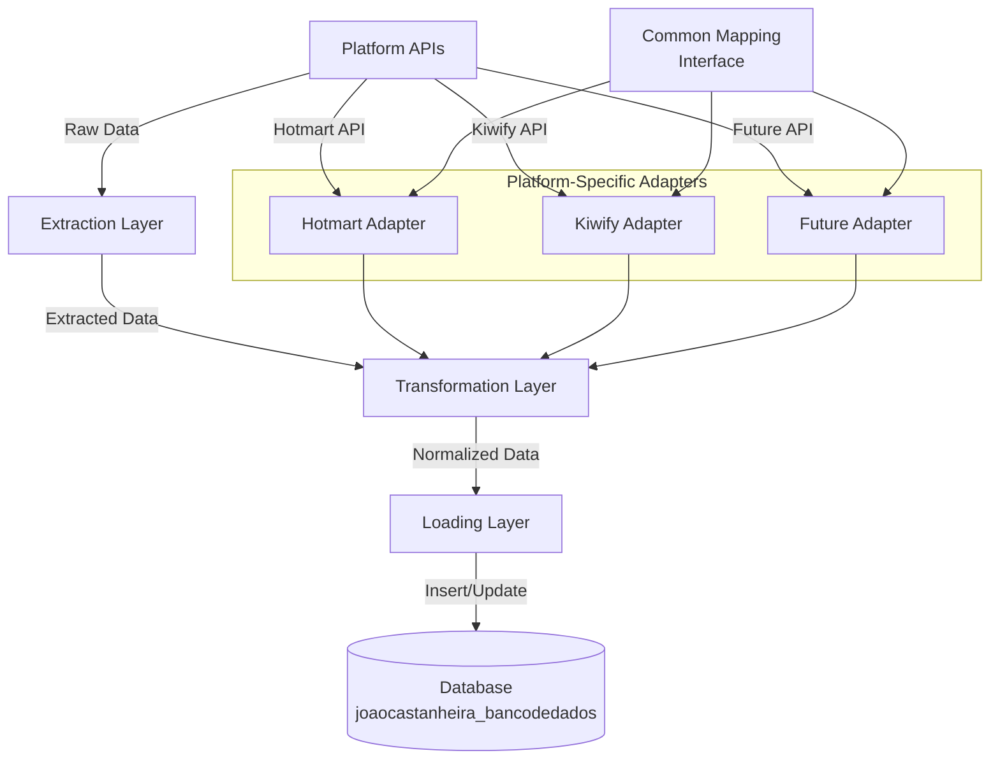
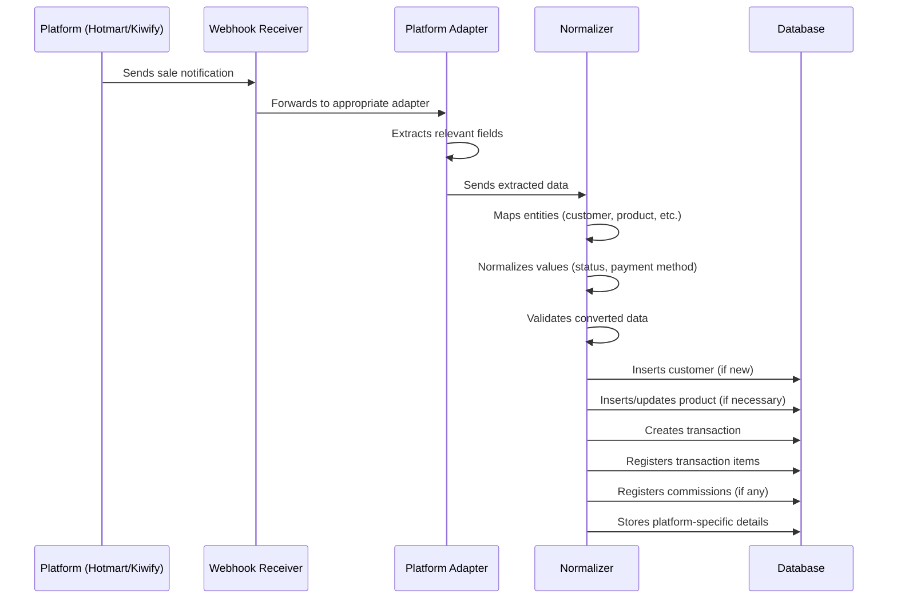
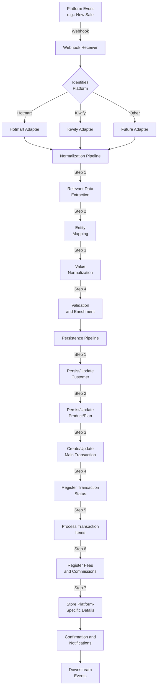

# `Platform_Integration_Strategy.md` 


```markdown
---
title: "Multi-platform Integration Strategy"
id: "platform_integration_strategy_001"
doc_type: "technical_strategy"
doc_version: "1.2"
date_created: "2025-04-23"
date_updated: "2025-04-23"
author: "João Castanheira"
db_name: "joaocastanheira_bancodedados"
db_version: "1.0"
doc_status: "Approved"
environment: "Production"
language: "en"
response_languages: ["pt-BR", "en"]
technical_terms_preservation: "strict"
original_language: "pt-BR"
related_docs: [
  "core_db_arch_001", 
  "core_db_design_001", 
  "process_flow_purchase_lifecycle_001",
  "process_flow_subscription_lifecycle_001",
  "domain_platform_integration_details_001",
  "domain_transactions_lifecycle_001",
  "ref_db_schema_details_001",
  "ref_api_mapping_guide_001"
]
tables_in_focus: [
  "transaction_statuses",
  "products",
  "plans",
  "transactions",
  "subscriptions",
  "commission_participants",
  "platform_transaction_payment_history"
]
technical_terms: {
  "integration_concepts": [
    "webhook", "API", "REST", "GraphQL", "OAuth", "middleware", 
    "event bus", "data mapping", "normalization", "transformation", 
    "extraction", "loading", "ETL", "idempotency", "rate limiting", 
    "circuit breaker", "adapter pattern", "pipeline", "reconciliation"
  ],
  "database_concepts": [
    "transactions", "transaction_statuses", "products", "plans", 
    "subscriptions", "commission_participants", "platform_transaction_payment_history",
    "status_id", "transaction_id", "payment_gateway", "metadata", 
    "platform_identifier", "canonical data model"
  ],
  "protocols_formats": [
    "HTTP", "JSON", "JWT", "XML", "URL"
  ],
  "security_concepts": [
    "HMAC", "TLS", "encryption", "signature validation", "authentication"
  ],
  "process_patterns": [
    "event-driven", "batch processing", "ETL", "polling", "asynchronous processing", 
    "retry mechanism", "exponential backoff", "idempotent operations"
  ],
  "platform_specific": [
    "Hotmart", "Kiwify", "checkout", "purchase", "subscription", "APPROVED", 
    "DECLINED", "REFUNDED", "CANCELED", "PENDING", "EXPIRED", "CHARGEBACK", 
    "ABANDONED", "paid", "declined", "refunded", "canceled", "pending", 
    "expired", "dispute", "abandoned", "CREDIT_CARD", "BANK_SLIP", "PIX", 
    "PAYPAL", "BANK_TRANSFER", "DIGITAL_WALLET", "credit_card", "boleto", 
    "pix", "paypal", "bank_transfer", "digital_wallet"
  ],
  "status_mappings": [
    "Aprovada", "Recusada", "Reembolsada", "Cancelada", "Aguardando", 
    "Expirada", "Disputa", "Abandonada"
  ],
  "database_types": [
    "payment_method_enum", "VARCHAR", "INTEGER", "NUMERIC", "TIMESTAMP", 
    "BOOLEAN", "JSON", "JSONB"
  ],
  "sql_keywords": [
    "INSERT", "INTO", "VALUES", "ON CONFLICT", "DO UPDATE", "SET", 
    "COALESCE", "CURRENT_TIMESTAMP", "CREATE OR REPLACE FUNCTION", 
    "RETURNS", "DECLARE", "BEGIN", "END", "LANGUAGE plpgsql", 
    "CASE", "WHEN", "THEN", "ELSE", "END", "SELECT", "FROM", "WHERE", 
    "INTO", "LOWER"
  ]
}
embedding_guide_concepts: [
  "platform integration",
  "data normalization",
  "API mapping",
  "data extraction",
  "data transformation",
  "data loading",
  "ETL",
  "platform adapters",
  "vocabulary unification",
  "cross-platform identification",
  "data pipeline",
  "webhooks",
  "data reconciliation",
  "data enrichment",
  "platform independence",
  "integration architecture",
  "status mapping",
  "entity mapping",
  "migration strategy"
]
---


# Multi-platform Integration Strategy


## Overview


This document details the integration strategy that allows the `joaocastanheira_bancodedados` database to unify data from multiple sales platforms (such as Hotmart, Kiwify, and future integrations) into a consistent, common data model. This approach is fundamental to the platform-agnostic architecture described in **[Unified Database Architecture](core_db_arch_001.md)**.


The strategy addresses critical integration challenges:
- **Terminology Disparity**: Different nomenclatures for the same concepts
- **Distinct Data Structures**: Incompatible data models between platforms
- **Varied Functionality**: Different capabilities and limitations of each platform
- **Information Granularity**: Varying levels of detail provided by APIs


The result is a system that allows consistent analysis and operations regardless of the data's source platform, while preserving specific details when necessary.


(Ref: Multi-platform Integration, ID platform_integration_strategy_001)


## Integration Architecture


### Architectural Overview


The integration solution employs a layered architecture that clearly separates responsibilities:





This design highlights the central role of platform-specific adapters, all implementing a common mapping interface, which ensures consistency in data transformation.


### Main Components


#### 1. Extraction Layer


- **Webhook Receivers**: Endpoints that receive automatic notifications from platforms
- **Scheduled Polling**: For data that doesn't trigger webhooks or for reconciliation
- **API Connectors**: Specific components for authentication and communication with each API


#### 2. Platform-Specific Adapters


- **Hotmart Adapter**: Converts Hotmart structure and terminology to the unified model
- **Kiwify Adapter**: Converts Kiwify structure and terminology to the unified model
- **Future Adapters**: Follow the same pattern for new platforms


#### 3. Transformation Layer


- **Entity Mapping**: Identifies correspondences between external and internal entities
- **Vocabulary Normalization**: Converts specific terminologies to the unified standard
- **Data Enrichment**: Adds derived or contextual information when necessary


#### 4. Loading Layer


- **Data Validation**: Ensures normalized data meets business rules
- **Transaction Control**: Ensures atomic operations to maintain integrity
- **Concurrency Management**: Handles simultaneous or out-of-order updates


This layered architecture provides:
- **Extensibility**: New adapters can be added without altering the core system
- **Simplified Maintenance**: Changes in an API only affect its corresponding adapter
- **Testability**: Each component can be tested in isolation


For a detailed view of the database structure that receives this normalized data, see **[Unified Database Architecture](core_db_arch_001.md#high-level-er-diagram)**.


(Ref: Multi-platform Integration, ID platform_integration_strategy_001)


## Normalization Process


### Process Steps


The normalization process converts heterogeneous API data into a unified format through well-defined steps:


1. **Event Identification**
   - Determine the event type (sale, refund, subscription, etc.)
   - Classify into standard category (regardless of original nomenclature)


2. **Relevant Data Extraction**
   - Select necessary fields from API payload
   - Determine required vs. optional fields for the event type


3. **Entity Mapping**
   - Map platform entities to unified model entities
   - Preserve original identifiers along with internal IDs


4. **Value Normalization**
   - Convert statuses, payment methods, and other enumerated values
   - Standardize date formats, monetary values, and other data types


5. **Validation and Enrichment**
   - Validate converted data against business rules
   - Add derived or calculated data when necessary


### Flow Example: New Sale Processing





This diagram illustrates how processing a new sale goes through all the steps, from webhook reception to normalized data insertion into the database.


(Ref: Multi-platform Integration, ID platform_integration_strategy_001)


## Vocabulary Mapping


### Transaction Status Mapping


One of the key elements of normalization is vocabulary mapping, especially for transaction and subscription statuses. The table below demonstrates how different terminologies are converted to a standardized set:


| Normalized Status | Hotmart             | Kiwify             | Other Platforms    |
|-------------------|---------------------|--------------------|--------------------|
| Aprovada          | "APPROVED"          | "paid"             | Mapped as needed   |
| Recusada          | "DECLINED"          | "declined"         | ...                |
| Reembolsada       | "REFUNDED"          | "refunded"         | ...                |
| Cancelada         | "CANCELED"          | "canceled"         | ...                |
| Aguardando        | "PENDING"           | "pending"          | ...                |
| Expirada          | "EXPIRED"           | "expired"          | ...                |
| Disputa           | "CHARGEBACK"        | "dispute"          | ...                |
| Abandonada        | "ABANDONED"         | "abandoned"        | ...                |


This mapping is implemented in the database using the `transaction_statuses` table:


```sql
-- Example data in the transaction_statuses table
INSERT INTO transaction_statuses (status) VALUES 
('Aprovada'), ('Recusada'), ('Reembolsada'), ('Cancelada'),
('Aguardando'), ('Expirada'), ('Disputa'), ('Abandonada');


-- Function that gets the normalized status ID
CREATE OR REPLACE FUNCTION get_normalized_status_id(
    platform_name VARCHAR,
    original_status VARCHAR
) RETURNS INTEGER AS $$
DECLARE
    normalized_status VARCHAR;
    status_id INTEGER;
BEGIN
    -- Status mapping by platform
    IF platform_name = 'Hotmart' THEN
        CASE original_status
            WHEN 'APPROVED' THEN normalized_status := 'Aprovada'
            WHEN 'DECLINED' THEN normalized_status := 'Recusada'
            WHEN 'REFUNDED' THEN normalized_status := 'Reembolsada'
            -- other mappings
        END;
    ELSIF platform_name = 'Kiwify' THEN
        CASE original_status
            WHEN 'paid' THEN normalized_status := 'Aprovada'
            WHEN 'declined' THEN normalized_status := 'Recusada'
            WHEN 'refunded' THEN normalized_status := 'Reembolsada'
            -- other mappings
        END;
    ELSE
        -- Mapping for other platforms
    END IF;
    
    -- Get the normalized status ID
    SELECT id INTO status_id FROM transaction_statuses 
    WHERE status = normalized_status;
    
    RETURN status_id;
END;
$$ LANGUAGE plpgsql;
```


### Payment Method Mapping


Similar to status mapping, payment methods are also normalized:


| Normalized Method  | Hotmart                | Kiwify               | Other Platforms    |
|---------------------|------------------------|----------------------|--------------------|
| credit_card         | "CREDIT_CARD"          | "credit_card"        | ...                |
| boleto              | "BANK_SLIP"            | "boleto"             | ...                |
| pix                 | "PIX"                  | "pix"                | ...                |
| paypal              | "PAYPAL"               | "paypal"             | ...                |
| bank_transfer       | "BANK_TRANSFER"        | "bank_transfer"      | ...                |
| digital_wallet      | "DIGITAL_WALLET"       | "digital_wallet"     | ...                |


To implement this mapping, we use the `payment_method_enum` ENUM type defined in the database:


```sql
-- Function that converts original payment method to standardized ENUM
CREATE OR REPLACE FUNCTION normalize_payment_method(
    platform_name VARCHAR,
    original_method VARCHAR
) RETURNS payment_method_enum AS $$
DECLARE
    normalized_method payment_method_enum;
BEGIN
    -- Mapping by platform
    IF platform_name = 'Hotmart' THEN
        CASE original_method
            WHEN 'CREDIT_CARD' THEN normalized_method := 'credit_card'::payment_method_enum
            WHEN 'BANK_SLIP' THEN normalized_method := 'boleto'::payment_method_enum
            WHEN 'PIX' THEN normalized_method := 'pix'::payment_method_enum
            -- other mappings
        END;
    ELSIF platform_name = 'Kiwify' THEN
        CASE original_method
            WHEN 'credit_card' THEN normalized_method := 'credit_card'::payment_method_enum
            WHEN 'boleto' THEN normalized_method := 'boleto'::payment_method_enum
            WHEN 'pix' THEN normalized_method := 'pix'::payment_method_enum
            -- other mappings
        END;
    ELSE
        -- Mapping for other platforms
    END IF;
    
    RETURN normalized_method;
END;
$$ LANGUAGE plpgsql;
```


These mappings ensure that, regardless of the source platform, queries and analyses can be performed in a unified way using consistent terminology.


For a complete reference of all mappings between platforms, see the document **[API Mapping Guide](ref_api_mapping_guide_001.md)**.


(Ref: Multi-platform Integration, ID platform_integration_strategy_001)


## Entity Identification and Reconciliation


### Identification Strategy


To unify data from different platforms, we need an effective strategy to identify and reconcile the same entities across systems:


#### 1. Customers


**Primary identifier**: Email address (normalized to lowercase)


**Implementation**:
```sql
-- Example of customer reconciliation by email
INSERT INTO customers (email, name, customer_id, document_type)
VALUES (LOWER('customer@example.com'), 'Customer Name', '12345', 'CPF')
ON CONFLICT (email) 
DO UPDATE SET 
    name = COALESCE(EXCLUDED.name, customers.name),
    customer_id = COALESCE(EXCLUDED.customer_id, customers.customer_id),
    document_type = COALESCE(EXCLUDED.document_type, customers.document_type),
    updated_at = CURRENT_TIMESTAMP;
```


#### 2. Products and Plans


**Compound identifier**: `product_id` + `platform_origin` / `plan_id` + `platform_origin`


**Implementation**:
```sql
-- Example of product reconciliation
INSERT INTO products (product_id, platform_origin, name, description)
VALUES ('PROD123', 'Hotmart', 'Marketing Course', 'Course description')
ON CONFLICT (product_id, platform_origin) 
DO UPDATE SET 
    name = COALESCE(EXCLUDED.name, products.name),
    description = COALESCE(EXCLUDED.description, products.description),
    updated_at = CURRENT_TIMESTAMP;
```


#### 3. Transactions


**Compound identifier**: `transaction_id` + `payment_gateway`


**Implementation**:
```sql
-- Example of transaction reconciliation
INSERT INTO transactions (transaction_id, payment_gateway, /* other fields */)
VALUES ('TRX789', 'Hotmart', /* other values */)
ON CONFLICT (transaction_id, payment_gateway) 
DO UPDATE SET 
    status_id = EXCLUDED.status_id,
    customer_paid_amount = EXCLUDED.customer_paid_amount,
    -- Other fields that can be updated
    updated_at = CURRENT_TIMESTAMP;
```


### Conflict Resolution


When conflicting information is received, we apply the following rules:


1. **Identification Data**: The most complete or recent information prevails
2. **Status**: Always updated to reflect the most recent state
3. **Monetary Values**: Updated only in case of official correction or adjustment
4. **Historical Data**: Never replaced, only complemented


For significant changes, we record the history of changes in dedicated tables, such as `transaction_status_history` and `customer_logs`.


(Ref: Multi-platform Integration, ID platform_integration_strategy_001)


## Platform-specific Implementation


### Hotmart


#### Data Sources
- Webhooks (`purchases`, `subscriptions`, `commissions`)
- REST API for reconciliation and data enrichment


#### Specific Challenges
- Complex response structure with many nested levels
- Different formats for subscriptions and one-time purchases
- Commission data separated from the main transaction


#### Transformation Example


**Input data (simplified fragment)**:
```json
{
  "data": {
    "purchase": {
      "approved_date": "2023-01-15T10:30:45Z",
      "status": "APPROVED",
      "transaction": "HOT12345",
      "price": {
        "value": 297.00
      },
      "payment": {
        "method": "CREDIT_CARD",
        "installments_number": 3
      },
      "commissions": [
        {
          "value": 148.50,
          "user": {
            "ucode": "PR12345",
            "name": "Example Producer"
          }
        }
      ]
    },
    "buyer": {
      "email": "buyer@example.com",
      "name": "Buyer Name"
    },
    "product": {
      "id": "123456",
      "name": "Example Course"
    }
  }
}
```


**Transformation process**:
1. Extract customer data from `data.buyer`
2. Extract product data from `data.product`
3. Extract transaction data from `data.purchase`
4. Normalize status "APPROVED" to "Aprovada"
5. Normalize payment method "CREDIT_CARD" to "credit_card"
6. Process commissions from `data.purchase.commissions`


**Adapter code example**:
```python
def transform_hotmart_purchase(webhook_data):
    data = webhook_data.get('data', {})
    purchase = data.get('purchase', {})
    buyer = data.get('buyer', {})
    product_data = data.get('product', {})
    
    # Normalize customer
    customer = {
        'email': buyer.get('email', '').lower(),
        'name': buyer.get('name'),
        'customer_id': buyer.get('code'),
        'platform_origin': 'Hotmart'
    }
    
    # Normalize product
    product = {
        'product_id': product_data.get('id'),
        'name': product_data.get('name'),
        'platform_origin': 'Hotmart'
    }
    
    # Normalize transaction
    transaction = {
        'transaction_id': purchase.get('transaction'),
        'payment_gateway': 'Hotmart',
        'order_date': purchase.get('approved_date'),
        'status': normalize_status('Hotmart', purchase.get('status')),
        'payment_method': normalize_payment_method('Hotmart', 
                           purchase.get('payment', {}).get('method')),
        'installments_number': purchase.get('payment', {}).get('installments_number', 1),
        'offer_price': purchase.get('price', {}).get('value', 0),
        # Other normalized fields
    }
    
    # Normalize commissions
    commissions = []
    for comm in purchase.get('commissions', []):
        commission = {
            'participant_id': comm.get('user', {}).get('ucode'),
            'amount': comm.get('value'),
            'currency_code': 'BRL',  # Normalized to standard currency
            'source': 'PRODUCER' if comm.get('user', {}).get('producer', False) else 'AFFILIATE'
        }
        commissions.append(commission)
    
    return {
        'customer': customer,
        'product': product,
        'transaction': transaction,
        'commissions': commissions
    }
```


### Kiwify


#### Data Sources
- Webhooks (`checkouts`, `subscriptions`, `charges`)
- GraphQL API for complementary queries


#### Specific Challenges
- Flatter structure, but with fewer details in some aspects
- Different handling for subscriptions and their recurring charges
- Need for additional queries for certain details


#### Transformation Example


**Input data (simplified fragment)**:
```json
{
  "id": "chk_1234567890",
  "status": "paid",
  "amount": 29700,
  "payment": {
    "method": "credit_card",
    "installments": 3
  },
  "customer": {
    "email": "buyer@example.com",
    "name": "Buyer Name"
  },
  "product": {
    "id": "prod_abcdef",
    "name": "Example Course"
  },
  "affiliate": {
    "id": "aff_123456",
    "name": "Example Affiliate",
    "commission": 14850
  }
}
```


**Transformation process**:
1. Extract customer data from `customer`
2. Extract product data from `product`
3. Extract transaction data from the root object
4. Normalize status "paid" to "Aprovada"
5. Normalize payment method "credit_card" (already normalized)
6. Process affiliate commission from `affiliate`


**Adapter code example**:
```python
def transform_kiwify_checkout(webhook_data):
    # Normalize customer
    customer = {
        'email': webhook_data.get('customer', {}).get('email', '').lower(),
        'name': webhook_data.get('customer', {}).get('name'),
        'customer_id': webhook_data.get('customer', {}).get('id'),
        'platform_origin': 'Kiwify'
    }
    
    # Normalize product
    product = {
        'product_id': webhook_data.get('product', {}).get('id'),
        'name': webhook_data.get('product', {}).get('name'),
        'platform_origin': 'Kiwify'
    }
    
    # Normalize transaction
    transaction = {
        'transaction_id': webhook_data.get('id'),
        'payment_gateway': 'Kiwify',
        'order_date': webhook_data.get('created_at'),
        'status': normalize_status('Kiwify', webhook_data.get('status')),
        'payment_method': normalize_payment_method('Kiwify', 
                           webhook_data.get('payment', {}).get('method')),
        'installments_number': webhook_data.get('payment', {}).get('installments', 1),
        'offer_price': webhook_data.get('amount') / 100,  # Converting from cents
        # Other normalized fields
    }
    
    # Normalize commissions
    commissions = []
    if webhook_data.get('affiliate'):
        commission = {
            'participant_id': webhook_data.get('affiliate', {}).get('id'),
            'amount': webhook_data.get('affiliate', {}).get('commission') / 100,  # Converting from cents
            'currency_code': 'BRL',  # Normalized to standard currency
            'source': 'AFFILIATE'
        }
        commissions.append(commission)
    
    return {
        'customer': customer,
        'product': product,
        'transaction': transaction,
        'commissions': commissions
    }
```


### Extension for New Platforms


To add a new platform to the system, we follow this process:


1. **API Analysis**: Document available endpoints, data formats, and webhooks
2. **Mapping Definition**: Create mapping between platform terminology and unified model
3. **Adapter Implementation**: Develop specific adapter following the established pattern
4. **Integration Tests**: Validate transformation and loading with real data
5. **Documentation**: Update mapping guides and references


Adapters for new platforms implement the same interface as existing ones, ensuring consistency in processing.


(Ref: Multi-platform Integration, ID platform_integration_strategy_001)


## Quality Assurance and Validation


### Implemented Validations


To ensure data integrity during the integration process, we implement multiple validation layers:


#### 1. Input Validations


- **Format**: Verification of received data structure and types
- **Completeness**: Confirmation of all required fields presence
- **Consistency**: Verification of logical relationships between values (e.g., start/end dates)


#### 2. Transformation Validations


- **Complete Mapping**: Guarantee that all enumerated values have mapping
- **Data Preservation**: Confirmation that no essential information is lost
- **Numerical Consistency**: Validation of monetary values and derived calculations


#### 3. Loading Validations


- **Referential Integrity**: Verification of related records existence
- **Uniqueness**: Prevention of entity duplication
- **Rule Compliance**: Validation of specific business rules


### Quality Metrics


We continuously monitor these key metrics:


| Metric | Target | Monitoring |
|--------|--------|------------|
| Integration Success Rate | >99.5% | Successfully processed webhooks vs. failures |
| Processing Time | <2 seconds | Average end-to-end integration duration |
| Mapping Accuracy | 100% | Sample checks of mapped values |
| Data Completeness | >99% | Non-null fields vs. total expected fields |


### Exception Handling


To ensure resilience, we implement these exception handling strategies:


1. **Reprocessing Queue**: Failed webhooks are sent to a reprocessing queue
2. **Gradual Retries**: Implementation of exponential backoff for new attempts
3. **Operational Alerts**: Team notification for recurring or critical errors
4. **Detailed Logs**: Complete record of data and errors for debugging


For situations where automatic reconciliation is impossible, we create administrative tools that allow controlled manual intervention.


(Ref: Multi-platform Integration, ID platform_integration_strategy_001)


## Challenges and Solutions


### Main Challenges


| Challenge | Implemented Solution |
|-----------|---------------------|
| **Divergent Vocabularies** | Centralized mapping tables and normalization functions |
| **Different Data Structures** | Platform-specific adapters with standardized output |
| **Granularity Differences** | Flexible model that supports various detail levels |
| **API Changes** | Adapter versioning and automated testing |
| **Out-of-Order Events** | Resolution logic based on timestamps |
| **Variable Data Volume** | Scalable system with asynchronous processing |
| **Cross-System Reconciliation** | Periodic cross-validation processes |


### Special Cases


#### Subscription Model Differences


**Challenge**: Hotmart and Kiwify have different models for managing recurring subscriptions.


**Solution**: We created an abstract model that captures the essential aspects of both:
- Unified subscription status
- Mapping of billing cycles to a common format
- Platform-independent status history


Example:
```sql
-- Normalized subscription insertion
INSERT INTO subscriptions (
    subscription_id, payment_gateway, customer_id, plan_id,
    billing_cycle, start_date, next_billing_date, status_id
)
VALUES (
    'SUB12345', 'Hotmart', 
    (SELECT id FROM customers WHERE email = 'customer@example.com'),
    (SELECT id FROM plans WHERE plan_id = 'PLAN123' AND platform_origin = 'Hotmart'),
    'MONTHLY', '2023-01-15', '2023-02-15',
    (SELECT id FROM transaction_statuses WHERE status = 'Ativa')
);
```


#### Commission Mapping


**Challenge**: Different structures and timing for commission registration between platforms.


**Solution**: 
- Unified model in the `platform_commission` table
- `source` field to distinguish participant types
- Asynchronous processing when necessary


Example:
```sql
-- Normalized commission insertion
INSERT INTO platform_commission (
    transaction_id, participant_id, amount, currency_code, source
)
VALUES (
    (SELECT id FROM transactions WHERE transaction_id = 'TRX123' AND payment_gateway = 'Kiwify'),
    (SELECT id FROM commission_participants WHERE platform_id = 'AFF456' AND platform_origin = 'Kiwify'),
    148.50, 'BRL', 'AFFILIATE'
);
```


(Ref: Multi-platform Integration, ID platform_integration_strategy_001)


## End-to-End Processing Pipeline


To illustrate how the entire system works together, here is the complete processing flow for a new transaction:





This pipeline represents the complete data journey, from the original event on the external platform to its storage in the unified database, following the normalization and mapping principles discussed in this document.


Each step of this pipeline is designed to be resilient, with error handling and reprocessing capability when necessary. The system also maintains detailed logs at each stage to facilitate problem diagnosis.


The modular approach allows new platform adapters to be easily integrated into the existing pipeline, keeping the central normalization and persistence process intact.


The result is a system that can process events from multiple platforms and present them in a unified way in the database, allowing consistent analysis and operations regardless of the data origin.


(Ref: Multi-platform Integration, ID platform_integration_strategy_001)


## Conclusion


The Multi-platform Integration Strategy described in this document is the fundamental component that allows the `joaocastanheira_bancodedados` database to function as a truly unified solution for managing transactions, subscriptions, and commissions from different platforms.


### Main Benefits


1. **Unified Customer View**: Consolidation of all customer transactions, regardless of the platform where they occurred.
2. **Cross-Platform Analysis**: Ability to perform analyses that cross data from different platforms consistently.
3. **Platform Independence**: Design that allows adding or replacing platforms with minimal impact on the central system.
4. **Terminology Consistency**: Standardized vocabulary that simplifies queries and analyses.
5. **Complete Audit**: Bidirectional traceability that maintains links with source systems.


### Practical Application


This integration strategy makes possible:


- **Unified Queries**: Reports and analyses that aggregate data from all platforms
- **Simplified Reconciliation**: Verification of consistency between internal and external systems
- **Independent Evolution**: Ability to adapt to changes in external APIs with minimal impact
- **Scalable Support**: Addition of new platforms following the same architectural pattern


For a detailed technical implementation of the business processes that use this normalized data, see the documents:
- **[Purchase Lifecycle](process_flow_purchase_lifecycle_001.md)**
- **[Subscription Lifecycle](process_flow_subscription_lifecycle_001.md)**
- **[Platform Integration Details](domain_platform_integration_details_001.md)**


This integration architecture, combined with the robust database design, provides the foundation for a truly unified system that can evolve and adapt to business needs and changes in external platforms over time.


(Ref: Multi-platform Integration, ID platform_integration_strategy_001)
```