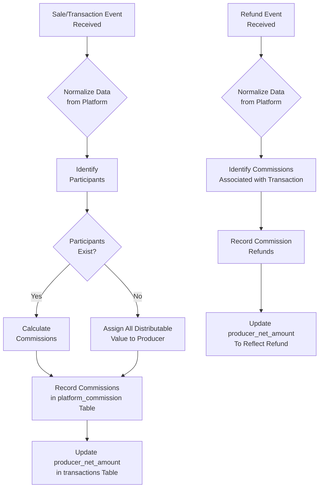

# `Process_Flow_Commission_System.md`


```markdown
---
title: "Process Flow: Commission System"
id: "process_flow_commission_system_001"
doc_type: "process_flow"
doc_version: "1.2"
date_created: "2025-04-23"
date_updated: "2025-04-23"
author: "João Castanheira"
db_name: "joaocastanheira_bancodedados"
db_version: "1.0"
doc_status: "Approved"
environment: "Production"
language: "en"
response_languages: ["pt-BR", "en"]
technical_terms_preservation: "strict"
original_language: "pt-BR"
related_docs: [
  "core_db_architecture_001", 
  "platform_integration_strategy_001", 
  "process_flow_purchase_lifecycle_001", 
  "process_flow_subscription_lifecycle_001", 
  "analytics_examples_001"
]
tables_in_focus: [
  "platform_commission", 
  "commission_participants", 
  "participant_addresses", 
  "transactions", 
  "products", 
  "plans", 
  "offers"
]
technical_terms: {
  "table_names": [
    "platform_commission", "commission_participants", "participant_addresses", 
    "transactions", "products", "plans", "offers", "transaction_items"
  ],
  "column_names": [
    "id", "transaction_id", "participant_id", "amount", "currency_code", "source", 
    "created_at", "updated_at", "platform_id", "platform_origin", "email", "name",
    "trader_name", "locale", "phone_local_code", "phone_number", "document_type",
    "document_number", "platform_fee_amount", "distributable_amount", 
    "partner_commission_amount", "producer_net_amount", "payment_gateway",
    "offer_price", "product_id"
  ],
  "data_types": [
    "SERIAL", "INTEGER", "NUMERIC(15, 4)", "VARCHAR", "TIMESTAMP WITH TIME ZONE",
    "REFERENCES", "PRIMARY KEY", "DEFAULT", "CONSTRAINT", "UNIQUE", 
    "ON DELETE CASCADE", "BOOLEAN", "NOT NULL"
  ],
  "commission_sources": [
    "PRODUCER", "AFFILIATE", "COPRODUCER", "MARKETPLACE", 
    "AFFILIATE_REFUND", "PRODUCER_REFUND"
  ],
  "document_types": [
    "CPF"
  ],
  "sql_keywords": [
    "CREATE TABLE", "SELECT", "FROM", "WHERE", "JOIN", "LEFT JOIN", 
    "INSERT INTO", "VALUES", "UPDATE", "SET", "GROUP BY", "ORDER BY", 
    "ON CONFLICT", "DO UPDATE", "HAVING", "COUNT", "SUM", "AVG", "MIN", "MAX", 
    "DISTINCT", "AS", "AND", "OR", "LIKE", "IN", "NOT", "DESC", "ASC", 
    "DATE_TRUNC", "INTERVAL", "CURRENT_DATE", "CURRENT_TIMESTAMP", "NOW()", 
    "RETURNING", "ABS", "ON", "EXCLUDED"
  ],
  "functions": [
    "normalize_commissions"
  ],
  "programming_terms": [
    "pseudocode", "webhook", "payload", "adaptadores", "JSON"
  ]
}
embedding_guide_concepts: [
  "commission system", 
  "revenue distribution", 
  "commission participants", 
  "affiliate", 
  "producer", 
  "coproducer", 
  "financial transfer", 
  "marketplace", 
  "commission percentage", 
  "commission refund", 
  "commission normalization", 
  "distributable amount", 
  "net amount", 
  "multi-level commission", 
  "affiliate performance analysis"
]
---


# Process Flow: Commission System


## Process Overview


The Commission System manages how sales amounts are distributed among different transaction participants, including producers, affiliates, and coproducers. This process is fundamental for businesses based on marketplaces, affiliate programs, and co-creation partnerships.


The system uses a unified data model that normalizes different commission structures from multiple platforms, allowing consistent analyses and a consolidated view of revenue distribution, regardless of the data source.


This process integrates directly with the [Purchase Lifecycle Flow](process_flow_purchase_lifecycle_001.md) and the [Subscription Lifecycle Flow](process_flow_subscription_lifecycle_001.md), recording commissions for both one-time and recurring transactions. The data normalization strategy is detailed in the [Multi-platform Integration Strategy](platform_integration_strategy_001.md).


(Ref: Commission System, ID process_flow_commission_system_001)


## Commission System Data Model


### 1. Commission Flow


This flow illustrates how transaction values are distributed among participants:


```
[transactions] -- (distributes commission) --> [platform_commission] -- (receives) --> [commission_participants]||-- (has) --> [participant_addresses]
```


**Description**: A Transaction (either one-time or recurring) distributes Commissions to Participants (producers, affiliates, etc.), recording the amount and origin of the commission in the `platform_commission` table. Participant details and addresses are stored separately.


### 2. Main Tables


The central structure of the commission system consists of:


**Table: commission_participants**
```sql
CREATE TABLE IF NOT EXISTS commission_participants (
    id               SERIAL PRIMARY KEY,
    platform_id      VARCHAR(255) NOT NULL,                -- ID on the platform
    platform_origin  VARCHAR(100) NOT NULL,                -- Platform name
    email            VARCHAR(255),                         -- Participant email
    name             VARCHAR(255),                         -- Full name
    trader_name      VARCHAR(255),                         -- Business name
    locale           VARCHAR(20),                          -- Location/language
    phone_local_code VARCHAR(10),                          -- Area code
    phone_number     VARCHAR(20),                          -- Phone number
    document_type    VARCHAR(10),                          -- Document type
    document_number  VARCHAR(55),                          -- Document number
    created_at       TIMESTAMP WITH TIME ZONE DEFAULT CURRENT_TIMESTAMP,
    updated_at       TIMESTAMP WITH TIME ZONE DEFAULT CURRENT_TIMESTAMP,
    CONSTRAINT uq_participant_platform UNIQUE (platform_id, platform_origin)
);
```


**Table: platform_commission**
```sql
CREATE TABLE IF NOT EXISTS platform_commission (
    id             SERIAL PRIMARY KEY,
    transaction_id INTEGER NOT NULL REFERENCES transactions ON DELETE CASCADE,
    participant_id INTEGER NOT NULL REFERENCES commission_participants,
    amount         NUMERIC(15, 4) NOT NULL,                -- Commission amount
    currency_code  VARCHAR(3) NOT NULL,                    -- Currency code
    source         VARCHAR(100),                           -- Origin/role of commission
    created_at     TIMESTAMP WITH TIME ZONE DEFAULT CURRENT_TIMESTAMP,
    updated_at     TIMESTAMP WITH TIME ZONE DEFAULT CURRENT_TIMESTAMP
);
```


**Fields in the transactions table related to commissions**
```sql
platform_fee_amount       NUMERIC(15, 4) DEFAULT 0,            -- Platform fees
distributable_amount      NUMERIC(15, 4),                      -- Distributable amount
partner_commission_amount NUMERIC(15, 4) DEFAULT 0,            -- Commissions for partners
producer_net_amount       NUMERIC(15, 4),                      -- Net amount for producer
```


(Ref: Commission System, ID process_flow_commission_system_001)


## Process Flow Diagram





The diagram illustrates two main flows:
1. **Commission processing** for a new sale
2. **Refund processing** when a refund or chargeback occurs


In both cases, the process begins with normalizing platform data, followed by specific processing for each scenario.


(Ref: Commission System, ID process_flow_commission_system_001)


## Participant Roles


The system recognizes different types of participants who can receive commissions. These roles are normalized from various platforms and recorded in the `source` field of the `platform_commission` table:


|Role (source)|Description|Example|
|:---------------|:----------|:--------|
|**PRODUCER**|Main owner of the product or service|Course creator, e-book author|
|**AFFILIATE**|Partner who promoted the sale|Affiliate who marketed the product|
|**COPRODUCER**|Partner who collaborated in creation|Co-author, secondary instructor|
|**MARKETPLACE**|Platform where the product is sold|Platform fee (when recorded as commission)|
|**AFFILIATE_REFUND**|Affiliate commission refund|Recorded with negative value|
|**PRODUCER_REFUND**|Producer amount refund|Recorded with negative value|


Roles are central to the commission system, as they determine how values are distributed and allow analyses by participant type.


(Ref: Commission System, ID process_flow_commission_system_001)


## Commission Process Phases


### 1. Commission Data Normalization


When a sale event is received, platform-specific data needs to be converted to the unified model.


**Process:**
1. Event received via webhook/API (Ex: approved purchase, activated subscription)
2. Extraction of commission data from payload
3. Normalization through platform-specific adapters


**Normalized Data:**
```json
{
  "transaction_id": "T123456",
  "payment_gateway": "example_platform",
  "offer_price": 100.00,
  "platform_fee_amount": 10.00,
  "distributable_amount": 90.00,
  "participants": [
    {
      "role": "PRODUCER",
      "platform_id": "P789",
      "email": "producer@example.com",
      "amount": 60.00,
      "percentage": 66.67
    },
    {
      "role": "AFFILIATE",
      "platform_id": "A456",
      "email": "affiliate@example.com",
      "amount": 30.00,
      "percentage": 33.33
    }
  ]
}
```


The normalization process converts different formats and terminologies into a unified structure, transforming fields such as "producer_id", "seller_id", "affiliate_id", "partner_id" into standardized identifiers with their respective roles.


(Ref: Commission System, ID process_flow_commission_system_001)


### 2. Participant Identification and Registration


Before recording commissions, the system checks if participants already exist in the database.


**Process:**
1. For each participant in the normalized data:
   - Search in the `commission_participants` table for the combination of `platform_id` and `platform_origin`
   - If it doesn't exist, create a new record
   - If it exists, update information if necessary


**Code Example:**
```sql
-- Check if participant exists
SELECT id 
FROM commission_participants 
WHERE platform_id = 'P789' 
AND platform_origin = 'example_platform';


-- If it doesn't exist, insert new participant
INSERT INTO commission_participants (
    platform_id, platform_origin, email, name, trader_name, 
    phone_local_code, phone_number, document_type, document_number,
    created_at, updated_at
)
VALUES (
    'P789', 'example_platform', 'producer@example.com', 
    'Producer Name', 'Producer Brand', 
    '11', '99999999', 'CPF',
    NOW(), NOW()
)
ON CONFLICT (platform_id, platform_origin) 
DO UPDATE SET 
    email = EXCLUDED.email, 
    name = EXCLUDED.name,
    updated_at = NOW()
RETURNING id;
```


This process ensures that each participant is registered only once in the system, even if they participate in multiple transactions across different platforms, as long as their identifier is consistent.


(Ref: Commission System, ID process_flow_commission_system_001)


### 3. Commission Calculation and Recording


After identifying all participants, the system records the commissions and updates the values in the transaction.


**Process:**
1. For each normalized participant:
   - Insert record in the `platform_commission` table
   - Include amount, currency, and role (source)
2. Calculate totals for the transaction:
   - Sum all partner commissions
   - Determine net amount for the producer
3. Update fields in the `transactions` table:
   - `partner_commission_amount`: sum of commissions for partners
   - `producer_net_amount`: net amount for the producer


**Code Example:**
```sql
-- Record commission for the producer
INSERT INTO platform_commission (
    transaction_id, participant_id, amount, currency_code, source, 
    created_at, updated_at
)
VALUES (
    (SELECT id FROM transactions 
     WHERE transaction_id = 'T123456' 
     AND payment_gateway = 'example_platform'), 
    (SELECT id FROM commission_participants 
     WHERE platform_id = 'P789' 
     AND platform_origin = 'example_platform'), 
    60.00, 'BRL', 'PRODUCER', 
    NOW(), NOW()
);


-- Record commission for the affiliate
INSERT INTO platform_commission (
    transaction_id, participant_id, amount, currency_code, source, 
    created_at, updated_at
)
VALUES (
    (SELECT id FROM transactions 
     WHERE transaction_id = 'T123456' 
     AND payment_gateway = 'example_platform'), 
    (SELECT id FROM commission_participants 
     WHERE platform_id = 'A456' 
     AND platform_origin = 'example_platform'), 
    30.00, 'BRL', 'AFFILIATE', 
    NOW(), NOW()
);


-- Update values in the transaction
UPDATE transactions
SET 
    producer_net_amount = 60.00,
    partner_commission_amount = 30.00,
    updated_at = NOW()
WHERE 
    transaction_id = 'T123456'
    AND payment_gateway = 'example_platform';
```


This design allows detailed recording of each individual commission, facilitating analysis and tracking.


(Ref: Commission System, ID process_flow_commission_system_001)


### 4. Refund Processing


When a transaction is refunded or has a chargeback, associated commissions need to be refunded.


**Process:**
1. Receive refund/chargeback event
2. Identify original commissions:
   - Query all positive commissions related to the transaction
3. Record refunds:
   - For each original commission, create a new record with negative value
   - Add "_REFUND" suffix to the `source` field
4. Update values in the transaction


**Code Example:**
```sql
-- Identify existing commissions
SELECT id, participant_id, amount, currency_code, source
FROM platform_commission
WHERE transaction_id = (
    SELECT id FROM transactions 
    WHERE transaction_id = 'T123456' 
    AND payment_gateway = 'example_platform'
);


-- Record refund for the affiliate
INSERT INTO platform_commission (
    transaction_id, participant_id, amount, currency_code, source, 
    created_at, updated_at
)
VALUES (
    (SELECT id FROM transactions 
     WHERE transaction_id = 'T123456' 
     AND payment_gateway = 'example_platform'), 
    (SELECT id FROM commission_participants 
     WHERE platform_id = 'A456' 
     AND platform_origin = 'example_platform'), 
    -30.00, 'BRL', 'AFFILIATE_REFUND', 
    NOW(), NOW()
);


-- Update values in the transaction to reflect the refund
UPDATE transactions
SET 
    producer_net_amount = 0.00,
    partner_commission_amount = 0.00,
    updated_at = NOW()
WHERE 
    transaction_id = 'T123456'
    AND payment_gateway = 'example_platform';
```


The system maintains a complete history of commissions and refunds, allowing precise financial reconciliation.


(Ref: Commission System, ID process_flow_commission_system_001)


## Supported Commission Models


The system supports different commission models that are normalized to the unified structure:


### 1. Simple Affiliate Commission


**Description**: An affiliate promotes a product and receives a percentage of the sale.


**Example**:
- Product value: R$ 100.00
- Platform fee (10%): R$ 10.00
- Distributable amount: R$ 90.00
- Affiliate commission (40% of distributable): R$ 36.00
- Net amount for producer: R$ 54.00


### 2. Coproduction with Percentage Split


**Description**: Multiple producers divide revenue in defined proportions.


**Example**:
- Product value: R$ 100.00
- Platform fee (10%): R$ 10.00
- Distributable amount: R$ 90.00
- Main producer (60%): R$ 54.00
- Coproducer (40%): R$ 36.00


### 3. Multi-level Commission


**Description**: System where there are cascading commissions for different levels of affiliation.


**Example**:
- Product value: R$ 100.00
- Platform fee (10%): R$ 10.00
- Distributable amount: R$ 90.00
- Direct affiliate (20%): R$ 18.00
- Level 2 affiliate (5%): R$ 4.50
- Producer (remaining amount): R$ 67.50


### 4. Commission with Custom Rate


**Description**: Some systems allow custom rates for specific affiliates.


**Example**:
- Standard affiliation rate: 30%
- Custom rate for specific affiliate: 50%


Data is normalized so that all these models can be consistently represented in the database structure.


(Ref: Commission System, ID process_flow_commission_system_001)


## Commission Calculations and Analyses


The system allows various types of analyses on commission performance:


### 1. Affiliate Performance


```sql
-- Affiliate performance in the last month
SELECT 
    cp.name AS affiliate_name, 
    cp.email AS affiliate_email,
    COUNT(DISTINCT pc.transaction_id) AS total_sales, 
    SUM(pc.amount) AS total_commission,
    AVG(pc.amount) AS avg_commission_per_sale,
    MIN(pc.amount) AS min_commission,
    MAX(pc.amount) AS max_commission
FROM 
    platform_commission pc
JOIN 
    commission_participants cp ON pc.participant_id = cp.id
WHERE 
    pc.source = 'AFFILIATE'
    AND pc.created_at >= DATE_TRUNC('month', CURRENT_DATE - INTERVAL '1 month')
    AND pc.created_at < DATE_TRUNC('month', CURRENT_DATE)
GROUP BY 
    cp.name, cp.email
ORDER BY 
    total_commission DESC;
```


### 2. Performance by Product and Affiliate


```sql
-- Affiliate performance by product
SELECT 
    p.name AS product_name,
    cp.name AS affiliate_name,
    COUNT(DISTINCT t.id) AS sales_count,
    SUM(pc.amount) AS commission_amount,
    AVG(pc.amount) AS avg_commission
FROM 
    platform_commission pc
JOIN 
    commission_participants cp ON pc.participant_id = cp.id
JOIN 
    transactions t ON pc.transaction_id = t.id
JOIN 
    transaction_items ti ON t.id = ti.transaction_id
JOIN 
    products p ON ti.product_id = p.id
WHERE 
    pc.source = 'AFFILIATE'
    AND pc.created_at >= DATE_TRUNC('year', CURRENT_DATE)
GROUP BY 
    p.name, cp.name
ORDER BY 
    p.name, commission_amount DESC;
```


### 3. Revenue Distribution


```sql
-- Revenue distribution analysis by role
SELECT 
    t.payment_gateway,
    pc.source,
    SUM(pc.amount) AS total_amount,
    COUNT(DISTINCT t.id) AS transaction_count,
    AVG(pc.amount) AS avg_amount
FROM 
    platform_commission pc
JOIN 
    transactions t ON pc.transaction_id = t.id
WHERE 
    pc.created_at >= DATE_TRUNC('month', CURRENT_DATE - INTERVAL '3 month')
    AND pc.source NOT LIKE '%REFUND%'
GROUP BY 
    t.payment_gateway, pc.source
ORDER BY 
    t.payment_gateway, total_amount DESC;
```


### 4. Refund Analysis


```sql
-- Commission refund analysis
SELECT 
    DATE_TRUNC('month', pc.created_at) AS month,
    pc.source,
    COUNT(*) AS refund_count,
    SUM(pc.amount) AS refund_amount, -- Negative values
    AVG(pc.amount) AS avg_refund_amount
FROM 
    platform_commission pc
WHERE 
    pc.source LIKE '%REFUND%'
    AND pc.created_at >= DATE_TRUNC('year', CURRENT_DATE)
GROUP BY 
    DATE_TRUNC('month', pc.created_at), pc.source
ORDER BY 
    month ASC, pc.source;
```


These queries demonstrate the flexibility of the data model for commission analyses across different dimensions.


(Ref: Commission System, ID process_flow_commission_system_001)


## Challenges and Considerations


### Platform Differences


**Challenge**: Each source platform may have different structures and terminologies for commissioning.


**Solution**:
- Specific adapters normalize data to the unified model
- Mapping of roles/functions to standardized types (PRODUCER, AFFILIATE, etc.)
- Storage of original identifiers for reference


**Adaptation Example**:
```python
# Pseudocode for normalizing commissions
def normalize_commissions(platform, transaction_data):
    if platform == "platform_a":
        # Platform A uses "seller_id" for producer and "referral_id" for affiliate
        producer = {
            "role": "PRODUCER",
            "platform_id": transaction_data["seller_id"],
            "amount": transaction_data["seller_amount"]
        }
        
        affiliate = None
        if "referral_id" in transaction_data:
            affiliate = {
                "role": "AFFILIATE",
                "platform_id": transaction_data["referral_id"],
                "amount": transaction_data["referral_amount"]
            }
        
        return [producer] + ([affiliate] if affiliate else [])
        
    elif platform == "platform_b":
        # Platform B uses "owner" and "partners" with types
        participants = []
        
        # Add producer
        participants.append({
            "role": "PRODUCER",
            "platform_id": transaction_data["owner"]["id"],
            "amount": transaction_data["owner"]["amount"]
        })
        
        # Add other participants
        for partner in transaction_data.get("partners", []):
            role = "AFFILIATE" if partner["type"] == "affiliate" else "COPRODUCER"
            participants.append({
                "role": role,
                "platform_id": partner["id"],
                "amount": partner["amount"]
            })
            
        return participants
```


### Currencies and Conversion


**Challenge**: Transactions and commissions can occur in different currencies.


**Solution**:
- The `platform_commission` table stores the currency code (`currency_code`)
- Analyses can group by currency or apply conversion as needed
- Implementation of exchange rate service for consolidated reports


### Financial Reconciliation


**Challenge**: Ensuring commission values are correct and consistent.


**Solution**:
- Automatic verification that the sum of commissions does not exceed the distributable amount
- Double calculation: values reported by the platform vs. calculated by the system
- Recording of all financial transactions, including adjustments and refunds


**Integrity Check**:
```sql
-- Verify that the sum of commissions matches the distributable amount
SELECT 
    t.id,
    t.transaction_id,
    t.payment_gateway,
    t.distributable_amount,
    SUM(pc.amount) AS sum_commissions,
    t.distributable_amount - SUM(pc.amount) AS difference
FROM 
    transactions t
LEFT JOIN 
    platform_commission pc ON t.id = pc.transaction_id
WHERE 
    pc.source NOT LIKE '%REFUND%'
    AND t.created_at >= CURRENT_DATE - INTERVAL '30 days'
GROUP BY 
    t.id, t.transaction_id, t.payment_gateway, t.distributable_amount
HAVING 
    ABS(t.distributable_amount - SUM(pc.amount)) > 0.01;
```


(Ref: Commission System, ID process_flow_commission_system_001)


## Integration with Other Processes


The Commission System integrates with other key processes in the system:


### 1. Purchase Lifecycle Flow


Commissioning is an integral part of the sales process. When a transaction is recorded, the system:
- Calculates commissions as part of transaction processing
- Determines the net amount for the producer
- Records the commission participants


See more details in the [Purchase Lifecycle Flow](process_flow_purchase_lifecycle_001.md).


### 2. Subscription Lifecycle Flow


For recurring products, the system:
- Records commissions for each recurring charge
- Maintains or adjusts commission proportions according to plan rules
- Handles subscription-specific refunds


See more details in the [Subscription Lifecycle Flow](process_flow_subscription_lifecycle_001.md).


### 3. Platform Integration Strategy


Normalizing commission data is a critical aspect of platform integration. The system:
- Uses platform-specific adapters
- Maps proprietary structures to the unified model
- Preserves original metadata when necessary


See more details in the [Multi-platform Integration Strategy](platform_integration_strategy_001.md).


(Ref: Commission System, ID process_flow_commission_system_001)


## Future Evolutions


Some possible improvements and extensions for the Commission System include:


### 1. Dynamic Commission Rules


Implementation of a subsystem to define commission rules that can vary by:
- Product or product category
- Transaction value (commission tiers)
- Affiliate history or level
- Campaigns or promotional periods


### 2. Payments and Transfers


Extension of the system to include:
- Commission payment scheduling
- Integration with payment systems
- Issuance of tax documents
- Payment status tracking


### 3. Affiliate Dashboard


Development of specific visualizations for:
- Individual affiliate performance
- Conversions and click-through rates
- Future earnings projection
- Performance comparison by product


(Ref: Commission System, ID process_flow_commission_system_001)


## Conclusion


The Commission System is a fundamental component of the database infrastructure, allowing detailed tracking and analysis of revenue distribution among the various participants in the ecosystem.


The architecture was designed with a focus on:
- **Flexibility**: Support for different commission models
- **Scalability**: Ability to process increasing volumes of transactions
- **Normalization**: Unification of data from different platforms
- **Auditability**: Complete record of commission and refund history
- **Analysis**: Ease of extracting insights about affiliate performance and revenue distribution


This design has enabled the creation of a robust system that efficiently manages the financial flow between all participants, regardless of the transaction's platform of origin, contributing to a unified view of the business.


(Ref: Commission System, ID process_flow_commission_system_001)
```