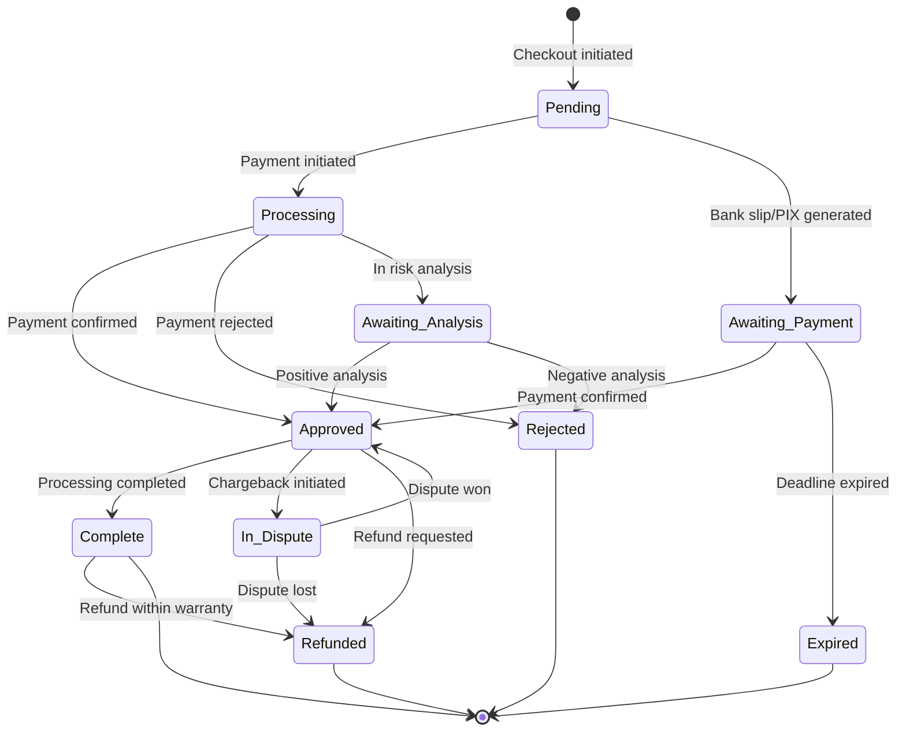

# `Process_Flow_Purchase_Lifecycle.md` 


```markdown
---
title: "Process Flow: Purchase Lifecycle"
id: "process_flow_purchase_lifecycle_001"
doc_type: "process_flow"
doc_version: "1.2"
date_created: "2025-04-23"
date_updated: "2025-04-23"
author: "João Castanheira"
db_name: "joaocastanheira_bancodedados"
db_version: "1.0"
doc_status: "Approved"
environment: "Production"
language: "en"
response_languages: ["pt-BR", "en"]
technical_terms_preservation: "strict"
original_language: "pt-BR"
related_docs: [
  "core_db_arch_001", 
  "domain_transaction_management_001", 
  "platform_integration_strategy_001",
  "process_flow_subscription_lifecycle_001",
  "analytics_examples_001"
]
tables_in_focus: [
  "transactions",
  "transaction_items",
  "transaction_status_history",
  "transaction_fees",
  "platform_commission",
  "platform_transaction_payment_history",
  "platform_sale_offer_history",
  "platform_software_invoice_history"
]
technical_terms: {
  "table_names": [
    "transactions", "transaction_items", "transaction_status_history", 
    "transaction_fees", "platform_commission", "platform_transaction_payment_history", 
    "platform_sale_offer_history", "platform_software_invoice_history", 
    "subscriptions", "subscription_status_history", "commission_participants", 
    "participant_addresses", "customers", "products", "offers", "plans", 
    "transaction_statuses", "platform_utm_history"
  ],
  "column_names": [
    "id", "transaction_id", "payment_gateway", "status_id", "customer_id", 
    "payment_type", "payment_method", "installments_number", "currency_code", 
    "base_price", "offer_price", "customer_paid_amount", "platform_fee_amount", 
    "distributable_amount", "partner_commission_amount", "producer_net_amount", 
    "is_subscription", "subscription_id", "platform_subscription_id", "recurrence_number", 
    "tracking_source", "tracking_sck", "under_warranty", "warranty_expire_date", 
    "order_date", "created_at", "updated_at", "product_id", "offer_id", "plan_id", 
    "quantity", "unit_price", "change_date", "reason", "fee_type", "total_amount", 
    "fee_currency_code", "base_amount", "fixed_amount", "participant_id", "amount", 
    "source", "gateway_transaction_id", "card_brand", "card_last_digits", "billet_url", 
    "billet_barcode", "status", "initial_transaction_id", "email", "name", "phone_local_code", 
    "phone_number", "document_type", "document_number", "platform_origin", "description", 
    "product_id", "utm_source", "utm_medium", "utm_campaign", "utm_term", "utm_content"
  ],
  "enum_types": [
    "payment_method_enum", "payment_type_enum"
  ],
  "enum_values": {
    "payment_method_enum": [
      "credit_card", "debit_card", "boleto", "boleto_installment", "pix", 
      "bank_transfer", "paypal", "digital_wallet", "cryptocurrency"
    ],
    "payment_type_enum": [
      "SINGLE_PAYMENT", "INSTALLMENT_PAYMENT"
    ]
  },
  "transaction_statuses": [
    "Pendente", "Processando", "Aguardando_Pagamento", "Aguardando_Análise", 
    "Aprovada", "Recusada", "Completa", "Em_Disputa", "Reembolsada", 
    "Parcialmente_Reembolsada", "Cancelada", "Expirada",
    "Pending", "Processing", "Awaiting_Payment", "Awaiting_Analysis", 
    "Approved", "Rejected", "Complete", "In_Dispute", "Refunded", 
    "Partially_Refunded", "Canceled", "Expired"
  ],
  "commission_sources": [
    "PRODUCER", "AFFILIATE"
  ],
  "fee_types": [
    "PLATFORM_FEE"
  ],
  "sql_keywords": [
    "SELECT", "FROM", "WHERE", "JOIN", "GROUP BY", "ORDER BY", "INSERT INTO", 
    "VALUES", "ON CONFLICT", "DO UPDATE", "RETURNING", "COUNT", "SUM", "AVG", 
    "ROUND", "CASE", "WHEN", "THEN", "ELSE", "END", "AND", "BETWEEN", "DISTINCT", 
    "NULLIF", "NULL", "NOW()", "INTERVAL"
  ],
  "functions": [
    "get_normalized_status_id"
  ]
}
embedding_guide_concepts: [
  "purchase flow", 
  "transaction lifecycle", 
  "payment processing", 
  "status tracking", 
  "refund", 
  "commissions", 
  "platform fees", 
  "payment methods",
  "transaction unification",
  "multi-platform transactions",
  "cross-platform purchases",
  "transaction history"
]
---


# Process Flow: Purchase Lifecycle


## Process Overview


This document describes the complete lifecycle of a purchase transaction in the system, from its initial registration to its possible final states. The flow covers payment processing, commission distribution, fiscal document generation, and possible post-sale events such as refunds.


The purchase lifecycle was designed to unify transactions from multiple platforms into a standardized flow, allowing consistent treatment and analysis regardless of origin. Each transaction preserves its original platform identification through the combination of `transaction_id` and `payment_gateway`, while receiving a sequential internal ID for reference in the system.


This process integrates with the **[Subscription Lifecycle Flow](process_flow_subscription_lifecycle_001.md)** in cases of recurring products, where the initial purchase generates a subscription that will have its own recurring transactions.


(Ref: Purchase Lifecycle, ID process_flow_purchase_lifecycle_001)


## Lifecycle Stages


The lifecycle of a purchase goes through the following main stages, regardless of the platform of origin. Normalization between the different vocabularies and flows of platforms is performed as described in **[Multi-platform Integration Strategy - Transaction Status Mapping](platform_integration_strategy_001.md#mapeamento-de-status-de-transação)**.


### 1. Initiation


**Description:** A new transaction is created when a customer completes a checkout process on any integrated platform.


**Typical events:**
- Customer selects product or plan
- Chooses payment method
- Provides necessary information
- Confirms purchase


**Possible initial states:**
- `Pending` - Awaiting payment confirmation
- `Processing` - Payment in process
- `Awaiting_Payment` - Bank slip generated or PIX pending


**Data captured at this stage:**
- Customer information
- Selected product/plan/offer
- Chosen payment method
- Total value and conditions (installments, etc.)
- Tracking data (UTM, source, etc.)
- Snapshot of the offer at the time of purchase


**System actions:**
1. Receives webhook or notification from the platform
2. Normalizes data according to unified model
3. Checks if customer already exists (by email) or creates new one
4. Creates record in the `transactions` table
5. Creates record(s) in the `transaction_items` table
6. Records initial state in `transaction_status_history`
7. Stores offer snapshot in `platform_sale_offer_history`
8. Stores payment data in `platform_transaction_payment_history`


### 2. Payment Processing


**Description:** The payment system processes the transaction and updates its status.


**Typical events:**
- Payment processor authorizes transaction
- Payment confirmation (PIX, bank slip)
- Rejection due to insufficient funds
- Rejection due to suspected fraud


**Possible states after processing:**
- `Approved` - Payment confirmed and approved
- `Rejected` - Payment rejected by system or bank
- `Awaiting_Analysis` - In risk analysis
- `Canceled` - Canceled before approval


**Data updated at this stage:**
- Transaction status
- Processing details (authorization code, etc.)
- Rejection information (when applicable)


**System actions:**
1. Receives status update notification
2. Updates status in the `transactions` table
3. Records new status in `transaction_status_history`
4. Updates `platform_transaction_payment_history` with processing details
5. If rejected, may initiate recovery flow according to configuration


### 3. Post-Approval


**Description:** After payment approval, several actions are executed to complete the sales process.


**Typical events:**
- Calculation and recording of commissions
- Calculation and recording of platform fees
- Release of access to the product/service
- Start of subscription (if applicable)
- Issuance of invoice (if configured)


**Possible states:**
- `Approved` - Continues with approved status
- `Complete` - All post-sale processing has been completed


**Data recorded at this stage:**
- Commissions (values, beneficiaries)
- Fees (values, types)
- Invoice details (when applicable)
- Link to subscription (when applicable)


**System actions:**
1. Calculates and records commissions in `platform_commission`
2. Calculates and records fees in `transaction_fees`
3. If it's a subscription purchase, creates record in `subscriptions`
4. Requests invoice issuance (when configured)
5. Records invoice data in `platform_software_invoice_history`


### 4. Post-Sale Events


**Description:** After sale completion, additional events may occur during the warranty period.


**Typical events:**
- Refund request
- Credit card dispute (chargeback)
- Cancellation within warranty period
- Repurchase or upgrade


**Possible states:**
- `In_Dispute` - Chargeback or dispute initiated
- `Refunded` - Refund completed
- `Partially_Refunded` - Partial refund
- `Canceled` - Canceled after approval


**Data updated at this stage:**
- Transaction status
- Refund/cancellation reason
- Refund date and details
- Commission status (reversed or maintained)


**System actions:**
1. Receives post-sale event notification
2. Updates transaction status
3. Records new status and reason in `transaction_status_history`
4. Updates commission status when applicable
5. If it's a subscription, may update status in the `subscriptions` table


(Ref: Purchase Lifecycle, ID process_flow_purchase_lifecycle_001)


## Main Process Flows


### 1. Sales Flow (Single Transaction)


This flow represents the purchase of a product or offer that is not a recurring subscription.
```
[customers] <-- (makes) -- [transactions] -- (contains) --> [transaction_items] -- (refers to) --> [products/offers/plans]||-- (records status) --> [transaction_status_history]||-- (charges) --> [transaction_fees]||-- (distributes commission) --> [platform_commission] --> [commission_participants]||-- (payment details) --> [platform_transaction_payment_history]||-- (UTM details) --> [platform_utm_history]||-- (fiscal details) --> [platform_software_invoice_history]||-- (offer snapshot) --> [platform_sale_offer_history]
```
**Description**: A Customer makes a Transaction. This Transaction contains Items that reference Products, Offers or Plans. The Transaction generates records of Status History, Fees, Commissions (for Participants), and various platform-specific details (payment, UTM, invoice, offer snapshot).


### 2. Subscription and Recurrence Flow


This flow describes the creation of a subscription and its associated recurring transactions.
```
[customers] <-- (subscribes to) -- [subscriptions] -- (defines) --> [plans] -- (offers) --> [products]||-- (records status) --> [subscription_status_history]||-- (originates transactions) --> [transactions] (recurrence)
```
**Description**: A Customer subscribes to a Plan, creating a Subscription. The Subscription records its Status History and originates recurring Transactions at defined intervals. Each recurring transaction follows the Sales Flow described above, but is explicitly linked to the parent Subscription.


### 3. Commission Flow


This flow details how commissions are assigned and recorded.
```
[transactions] -- (distributes commission) --> [platform_commission] -- (receives) --> [commission_participants]||-- (has) --> [participant_addresses]
```
**Description**: A Transaction (whether single or recurring) can distribute Commissions to Participants (producers, affiliates, etc.), recording the value and origin of the commission in the `platform_commission` table. The details and addresses of participants are stored separately.


## Status Diagram





This diagram presents the normalization of the various status flows existing in different platforms into a unified model. For details on how specific platform statuses are mapped to this model, see **[Multi-platform Integration Strategy - Transaction Status Mapping](platform_integration_strategy_001.md#mapeamento-de-status-de-transação)**.


(Ref: Purchase Lifecycle, ID process_flow_purchase_lifecycle_001)


## Payment Processing


### Supported Payment Methods


The system supports various payment methods, all normalized through the enumerated type `payment_method_enum`:


- `credit_card` - Credit Card
- `debit_card` - Debit Card
- `boleto` - One-time Bank Slip
- `boleto_installment` - Installment Bank Slip
- `pix` - PIX
- `bank_transfer` - Bank Transfer
- `paypal` - PayPal
- `digital_wallet` - Digital Wallets (Google Pay, Apple Pay)
- `cryptocurrency` - Cryptocurrencies


The process of normalizing payment methods from different platforms to these standardized values is performed as described in **[Multi-platform Integration Strategy - Payment Method Mapping](platform_integration_strategy_001.md#mapeamento-de-métodos-de-pagamento)**.


### Payment Types


In addition to the method, the system classifies payments into two main types through the enumerated type `payment_type_enum`:


- `SINGLE_PAYMENT` - Single payment (one-time)
- `INSTALLMENT_PAYMENT` - Installment payment


For installment payments, the `installments_number` field in the `transactions` table indicates the number of installments.


### Processing by Platform


Each integrated platform has its own payment processing flow and notification system. The system unifies these different flows through specific adapters that:


1. Receive notifications (webhooks) from the platform
2. Normalize the data according to the unified model
3. Update the transaction status and payment history
4. Track platform-specific information in appropriate fields


Implementation details for each platform are documented in **[Multi-platform Integration Strategy - Payment Event Processing](platform_integration_strategy_001.md#processamento-de-eventos-de-pagamento)**.


(Ref: Purchase Lifecycle, ID process_flow_purchase_lifecycle_001)


## Commissions and Fees


### Commission Calculation and Distribution


After transaction approval, the system calculates and records commissions for different participants:


1. **Producers**: Product creators, receive the largest portion of net revenue
2. **Affiliates**: Promoters who generated the sale, receive commission on the value
3. **Co-producers**: Partners who contributed to the product, receive percentage of revenue


Commissions are calculated according to the rules configured on each platform and recorded in the `platform_commission` table.


```sql
-- Example of commission recording
INSERT INTO platform_commission (
    transaction_id, participant_id, amount, currency_code, source
)
VALUES
    (123, 456, 150.00, 'BRL', 'PRODUCER'),     -- Value for the producer
    (123, 789, 50.00, 'BRL', 'AFFILIATE');     -- Value for the affiliate
```


### Platform Fees


Each transaction is subject to fees charged by the originating platform, which are recorded in the `transaction_fees` table:


```sql
-- Example of fee recording
INSERT INTO transaction_fees (
    transaction_id, fee_type, total_amount, fee_currency_code, 
    base_amount, fixed_amount
)
VALUES
    (123, 'PLATFORM_FEE', 25.00, 'BRL', 20.00, 5.00);    -- Platform fee
```


### Calculated Values in the Transaction


The `transactions` table stores important aggregated values for financial analysis:


- `base_price`: Original base price of the product/plan
- `offer_price`: Effective price of the offer applied in the transaction
- `customer_paid_amount`: Total amount paid by the customer (includes installment interest)
- `platform_fee_amount`: Total fees charged by the platform
- `distributable_amount`: Value after fee deduction (`offer_price - platform_fee_amount`)
- `partner_commission_amount`: Total commissions paid to partners (affiliates, co-producers)
- `producer_net_amount`: Final net value for the producer (`distributable_amount - partner_commission_amount`)


These fields allow detailed financial analyses throughout the transaction lifecycle.


(Ref: Purchase Lifecycle, ID process_flow_purchase_lifecycle_001)


## Tracking and Traceability


### Origin Tracking


The system captures information about the transaction origin:


- `tracking_source`: Identifies the traffic source (e.g., "Facebook", "Email", "Instagram")
- `tracking_sck`: Campaign-specific tracking code


Additionally, complete UTM data is stored in the `platform_utm_history` table:


```sql
-- Example of UTM recording
INSERT INTO platform_utm_history (
    transaction_id, utm_source, utm_medium, utm_campaign, utm_term, utm_content
)
VALUES
    (123, 'facebook', 'cpc', 'black_friday_2023', 'online course', 'banner_1');
```


### Status History


Each transaction status change is recorded in the `transaction_status_history` table, creating a detailed record of the entire lifecycle:


```sql
-- Example of status history
INSERT INTO transaction_status_history (
    transaction_id, status_id, change_date, reason
)
VALUES
    (123, 1, '2023-11-20 10:00:00', 'Checkout initiated'),
    (123, 2, '2023-11-20 10:05:00', 'Payment approved by gateway'),
    (123, 5, '2023-11-25 14:30:00', 'Refund requested by customer - dissatisfaction with product');
```


This history allows detailed audits and sales funnel analyses.


### Cross-Platform Traceability


The system maintains complete traceability to the platform of origin through the fields:


- `transaction_id`: Original transaction ID on the platform
- `payment_gateway`: Name of the platform where the transaction was processed
- `gateway_transaction_id`: Specific ID in the payment gateway (when available)


This approach allows queries by both internal ID and original platform identifiers.


(Ref: Purchase Lifecycle, ID process_flow_purchase_lifecycle_001)


## Transactions and Subscriptions


### Relationship between Initial Transaction and Subscription


When a purchase results in the creation of a subscription, an important relationship is established:


1. The initial transaction is recorded normally with `is_subscription = true`
2. A subscription is created in the `subscriptions` table
3. The initial transaction references the subscription through the `subscription_id` field
4. The subscription references the initial transaction through the `initial_transaction_id` field


```sql
-- Example of transaction resulting in subscription
INSERT INTO transactions (
    transaction_id, payment_gateway, /* other fields */,
    is_subscription, subscription_id, platform_subscription_id
)
VALUES (
    'TRANS123', 'Platform', /* other values */,
    true, 456, 'SUB789'
);


INSERT INTO subscriptions (
    subscription_id, payment_gateway, initial_transaction_id, /* other fields */
)
VALUES (
    'SUB789', 'Platform', 'TRANS123', /* other values */
);
```


### Recurring Transactions


Recurring subscription charges follow a flow similar to initial transactions, with some differences:


1. They are automatically created by the platform system in the billing cycle
2. They have `is_subscription = true` and `subscription_id` filled
3. The `recurrence_number` field indicates which recurrence is being charged (2nd, 3rd, etc.)
4. They follow the same status lifecycle (pending → approved → etc.)


For more details about the specific lifecycle of subscriptions and their recurrences, see **[Subscription Lifecycle Flow](process_flow_subscription_lifecycle_001.md)**.


(Ref: Purchase Lifecycle, ID process_flow_purchase_lifecycle_001)


## Implementation by Platform


### Adaptation for Different Platforms


The system was designed to process transaction events from multiple platforms, using specific adapters for each of them. Below is a generic description of the process:


**Data source**: Platform APIs and webhooks


**Status mapping**:
- Each platform uses its own terminology for transaction status
- The system maps these statuses to the normalized set using reference tables
- Common examples include mapping statuses such as "approved", "paid", "rejected", "refunded", etc.


**Captured events**:
- Transaction creation events
- Status update events
- Payment events
- Refund or chargeback events
- Subscription-related events


**Particularities**:
- Different platforms use distinct terms for transactions (e.g., "purchases", "checkouts")
- Commission systems vary significantly between platforms
- Some platforms have their own subscription management, others use third-party gateways


For complete details about specific adapters for each platform, including data transformation, field mapping, and handling of particularities, see **[Multi-platform Integration Strategy - Implementation by Platform](platform_integration_strategy_001.md#implementação-por-plataforma)**.


(Ref: Purchase Lifecycle, ID process_flow_purchase_lifecycle_001)


## Common Queries and Analyses


### Sales Analysis by Status


```sql
-- Overview of transactions by status in the period
SELECT 
    ts.status AS status_name,
    COUNT(t.id) AS transaction_count,
    SUM(t.offer_price) AS total_value
FROM transactions t
JOIN transaction_statuses ts ON t.status_id = ts.id
WHERE t.order_date BETWEEN '2023-10-01' AND '2023-10-31'
GROUP BY ts.status
ORDER BY total_value DESC;
```


### Performance by Platform


```sql
-- Performance comparison between platforms
SELECT 
    t.payment_gateway AS platform,
    COUNT(t.id) AS sales_count,
    SUM(t.offer_price) AS gross_revenue,
    SUM(t.producer_net_amount) AS net_revenue,
    AVG(t.offer_price) AS avg_ticket,
    SUM(t.platform_fee_amount) AS total_fees,
    SUM(t.platform_fee_amount) / SUM(t.offer_price) * 100 AS fee_percentage
FROM transactions t
WHERE t.status_id = (SELECT id FROM transaction_statuses WHERE status = 'Approved')
AND t.order_date BETWEEN '2023-01-01' AND '2023-12-31'
GROUP BY t.payment_gateway
ORDER BY gross_revenue DESC;
```


### Payment Method Analysis


```sql
-- Distribution of payment methods
SELECT 
    t.payment_method::text AS payment_method,
    COUNT(t.id) AS transaction_count,
    SUM(t.offer_price) AS total_value,
    ROUND((COUNT(t.id) * 100.0 / (SELECT COUNT(*) FROM transactions 
                                 WHERE status_id = (SELECT id FROM transaction_statuses WHERE status = 'Approved')
                                 AND order_date BETWEEN '2023-01-01' AND '2023-12-31')), 2) AS percentage
FROM transactions t
WHERE t.status_id = (SELECT id FROM transaction_statuses WHERE status = 'Approved')
AND t.order_date BETWEEN '2023-01-01' AND '2023-12-31'
GROUP BY t.payment_method
ORDER BY transaction_count DESC;
```


### Refund Rate by Product


```sql
-- Refund rate by product
SELECT 
    p.name AS product_name,
    p.platform_origin,
    COUNT(DISTINCT CASE WHEN ts.status = 'Approved' THEN t.id END) AS approved_count,
    COUNT(DISTINCT CASE WHEN ts.status = 'Refunded' THEN t.id END) AS refunded_count,
    ROUND((COUNT(DISTINCT CASE WHEN ts.status = 'Refunded' THEN t.id END) * 100.0 / 
          NULLIF(COUNT(DISTINCT CASE WHEN ts.status IN ('Approved', 'Refunded', 'Complete') THEN t.id END), 0)), 2) AS refund_rate
FROM transactions t
JOIN transaction_items ti ON t.id = ti.transaction_id
JOIN products p ON ti.product_id = p.id
JOIN transaction_statuses ts ON t.status_id = ts.id
WHERE t.order_date BETWEEN '2023-01-01' AND '2023-12-31'
GROUP BY p.id, p.name, p.platform_origin
HAVING COUNT(DISTINCT CASE WHEN ts.status IN ('Approved', 'Refunded', 'Complete') THEN t.id END) > 10
ORDER BY refund_rate DESC;
```


For more examples of advanced analyses that can be performed with this data, see the document **[Analysis and Report Examples](analytics_examples_001.md)**.


(Ref: Purchase Lifecycle, ID process_flow_purchase_lifecycle_001)


## Refund and Dispute Management


### Refund Flow


The refund process follows these steps:


1. **Request**: Customer requests refund (directly on the platform or via support)
2. **Evaluation**: Verification if it's within warranty period (`under_warranty = true`)
3. **Approval**: Authorization of refund on the platform of origin
4. **Processing**: Platform processes the refund and sends notification
5. **Update**: System updates transaction status to `Refunded`
6. **Financial adjustments**: 
   - Commission reversal (when applicable)
   - Recording of refund reason
   - Updating subscription status (when applicable)


### Chargeback Handling (Disputes)


Chargebacks (credit card disputes) follow a similar flow, but with particularities:


1. **Notification**: System receives chargeback notification from the platform
2. **Registration**: Transaction status is changed to `In_Dispute`
3. **Contention**: There may be a dispute process with documentation submission
4. **Resolution**: Based on the dispute result:
   - If won, returns to `Approved` status
   - If lost, changes to `Refunded` (chargeback effective)


### Impact on Metrics


Refunds and chargebacks affect various financial metrics:


- Reduction of gross and net revenue
- Increase in refund/chargeback rate
- Possible impact on commissions paid to affiliates
- Adjustments in financial and accounting reports


The system maintains both original values and adjusted values after refunds, allowing precise analyses of business financial health.


(Ref: Purchase Lifecycle, ID process_flow_purchase_lifecycle_001)


## Best Practices and Considerations


### Efficient Lifecycle Management


1. **Funnel monitoring**:
   - Track conversion at each lifecycle stage
   - Identify bottlenecks in the payment process
   - Analyze abandonment and rejection rates


2. **Fraud prevention**:
   - Monitor suspicious behavior patterns
   - Analyze chargeback rates by segment
   - Implement additional checks for high-risk transactions


3. **Recovery optimization**:
   - Implement recovery flows for rejected payments
   - Configure reminders for pending bank slips
   - Offer payment alternatives in case of failure


4. **Warranty management**:
   - Monitor refunds near the end of the warranty period
   - Analyze refund reasons for product improvement
   - Implement post-refund surveys for feedback


### Cross-Platform Consistency


Unifying transactions from multiple platforms requires special attention:


1. **Financial reconciliation**:
   - Regularly check if all values are consistent between platforms and the unified database
   - Implement validation routines to detect discrepancies


2. **Status mapping**:
   - Keep updated the mappings between platform-specific statuses and the unified model
   - Document special cases or exceptions in status handling


3. **Event tracking**:
   - Ensure that critical platform events are captured even in case of temporary failures
   - Implement retry system for unprocessed notifications


(Ref: Purchase Lifecycle, ID process_flow_purchase_lifecycle_001)


## Detailed Technical Implementation


### Phase 1: Receiving and Normalizing the Sale Event


The process is initiated when the system receives a sale notification (usually via webhook) from an external platform.


1. **Event Reception:** A specific system endpoint receives the JSON payload from the platform.
2. **Validation and Authentication:** The payload is validated (e.g., webhook signature verification) and authenticated to ensure it is legitimate.
3. **Data Normalization:** The platform-specific adapter transforms the raw platform data to the system's standardized data model. This includes mapping statuses, payment methods, price structures, etc., using, for example, the `platform_status_mapping` table to normalize statuses.
4. **Temporary Registration/Queue:** The normalized event may be temporarily registered or placed in a queue for asynchronous processing, ensuring idempotence and resilience.


### Phase 2: Identification and Registration of Related Entities


Before registering the main transaction, the system ensures that related entities (Customer, Product, Offer, Plan) exist in the unified database or are created.


1. **Identify/Create Customer:**
    ```sql
    -- Simplified example: Get or create customer using normalized data
    -- Assumes that normalization has already extracted email, name, etc.
    INSERT INTO customers (email, name, customer_id, -- customer_id from the original platform
                          phone_local_code, phone_number, document_type, document_number
                          created_at, updated_at)
    VALUES (
        'customer@email.com', 
        'Customer Name', 
        'ID_ON_PLATFORM', 
        '11', '999999999', 'CPF',
        NOW(), NOW()
    )
    ON CONFLICT (email) DO UPDATE SET
        name = EXCLUDED.name, 
        phone_local_code = EXCLUDED.phone_local_code, 
        phone_number = EXCLUDED.phone_number,
        document_type = EXCLUDED.document_type,
        document_number = EXCLUDED.document_number,
        updated_at = NOW();
    
    -- Retrieve the customer's internal ID to use in the transaction
    SELECT id FROM customers WHERE email = 'customer@email.com';
    ```


2. **Identify/Create Product, Offer and Plan:**
    ```sql
    -- Simplified example: Get or create product using normalized data
    INSERT INTO products (product_id, platform_origin, name, description, created_at, updated_at)
    VALUES (
        'PROD123', 
        'Platform', 
        'Product Name',
        'Product Description',
        NOW(), NOW()
    )
    ON CONFLICT (product_id, platform_origin) DO UPDATE SET
        name = EXCLUDED.name,
        description = EXCLUDED.description,
        updated_at = NOW();
        
    -- Retrieve the product's internal ID
    SELECT id FROM products WHERE product_id = 'PROD123' AND platform_origin = 'Platform';
    
    -- Similarly for offers and plans
    ```


### Phase 3: Main Transaction Registration


```sql
-- Simplified example: Insert transaction using normalized data
INSERT INTO transactions (
    transaction_id, customer_id, payment_gateway, status_id, 
    payment_type, payment_method, installments_number, gateway_transaction_id,
    card_brand, card_last_digits, billet_url, billet_barcode,
    currency_code, base_price, offer_price, customer_paid_amount, 
    platform_fee_amount, distributable_amount, partner_commission_amount, 
    producer_net_amount, is_subscription, 
    tracking_source, tracking_sck, under_warranty, warranty_expire_date,
    order_date, created_at, updated_at
)
VALUES (
    'TXN_ABC', -- Transaction ID on the platform of origin
    123,       -- Customer's internal ID
    'Platform', 
    get_normalized_status_id('Platform', 'transaction', 'original_platform_status'), -- Status mapping
    'SINGLE_PAYMENT'::payment_type_enum, 
    'credit_card'::payment_method_enum, 
    1,         -- Number of installments
    'GATEWAY_TRANS_ID', -- Gateway ID (may be different from transaction_id)
    'Visa', '1234', NULL, NULL, -- Payment details
    'BRL',     -- Currency
    120.00,    -- Base price (if available)
    100.00,    -- Offer price
    100.00,    -- Amount paid by customer (may include interest)
    5.00,      -- Platform fees (initial)
    95.00,     -- Distributable amount (initial)
    0.00,      -- Partner commissions (initial)
    95.00,     -- Net amount for producer (initial)
    FALSE,     -- Is subscription?
    'facebook', 'sck123', TRUE, NOW() + INTERVAL '7 days', -- Tracking and warranty
    NOW(), NOW(), NOW() -- Dates
) RETURNING id; -- Returns the internal ID of the new transaction
```


### Phase 4: Transaction Details Registration


1. **Register Transaction Items (`transaction_items`):**
    ```sql
    -- Example: Insert transaction item using internal IDs
    INSERT INTO transaction_items (transaction_id, product_id, offer_id, plan_id, quantity, unit_price, created_at, updated_at)
    VALUES (
        456, -- Transaction internal ID (obtained in Phase 3)
        789, -- Product internal ID (obtained in Phase 2)
        101, -- Offer internal ID (obtained in Phase 2)
        NULL, -- Plan internal ID (if applicable, obtained in Phase 2)
        1, 
        100.00, -- Unit price at the time of purchase
        NOW(), NOW()
    );
    ```


2. **Register Initial Status History (`transaction_status_history`):**
    ```sql
    -- Example: Register initial status
    INSERT INTO transaction_status_history (transaction_id, status_id, change_date, reason, created_at, updated_at)
    VALUES (
        456, -- Transaction internal ID
        get_normalized_status_id('Platform', 'transaction', 'original_platform_status'), -- Normalized status
        NOW(), -- Change date (ideally, timestamp of the platform event)
        'Initial status received from platform', 
        NOW(), NOW()
    );
    ```


(Ref: Purchase Lifecycle, ID process_flow_purchase_lifecycle_001)


## Conclusion


The purchase lifecycle represents one of the most critical flows in the system, unifying transactions from multiple platforms into a consistent model that allows comprehensive analysis and centralized management. The main benefits of this design include:


1. **Unified view**: Consolidation of transactions from various platforms with consistent status mapping
2. **Complete traceability**: Detailed history of each stage of the transaction lifecycle
3. **Cross-platform analyses**: Ability to compare performance between different platforms
4. **Precise financial management**: Detailed recording of values, fees, and commissions
5. **Adaptability**: Flexible structure that can incorporate new platforms through the **[Multi-platform Integration Strategy](platform_integration_strategy_001.md)**


This flow works in conjunction with the **[Subscription Lifecycle Flow](process_flow_subscription_lifecycle_001.md)** to provide a complete view of the commercial relationship with customers, from single purchases to recurring subscriptions.


(Ref: Purchase Lifecycle, ID process_flow_purchase_lifecycle_001)
```