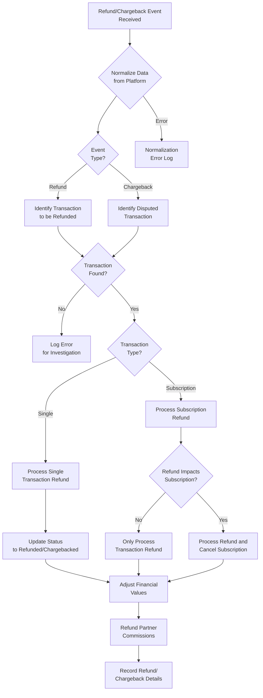

# `Process_Flow_Refund_Chargeback.md` 


```markdown
---
title: "Process Flow: Refunds and Chargebacks"
id: "process_flow_refund_chargeback_001"
doc_type: "process_flow"
doc_version: "1.2"
date_created: "2025-04-23"
date_updated: "2025-04-23"
author: "João Castanheira"
db_name: "joaocastanheira_bancodedados"
db_version: "1.0"
doc_status: "Approved"
environment: "Production"
language: "en"
response_languages: ["pt-BR", "en"]
technical_terms_preservation: "strict"
original_language: "pt-BR"
related_docs: [
  "core_db_architecture_001", 
  "platform_integration_strategy_001", 
  "process_flow_purchase_lifecycle_001", 
  "process_flow_commission_system_001", 
  "process_flow_status_tracking_001", 
  "analytics_examples_001"
]
tables_in_focus: [
  "transactions", 
  "transaction_status_history", 
  "subscriptions", 
  "subscription_status_history", 
  "platform_commission", 
  "platform_transaction_payment_history", 
  "transaction_statuses"
]
technical_terms: {
  "table_names": [
    "transactions", "transaction_status_history", "subscriptions", 
    "subscription_status_history", "platform_commission", 
    "platform_transaction_payment_history", "transaction_statuses",
    "transaction_items", "products"
  ],
  "column_names": [
    "id", "transaction_id", "status_id", "customer_id", "offer_price", 
    "currency_code", "is_subscription", "subscription_id", "producer_net_amount", 
    "partner_commission_amount", "platform_fee_amount", "order_date", 
    "payment_gateway", "change_date", "reason", "created_at", "updated_at", 
    "cancel_date", "payment_method", "payment_type", "value", "payment_date", 
    "metadata", "participant_id", "amount", "source", "product_id", "name"
  ],
  "data_types": [
    "INTEGER", "VARCHAR", "NUMERIC", "TIMESTAMP", "TIMESTAMP WITH TIME ZONE", 
    "TEXT", "JSON", "BOOLEAN", "CURRENT_TIMESTAMP", "INTERVAL"
  ],
  "sql_keywords": [
    "SELECT", "FROM", "WHERE", "JOIN", "LEFT JOIN", "INSERT INTO", "VALUES", 
    "UPDATE", "SET", "CASE", "WHEN", "THEN", "ELSE", "END", "GROUP BY", 
    "ORDER BY", "COUNT", "SUM", "AVG", "ROUND", "EXTRACT", "EPOCH", "IN", 
    "NOT", "LIKE", "ILIKE", "AS", "WITH", "COALESCE", "MIN", "date_trunc", 
    "OVER", "AND", "OR", "NULL", "NOT NULL", "PARTITION BY"
  ],
  "transaction_statuses": [
    "Reembolsada", "Refunded", "Estornada", "Chargebacked",
    "Cancelada", "Canceled", "Em Disputa", "In Dispute"
  ],
  "payment_types": [
    "refund", "REFUND", "chargeback", "PARTIAL_REFUND"
  ],
  "commission_sources": [
    "AFFILIATE", "AFFILIATE_REFUND", "PRODUCER", "PRODUCER_REFUND", 
    "COPRODUCER", "COPRODUCER_REFUND", "AFFILIATE_PARTIAL_REFUND"
  ],
  "programming_terms": [
    "webhook", "API", "payload", "JSON", "timestamp"
  ]
}
embedding_guide_concepts: [
  "refund processing", 
  "chargeback management", 
  "commission refunds", 
  "financial reversal", 
  "status updates", 
  "partial refund", 
  "guarantee policy", 
  "card dispute", 
  "refund flow", 
  "cancellation with refund", 
  "financial impact", 
  "refund analysis", 
  "refund rate", 
  "return reasons", 
  "refund webhook"
]
---


# Process Flow: Refunds and Chargebacks


## Process Overview


The refund and chargeback processing system was designed to consistently manage financial return events, regardless of the originating platform. This process is critical for maintaining the financial integrity of the system, ensuring customer satisfaction, and complying with regulatory requirements.


When a refund or chargeback occurs, the system executes a series of coordinated steps: normalizing the received event, identifying the original transaction, updating status, making financial adjustments, and processing commission refunds. This flow creates a complete and auditable record of every operation, allowing precise financial analyses and efficient dispute resolution.


This process integrates directly with the [Commission System](process_flow_commission_system_001.md) and [Status Tracking](process_flow_status_tracking_001.md), ensuring that all financial and state implications are properly recorded and processed.


(Ref: Refunds and Chargebacks, ID process_flow_refund_chargeback_001)


## Differences between Refunds and Chargebacks


Although both result in returning funds to the customer, refunds and chargebacks have distinct characteristics and implications:


|Characteristic|Refund|Chargeback|
|:--------------|:----------|:-----------|
|**Initiator**|Customer requests directly from seller or platform|Customer disputes with the bank/card issuer|
|**Approval**|Approved by seller/platform|Forced by the issuing bank after investigation|
|**Control**|Seller has control over the process|Little or no seller control over the process|
|**Additional costs**|Generally no extra fees|Often involves chargeback fees and penalties|
|**Reputation impact**|Minimal impact|Can negatively affect reputation with payment processors|
|**Timing**|Generally faster|Longer process, with dispute period|


The system processes both types of events similarly, with specific adaptations to handle the particularities of each.


(Ref: Refunds and Chargebacks, ID process_flow_refund_chargeback_001)


## Process Flow Diagram





The diagram illustrates the complete flow from receiving the event to completing the refund or chargeback processing, including all intermediate steps and decisions.


(Ref: Refunds and Chargebacks, ID process_flow_refund_chargeback_001)


## Data Model for Refunds and Chargebacks


The system uses several tables to record and process refund and chargeback events:


### Main Tables


1. **transactions**: Stores the main transaction affected by the refund/chargeback
   - `status_id`: Updated to reflect the refund/chargeback state
   - `producer_net_amount`, `partner_commission_amount`: Adjusted to reflect values after refund


2. **transaction_status_history**: Records the status change to refund/chargeback
   - `reason`: Documents the reason for the refund/chargeback
   - `change_date`: Records when the refund/chargeback occurred


3. **platform_transaction_payment_history**: Records specific refund details
   - `payment_method`: "refund" or "chargeback"
   - `value`: Negative value indicating the refunded amount
   - `metadata`: JSON with specific details (reason, refund ID, etc.)


4. **platform_commission**: Records commission refunds
   - New records with negative values are created for each refunded commission
   - `source`: Receives "_REFUND" suffix to indicate refund (e.g., "AFFILIATE_REFUND")


### Example Data Structure


For a typical refund, the system records:


```json
// In platform_transaction_payment_history
{
  "transaction_id": 1234,
  "payment_method": "refund",
  "payment_type": "REFUND",
  "value": -97.00,
  "payment_date": "2023-11-21T14:30:00Z",
  "metadata": {
    "refund_reason": "Customer requested during guarantee period",
    "refund_id": "REF123456",
    "refund_type": "full",
    "initiated_by": "customer",
    "platform_refund_id": "plat_ref_987654"
  }
}


// In transaction_status_history
{
  "transaction_id": 1234,
  "status_id": 5, // ID of the "Refunded" status
  "change_date": "2023-11-21T14:30:00Z",
  "reason": "Refund processed via webhook: Customer requested during guarantee period"
}
```


(Ref: Refunds and Chargebacks, ID process_flow_refund_chargeback_001)


## Refund Processing Phases


### 1. Event Reception and Normalization


Processing begins when the system receives a refund or chargeback notification, usually via webhook.


**Process:**
1. Receive event payload (webhook/API)
2. Validate event authenticity
3. Normalize data to the system's standard format
4. Identify the exact event type (full refund, partial refund, chargeback)


**Example of Normalized Data:**
```json
{
  "event_type": "refund",
  "transaction_id": "T123456",
  "payment_gateway": "platform_example",
  "refund_amount": 97.00,
  "is_partial": false,
  "refund_date": "2023-11-21T14:30:00Z",
  "reason": "Customer requested during guarantee period",
  "initiated_by": "customer",
  "refund_id": "REF123456"
}
```


Normalization ensures that, regardless of the originating platform, the system processes data consistently.


(Ref: Refunds and Chargebacks, ID process_flow_refund_chargeback_001)


### 2. Original Transaction Identification


After normalizing the event, the system identifies the original transaction affected by the refund/chargeback.


**Process:**
1. Query the `transactions` table using the transaction ID and platform
2. Verify if the transaction exists and is in a valid state
3. Determine if it's a single transaction or part of a subscription
4. If it's part of a subscription, identify the related subscription


**SQL Query:**
```sql
-- Locate the original transaction
SELECT 
    t.id AS transaction_internal_id,
    t.customer_id,
    t.offer_price,
    t.currency_code,
    t.is_subscription,
    t.subscription_id,
    t.status_id,
    ts.status AS current_status
FROM 
    transactions t
JOIN 
    transaction_statuses ts ON t.status_id = ts.id
WHERE 
    t.transaction_id = 'T123456'
    AND t.payment_gateway = 'platform_example';
```


This phase is critical to ensure that the system is operating on the correct transaction, avoiding potential data inconsistencies.


(Ref: Refunds and Chargebacks, ID process_flow_refund_chargeback_001)


### 3. Status Update


With the transaction identified, the system updates its status to reflect the refund or chargeback.


**Process:**
1. Determine the new normalized status (e.g., "Refunded" or "Chargebacked")
2. Update the transaction with the new status
3. Record the change in the status history with the detailed reason
4. For affected subscriptions, update their status if necessary


**Implementation:**
```sql
-- Update transaction status
UPDATE transactions
SET 
    status_id = (SELECT id FROM transaction_statuses WHERE status = 'Refunded'),
    updated_at = CURRENT_TIMESTAMP
WHERE 
    id = [transaction_internal_id];


-- Record in status history
INSERT INTO transaction_status_history (
    transaction_id,
    status_id,
    change_date,
    reason,
    created_at,
    updated_at
)
VALUES (
    [transaction_internal_id],
    (SELECT id FROM transaction_statuses WHERE status = 'Refunded'),
    CURRENT_TIMESTAMP,
    'Refund processed: Customer requested during guarantee period',
    CURRENT_TIMESTAMP,
    CURRENT_TIMESTAMP
);
```


For subscriptions that also need to be canceled due to the refund:


```sql
-- Update subscription status
UPDATE subscriptions
SET 
    status_id = (SELECT id FROM transaction_statuses WHERE status = 'Canceled'),
    cancel_date = CURRENT_TIMESTAMP,
    updated_at = CURRENT_TIMESTAMP
WHERE 
    id = [subscription_id];


-- Record in subscription status history
INSERT INTO subscription_status_history (
    subscription_id,
    status_id,
    change_date,
    reason,
    created_at,
    updated_at
)
VALUES (
    [subscription_id],
    (SELECT id FROM transaction_statuses WHERE status = 'Canceled'),
    CURRENT_TIMESTAMP,
    'Subscription canceled due to transaction refund',
    CURRENT_TIMESTAMP,
    CURRENT_TIMESTAMP
);
```


(Ref: Refunds and Chargebacks, ID process_flow_refund_chargeback_001)


### 4. Financial Adjustments


After updating the status, the system makes the necessary financial adjustments to the transaction.


**Process:**
1. For full refunds: Zero out relevant financial values
2. For partial refunds: Adjust values proportionally
3. Record the refund as a negative payment event


**Implementation for Full Refund:**
```sql
-- Adjust financial values of the transaction
UPDATE transactions
SET 
    producer_net_amount = 0,
    partner_commission_amount = 0,
    updated_at = CURRENT_TIMESTAMP
WHERE 
    id = [transaction_internal_id];


-- Record the refund event
INSERT INTO platform_transaction_payment_history (
    transaction_id,
    payment_method,
    payment_type,
    value,
    payment_date,
    metadata,
    created_at,
    updated_at
)
VALUES (
    [transaction_internal_id],
    'refund',
    'REFUND',
    -97.00,  -- Negative value indicating refund
    CURRENT_TIMESTAMP,
    '{"reason": "Customer requested during guarantee period", "refund_id": "REF123456", "refund_type": "full"}',
    CURRENT_TIMESTAMP,
    CURRENT_TIMESTAMP
);
```


**Implementation for Partial Refund (example: 50%):**
```sql
-- Calculate new values for partial refund
UPDATE transactions
SET 
    producer_net_amount = producer_net_amount * 0.5,
    partner_commission_amount = partner_commission_amount * 0.5,
    updated_at = CURRENT_TIMESTAMP
WHERE 
    id = [transaction_internal_id];


-- Record the partial refund event
INSERT INTO platform_transaction_payment_history (
    transaction_id,
    payment_method,
    payment_type,
    value,
    payment_date,
    metadata,
    created_at,
    updated_at
)
VALUES (
    [transaction_internal_id],
    'refund',
    'PARTIAL_REFUND',
    -48.50,  -- 50% of the original value
    CURRENT_TIMESTAMP,
    '{"reason": "Partial refund agreement", "refund_id": "REF123456", "refund_type": "partial", "refund_percentage": 50}',
    CURRENT_TIMESTAMP,
    CURRENT_TIMESTAMP
);
```


(Ref: Refunds and Chargebacks, ID process_flow_refund_chargeback_001)


### 5. Commission Refunds


The final step of processing involves refunding commissions paid to partners.


**Process:**
1. Identify all commissions associated with the transaction
2. For each commission, create a corresponding refund record
3. Record negative values to represent the refund


**Implementation:**
```sql
-- Identify all original commissions
WITH original_commissions AS (
    SELECT 
        id,
        participant_id, 
        amount, 
        currency_code, 
        source
    FROM 
        platform_commission
    WHERE 
        transaction_id = [transaction_internal_id]
        AND source NOT LIKE '%REFUND%'
)


-- Record refunds for each commission
INSERT INTO platform_commission (
    transaction_id,
    participant_id,
    amount,
    currency_code,
    source,
    created_at,
    updated_at
)
SELECT
    [transaction_internal_id],
    participant_id,
    -amount,  -- Negative value for refund
    currency_code,
    CASE 
        WHEN source = 'AFFILIATE' THEN 'AFFILIATE_REFUND'
        WHEN source = 'PRODUCER' THEN 'PRODUCER_REFUND'
        WHEN source = 'COPRODUCER' THEN 'COPRODUCER_REFUND'
        ELSE source||'_REFUND'
    END,
    CURRENT_TIMESTAMP,
    CURRENT_TIMESTAMP
FROM
    original_commissions;
```


For partial refunds, refunds are proportional to the refunded percentage:


```sql
-- For 50% partial refund
INSERT INTO platform_commission (
    transaction_id,
    participant_id,
    amount,
    currency_code,
    source,
    created_at,
    updated_at
)
SELECT
    [transaction_internal_id],
    participant_id,
    -amount * 0.5,  -- 50% of the original value
    currency_code,
    source||'_PARTIAL_REFUND',
    CURRENT_TIMESTAMP,
    CURRENT_TIMESTAMP
FROM
    original_commissions;
```


(Ref: Refunds and Chargebacks, ID process_flow_refund_chargeback_001)


## Special Refund Scenarios


### Partial Refund


Partial refunds require special handling to ensure that values are adjusted proportionally.


**Process:**
1. Calculate the percentage of the value being refunded
2. Adjust `producer_net_amount` and `partner_commission_amount` in the same proportion
3. Refund only the proportional part of commissions


**Example:**
```
Original Transaction:
- Offer price: $100.00
- Platform fee: $10.00
- Distributable amount: $90.00
- Affiliate commission: $30.00
- Producer net amount: $60.00


50% Partial Refund:
- Refunded amount: $50.00
- Affiliate commission refund: $15.00 (50% of $30.00)
- New producer net amount: $30.00 (50% of $60.00)
```


The transaction status can be updated to a specific partial refund status or retain the original status, depending on business rules.


### Subscription Refund


Refunds related to subscriptions can have different implications, depending on the context and platform policies.


**Common Scenarios:**


1. **Refund during trial/guarantee period:**
   - Completely cancels the subscription
   - Refunds the initial transaction
   - Revokes access immediately


2. **Refund of specific recurring charge:**
   - Refunds only the specific recurring transaction
   - Subscription remains active for future charges
   - Access is maintained


3. **Refund with proactive cancellation:**
   - Refunds one or more recent transactions
   - Cancels the subscription to prevent future charges
   - Sets final access date (immediate or future)


The processing logic must consider:
- Whether the refund affects the subscription status
- How access dates and next billing dates should be adjusted
- Whether there is a notice period for cancellation


(Ref: Refunds and Chargebacks, ID process_flow_refund_chargeback_001)


## Refund and Chargeback Analyses


The system allows detailed analyses to monitor trends and identify issues related to refunds and chargebacks.


### Refund Rate by Product


```sql
-- Refund rate analysis by product
WITH sales_data AS (
    SELECT 
        p.id AS product_id,
        p.name AS product_name,
        COUNT(t.id) AS total_sales,
        SUM(t.offer_price) AS total_revenue
    FROM 
        transactions t
    JOIN 
        transaction_items ti ON t.id = ti.transaction_id
    JOIN 
        products p ON ti.product_id = p.id
    WHERE 
        t.created_at >= CURRENT_DATE - INTERVAL '90 days'
    GROUP BY 
        p.id, p.name
),
refund_data AS (
    SELECT 
        p.id AS product_id,
        COUNT(t.id) AS refund_count,
        SUM(t.offer_price) AS refunded_amount
    FROM 
        transactions t
    JOIN 
        transaction_items ti ON t.id = ti.transaction_id
    JOIN 
        products p ON ti.product_id = p.id
    JOIN 
        transaction_statuses ts ON t.status_id = ts.id
    WHERE 
        ts.status IN ('Refunded', 'Chargebacked')
        AND t.created_at >= CURRENT_DATE - INTERVAL '90 days'
    GROUP BY 
        p.id
)
SELECT 
    sd.product_name,
    sd.total_sales,
    COALESCE(rd.refund_count, 0) AS refund_count,
    sd.total_revenue,
    COALESCE(rd.refunded_amount, 0) AS refunded_amount,
    ROUND(
        COALESCE(rd.refund_count, 0) * 100.0 / sd.total_sales, 
        2
    ) AS refund_rate_percent
FROM 
    sales_data sd
LEFT JOIN 
    refund_data rd ON sd.product_id = rd.product_id
ORDER BY 
    refund_rate_percent DESC;
```


### Average Time to Refund


```sql
-- Analysis of average time to refund
SELECT 
    date_trunc('month', t.order_date) AS month,
    COUNT(*) AS refund_count,
    ROUND(
        AVG(
            EXTRACT(EPOCH FROM (
                (SELECT MIN(tsh.change_date)
                 FROM transaction_status_history tsh
                 JOIN transaction_statuses ts ON tsh.status_id = ts.id
                 WHERE tsh.transaction_id = t.id
                 AND ts.status IN ('Refunded', 'Chargebacked'))
                - t.order_date
            )) / 86400
        ), 
        1
    ) AS avg_days_to_refund
FROM 
    transactions t
JOIN 
    transaction_statuses ts ON t.status_id = ts.id
WHERE 
    ts.status IN ('Refunded', 'Chargebacked')
    AND t.order_date >= CURRENT_DATE - INTERVAL '365 days'
GROUP BY 
    month
ORDER BY 
    month;
```


### Refund Reason Analysis


```sql
-- Categorization of refund reasons
SELECT 
    CASE
        WHEN tsh.reason ILIKE '%garantia%' OR tsh.reason ILIKE '%guarantee%' THEN 'Satisfaction Guarantee'
        WHEN tsh.reason ILIKE '%tecnic%' OR tsh.reason ILIKE '%problem%' OR tsh.reason ILIKE '%error%' THEN 'Technical Problems'
        WHEN tsh.reason ILIKE '%expect%' OR tsh.reason ILIKE '%descri%' THEN 'Did Not Meet Expectations'
        WHEN tsh.reason ILIKE '%duplic%' THEN 'Duplicate Purchase'
        WHEN tsh.reason ILIKE '%fraud%' OR tsh.reason ILIKE '%unauthoriz%' THEN 'Unauthorized Transaction'
        WHEN tsh.reason ILIKE '%chargeback%' THEN 'Chargeback'
        ELSE 'Other Reasons'
    END AS reason_category,
    COUNT(*) AS count,
    ROUND(
        COUNT(*) * 100.0 / SUM(COUNT(*)) OVER (), 
        2
    ) AS percentage
FROM 
    transaction_status_history tsh
JOIN 
    transaction_statuses ts ON tsh.status_id = ts.id
WHERE 
    ts.status IN ('Refunded', 'Chargebacked')
    AND tsh.created_at >= CURRENT_DATE - INTERVAL '90 days'
GROUP BY 
    reason_category
ORDER BY 
    count DESC;
```


### Financial Impact of Refunds


```sql
-- Monthly financial impact analysis
SELECT 
    date_trunc('month', t.updated_at) AS month,
    COUNT(*) AS refund_count,
    SUM(t.offer_price) AS total_refunded,
    SUM(t.platform_fee_amount) AS platform_fees,
    SUM(t.partner_commission_amount) AS commission_refunds,
    SUM(ptph.value) AS actual_refund_value
FROM 
    transactions t
JOIN 
    transaction_statuses ts ON t.status_id = ts.id
LEFT JOIN 
    platform_transaction_payment_history ptph ON 
        t.id = ptph.transaction_id AND 
        ptph.payment_method = 'refund'
WHERE 
    ts.status IN ('Refunded', 'Chargebacked')
    AND t.updated_at >= CURRENT_DATE - INTERVAL '12 months'
GROUP BY 
    month
ORDER BY 
    month;
```


(Ref: Refunds and Chargebacks, ID process_flow_refund_chargeback_001)


## Challenges and Special Considerations


### Distinct Refund Policies Across Platforms


Each platform may have its own rules and policies for refunds, creating standardization challenges.


**Challenge:** Platform A may allow refunds within 30 days, while Platform B limits to 7 days, with different rules for subscriptions.


**Solution:**
- Normalize processing internally, regardless of specific rules
- Store platform-specific metadata for reference
- Implement flexible logic that accommodates different business rules


### Partial Refund Handling


Partial refunds require precise proportional calculations to maintain financial integrity.


**Challenge:** Ensuring that values are proportionally adjusted in all financial components.


**Solution:**
- Calculate the exact refund proportion
- Apply the same proportion to all derived values (commissions, fees)
- Maintain detailed metadata about the applied calculation


### Chargebacks vs. Voluntary Refunds


Chargebacks and voluntary refunds have different natures and may require distinct handling.


**Challenge:** Chargebacks generally involve disputes, potential penalties, and additional fees.


**Solution:**
- Use distinct statuses or flags to differentiate chargebacks from voluntary refunds
- Include fields for additional fees associated with chargebacks
- Implement specific follow-up flows for chargebacks


### Refund Validation


Not all refunds should be processed automatically, especially outside the guarantee period.


**Challenge:** Establishing a validation process for refunds that require approval.


**Solution:**
- Implement an intermediate state for refunds pending approval
- Record the complete approval flow in the history
- Allow annotations and documentation of evidence for disputed cases


(Ref: Refunds and Chargebacks, ID process_flow_refund_chargeback_001)


## Integration with Other Processes


The refund and chargeback flow integrates with several other system processes:


### 1. Commission System


When a refund occurs, the [Commission System](process_flow_commission_system_001.md) is triggered to:
- Refund commissions paid to affiliates and co-producers
- Record refunds with negative values
- Adjust the producer's net value


### 2. Status Tracking


The [Status Tracking](process_flow_status_tracking_001.md) is updated to:
- Record the transaction status change to "Refunded" or "Chargebacked"
- Maintain the complete history of all status transitions
- Document the reasons for each change


### 3. Subscription Lifecycle


For refunds that affect subscriptions, the process interacts with the subscription lifecycle flow to:
- Update the subscription status (if necessary)
- Cancel future charges
- Set access end dates


### 4. Notifications and Alerts


Refund processing can trigger:
- Notifications to the customer about the refund status
- Alerts to producers about significant refunds
- Reports to administrators about abnormal refund rates


(Ref: Refunds and Chargebacks, ID process_flow_refund_chargeback_001)


## Best Practices for Refund Management


### 1. Detailed Documentation


Always record complete information about each refund:
- Specific reason for the request
- Who initiated and who approved
- Relevant evidence or communications
- Specific details from the originating platform


### 2. Proactive Monitoring


Implement alerts and monitoring for:
- Above-normal refund rates
- Products with high refund rates
- Suspicious patterns (multiple refunds from the same customer)
- Average times for refund requests


### 3. Financial Reconciliation


Perform periodic reconciliation to ensure:
- That all platform refunds were correctly processed
- That commission refunds were calculated precisely
- That financial reports correctly reflect refunds


### 4. Root Cause Analysis


To reduce refund rates:
- Regularly analyze the most common reasons
- Identify patterns by product, affiliate, or period
- Implement improvements based on refund feedback


(Ref: Refunds and Chargebacks, ID process_flow_refund_chargeback_001)


## Conclusion


Efficient processing of refunds and chargebacks is fundamental to the financial and operational integrity of any sales and subscription system. The flow implemented in the `joaocastanheira_bancodedados` database offers:


1. **Unified handling** of refund and chargeback events from multiple platforms
2. **Precise tracking** of all status changes and financial adjustments
3. **Appropriate refunding** of commissions paid to partners
4. **Flexible support** for different refund types (full, partial) and subscription scenarios
5. **Foundation for** detailed trend and financial impact analyses


The described implementation ensures that all aspects of refunds and chargebacks are correctly processed, maintaining financial accuracy and providing the necessary data for business reports and analyses.


(Ref: Refunds and Chargebacks, ID process_flow_refund_chargeback_001)
```