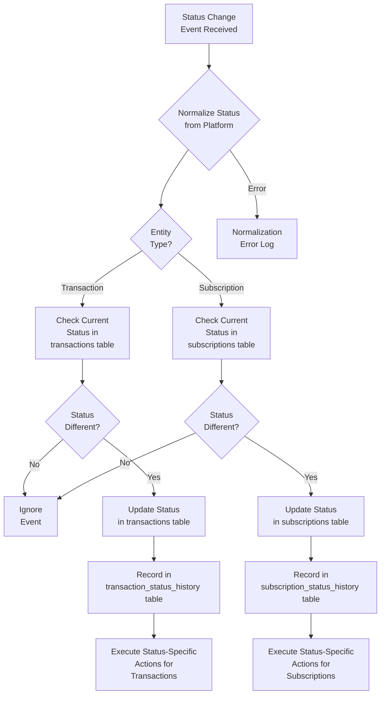

# `Process_Flow_Status_Tracking.md`
```markdown
---
title: "Process Flow: Transaction and Subscription Status Tracking"
id: "process_flow_status_tracking_001"
doc_type: "process_flow"
doc_version: "1.2"
date_created: "2025-04-23"
date_updated: "2025-04-23"
author: "João Castanheira"
db_name: "joaocastanheira_bancodedados"
db_version: "1.0"
doc_status: "Approved"
environment: "Production"
language: "en"
response_languages: ["pt-BR", "en"]
technical_terms_preservation: "strict"
original_language: "pt-BR"
related_docs: [
  "core_db_architecture_001", 
  "platform_integration_strategy_001", 
  "process_flow_purchase_lifecycle_001", 
  "process_flow_subscription_lifecycle_001", 
  "analytics_examples_001"
]
tables_in_focus: [
  "transaction_statuses", 
  "transaction_status_history", 
  "subscription_status_history", 
  "transactions", 
  "subscriptions", 
  "platform_transaction_payment_history"
]
technical_terms: {
  "table_names": [
    "transaction_statuses", "transaction_status_history", "subscription_status_history", 
    "transactions", "subscriptions", "platform_transaction_payment_history", 
    "platform_status_mapping", "subscription_payment_attempts"
  ],
  "column_names": [
    "id", "status", "transaction_id", "subscription_id", "status_id", "change_date", 
    "reason", "created_at", "updated_at", "payment_gateway", "cancel_date", "end_date", 
    "payment_method", "payment_type", "value", "payment_date", "card_brand", 
    "card_last_digits", "metadata", "normalized_status_id", "original_status", 
    "customer_id", "attempt_date", "failure_reason"
  ],
  "data_types": [
    "SERIAL", "VARCHAR", "INTEGER", "TIMESTAMP WITH TIME ZONE", "TEXT", "jsonb_build_object", 
    "PRIMARY KEY", "REFERENCES", "ON DELETE CASCADE", "DEFAULT", "CURRENT_TIMESTAMP", 
    "UNIQUE", "NOT NULL"
  ],
  "sql_keywords": [
    "CREATE TABLE", "CREATE INDEX", "SELECT", "FROM", "WHERE", "JOIN", "INSERT INTO", 
    "VALUES", "UPDATE", "SET", "GROUP BY", "ORDER BY", "HAVING", "CASE", "WHEN", "THEN", 
    "ELSE", "END", "WITH", "OVER", "PARTITION BY", "LEAD", "EXISTS", "NOT EXISTS", 
    "COALESCE", "EXTRACT", "EPOCH", "COUNT", "SUM", "AVG", "ROUND", "INTERVAL", 
    "CURRENT_DATE", "CURRENT_TIMESTAMP", "DESC", "ASC", "AS", "ON", "AND", "OR", 
    "IN", "LIKE", "DATE_TRUNC"
  ],
  "status_values": [
    "Pendente", "Pending", "Aguardando Pagamento", "Awaiting Payment", "Processando", 
    "Processing", "Aprovada", "Approved", "Recusada", "Declined", "Cancelada", "Canceled", 
    "Reembolsada", "Refunded", "Em Disputa", "In Dispute", "Expirada", "Expired", 
    "Trial", "Ativa", "Active", "Inadimplente", "Defaulting", "Suspensa", "Suspended", 
    "Cancelada Cliente", "Canceled by Customer", "Cancelada Admin", "Canceled by Admin"
  ],
  "payment_types": [
    "refund", "REFUND"
  ],
  "functions": [
    "normalize_status", "calculate_and_register_commissions", "process_commission_refunds", 
    "subscription_has_recovery_enabled", "schedule_recovery_attempt", "get_current_status", 
    "get_platform_status", "update_transaction_status", "get_default_status_id", 
    "reconcile_transaction_status"
  ],
  "programming_terms": [
    "pseudocódigo", "webhook", "UTC", "timestamp", "log", "API", "rotinas"
  ]
}
embedding_guide_concepts: [
  "status tracking", 
  "transaction history", 
  "subscription history", 
  "status normalization", 
  "status mapping", 
  "transaction auditing", 
  "lifecycle", 
  "state change", 
  "platform events", 
  "status webhooks", 
  "transaction timeline", 
  "status unification", 
  "status transition", 
  "temporal analysis", 
  "status reconciliation"
]
---


# Process Flow: Transaction and Subscription Status Tracking


## Process Overview


The status tracking system was designed to record, normalize, and analyze all state transitions that transactions and subscriptions go through during their lifecycle. This process is fundamental for maintaining the historical integrity of data and enabling precise temporal analyses in an environment that integrates multiple platforms.


Through normalizing statuses from different sources into a unified model, the system allows operations and analyses to be performed consistently, regardless of the data's platform of origin. For each status change, a complete historical record is maintained, creating a detailed audit trail that documents the entire journey of the transaction or subscription.


This process integrates directly with the [Purchase Lifecycle Flow](process_flow_purchase_lifecycle_001.md) and the [Subscription Lifecycle Flow](process_flow_subscription_lifecycle_001.md), recording the critical events that determine the state of these entities over time.


(Ref: Status Tracking, ID process_flow_status_tracking_001)


## Data Model for Status Tracking


### Central Table: `transaction_statuses`


This table functions as a central catalog that defines all normalized statuses in the system:


```sql
CREATE TABLE IF NOT EXISTS transaction_statuses (
    id         SERIAL PRIMARY KEY,
    status     VARCHAR(50) NOT NULL UNIQUE,                -- Status name
    created_at TIMESTAMP WITH TIME ZONE DEFAULT CURRENT_TIMESTAMP,
    updated_at TIMESTAMP WITH TIME ZONE DEFAULT CURRENT_TIMESTAMP
);
```


All normalized statuses are registered in this table. This creates a single point of truth for possible states, simplifying queries and ensuring consistency.


### History Tables


Two tables maintain the complete history of all status changes:


```sql
-- Status history for transactions
CREATE TABLE IF NOT EXISTS transaction_status_history (
    id             SERIAL PRIMARY KEY,
    transaction_id INTEGER NOT NULL REFERENCES transactions ON DELETE CASCADE,
    status_id      INTEGER NOT NULL REFERENCES transaction_statuses,
    change_date    TIMESTAMP WITH TIME ZONE DEFAULT CURRENT_TIMESTAMP,
    reason         TEXT,                                   -- Reason for change
    created_at     TIMESTAMP WITH TIME ZONE DEFAULT CURRENT_TIMESTAMP,
    updated_at     TIMESTAMP WITH TIME ZONE DEFAULT CURRENT_TIMESTAMP
);


-- Status history for subscriptions
CREATE TABLE IF NOT EXISTS subscription_status_history (
    id              SERIAL PRIMARY KEY,
    subscription_id INTEGER NOT NULL REFERENCES subscriptions ON DELETE CASCADE,
    status_id       INTEGER NOT NULL REFERENCES transaction_statuses,
    change_date     TIMESTAMP WITH TIME ZONE DEFAULT CURRENT_TIMESTAMP,
    reason          TEXT,                                   -- Reason for change
    created_at      TIMESTAMP WITH TIME ZONE DEFAULT CURRENT_TIMESTAMP,
    updated_at      TIMESTAMP WITH TIME ZONE DEFAULT CURRENT_TIMESTAMP
);
```


These tables capture each status transition, recording not only what the change was, but also when and why it occurred.


(Ref: Status Tracking, ID process_flow_status_tracking_001)


## Process Flow Diagram





The diagram illustrates the complete process from receiving a status change event to recording it in the history and executing specific actions related to the new status.


(Ref: Status Tracking, ID process_flow_status_tracking_001)


## Normalized Status Catalog


The system employs a standardized set of statuses that are consistent across all integrated platforms. These statuses are grouped by entity type:


### Transaction Statuses


|Normalized Status|Description|Common Actions|
|:-------------------|:----------|:-------------|
|**Pending**|Transaction initiated, awaiting interaction|Monitor for timeout|
|**Awaiting Payment**|Boleto/PIX generated, awaiting payment|Send reminders|
|**Processing**|Payment in processing|Monitor gateway response|
|**Approved**|Payment confirmed|Grant access, calculate commissions|
|**Declined**|Payment rejected|Notify customer, offer alternatives|
|**Canceled**|Canceled before completion|Clear reserved resources|
|**Refunded**|Amount returned to customer|Adjust commissions, revoke access|
|**In Dispute**|Contestation/chargeback opened|Collect documentation, monitor|
|**Expired**|Payment deadline passed|Clear purchase attempt|


### Subscription Statuses


|Normalized Status|Description|Common Actions|
|:-------------------|:----------|:-------------|
|**Trial**|Free trial period|Monitor conversion to paid|
|**Active**|Subscription up to date|Process renewals according to cycle|
|**Defaulting**|Failed recurring payment|Attempt recovery, limit access|
|**Suspended**|Temporarily paused|Pause charges, retain data|
|**Canceled by Customer**|Canceled by subscriber|Confirm reason, attempt retention|
|**Canceled by Admin**|Canceled by producer/admin|Document reason, notify customer|
|**Expired**|End of maximum period|Offer renewal or upgrade|


The detailed mapping between original statuses from each platform and these normalized statuses is managed according to the [Multi-platform Integration Strategy](platform_integration_strategy_001.md).


(Ref: Status Tracking, ID process_flow_status_tracking_001)


## Tracking Process Phases


### Phase 1: Event Reception and Normalization


When a status change event is received, the first step is to normalize it to the system's unified model.


**Process:**
1. Receive event via webhook or API
2. Validate the authenticity and structure of the event
3. Identify the entity type (transaction or subscription)
4. Extract relevant data:
   - Entity identifier on the platform
   - Original status on the platform
   - Timestamp of the change
   - Reason for the change (when available)
5. Normalize the status using the defined mapping


**Normalization Example:**
```python
# Pseudocode for status normalization
def normalize_status(platform, entity_type, original_status):
    # Query status mapping table
    normalized_status_id = db.query("""
        SELECT normalized_status_id 
        FROM platform_status_mapping 
        WHERE platform = :platform 
          AND entity_type = :entity_type 
          AND original_status = :original_status
    """, {
        "platform": platform,
        "entity_type": entity_type,
        "original_status": original_status
    })
    
    if not normalized_status_id:
        log.warning(f"Unmapped status: {platform}, {entity_type}, {original_status}")
        # Use an appropriate default status for unmapped cases
        normalized_status_id = get_default_status_id(entity_type)
    
    return normalized_status_id
```


This phase ensures that, regardless of the nomenclature used by the source platform, the status is consistently interpreted by the system.


(Ref: Status Tracking, ID process_flow_status_tracking_001)


### Phase 2: Verification and Update of Main Entity


After normalizing the status, the system checks if it represents a real change and, if so, updates the corresponding entity.


**Process:**
1. Check the current status of the entity in the database
2. Compare with the received normalized status
3. If they are different:
   - Update the status in the main table (transactions or subscriptions)
   - Update status-related fields (e.g., specific dates)
4. If they are the same:
   - Record only in the history, without modifying the entity


**Example for Transactions:**
```sql
-- Check current status
SELECT id, status_id 
FROM transactions
WHERE transaction_id = :transaction_id_from_platform
  AND payment_gateway = :platform;


-- If different, update
UPDATE transactions
SET status_id = :new_status_id,
    updated_at = CURRENT_TIMESTAMP
WHERE transaction_id = :transaction_id_from_platform
  AND payment_gateway = :platform
  AND status_id != :new_status_id;
```


**Example for Subscriptions:**
```sql
-- Update status and related fields
UPDATE subscriptions
SET status_id = :new_status_id,
    updated_at = CURRENT_TIMESTAMP,
    -- Additional fields based on status
    cancel_date = CASE 
        WHEN :new_status_id IN (SELECT id FROM transaction_statuses WHERE status IN ('Canceled by Customer', 'Canceled by Admin'))
        THEN CURRENT_TIMESTAMP
        ELSE cancel_date
    END,
    end_date = CASE 
        WHEN :new_status_id IN (SELECT id FROM transaction_statuses WHERE status IN ('Canceled by Customer', 'Canceled by Admin', 'Expired'))
        THEN CURRENT_TIMESTAMP
        ELSE end_date
    END
WHERE subscription_id = :subscription_id_from_platform
  AND payment_gateway = :platform
  AND status_id != :new_status_id;
```


This phase ensures that the current state of entities is always up-to-date, reflecting the most recent information.


(Ref: Status Tracking, ID process_flow_status_tracking_001)


### Phase 3: History Recording


Each status change is recorded in the corresponding history tables, creating a complete chronological record.


**Process:**
1. Determine the internal ID of the entity (transaction or subscription)
2. Prepare data for the historical record:
   - Entity ID
   - Normalized status ID
   - Date and time of change
   - Reason for change
3. Insert the record into the appropriate table


**Example for Transactions:**
```sql
-- Record status history
INSERT INTO transaction_status_history (
    transaction_id,
    status_id,
    change_date,
    reason,
    created_at,
    updated_at
)
VALUES (
    :internal_transaction_id,  -- Internal transaction ID
    :normalized_status_id,     -- Normalized status ID
    :change_timestamp,         -- Event timestamp (from platform)
    :change_reason,            -- Reason for change
    CURRENT_TIMESTAMP,
    CURRENT_TIMESTAMP
);
```


**Example for Subscriptions:**
```sql
-- Record status history
INSERT INTO subscription_status_history (
    subscription_id,
    status_id,
    change_date,
    reason,
    created_at,
    updated_at
)
VALUES (
    :internal_subscription_id,  -- Internal subscription ID
    :normalized_status_id,      -- Normalized status ID
    :change_timestamp,          -- Event timestamp (from platform)
    :change_reason,             -- Reason for change
    CURRENT_TIMESTAMP,
    CURRENT_TIMESTAMP
);
```


This complete history allows auditing, trend analysis, and problem diagnosis over time.


(Ref: Status Tracking, ID process_flow_status_tracking_001)


### Phase 4: Status-Specific Actions


Different statuses can trigger additional specific actions in the system.


**Examples for Transactions:**


For **Approved** status:
```sql
-- Record payment details
INSERT INTO platform_transaction_payment_history (
    transaction_id,
    payment_method,
    payment_type,
    value,
    payment_date,
    card_brand,
    card_last_digits,
    created_at,
    updated_at
)
VALUES (
    :internal_transaction_id,
    :payment_method,
    :payment_type,
    :transaction_amount,
    :payment_timestamp,
    :card_brand,
    :last_digits,
    CURRENT_TIMESTAMP,
    CURRENT_TIMESTAMP
);


-- Calculate and record commissions (separate process)
CALL calculate_and_register_commissions(:internal_transaction_id);
```


For **Refunded** status:
```sql
-- Record the refund in payment details
INSERT INTO platform_transaction_payment_history (
    transaction_id,
    payment_method,
    payment_type,
    value,
    payment_date,
    metadata,
    created_at,
    updated_at
)
VALUES (
    :internal_transaction_id,
    'refund',
    'REFUND',
    -:refund_amount,  -- Negative value to indicate refund
    :refund_timestamp,
    jsonb_build_object('refund_reason', :reason, 'refund_id', :refund_id),
    CURRENT_TIMESTAMP,
    CURRENT_TIMESTAMP
);


-- Process commission refunds (if applicable)
CALL process_commission_refunds(:internal_transaction_id);
```


**Examples for Subscriptions:**


For **Defaulting** status:
```sql
-- Record failed payment attempt
INSERT INTO subscription_payment_attempts (
    subscription_id,
    attempt_date,
    status,
    failure_reason,
    created_at
)
VALUES (
    :internal_subscription_id,
    :attempt_timestamp,
    'failed',
    :failure_reason,
    CURRENT_TIMESTAMP
);


-- Start recovery flow (if configured)
IF subscription_has_recovery_enabled(:internal_subscription_id) THEN
    CALL schedule_recovery_attempt(:internal_subscription_id);
END IF;
```


These specific actions ensure that the system reacts appropriately to each status change, maintaining data consistency and triggering complementary processes when necessary.


(Ref: Status Tracking, ID process_flow_status_tracking_001)


## Status and Transition Analyses


The status tracking system allows detailed analyses that offer valuable insights into the lifecycle of transactions and subscriptions.


### 1. Complete History of an Entity


```sql
-- Complete status history of a transaction
SELECT 
    tsh.change_date,
    ts.status AS status_name,
    tsh.reason
FROM 
    transaction_status_history tsh
JOIN 
    transaction_statuses ts ON tsh.status_id = ts.id
WHERE 
    tsh.transaction_id = :internal_transaction_id
ORDER BY 
    tsh.change_date ASC;
```


This query displays the entire journey of a specific transaction, showing each status it went through, when the change occurred, and why.


### 2. Time in Status Analysis


```sql
-- Average time in each status for recent transactions
WITH status_periods AS (
    SELECT 
        t.id,
        tsh1.status_id,
        ts.status,
        tsh1.change_date AS start_date,
        LEAD(tsh1.change_date) OVER (
            PARTITION BY t.id 
            ORDER BY tsh1.change_date
        ) AS end_date
    FROM 
        transactions t
    JOIN 
        transaction_status_history tsh1 ON t.id = tsh1.transaction_id
    JOIN 
        transaction_statuses ts ON tsh1.status_id = ts.id
    WHERE 
        t.created_at >= CURRENT_DATE - INTERVAL '30 days'
)
SELECT 
    status,
    COUNT(*) AS transitions,
    AVG(
        EXTRACT(EPOCH FROM (
            COALESCE(end_date, CURRENT_TIMESTAMP) - start_date
        ))
    ) / 60 AS avg_minutes_in_status
FROM 
    status_periods
GROUP BY 
    status
ORDER BY 
    avg_minutes_in_status DESC;
```


This analysis helps identify potential bottlenecks in the process, showing how long, on average, transactions remain in each status.


### 3. Status Flow Analysis


```sql
-- Flow analysis: From which status -> to which status
SELECT 
    ts_from.status AS from_status,
    ts_to.status AS to_status,
    COUNT(*) AS transition_count,
    ROUND(
        COUNT(*) * 100.0 / SUM(COUNT(*)) OVER (PARTITION BY ts_from.status),
        2
    ) AS percentage_of_outgoing
FROM 
    transaction_status_history tsh1
JOIN 
    transaction_status_history tsh2 ON 
        tsh1.transaction_id = tsh2.transaction_id AND
        tsh2.change_date > tsh1.change_date AND
        NOT EXISTS (
            SELECT 1 FROM transaction_status_history tsh3
            WHERE tsh3.transaction_id = tsh1.transaction_id
              AND tsh3.change_date > tsh1.change_date
              AND tsh3.change_date < tsh2.change_date
        )
JOIN 
    transaction_statuses ts_from ON tsh1.status_id = ts_from.id
JOIN 
    transaction_statuses ts_to ON tsh2.status_id = ts_to.id
WHERE 
    tsh1.change_date >= CURRENT_DATE - INTERVAL '90 days'
GROUP BY 
    ts_from.status, ts_to.status
ORDER BY 
    ts_from.status, transition_count DESC;
```


This analysis maps the most common paths between statuses, showing where a transaction usually goes after being in a certain status.


### 4. Platform Conversion Comparison


```sql
-- Approval rate comparison between platforms
WITH transaction_outcomes AS (
    SELECT 
        t.payment_gateway,
        t.id,
        CASE 
            WHEN EXISTS (
                SELECT 1 FROM transaction_status_history tsh
                JOIN transaction_statuses ts ON tsh.status_id = ts.id
                WHERE tsh.transaction_id = t.id
                AND ts.status = 'Approved'
            ) THEN 1
            ELSE 0
        END AS converted
    FROM 
        transactions t
    WHERE 
        t.created_at >= CURRENT_DATE - INTERVAL '30 days'
)
SELECT 
    payment_gateway,
    COUNT(*) AS total_transactions,
    SUM(converted) AS approved_transactions,
    ROUND(SUM(converted) * 100.0 / COUNT(*), 2) AS approval_rate
FROM 
    transaction_outcomes
GROUP BY 
    payment_gateway
ORDER BY 
    approval_rate DESC;
```


This query allows comparing the effectiveness of different platforms, showing which has the highest conversion rate from pending to approved transactions.


(Ref: Status Tracking, ID process_flow_status_tracking_001)


## Challenges and Solutions


### 1. Out-of-Order Events


**Challenge:** Webhooks and API notifications may arrive in a different order than the actual sequence of events.


**Solution:**
- Store and use original event timestamps, not the moment of reception
- Create temporal verification logic before applying changes
- Maintain complete history even for events received out of order


**Implementation:**
```sql
-- Check if the received event is more recent than the last recorded
INSERT INTO transaction_status_history (transaction_id, status_id, change_date, reason)
SELECT 
    :internal_transaction_id, 
    :new_status_id,
    :event_timestamp,
    :reason
WHERE 
    NOT EXISTS (
        SELECT 1 FROM transaction_status_history 
        WHERE transaction_id = :internal_transaction_id
        AND change_date > :event_timestamp
    );
```


### 2. Platform-Specific Statuses


**Challenge:** Some platforms have unique statuses that don't have a direct equivalent in the normalized model.


**Solution:**
- Keep the original status as metadata for specific cases
- Implement flexible mappings that can evolve over time
- For truly unique statuses, create specific normalized statuses if necessary


### 3. Status Reconciliation


**Challenge:** Statuses can become out of sync between the system and source platforms.


**Solution:**
- Implement periodic checks via platform APIs
- Reconciliation routines that compare current status with the platform
- Process for automatic resolution of discrepancies


**Reconciliation Process:**
```python
# Pseudocode for reconciliation
def reconcile_transaction_status(transaction_id, platform):
    # Get current status in our system
    current_status = get_current_status(transaction_id, platform)
    
    # Query platform API for current status there
    platform_status = get_platform_status(transaction_id, platform)
    
    # Normalize platform status
    normalized_status = normalize_status(platform, "transaction", platform_status)
    
    # If different, update our system
    if current_status != normalized_status:
        update_transaction_status(
            transaction_id, 
            platform, 
            normalized_status,
            "Automatic update via reconciliation"
        )
        
        log.info(f"Reconciliation: transaction {transaction_id} updated from {current_status} to {normalized_status}")
```


### 4. Performance in Historical Queries


**Challenge:** As history grows, queries can become slow.


**Solution:**
- Optimized indexes on history tables
- Partitioning by date for very large histories
- Materialized views for common analyses


**Recommended Indexes:**
```sql
-- Indexes to improve performance in historical queries
CREATE INDEX idx_tsh_transaction_change_date ON transaction_status_history(transaction_id, change_date);
CREATE INDEX idx_tsh_status_change_date ON transaction_status_history(status_id, change_date);
CREATE INDEX idx_ssh_subscription_change_date ON subscription_status_history(subscription_id, change_date);
```


(Ref: Status Tracking, ID process_flow_status_tracking_001)


## Integration with Other Systems


Status tracking integrates with various other system components:


### 1. Notifications and Alerts


Specific status changes can trigger automatic notifications for:
- Customers (e.g., "Your payment has been approved")
- Administrators (e.g., "Abnormal increase in declined transactions")
- Affiliates (e.g., "Commission confirmed")


```sql
-- Example: Identify transitions that should generate notifications
SELECT 
    t.id, t.transaction_id, t.customer_id,
    ts_new.status AS new_status
FROM 
    transaction_status_history tsh
JOIN 
    transactions t ON tsh.transaction_id = t.id
JOIN 
    transaction_statuses ts_new ON tsh.status_id = ts_new.id
WHERE 
    tsh.id = :latest_history_id
    AND ts_new.status IN ('Approved', 'Refunded', 'Declined');
```


### 2. Recovery Automations


Statuses like "Declined" or "Defaulting" can trigger automatic recovery flows:
- Alternative payment attempts
- Reminder sending
- Discount offers for retention


### 3. Risk Analysis


Status transition patterns are important for risk analysis:
- Accounts with many declined transactions
- Abnormal refund patterns
- Average time between approval and dispute


### 4. Business Intelligence


Status history data feeds essential BI reports:
- Sales conversion funnel
- Subscription retention rates
- Cycle time for each sales phase


(Ref: Status Tracking, ID process_flow_status_tracking_001)


## Best Practices for Status Tracking


### 1. Change Documentation


Whenever possible, record the reason for the status change:
- For automatic changes, use standardized descriptions
- For manual changes, require an explanatory comment
- For reconciliations, indicate the source of truth


### 2. Timestamp Granularity


Use timestamps with time zone (TIMESTAMP WITH TIME ZONE) to avoid ambiguities:
- Store in UTC internally
- Preserve the original event timestamp when available
- Maintain millisecond precision for correct ordering


### 3. Design for Auditing


The tracking system should serve as a reliable source for auditing:
- Never update historical records, only add new ones
- Keep sufficient metadata to reconstruct the exact chronology
- Record the origin of the change (system, API, user, reconciliation)


### 4. Proactive Monitoring


Implement alerts for abnormal behaviors in the status system:
- Transactions stuck in a certain status for excessive time
- Frequent oscillations between statuses (possible instability)
- Sudden increases in negative statuses (declines, refunds)


(Ref: Status Tracking, ID process_flow_status_tracking_001)


## Conclusion


The status tracking system is a fundamental component of the database architecture, providing:


1. **Complete visibility** of the lifecycle of transactions and subscriptions
2. **Normalization** of distinct terminologies from various platforms
3. **Audit trail** detailed for all state changes
4. **Foundation for analyses** temporal and performance
5. **Basis for automations** triggered by status changes


The implemented approach ensures that the system maintains an accurate and complete historical record, regardless of the data's platform of origin, while offering a standardized model that simplifies queries and analyses.


Status tracking, in conjunction with other system components, creates a cohesive and consistent data ecosystem that allows effectively tracking and managing the entire financial lifecycle of business transactions.


(Ref: Status Tracking, ID process_flow_status_tracking_001)
```