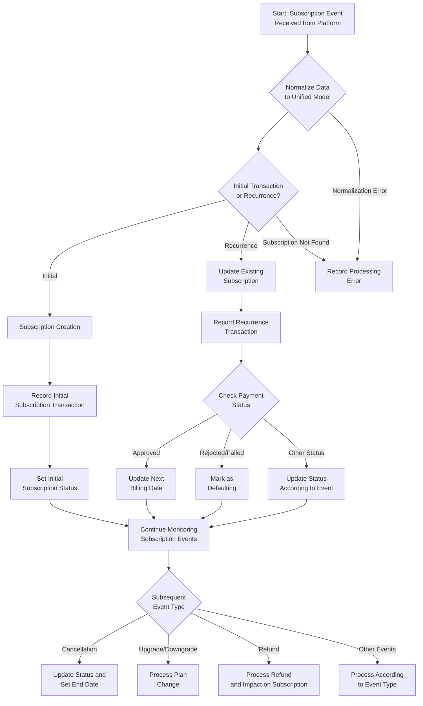
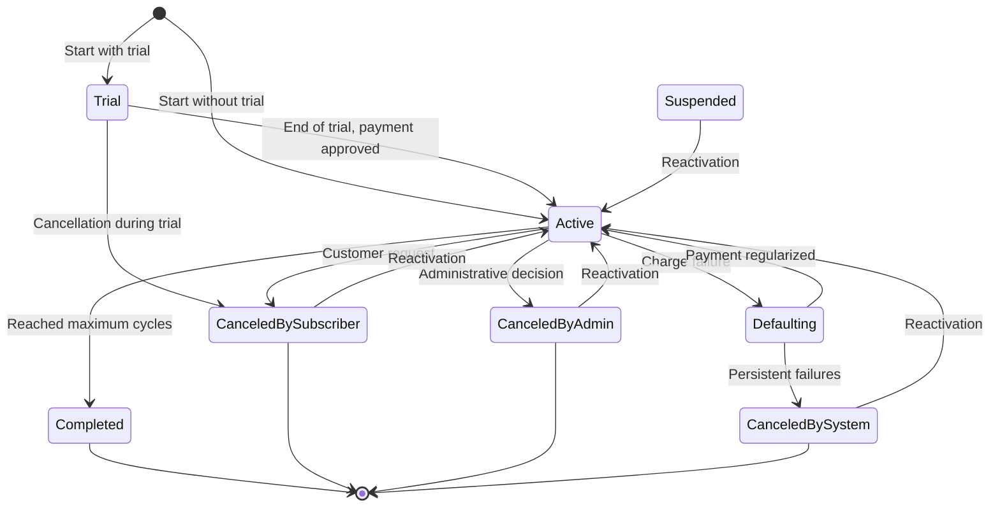
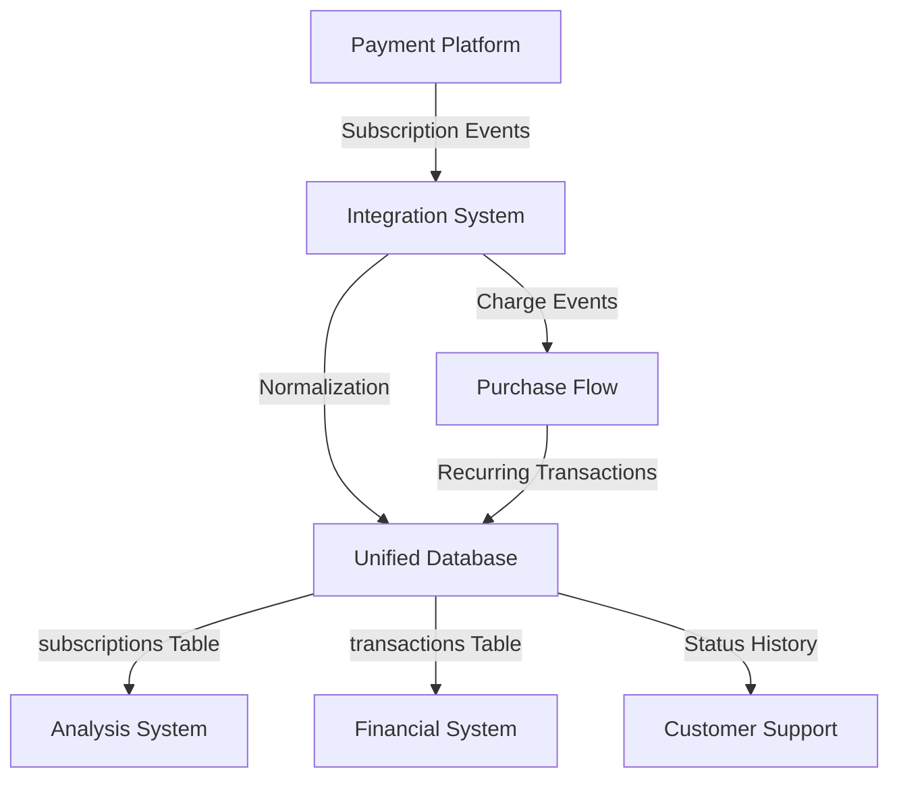

# `Process_Flow_Subscription_Lifecycle.md`


```markdown
---
title: "Process Flow: Subscription Lifecycle"
id: "process_flow_subscription_lifecycle_001"
doc_type: "process_flow"
doc_version: "1.2"
date_created: "2025-04-23"
date_updated: "2025-04-23"
author: "João Castanheira"
db_name: "joaocastanheira_bancodedados"
db_version: "1.0"
doc_status: "Approved"
environment: "Production"
language: "en"
response_languages: ["pt-BR", "en"]
technical_terms_preservation: "strict"
original_language: "pt-BR"
related_docs: [
  "core_db_architecture_001", 
  "platform_integration_strategy_001", 
  "process_flow_purchase_lifecycle_001", 
  "domain_products_catalog_001", 
  "analytics_examples_001"
]
tables_in_focus: [
  "subscriptions",
  "subscription_status_history",
  "plans",
  "transactions",
  "transaction_status_history",
  "customers",
  "transaction_fees",
  "platform_commission"
]
technical_terms: {
  "table_names": [
    "subscriptions", "subscription_status_history", "plans", "transactions", 
    "transaction_status_history", "customers", "transaction_fees", 
    "platform_commission", "platform_status_mapping", "transaction_statuses"
  ],
  "column_names": [
    "id", "subscription_id", "subscriber_id", "initial_transaction_id", 
    "customer_id", "plan_id", "payment_gateway", "billing_cycle", 
    "total_recurrences", "max_cycles", "last_update", "start_date", 
    "end_date", "status_id", "request_billet", "next_billing_date", 
    "cancel_date", "created_at", "updated_at", "change_date", 
    "reason", "transaction_id", "is_subscription", "platform_subscription_id", 
    "recurrence_number", "payment_method", "offer_price", "order_date",
    "recurrence_period", "price", "email", "name"
  ],
  "data_types": [
    "SERIAL", "VARCHAR", "INTEGER", "BOOLEAN", "TIMESTAMP WITH TIME ZONE", 
    "REFERENCES", "PRIMARY KEY", "DEFAULT", "CONSTRAINT", "UNIQUE", 
    "ON DELETE CASCADE", "INTERVAL", "TEXT"
  ],
  "subscription_statuses": [
    "Ativa", "Trial", "Inadimplente", "Cancelada Assinante", "Cancelada Admin", 
    "Cancelada Sistema", "Concluída", "Suspensa",
    "Active", "Trial", "Defaulting", "Canceled by Subscriber", "Canceled by Admin", 
    "Canceled by System", "Completed", "Suspended"
  ],
  "billing_cycles": [
    "MONTHLY", "YEARLY", "WEEKLY", "QUARTERLY"
  ],
  "sql_keywords": [
    "CREATE TABLE", "INSERT INTO", "UPDATE", "SELECT", "FROM", "WHERE", "JOIN", 
    "GROUP BY", "ORDER BY", "VALUES", "COUNT", "SUM", "AVG", "ROUND", "FILTER", 
    "CASE", "WHEN", "THEN", "ELSE", "END", "AND", "OR", "NOT", "NULL", "WITH", 
    "AS", "HAVING", "COALESCE", "EXTRACT", "DATE_TRUNC", "INTERVAL", "ON", 
    "BETWEEN", "IN", "IS", "NOW()", "CURRENT_DATE", "CURRENT_TIMESTAMP",
    "generate_series", "date_trunc", "TO_CHAR", "DISTINCT", "LEFT JOIN"
  ],
  "functions": [
    "normalize_subscription_event", "get_platform_adapter", "extract_subscription_id",
    "map_status_to_normalized", "extract_plan_id", "extract_start_date",
    "calculate_next_billing_date", "should_apply_status_change"
  ],
  "programming_terms": [
    "adapter", "normalized_data", "event_data", "webhook", "pseudocode",
    "timedelta", "timestamp"
  ],
  "payment_methods": [
    "credit_card"
  ]
}
embedding_guide_concepts: [
  "subscription lifecycle", 
  "payment recurrence", 
  "subscription management", 
  "subscription status", 
  "next billing", 
  "cancellation", 
  "defaulting", 
  "trial",
  "plan upgrade",
  "plan downgrade",
  "subscription reactivation",
  "multi-platform subscriptions",
  "subscription normalization",
  "subscription gateway integration",
  "MRR",
  "churn",
  "automatic renewal"
]
---


# Process Flow: Subscription Lifecycle


## Process Overview


This document describes the complete process of subscription management in the system, from creation to eventual termination. The flow was designed to work with multiple platforms and payment gateways, unifying data in a coherent model that allows consistent analysis regardless of origin.


Subscriptions represent an ongoing relationship with the customer, characterized by recurring payments at defined intervals. Each subscription is linked to a specific plan and generates recurring transactions that are recorded in the system in the same way as one-time transactions, but with specific markers.


This process complements the **[Purchase Lifecycle Flow](process_flow_purchase_lifecycle_001.md)** and integrates with the **[Multi-platform Integration Strategy](platform_integration_strategy_001.md)** to normalize data from different platforms into a uniform model.


(Ref: Subscription Lifecycle, ID process_flow_subscription_lifecycle_001)


## Process Flow Diagram





This diagram illustrates the complete flow of a subscription lifecycle, highlighting how the process begins with normalizing received data, continues with creating or updating the subscription, and then monitors subsequent events such as renewals, cancellations, and plan changes.


(Ref: Subscription Lifecycle, ID process_flow_subscription_lifecycle_001)


## Subscription Data Model


### Main Table: `subscriptions`


The `subscriptions` table is the center of the subscription data model, containing all essential information about the current status and configuration of each subscription:


```sql
CREATE TABLE IF NOT EXISTS subscriptions (
    id                     SERIAL PRIMARY KEY,
    subscription_id        VARCHAR(100) NOT NULL,          -- Subscription ID on the platform
    subscriber_id          VARCHAR(100),                   -- Subscriber ID on the platform
    initial_transaction_id VARCHAR(100),                   -- Initial transaction ID
    customer_id            INTEGER REFERENCES customers,   -- Associated customer
    plan_id                INTEGER REFERENCES plans,       -- Associated plan
    payment_gateway        VARCHAR(100) NOT NULL,          -- Payment gateway
    billing_cycle          VARCHAR(50),                    -- Billing cycle
    total_recurrences      INTEGER,                        -- Total recurrences
    max_cycles             INTEGER,                        -- Maximum cycles
    last_update            TIMESTAMP WITH TIME ZONE,       -- Last update
    start_date             TIMESTAMP WITH TIME ZONE,       -- Start date
    end_date               TIMESTAMP WITH TIME ZONE,       -- End date
    status_id              INTEGER REFERENCES transaction_statuses, -- Current status
    request_billet         BOOLEAN DEFAULT false,          -- Billet request
    next_billing_date      TIMESTAMP WITH TIME ZONE,       -- Next billing date
    cancel_date            TIMESTAMP WITH TIME ZONE,       -- Cancellation date
    created_at             TIMESTAMP WITH TIME ZONE DEFAULT CURRENT_TIMESTAMP,
    updated_at             TIMESTAMP WITH TIME ZONE DEFAULT CURRENT_TIMESTAMP,
    CONSTRAINT uq_subscription_gateway UNIQUE (subscription_id, payment_gateway)
);
```


Key fields include:
- `subscription_id` and `payment_gateway`: Uniquely identify the subscription on its platform of origin
- `customer_id` and `plan_id`: Reference the customer and plan associated with this subscription
- `status_id`: Current subscription status (mapped to a normalized model)
- `next_billing_date`: Next scheduled billing date
- `billing_cycle`, `total_recurrences`, `max_cycles`: Billing cycle configuration


### Status History: `subscription_status_history`


This table maintains a complete record of all subscription status changes:


```sql
CREATE TABLE IF NOT EXISTS subscription_status_history (
    id              SERIAL PRIMARY KEY,
    subscription_id INTEGER NOT NULL REFERENCES subscriptions ON DELETE CASCADE,
    status_id       INTEGER NOT NULL REFERENCES transaction_statuses,
    change_date     TIMESTAMP WITH TIME ZONE DEFAULT CURRENT_TIMESTAMP,
    reason          TEXT,                                   -- Reason for change
    created_at      TIMESTAMP WITH TIME ZONE DEFAULT CURRENT_TIMESTAMP,
    updated_at      TIMESTAMP WITH TIME ZONE DEFAULT CURRENT_TIMESTAMP
);
```


### Relationship with Transactions: `transactions`


Each recurring charge is recorded as a transaction linked to the subscription:


```sql
-- Relevant fields for subscriptions in the transactions table
is_subscription           BOOLEAN DEFAULT false,            -- Is subscription?
subscription_id           INTEGER REFERENCES subscriptions, -- Associated subscription
platform_subscription_id  VARCHAR(100),                     -- Subscription ID on the platform
recurrence_number         INTEGER,                          -- Recurrence number
```


(Ref: Subscription Lifecycle, ID process_flow_subscription_lifecycle_001)


## Lifecycle Phases


### 1. Subscription Creation


Subscription creation is usually initiated by a successful purchase event of a subscription plan.


**Data Flow:**
1. Event received from the platform (via webhook or API)
2. Data normalized by the platform adapter
3. Customer identified or created in the system
4. Plan identified or created in the system
5. Subscription created in the database


**Normalization Processing:**
```python
# Pseudocode demonstrating normalization
def normalize_subscription_event(platform, event_data):
    # Get the platform-specific adapter
    adapter = get_platform_adapter(platform)
    
    # Map platform-specific data to the unified model
    normalized_data = {
        "subscription_id": adapter.extract_subscription_id(event_data),
        "platform": platform,
        "status": adapter.map_status_to_normalized(event_data.status),
        "plan_id": adapter.extract_plan_id(event_data),
        "start_date": adapter.extract_start_date(event_data),
        "next_billing_date": adapter.calculate_next_billing_date(event_data),
        # Other normalized fields
    }
    
    return normalized_data
```


**Database Creation:**
```sql
-- Simplified example of subscription creation after normalization
INSERT INTO subscriptions (
    subscription_id,
    subscriber_id,
    initial_transaction_id,
    customer_id,
    plan_id,
    payment_gateway,
    billing_cycle,
    total_recurrences,
    max_cycles,
    start_date,
    next_billing_date,
    status_id,
    created_at,
    updated_at
)
VALUES (
    'SUB_12345',                                      -- ID on platform
    'USER_789',                                       -- Subscriber ID on platform
    'TRANS_INITIAL_456',                              -- Initial transaction ID
    123,                                              -- Customer ID in system
    456,                                              -- Plan ID in system
    'example_platform',                               -- Normalized platform name
    'MONTHLY',                                        -- Normalized cycle
    0,                                                -- No recurrences yet
    12,                                               -- 12 maximum cycles (1 year)
    '2024-02-01 10:00:00+00',                         -- Start date
    '2024-03-01 10:00:00+00',                         -- Next billing
    (SELECT id FROM transaction_statuses WHERE status = 'Active'),
    NOW(), NOW()
);
```


(Ref: Subscription Lifecycle, ID process_flow_subscription_lifecycle_001)


### 2. Recording Recurring Transactions


Each recurring charge of the subscription generates a transaction that is processed similarly to one-time transactions, but with specific subscription markers.


**Data Flow:**
1. Recurring charge event received
2. Subscription identified in the system
3. New transaction created and linked to the subscription
4. Transaction status recorded
5. Subscription status updated (if necessary)


**Recording Example:**
```sql
-- Recording a recurring transaction
INSERT INTO transactions (
    transaction_id,
    customer_id,
    payment_gateway,
    status_id,
    payment_method,
    offer_price,
    is_subscription,
    subscription_id,
    platform_subscription_id,
    recurrence_number,
    order_date,
    created_at,
    updated_at
)
VALUES (
    'TRANS_REC_123',                                  -- Recurring transaction ID
    123,                                              -- Customer ID
    'example_platform',                               -- Platform name
    (SELECT id FROM transaction_statuses WHERE status = 'Approved'),
    'credit_card'::payment_method_enum,               -- Payment method
    99.90,                                            -- Charged amount
    TRUE,                                             -- Subscription marker
    789,                                              -- Internal subscription ID
    'SUB_12345',                                      -- Subscription ID on platform
    2,                                                -- Second recurrence
    '2024-03-01 10:00:00+00',                         -- Transaction date
    NOW(), NOW()
);
```


**Subscription Update:**
```sql
-- After recording a successful recurring transaction
UPDATE subscriptions
SET
    total_recurrences = total_recurrences + 1,       -- Increment counter
    next_billing_date = '2024-04-01 10:00:00+00',    -- Update next billing
    last_update = NOW(),
    updated_at = NOW()
WHERE id = 789;
```


(Ref: Subscription Lifecycle, ID process_flow_subscription_lifecycle_001)


### 3. Subscription Status Management


During its lifecycle, a subscription goes through different states, such as active, trial, defaulting, canceled, etc. Each status change is recorded in the history.


#### Main Normalized States


The system uses a unified set of statuses to represent subscription states from different platforms:


|Normalized Status|Description|
|:-----------------|:------------|
|**Active**|Subscription in good standing, with up-to-date payments|
|**Trial**|Free trial period before first charge|
|**Defaulting**|Failed most recent charge, but recoverable|
|**Canceled by Subscriber**|Canceled by customer request|
|**Canceled by Admin**|Canceled by administrative decision|
|**Canceled by System**|Automatically canceled after persistent failures|
|**Completed**|Naturally ended after completing all cycles|
|**Suspended**|Temporarily inactive, can be reactivated|


#### Status Transition Diagram





#### Status Update Process


When an event indicates a subscription status change:


1. The original platform status is normalized
2. The validity of the transition is verified
3. The current status is updated in the `subscriptions` table
4. The change is recorded in the `subscription_status_history` table


```sql
-- Example of update to Defaulting status
UPDATE subscriptions
SET
    status_id = (SELECT id FROM transaction_statuses WHERE status = 'Defaulting'),
    last_update = '2024-03-05 10:00:00+00',
    updated_at = NOW()
WHERE
    subscription_id = 'SUB_12345'
    AND payment_gateway = 'example_platform';


-- Record in history
INSERT INTO subscription_status_history (
    subscription_id,
    status_id,
    change_date,
    reason,
    created_at,
    updated_at
)
VALUES (
    789,                                              -- Internal subscription ID
    (SELECT id FROM transaction_statuses WHERE status = 'Defaulting'),
    '2024-03-05 10:00:00+00',                         -- Event date
    'Failed recurring charge after 3 attempts',       -- Reason for change
    NOW(), NOW()
);
```


(Ref: Subscription Lifecycle, ID process_flow_subscription_lifecycle_001)


### 4. Defaulting Recovery


When a subscription becomes defaulting due to charge failures, the system can process recovery attempt events.


**Recovery Process:**
1. Automatic recharge attempts managed by the platform
2. Each attempt generates an event that is recorded as a new transaction
3. If an attempt is successful, the subscription returns to "Active" status
4. If all attempts fail, the subscription may be canceled by the system


**Example of Attempt Recording:**
```sql
-- Recording a recovery attempt
INSERT INTO transactions (
    transaction_id,
    customer_id,
    payment_gateway,
    status_id,
    payment_method,
    offer_price,
    is_subscription,
    subscription_id,
    platform_subscription_id,
    recurrence_number,
    order_date,
    created_at,
    updated_at
)
VALUES (
    'TRANS_RETRY_456',                                -- Retry transaction ID
    123,                                              -- Customer ID
    'example_platform',                               -- Platform name
    (SELECT id FROM transaction_statuses WHERE status = 'Rejected'),
    'credit_card'::payment_method_enum,               -- Payment method
    99.90,                                            -- Charged amount
    TRUE,                                             -- Subscription marker
    789,                                              -- Internal subscription ID
    'SUB_12345',                                      -- Subscription ID on platform
    2,                                                -- Keeps same recurrence number
    '2024-03-03 10:00:00+00',                         -- Attempt date
    NOW(), NOW()
);
```


**Successful Recovery Recording:**
```sql
-- If a later attempt is successful
UPDATE subscriptions
SET
    status_id = (SELECT id FROM transaction_statuses WHERE status = 'Active'),
    next_billing_date = '2024-04-01 10:00:00+00',    -- Updates next billing
    last_update = NOW(),
    updated_at = NOW()
WHERE id = 789;


-- Record in history
INSERT INTO subscription_status_history (
    subscription_id,
    status_id,
    change_date,
    reason,
    created_at,
    updated_at
)
VALUES (
    789,                                              -- Internal subscription ID
    (SELECT id FROM transaction_statuses WHERE status = 'Active'),
    NOW(),                                            -- Event date
    'Subscription recovered after successful payment',
    NOW(), NOW()
);
```


(Ref: Subscription Lifecycle, ID process_flow_subscription_lifecycle_001)


### 5. Subscription Cancellation


There are several forms of cancellation, each with its specific flow:


1. **Cancellation by Subscriber**: The customer requests cancellation
2. **Administrative Cancellation**: Decided by the producer/administrator
3. **System Cancellation**: After persistent payment failures
4. **Natural Completion**: When reaching the maximum number of cycles


**Cancellation Process:**
1. Cancellation event received and normalized
2. Status updated to the specific type of cancellation
3. Relevant dates (`cancel_date` and `end_date`) set
4. Change recorded in history


**Example of Cancellation by Subscriber:**
```sql
-- Subscription update
UPDATE subscriptions
SET
    status_id = (SELECT id FROM transaction_statuses WHERE status = 'Canceled by Subscriber'),
    cancel_date = '2024-03-15 09:30:00+00',          -- Cancellation request date
    end_date = '2024-04-01 00:00:00+00',             -- End of paid period
    last_update = NOW(),
    updated_at = NOW()
WHERE
    subscription_id = 'SUB_12345'
    AND payment_gateway = 'example_platform';


-- Record in history
INSERT INTO subscription_status_history (
    subscription_id,
    status_id,
    change_date,
    reason,
    created_at,
    updated_at
)
VALUES (
    789,                                              -- Internal subscription ID
    (SELECT id FROM transaction_statuses WHERE status = 'Canceled by Subscriber'),
    '2024-03-15 09:30:00+00',                         -- Event date
    'Cancellation requested by customer: "Not using it enough"',
    NOW(), NOW()
);
```


**Example of Natural Completion:**
```sql
-- Subscription update after reaching max_cycles
UPDATE subscriptions
SET
    status_id = (SELECT id FROM transaction_statuses WHERE status = 'Completed'),
    end_date = '2025-02-01 00:00:00+00',             -- End date
    last_update = NOW(),
    updated_at = NOW()
WHERE id = 789;


-- Record in history
INSERT INTO subscription_status_history (
    subscription_id,
    status_id,
    change_date,
    reason,
    created_at,
    updated_at
)
VALUES (
    789,                                              -- Internal subscription ID
    (SELECT id FROM transaction_statuses WHERE status = 'Completed'),
    '2025-02-01 00:00:00+00',                         -- Event date
    'Subscription naturally completed after reaching maximum of 12 cycles',
    NOW(), NOW()
);
```


(Ref: Subscription Lifecycle, ID process_flow_subscription_lifecycle_001)


### 6. Plan Update (Upgrade/Downgrade)


Subscribers can change plans during the subscription lifecycle, either to a higher plan (upgrade) or lower plan (downgrade).


**Plan Change Process:**
1. Plan update event received
2. New plan identified in the system
3. Subscription updated with reference to the new plan
4. Change recorded in history
5. Next billing date possibly adjusted


**Example of Plan Upgrade:**
```sql
-- Subscription update to new plan
UPDATE subscriptions
SET
    plan_id = 567,                                    -- New plan ID
    billing_cycle = 'MONTHLY',                        -- New plan cycle
    last_update = '2024-04-10 11:15:00+00',           -- Event date
    next_billing_date = '2024-05-01 10:00:00+00',     -- Adjusted if necessary
    updated_at = NOW()
WHERE id = 789;


-- Record in history
INSERT INTO subscription_status_history (
    subscription_id,
    status_id,
    change_date,
    reason,
    created_at,
    updated_at
)
VALUES (
    789,                                              -- Internal subscription ID
    (SELECT status_id FROM subscriptions WHERE id = 789), -- Keeps current status
    '2024-04-10 11:15:00+00',                         -- Event date
    'Plan upgrade: "Basic" (ID:456) to "Premium" (ID:567)',
    NOW(), NOW()
);
```


In some cases, depending on the platform, an upgrade may involve canceling the current subscription and creating a new one. In these cases, both subscriptions are recorded and linked through metadata or specific fields.


(Ref: Subscription Lifecycle, ID process_flow_subscription_lifecycle_001)


## Platform Integration


The system unifies subscriptions from multiple platforms through specific adapters that normalize the data before processing.


### Data Normalization


Each platform has its own data model, terminology, and events for subscriptions. The normalization process ensures that all these different formats are converted to a unified model before being processed.


**Normalized Aspects:**
1. **Status**: Mapping platform-specific statuses to the standard set
2. **Billing Cycles**: Standardization of different cycle formats
3. **Dates**: Normalization to a common format with consistent timezone
4. **Identifiers**: Preservation of original IDs along with internal IDs


For specific details on how each platform is integrated, see the subscriptions section in **[Multi-platform Integration Strategy](platform_integration_strategy_001.md#integração-de-assinaturas)**.


### Platform Adapters


Platform adapters are responsible for:
1. Receiving and validating platform events
2. Extracting relevant data and normalizing it
3. Identifying the event type (creation, update, cancellation, etc.)
4. Mapping external IDs and references to the internal model
5. Handling platform-specific particularities


Each platform may have a different set of events and behaviors related to subscriptions, which are abstracted by adapters to keep the main flow consistent.


(Ref: Subscription Lifecycle, ID process_flow_subscription_lifecycle_001)


## Metrics and Analyses


### Key Subscription Metrics


The data model allows calculation of various important subscription metrics:


#### 1. MRR (Monthly Recurring Revenue)


```sql
-- Total MRR calculation normalized to monthly basis
SELECT
    SUM(
        CASE
            WHEN p.recurrence_period = 'MONTH' THEN p.price
            WHEN p.recurrence_period = 'YEAR' THEN p.price / 12
            WHEN p.recurrence_period = 'WEEK' THEN p.price * 4.33
            ELSE p.price
        END
    ) AS total_mrr
FROM
    subscriptions s
JOIN
    plans p ON s.plan_id = p.id
WHERE
    s.status_id = (SELECT id FROM transaction_statuses WHERE status = 'Active');
```


#### 2. Churn Rate


```sql
-- Churn rate for a specific period
WITH period AS (
    SELECT 
        '2024-01-01'::date AS start,
        '2024-01-31'::date AS end
),
cancellations AS (
    SELECT COUNT(*) AS total
    FROM subscription_status_history ssh
    JOIN transaction_statuses ts ON ssh.status_id = ts.id
    WHERE 
        ts.status IN ('Canceled by Subscriber', 'Canceled by System', 'Canceled by Admin')
        AND ssh.change_date >= (SELECT start FROM period)
        AND ssh.change_date <= (SELECT end FROM period)
),
active_base AS (
    SELECT COUNT(*) AS total
    FROM subscriptions s
    JOIN transaction_statuses ts ON s.status_id = ts.id
    WHERE 
        s.start_date < (SELECT start FROM period)
        AND (ts.status = 'Active' OR s.cancel_date > (SELECT start FROM period))
)
SELECT
    (SELECT total FROM cancellations) AS cancellations,
    (SELECT total FROM active_base) AS initial_base,
    CASE WHEN (SELECT total FROM active_base) > 0
        THEN ROUND(((SELECT total FROM cancellations)::numeric / (SELECT total FROM active_base)) * 100, 2)
        ELSE 0
    END AS monthly_churn_rate
```


#### 3. LTV (Lifetime Value)


```sql
-- Simple LTV calculation by plan
WITH mrr_by_plan AS (
    SELECT
        p.id AS plan_id,
        p.name AS plan_name,
        AVG(
            CASE
                WHEN p.recurrence_period = 'MONTH' THEN p.price
                WHEN p.recurrence_period = 'YEAR' THEN p.price / 12
                WHEN p.recurrence_period = 'WEEK' THEN p.price * 4.33
                ELSE p.price
            END
        ) AS avg_mrr
    FROM
        subscriptions s
    JOIN
        plans p ON s.plan_id = p.id
    WHERE
        s.status_id = (SELECT id FROM transaction_statuses WHERE status = 'Active')
    GROUP BY
        p.id, p.name
),
churn_by_plan AS (
    SELECT
        p.id AS plan_id,
        COUNT(DISTINCT s.id) AS cancellations,
        COUNT(DISTINCT s2.id) AS total_active,
        CASE WHEN COUNT(DISTINCT s2.id) > 0
            THEN (COUNT(DISTINCT s.id)::numeric / COUNT(DISTINCT s2.id))
            ELSE 0
        END AS monthly_churn_rate
    FROM
        plans p
    LEFT JOIN
        subscriptions s ON s.plan_id = p.id
    LEFT JOIN
        subscription_status_history ssh ON s.id = ssh.subscription_id
    LEFT JOIN
        transaction_statuses ts ON ssh.status_id = ts.id
    LEFT JOIN
        subscriptions s2 ON s2.plan_id = p.id
    WHERE
        ts.status IN ('Canceled by Subscriber', 'Canceled by System', 'Canceled by Admin')
        AND ssh.change_date >= CURRENT_DATE - INTERVAL '30 days'
        AND s2.status_id = (SELECT id FROM transaction_statuses WHERE status = 'Active')
    GROUP BY
        p.id
)
SELECT
    m.plan_id,
    m.plan_name,
    m.avg_mrr,
    COALESCE(c.monthly_churn_rate, 0.05) AS monthly_churn_rate,
    CASE WHEN COALESCE(c.monthly_churn_rate, 0.05) > 0
        THEN ROUND(m.avg_mrr / COALESCE(c.monthly_churn_rate, 0.05), 2)
        ELSE 0
    END AS estimated_ltv
FROM
    mrr_by_plan m
LEFT JOIN
    churn_by_plan c ON m.plan_id = c.plan_id;
```


### Cohort Analysis


```sql
-- Example of cohort analysis (retention by subscription month)
WITH cohorts AS (
    SELECT
        DATE_TRUNC('month', s.start_date) AS cohort_month,
        s.id AS subscription_id
    FROM
        subscriptions s
    WHERE
        s.start_date >= '2023-01-01'
        AND s.start_date < '2024-01-01'
),
recurrence_months AS (
    SELECT
        c.cohort_month,
        c.subscription_id,
        EXTRACT(MONTH FROM AGE(t.order_date, c.cohort_month)) AS month_number
    FROM
        cohorts c
    JOIN
        transactions t ON t.subscription_id = c.subscription_id
    WHERE
        t.is_subscription = TRUE
        AND t.status_id = (SELECT id FROM transaction_statuses WHERE status = 'Approved')
)
SELECT
    TO_CHAR(cohort_month, 'YYYY-MM') AS cohort,
    COUNT(DISTINCT subscription_id) AS total_subscribers,
    COUNT(DISTINCT CASE WHEN month_number = 1 THEN subscription_id END) AS month_1,
    COUNT(DISTINCT CASE WHEN month_number = 2 THEN subscription_id END) AS month_2,
    COUNT(DISTINCT CASE WHEN month_number = 3 THEN subscription_id END) AS month_3,
    COUNT(DISTINCT CASE WHEN month_number = 6 THEN subscription_id END) AS month_6,
    COUNT(DISTINCT CASE WHEN month_number = 12 THEN subscription_id END) AS month_12,
    ROUND(COUNT(DISTINCT CASE WHEN month_number = 1 THEN subscription_id END) * 100.0 / COUNT(DISTINCT subscription_id), 1) AS retention_month_1,
    ROUND(COUNT(DISTINCT CASE WHEN month_number = 3 THEN subscription_id END) * 100.0 / COUNT(DISTINCT subscription_id), 1) AS retention_month_3,
    ROUND(COUNT(DISTINCT CASE WHEN month_number = 12 THEN subscription_id END) * 100.0 / COUNT(DISTINCT subscription_id), 1) AS retention_month_12
FROM
    recurrence_months
GROUP BY
    cohort_month
ORDER BY
    cohort_month;
```


(Ref: Subscription Lifecycle, ID process_flow_subscription_lifecycle_001)


## Challenges and Considerations


### Platform Differences


Each platform has particularities in how it manages subscriptions:


|Aspect|Challenge|Solution|
|:--------|:--------|:--------|
|**Billing Cycles**|Different formats and nomenclatures|Mapping to standard format (MONTHLY, YEARLY, etc.)|
|**Trial Periods**|Various implementations|Normalization to `start_date` and `next_billing_date` fields|
|**Cancellations**|Different termination policies|Distinction between `cancel_date` and `end_date`|
|**Recovery**|Different retry strategies|Tracking all attempts as separate transactions|
|**Upgrade/Downgrade**|Some create new subscription|Mechanism to link related subscriptions|
|**Defaulting**|Different times until cancellation|Detailed recording in status history|


### Out-of-Order Event Handling


Webhook events can arrive out of order, especially in distributed systems. The system implements:


1. **Logical Sequence Verification**: Evaluates if the status transition makes sense
2. **Event Timestamps**: Uses the original event timestamp, not the receipt timestamp
3. **Version Control**: For some platforms, tracks event versions
4. **Status Priority**: Some statuses have priority over others (e.g., cancellation)


```python
# Pseudocode for status priority verification
def should_apply_status_change(current_status, new_status, current_timestamp, new_timestamp):
    # Define priorities for each status (higher number = higher priority)
    priority = {
        "Trial": 1,
        "Active": 2,
        "Defaulting": 3,
        "Canceled by Subscriber": 5,
        "Canceled by Admin": 5,
        "Canceled by System": 4,
        "Completed": 5,
    }
    
    # Check if new status has higher priority
    if priority.get(new_status, 0) > priority.get(current_status, 0):
        return True
    
    # Same status, check more recent timestamp
    if new_status == current_status and new_timestamp > current_timestamp:
        return True
    
    # Lower priority status, but more recent timestamp by significant margin
    if new_timestamp > current_timestamp + timedelta(hours=24):
        return True
    
    return False
```


### Financial Metrics Calculation


Calculating metrics like MRR and LTV faces challenges due to:


1. **Different Currencies**: Need to normalize to a base currency
2. **Varied Cycles**: Conversion to monthly base (MRR)
3. **Fees and Commissions**: Decision whether to include in calculation
4. **Upgrades/Downgrades**: Proper accounting in analyses


The adopted solution is to create dedicated SQL functions for each metric, clearly documenting the assumptions and transformations applied.


(Ref: Subscription Lifecycle, ID process_flow_subscription_lifecycle_001)


## Integrations and Related Flows


### Integration with Purchase Flow


The subscription lifecycle integrates with the **[Purchase Lifecycle Flow](process_flow_purchase_lifecycle_001.md)** at the following points:


1. **Initial Transaction**: The initial purchase of a plan generates a transaction that initiates the subscription
2. **Recurring Transactions**: Each recurring charge generates a transaction
3. **Status Sharing**: Statuses are normalized and shared between flows
4. **Payment Processing**: The same mechanism is used to process payments


### Integration with Product Catalog


The relationship with the **[Product Catalog](domain_products_catalog_001.md)** occurs through:


1. **Plans**: Each subscription is linked to a specific plan
2. **Recurrence Configuration**: Recurrence parameters are defined in the plan
3. **Prices and Cycles**: Financial conditions come from the product catalog


### Data Flow Between Systems





(Ref: Subscription Lifecycle, ID process_flow_subscription_lifecycle_001)


## Useful Monitoring Queries


### Current Subscription Status


```sql
-- Overview of subscriptions by status
SELECT
    ts.status,
    COUNT(*) AS total,
    COUNT(*) FILTER (WHERE s.next_billing_date < CURRENT_DATE) AS attention_needed
FROM
    subscriptions s
JOIN
    transaction_statuses ts ON s.status_id = ts.id
GROUP BY
    ts.status
ORDER BY
    total DESC;
```


### Complete Subscription History


```sql
-- Main details
SELECT
    s.subscription_id,
    s.payment_gateway,
    c.email AS customer_email,
    p.name AS plan_name,
    ts.status AS current_status,
    s.start_date,
    s.next_billing_date,
    s.total_recurrences
FROM
    subscriptions s
JOIN
    customers c ON s.customer_id = c.id
JOIN
    plans p ON s.plan_id = p.id
JOIN
    transaction_statuses ts ON s.status_id = ts.id
WHERE
    s.id = 789;


-- Status history
SELECT
    ssh.change_date,
    ts.status,
    ssh.reason
FROM
    subscription_status_history ssh
JOIN
    transaction_statuses ts ON ssh.status_id = ts.id
WHERE
    ssh.subscription_id = 789
ORDER BY
    ssh.change_date;


-- Related transactions
SELECT
    t.transaction_id,
    t.recurrence_number,
    ts.status AS transaction_status,
    t.payment_method,
    t.offer_price,
    t.order_date
FROM
    transactions t
JOIN
    transaction_statuses ts ON t.status_id = ts.id
WHERE
    t.subscription_id = 789
ORDER BY
    t.recurrence_number, t.order_date;
```


### Future Revenue Forecast


```sql
-- Revenue forecast for the next 3 months
WITH months AS (
    SELECT generate_series(
        date_trunc('month', CURRENT_DATE),
        date_trunc('month', CURRENT_DATE) + interval '3 months', 
        interval '1 month'
    ) AS month
)
SELECT
    TO_CHAR(m.month, 'YYYY-MM') AS billing_month,
    COUNT(DISTINCT s.id) AS expected_subscriptions,
    SUM(
        CASE
            WHEN p.recurrence_period = 'MONTH' THEN p.price
            WHEN p.recurrence_period = 'YEAR' THEN p.price / 12
            WHEN p.recurrence_period = 'WEEK' THEN p.price * 4.33
            ELSE p.price
        END
    ) AS expected_revenue
FROM
    months m
LEFT JOIN
    subscriptions s ON 
        date_trunc('month', s.next_billing_date) = m.month
        AND s.status_id = (SELECT id FROM transaction_statuses WHERE status = 'Active')
LEFT JOIN
    plans p ON s.plan_id = p.id
GROUP BY
    m.month
ORDER BY
    m.month;
```


(Ref: Subscription Lifecycle, ID process_flow_subscription_lifecycle_001)


## Conclusion


The subscription lifecycle is a complex process involving multiple stages, from initial creation to eventual termination. The system uses a unified model that:


1. **Normalizes data** from multiple platforms into a coherent structure
2. **Tracks the complete history** of status changes and transactions
3. **Manages all lifecycle events** (creation, billing, defaulting, cancellation)
4. **Enables consistent analysis** regardless of the platform of origin


This robust design enables not only efficient management of subscriptions themselves, but also advanced analyses of critical metrics such as MRR, churn, and LTV, providing valuable insights for business decision-making.


The multi-platform approach ensures that, regardless of where the subscription originated, it can be managed and analyzed consistently, creating a unified view of the recurring business.


(Ref: Subscription Lifecycle, ID process_flow_subscription_lifecycle_001)
```